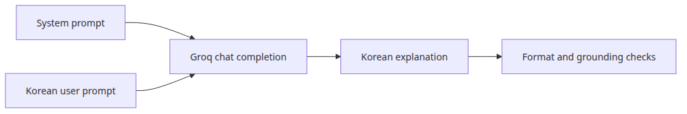
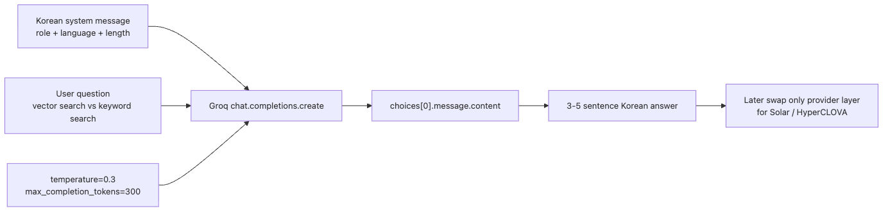
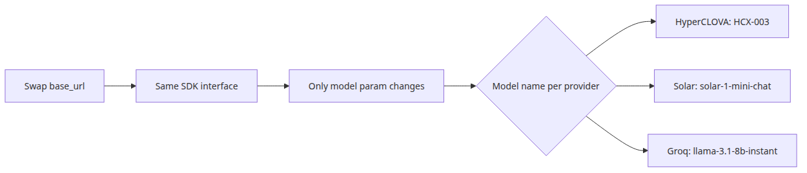
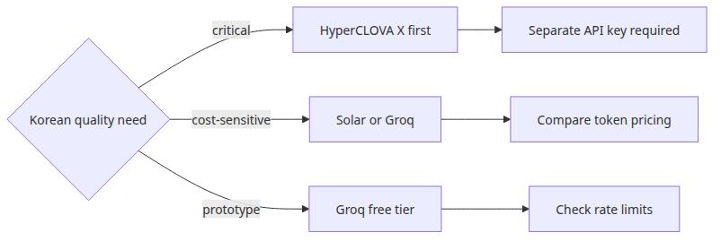

# Using HyperCLOVA X and Solar API

## Questions this post answers

- What API contract should you lock down before you start prompt tuning?
- What should you validate first when introducing Korean-first generation APIs such as HyperCLOVA X or Solar?
- Why does the runnable example use Groq `llama-3.1-8b-instant` as a stand-in?
- How should you separate Korean fluency from retrieval-grounded factual control?

> Switching generation providers is not just a model-name change. It also changes authentication, request shape, prompt contracts, and response validation.

> Korean AI Stack 101 (5/6)

Example code: [github.com/yeongseon-books/korean-ai-stack-101](https://github.com/yeongseon-books/korean-ai-stack-101/tree/main/en/05-hyperclova-solar-api)

The title points to HyperCLOVA X and Solar because they matter in the Korean model landscape, but the runnable example uses Groq's `llama-3.1-8b-instant`. The reason is practical: the repository example must run immediately in a reader's environment.

## Why this matters

This post covers the patterns for safely calling Korean generation LLM APIs. Earlier posts cleaned the input data with embeddings (KoSimCSE, BGE-M3) and OCR (CLOVA). This post builds the answer on top. HyperCLOVA X (NAVER) and Solar (Upstage) are tuned for Korean fluency, but the real production problems live on the call-contract side: authentication, latency, error codes, token limits, prompt caching.

A separate post is justified because many teams expect that swapping in a Korean-tuned model is enough. If system messages, temperature, output format, and timeouts stay at defaults, the variance and refusal patterns persist. The most realistic learning path is two-stage: get fluent with the OpenAI-compatible interface using Groq's `llama-3.1-8b-instant`, then swap in HyperCLOVA / Solar at the end.

## Mental Model

Generation API calls factor into a 4-layer contract.

```
[call contract]    auth, endpoint, rate limit, timeout, retry
     |
     v
[message contract] system / user / assistant roles, Korean system prompt
     |
     v
[sampling contract] temperature, top_p, max_tokens, stop sequences
     |
     v
[response contract] choices[0].message.content post-processing, JSON validation, safety filters
```

Three things matter most:

- **A model swap touches all four layers**: changing the model name is not the end of operationalization. Even one shifted layer changes the response distribution.
- **OpenAI-compatible is not a standard**: Groq, Solar, vLLM all advertise OpenAI compatibility, but timeout handling, rate-limit headers, and error codes differ.
- **Korean fluency is not factual correctness**: HyperCLOVA / Solar's natural Korean does not guarantee accuracy. Retrieval (next post) covers that gap.

Two more facts:

- HyperCLOVA X uses NAVER Cloud Platform auth; Solar uses an Upstage API key. The OpenAI SDK does not call HyperCLOVA directly — Solar mostly works via `base_url` swap.
- Groq is close to an OpenAI-compatible reference for learning purposes.

## Core concepts

| Item | Meaning |
| --- | --- |
| HyperCLOVA X | NAVER's Korean-centric LLM, served via NCP |
| Solar | Upstage's Korean/English LLM, with Solar Pro/Mini variants |
| Groq | LPU-based ultra low latency inference, OpenAI-compatible |
| `temperature` | Sampling randomness. 0.0 (deterministic) to 1.0+ (creative) |
| `max_completion_tokens` | Response token cap, output is truncated when exceeded |
| System prompt | First message that fixes persona, tone, language |
| Stop sequence | Token sequence that ends generation. Useful for JSON enforcement |
| Output validation | Post-processing: JSON schema, regex, length checks |

## Before vs. After

**Before** — Calling without a system message and an English user prompt makes the model mix English words into Korean responses, and the default temperature (often 1.0) returns a different answer to the same question every time.

**After** — A Korean system message and `temperature=0.3` stabilize behavior:

```python
# Three calls with the same question
'벡터 검색은 의미 유사도 기반, 키워드 검색은 문자 일치 기반입니다...'
'벡터 검색은 임베딩으로 의미를 비교하고, 키워드 검색은 토큰 매칭에 의존합니다...'
'벡터 검색은 의미를 벡터 공간에서 비교하고, 키워드 검색은 단어 단위 매칭입니다...'
```

What matters: (1) the same key concepts ("의미", "임베딩", "토큰") appear every time, (2) wording varies but facts stay consistent, (3) length stays predictable so post-processing cost is bounded.

## Core flow



*Core flow*

## Why a provider-substitution exercise still helps



*Minimal runnable example*

Readers do not always have HyperCLOVA X or Solar keys available. If the example cannot run, the prompt design lessons remain abstract. A stand-in provider still teaches the durable part of the workflow. At the final step, swapping the endpoint and auth header makes the same system message, sampling settings, and response handling reusable.

## Step-by-step practice

### Step 1 — Basic Groq call with a Korean system message

```python
import os
from groq import Groq

client = Groq(api_key=os.environ['GROQ_API_KEY'])
response = client.chat.completions.create(
    model='llama-3.1-8b-instant',
    temperature=0.3,
    max_completion_tokens=300,
    messages=[
        {'role': 'system', 'content': '당신은 한국어 제품 문서를 설명하는 시니어 개발자입니다. 항상 한국어로, 3~5문장으로 답합니다.'},
        {'role': 'user', 'content': '벡터 검색과 키워드 검색의 차이를 한국어로 설명해 주세요.'},
    ],
)
print(response.choices[0].message.content)
```

The point is to embed **language, role, and length** all into the system message. The user message stays clean.

### Step 2 — Constrain output format (force JSON)



*What to notice in this code*

```python
import json

response = client.chat.completions.create(
    model='llama-3.1-8b-instant',
    temperature=0.0,
    max_completion_tokens=200,
    response_format={'type': 'json_object'},
    messages=[
        {'role': 'system', 'content': '당신은 한국어 답변을 JSON으로 반환합니다. {"summary": str, "keywords": [str]} 형태만 사용합니다.'},
        {'role': 'user', 'content': '벡터 검색의 핵심을 한 줄 요약과 키워드 3개로 정리해 주세요.'},
    ],
)
data = json.loads(response.choices[0].message.content)
assert 'summary' in data and 'keywords' in data
print(data)
```

`response_format='json_object'` and the explicit schema in the system message are a pair. Drop one and non-JSON answers leak through.

### Step 3 — Timeout and retry

```python
import time
from groq import Groq, APIConnectionError, RateLimitError

def call_with_retry(messages, max_retries=3):
    for attempt in range(max_retries):
        try:
            return client.chat.completions.create(
                model='llama-3.1-8b-instant',
                temperature=0.3,
                max_completion_tokens=300,
                messages=messages,
                timeout=10.0,
            )
        except (APIConnectionError, RateLimitError) as e:
            wait = 2 ** attempt
            print(f"retry {attempt+1}/{max_retries} after {wait}s: {e}")
            time.sleep(wait)
    raise RuntimeError('all retries failed')
```

Exponential backoff and timeout are a pair. Without a timeout, retries can wait forever on a hung call.

### Step 4 — Response validation and masking

```python
import re

def sanitize(text):
    text = re.sub(r'\b\d{2,3}-\d{3,4}-\d{4}\b', '[PHONE]', text)
    text = re.sub(r'\b\d{6}-\d{7}\b', '[RRN]', text)  # Korean resident number pattern
    return text

def validate(text, min_len=20, max_len=2000):
    if not (min_len <= len(text) <= max_len):
        raise ValueError(f'length out of range: {len(text)}')
    if any(bad in text for bad in ['죄송합니다, 제가', 'I cannot', 'As an AI']):
        raise ValueError('refusal-like response')
    return text

raw = response.choices[0].message.content
clean = sanitize(validate(raw))
```

Validation runs immediately after generation, before any user-facing surface. Masking runs once more before the response is logged or cached.

### Step 5 — Switching to HyperCLOVA / Solar (concept)



*Where engineers get confused*

```python
# Solar (Upstage) call — OpenAI SDK compatible
from openai import OpenAI

solar = OpenAI(
    api_key=os.environ['UPSTAGE_API_KEY'],
    base_url='https://api.upstage.ai/v1/solar',
)
response = solar.chat.completions.create(
    model='solar-mini',
    temperature=0.3,
    max_tokens=300,
    messages=[
        {'role': 'system', 'content': '당신은 한국어 제품 문서를 설명하는 시니어 개발자입니다.'},
        {'role': 'user', 'content': '벡터 검색과 키워드 검색의 차이를 설명해 주세요.'},
    ],
)
```

Solar requires only a `base_url` change, so most of the Groq example transfers as-is. HyperCLOVA X requires NCP-specific SDK or REST calls, but the message, sampling, and validation layers are identical.

## What to notice in this code

- A single system message line carrying **language, role, length** keeps the user message minimal.
- `temperature=0.3` is a strong starting point for explanatory Korean. Creative writing wants 0.7+.
- JSON enforcement needs **both** `response_format` and an explicit schema in the system message.
- Retry without timeout is dangerous. Always pair them.
- When you swap providers, the parts that change are endpoint and auth. The parts that stay are messages, validation, and masking.

## Common mistakes

- **No system message** — even at low temperature the persona drifts. A one-line system message is the highest leverage move.
- **Default temperature** — defaults vary by provider (0.7-1.0). Set it explicitly for cross-environment reproducibility.
- **No `max_tokens` cap** — Korean costs 1.3-1.5x more tokens than English. Without a cap, bills explode.
- **Assuming the OpenAI SDK reaches every Korean model** — Solar yes, HyperCLOVA X no. Verify before integration.
- **Surfacing raw response** — refusals ("죄송합니다, 제가 답할 수 없습니다") and PII can leak. Always validate and mask.
- **Confusing fluency for accuracy** — natural answers are not accurate by default. Accuracy is reinforced by RAG in the next post.

## Production application

- **Dual-provider operation**: Solar primary, HyperCLOVA X fallback. Share message code, swap endpoints.
- **Prompt caching**: long, repeated system messages benefit from OpenAI-compatible caching. Often 30%+ latency and cost savings.
- **Streaming**: responses over 200 tokens should stream. `stream=True` halves perceived latency.
- **Log masking**: never store raw prompts in production logs. Save only the `sanitize()` output.
- **Temperature/length A/B**: compare 0.3 vs 0.5, max_tokens 200 vs 400 against user satisfaction. Korean varies in length more than English.
- **Monitoring metrics**: TTFT, end-to-end latency, refusal rate, JSON parse failure rate, mean input/output tokens — these five form the LLM operations dashboard.

## Checklist

- [ ] Target reader, tone, and language are stated in the system message.
- [ ] `temperature` and token limits are fixed before comparing outputs.
- [ ] Output format is constrained to bullets, JSON, or another explicit shape.
- [ ] `timeout` and `retry` are paired.
- [ ] Validation and masking run once, immediately after generation.
- [ ] Auth, error handling, and latency are re-verified when switching providers.

## Exercises

1. Call the same system message with `temperature` 0.0, 0.3, 0.7 — five times each. Compare response length and key-term frequency.
2. Drop the schema from the JSON-forced call's system message and see how stable `response_format` alone is.
3. If you have a Solar (or HyperCLOVA) key, send the same messages and compare latency, refusal rate, and length against Groq in a small table.

## Summary · Next article

The core idea is operating Korean generation APIs as a 4-layer contract — call, message, sampling, response. Lock down system message, temperature, output format, and timeout once, and provider swaps or model upgrades become a one or two line edit. Korean fluency comes for free; factual control comes from retrieval, which is the next post.

The next article (episode 6, the final one) assembles a Korean RAG pipeline. We will combine BGE-M3 retrieval, CLOVA OCR text, and this post's LLM call into one flow that produces fact-grounded Korean responses — a minimum viable RAG, in code.

<!-- toc:begin -->
## In this series

- [Korean embedding models compared — KoSimCSE, BGE-M3, Solar](./01-korean-embedding-models.md)
- [Building sentence similarity search with KoSimCSE](./02-kosimcse-similarity.md)
- [BGE-M3 multilingual embedding in practice](./03-bge-m3-multilingual.md)
- [Document text extraction with CLOVA OCR API](./04-clova-ocr.md)
- **Using HyperCLOVA X and Solar API (current)**
- Assembling a Korean RAG pipeline (upcoming)

<!-- toc:end -->

---

## References

- [Groq Python library](https://github.com/groq/groq-python)
- [Groq API reference](https://console.groq.com/docs/api-reference)
- [Upstage Solar documentation](https://developers.upstage.ai/docs/getting-started/overview)
- [NAVER Cloud HyperCLOVA X overview](https://www.ncloud.com/product/aiService/clovaStudio)

Tags: Korean NLP, LLM, Embeddings, OCR
