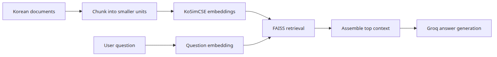
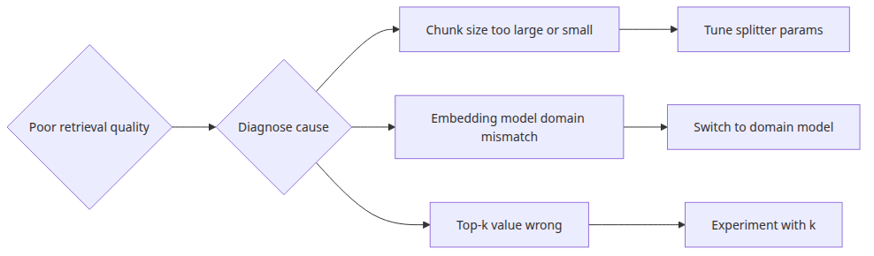

# Assembling a Korean RAG pipeline

RAG stops feeling mystical once you can see where each failure comes from. In Korean workflows, chunking, retrieval, and generation each introduce their own class of mistakes, so the only sane approach is to wire them together in a way you can inspect stage by stage.

This is the final post in the Korean AI Stack 101 series. Here, we connect the earlier embedding, OCR, and generation pieces into one minimal Korean RAG pipeline.

## Questions this post answers

- What stages are non-negotiable in a minimal Korean RAG pipeline?
- Which stage most often becomes the quality bottleneck — chunking, embedding, retrieval, or generation?
- How should retrieved context be formatted before it reaches the LLM?
- How do the earlier pieces of this series (KoSimCSE, BGE-M3, CLOVA OCR, HyperCLOVA/Solar) connect into one working pipeline?

> RAG quality is not produced by one magical call. It emerges from the combined behavior of chunk boundaries, retrieval candidates, and the way context is handed to the model.

> Korean AI Stack 101 (6/6)

Example code: [github.com/yeongseon-books/korean-ai-stack-101](https://github.com/yeongseon-books/korean-ai-stack-101/tree/main/en/06-korean-rag-pipeline)

---

## What you will learn

This final post connects every piece introduced earlier in the series. You will split Korean documents into chunks, embed them with KoSimCSE or BGE-M3, retrieve top chunks with FAISS, and then call a Groq model (or Solar / HyperCLOVA X) using only the retrieved context — a minimum viable Korean RAG pipeline.

Concretely, you will pick up four habits.

1. **Four-stage decomposition** — keep Ingest, Index, Retrieve, and Generate as separate functions so you can isolate which stage is the quality bottleneck.
2. **Chunk boundary design** — understand the difference between paragraph, fixed-token, and sentence chunking, and the failure patterns that show up in Korean text.
3. **Separate retrieval from generation evaluation** — learn why Recall@k and Faithfulness must be measured independently, with minimal evaluation code.
4. **Anti-speculation prompting** — explicitly instruct the LLM to say "I don't know" when the answer is not in the context, and force a citation line.

By the end you will have enough fundamentals to build a small internal-wiki RAG over 30–50 documents and debug retrieval failures and hallucination separately.

---

## Why this matters

The difference between a bare LLM call and RAG is **provenance**. When a user asks "the payment went through but the order is missing — what should I check?", a standalone LLM may fabricate plausible-looking advice that contradicts your actual internal policy. Operations teams cannot rely on answers without traceable sources.

RAG is hard not because there are many stages, but because **responsibility separation** between stages is hard. When an answer looks wrong, you must first determine whether the chunking was off, the embedding missed the meaning, top-k was insufficient, or the LLM ignored the context. A single end-to-end call makes that diagnosis nearly impossible.

The code in this post deliberately prints intermediate state and logs retrieval scores alongside selected chunk IDs. In Korean RAG, chunking is an especially common failure point because tokenizers differ in how they treat whitespace versus morphemes — visually inspecting which chunk was selected dramatically shortens debugging time.

---

## Mental Model — the four-stage pipeline



*Core flow*

RAG decomposes into four independent stages.

| Stage | Input | Output | Quality metric |
|---|---|---|---|
| **Ingest** | Raw documents (PDF, HTML, OCR output) | Chunk list | Chunk length distribution, boundary placement |
| **Index** | Chunks + embedding model | FAISS index | Vector dimension, index size |
| **Retrieve** | Question embedding + index | Top-k chunks + scores | Recall@k |
| **Generate** | Question + retrieved chunks | Answer + citations | Faithfulness, speculation rate |

Each stage can be replaced, measured, and debugged independently. Changing only the chunk boundary in Ingest can swing Recall@k significantly; changing only the prompt in Generate can change the hallucination rate. This separation is the central mental model of the entire post.

---

## Core concepts

### Chunking

Splits long documents into search units. For Korean, three strategies are common.

- **Paragraph** — split on `\n\n`. Simplest, preserves semantic boundaries well.
- **Fixed token** — 256–512 tokens per chunk with 50–100 token overlap. Predictable size, stable indexing.
- **Sentence** — split with KSS or kiwi. Suitable for short FAQs, but each chunk may lack context.

### Embedding

Turns chunks into vectors. For Korean-only corpora, KoSimCSE (post 2) is a typical pick; for multilingual corpora, BGE-M3 (post 3). Set `normalize_embeddings=True` and use `IndexFlatIP` (inner product) — the result equals cosine similarity.

### Retrieval

Pulls the top-k chunks closest to the question vector. Start with k = 3–5 and adjust based on the LLM's context window. Always log the score (distance) so you can audit retrieval quality afterwards.

### Generation

Injects only the retrieved chunks into the system message. Two non-negotiables: (1) explicitly say "if the answer is not in the context, say you don't know"; (2) force the model to cite chunk numbers.

---

## Before / After

### Before — bare LLM call

```python
client.chat.completions.create(
    model='llama-3.3-70b-versatile',
    messages=[{'role': 'user', 'content': 'Payment succeeded but no order — what to check?'}],
)
```

The LLM produces a generic-sounding answer. It may contradict your internal policy, and there is no source.

### After — RAG pipeline

```python
chunks = retrieve(question, top_k=3)        # internal-doc chunks
answer = generate(question, chunks)         # answer grounded only in chunks
print('sources:', [c['id'] for c in chunks])
```

The answer is grounded in your documents, and you can trace exactly which chunks were used.

---

## Step-by-step walkthrough

### Step 1 — chunking and indexing

```python
import faiss
from sentence_transformers import SentenceTransformer

model = SentenceTransformer('BM-K/KoSimCSE-roberta-multitask')

chunks = [
    '결제는 성공했지만 주문이 생성되지 않은 경우에는 주문 동기화 지연 여부를 먼저 확인합니다.',
    '결제 실패 문의는 카드 승인 실패와 주문 저장 실패를 분리해서 대응해야 합니다.',
    '환불 요청은 결제 채널별로 처리 시간이 다르며, 카드사 환불은 영업일 기준 3~5일이 소요됩니다.',
    '쿠폰이 적용되지 않을 때는 적용 조건(최소 주문 금액, 카테고리 제한, 만료일)을 먼저 확인합니다.',
]

vectors = model.encode(chunks, normalize_embeddings=True).astype('float32')
index = faiss.IndexFlatIP(vectors.shape[1])
index.add(vectors)
```

### Step 2 — retrieval


*Minimal runnable example*

```python
def retrieve(question: str, top_k: int = 2) -> list[dict]:
    query_vec = model.encode([question], normalize_embeddings=True).astype('float32')
    distances, indices = index.search(query_vec, top_k)
    return [
        {'id': int(idx), 'score': float(score), 'text': chunks[idx]}
        for score, idx in zip(distances[0], indices[0])
    ]

question = '결제는 됐는데 주문 내역이 없을 때 어떤 순서로 점검해야 하나요?'
hits = retrieve(question, top_k=2)
for h in hits:
    print(f"[{h['id']}] score={h['score']:.3f}  {h['text'][:40]}...")
```

### Step 3 — generation


*What to notice in this code*

```python
from groq import Groq

client = Groq()

def generate(question: str, hits: list[dict]) -> str:
    context = '\n\n'.join(f"[{h['id']}] {h['text']}" for h in hits)
    response = client.chat.completions.create(
        model='llama-3.3-70b-versatile',
        messages=[
            {
                'role': 'system',
                'content': (
                    'Answer ONLY using the provided context. '
                    'If the answer is not in the context, reply '
                    '"I could not find a relevant policy" and do not speculate. '
                    'End the answer with a citation in the form [sources: 0,1].'
                ),
            },
            {'role': 'user', 'content': f'Context:\n{context}\n\nQuestion: {question}'},
        ],
        temperature=0.0,
    )
    return response.choices[0].message.content

answer = generate(question, hits)
print(answer)
```

### Step 4 — a minimal evaluation set

```python
eval_set = [
    {'q': 'Payment succeeded but no order — steps to check?', 'expected_chunk': 0},
    {'q': 'How long does a refund take?', 'expected_chunk': 2},
    {'q': 'What to verify when a coupon is not applied?', 'expected_chunk': 3},
]

recall_hits = sum(
    1 for case in eval_set
    if case['expected_chunk'] in [h['id'] for h in retrieve(case['q'], top_k=3)]
)
print(f'Recall@3 = {recall_hits}/{len(eval_set)}')
```

Even ten cases are enough for the impact of chunking and embedding changes to show up as numbers.

---

## Common mistakes



*Where engineers get confused*

1. **Believing a stronger LLM rescues RAG.** If retrieval pulls the wrong chunk, GPT-4o or Claude Opus will still answer wrong. Measure Recall@k first.
2. **Not logging retrieval scores.** Looking at answers alone hides which stage broke. Always log retrieval results, scores, and selected chunk IDs together.
3. **Setting top-k too high.** k = 20 only adds noise and crowds out the relevant chunks. Start at k = 3–5.
4. **Skipping citations.** Without citations, neither users nor operators can verify answers. Force them in the system prompt.
5. **Chunks that are too long or too short.** Over 1000 tokens lets the LLM focus on irrelevant parts; under 50 tokens loses context. Aim for 200–500 tokens.
6. **Sending sensitive data unmasked.** Mask resident registration numbers, card numbers, and account IDs before calling an external LLM API.
7. **Tuning without an eval set.** "It feels better" invites regressions. Write ten cases and measure on every change.

---

## Production application — internal wiki RAG

In real deployments you typically add the following:

- **Metadata filtering** — attach fields like `{'team': 'payments', 'updated_at': '2026-04-01'}` to each chunk so you can scope searches by team or date. FAISS alone is not enough; vector databases such as Qdrant, Weaviate, or Milvus are commonly used.
- **Hybrid search** — combine BM25 (keyword) and dense (embedding) scores via Reciprocal Rank Fusion. This significantly improves Korean retrieval for proper nouns and abbreviations.
- **Reranking** — retrieve top-20, then rescore with a cross-encoder (for example `BAAI/bge-reranker-v2-m3`) and pass only top-3 to the LLM.
- **OCR ingestion** — for PDF/image documents, run them through CLOVA OCR (post 4) and merge the output into the chunking stage.
- **Model swap** — when external APIs are restricted, swap the LLM for Solar or HyperCLOVA X (post 5). With separate `retrieve` / `generate` interfaces, model replacement is nearly free.
- **Logging and operations** — write one JSON line per request: question, retrieved chunk IDs, scores, answer, user feedback. A few days of data already produces the next eval set and chunking improvement ideas.

---

## Checklist

- [ ] Ingest, Index, Retrieve, and Generate are split into separate functions.
- [ ] Chunk boundaries are decided first; retrieved chunks are inspected by eye (200–500 tokens recommended).
- [ ] Retrieval scores and selected chunk IDs are always logged with the answer.
- [ ] The system prompt forbids speculation and forces citations.
- [ ] An evaluation set of at least ten question/expected-chunk pairs exists, with Recall@k measured.
- [ ] Sensitive-data masking runs immediately before `generate`.
- [ ] Top-k starts at 3–5 and is tuned against the LLM context budget.

---

## Exercises

1. **Compare chunking strategies.** Index the same document with (a) paragraph splits and (b) 300-token chunks with 50-token overlap. Measure Recall@3 over the same five questions and compare.
2. **Verify the no-speculation rule.** Add three questions to your eval set whose answers are NOT in the corpus, then compare how often the LLM speculates with vs. without the no-speculation system prompt.
3. **Hybrid search.** Add BM25 scores via `rank_bm25`, fuse them with the dense scores using RRF, and measure Recall@3 improvement over dense-only retrieval.
4. **Force citations.** Add a retry that re-calls the LLM whenever the answer does not contain a `[sources: 0,1]` line.

---

## Summary and next steps

The deeper lesson of the series is not a specific tool choice but the habit of **separating each Korean document-processing stage clearly**. By stacking embedding comparison (post 1), sentence similarity (post 2), multilingual retrieval (post 3), OCR (post 4), and generation APIs (post 5), you can design Korean RAG pipelines with much more composure.

This post closes the series. Recommended next series:

- **vector-search-101** — deep dive on FAISS, Qdrant, and Milvus, covering metadata filters, hybrid search, and index tuning.
- **ai-evaluation-101** — building a RAG evaluation system using Recall@k, MRR, Faithfulness, and RAGAS.

A small evaluation set and a four-stage pipeline are the only two habits you really need to scale into much larger RAG systems with confidence.

<!-- toc:begin -->
## In this series

- [Korean embedding models compared — KoSimCSE, BGE-M3, Solar](./01-korean-embedding-models.md)
- [Building sentence similarity search with KoSimCSE](./02-kosimcse-similarity.md)
- [BGE-M3 multilingual embedding in practice](./03-bge-m3-multilingual.md)
- [Document text extraction with CLOVA OCR API](./04-clova-ocr.md)
- [Using HyperCLOVA X and Solar API](./05-hyperclova-solar-api.md)
- **Assembling a Korean RAG pipeline (current)**

<!-- toc:end -->

---

## References

- [FAISS getting started](https://github.com/facebookresearch/faiss/wiki/Getting-started)
- [BM-K/KoSimCSE-roberta-multitask](https://huggingface.co/BM-K/KoSimCSE-roberta-multitask)
- [BAAI/bge-reranker-v2-m3](https://huggingface.co/BAAI/bge-reranker-v2-m3)
- [Groq API reference](https://console.groq.com/docs/api-reference)
- [RAGAS — RAG evaluation framework](https://github.com/explodinggradients/ragas)
- [Reciprocal Rank Fusion paper](https://plg.uwaterloo.ca/~gvcormac/cormacksigir09-rrf.pdf)

Tags: Korean NLP, LLM, Embeddings, OCR
