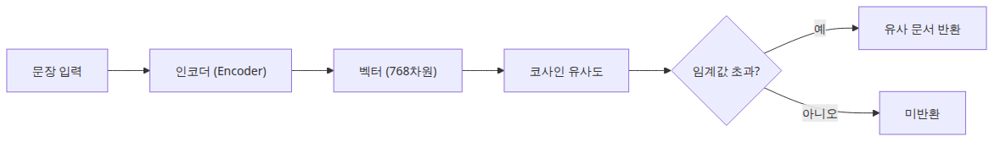
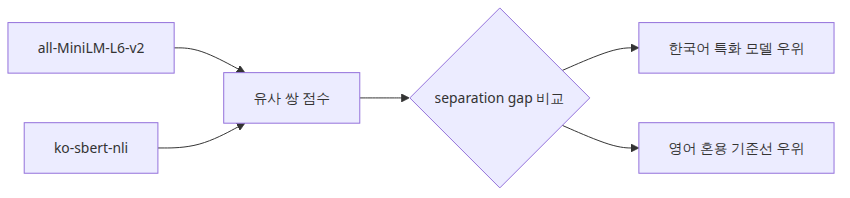
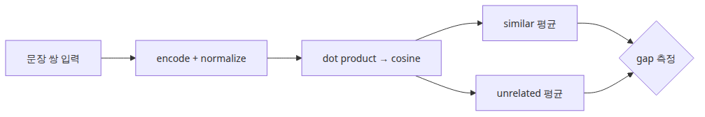
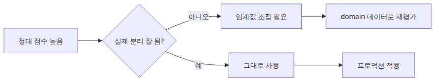

# 한국어 임베딩 모델 비교 — KoSimCSE, BGE-M3, Solar

## 이 글에서 배울 것

- 한국어 임베딩 모델과 영어 범용 모델의 차이가 실무에서 어떤 영향을 주는지 이해합니다.
- separation gap(유사 문장 평균 − 무관 문장 평균)을 기준으로 모델을 비교하는 프레임을 익힙니다.
- `sentence-transformers`로 두 모델을 같은 문장 쌍에 적용하는 최소 실행 예제를 실습합니다.
- 코사인 유사도 절대값이 아니라 상대적 간격으로 모델을 판단하는 습관을 들입니다.

<!-- a-grade-intro:begin -->
## 핵심 질문

KoSimCSE·BGE-M3·Solar 중 어떤 한국어 임베딩을 골라야 우리 use case에 맞을까요?

이 글은 그 질문에 답하기 위해 한국어 임베딩 비교의 핵심 결정과 운영 함정을 살펴봅니다.

<!-- a-grade-intro:end -->

## 이 글에서 답할 질문

- 한국어 문장을 많이 다루는 팀이 영어 중심 임베딩만 쓰면 어디서 자주 틀어질까요?
- 모델 비교에서 코사인 유사도 한두 개보다 separation gap을 먼저 봐야 하는 이유는 무엇일까요?
- 한국어 문장과 영어 기술 용어가 섞인 데이터에서는 어떤 비교 축을 먼저 잡아야 할까요?
- 바로 돌려 볼 수 있는 기준선 모델과 한국어 특화 모델을 함께 놓고 보면 어떤 판단이 쉬워질까요?

> 임베딩 모델 비교는 절대 점수 자랑이 아니라, 비슷한 문장과 무관한 문장을 얼마나 안정적으로 벌려 놓는지 보는 작업입니다.

> 한국어 AI 스택 101 시리즈 (1/6)

예제 코드: [github.com/yeongseon-books/korean-ai-stack-101](https://github.com/yeongseon-books/korean-ai-stack-101/tree/main/ko/01-korean-embedding-models)

이번 글의 목표는 화려한 벤치마크 표를 다시 옮기는 데 있지 않습니다. 같은 문장 쌍을 두 모델에 통과시키고, 한국어 문장·영어 혼용 문장·무관한 문장이 어떤 간격으로 분리되는지 직접 보는 데 있습니다. 글 제목에는 KoSimCSE, BGE-M3, Solar가 함께 나오지만, 실행 예제는 재현성을 우선해 `all-MiniLM-L6-v2`와 `jhgan/ko-sbert-nli`를 비교합니다. 독자가 바로 `python main.py`로 돌릴 수 있어야 비교 기준이 손에 잡히기 때문입니다.

실무에서는 "어떤 모델이 제일 좋으냐"보다 "우리 데이터에서 어떤 실패를 덜 내느냐"가 더 중요합니다. 고객센터 FAQ처럼 짧은 한국어 문장이 많은지, 한국어 설명문 안에 영어 제품명이 자주 섞이는지, 코사인 점수를 임계값으로 잘라야 하는지에 따라 선택 기준이 달라집니다. 그래서 첫 글은 모델 소개보다 비교 프레임을 먼저 세웁니다.

---

## 왜 중요한가

한국어를 다루는 팀이 영어 중심 임베딩 모델만 쓰면 두 가지 문제가 자주 생깁니다. 첫째, 한국어 문장끼리의 유사도가 전반적으로 낮게 나와 임계값을 잡기 어렵습니다. 둘째, 한국어와 영어가 섞인 문서에서 검색 품질이 불안정해집니다. 이 글에서 비교 프레임을 먼저 세우는 이유는, 모델을 바꿀 때마다 같은 기준으로 판단할 수 있어야 팀 전체의 의사결정 속도가 빨라지기 때문입니다.

1편에서 비교 방법을 잡아 두면 2편(KoSimCSE)부터 6편(RAG 파이프라인)까지 같은 프레임으로 각 구성 요소를 평가할 수 있습니다. 반대로 비교 기준 없이 모델을 고르면 "이전 모델이 더 나았는데"라는 감만 남고, 재현 가능한 근거가 사라집니다.

## Mental Model

임베딩 모델 비교는 다음 세 축으로 생각합니다.

```
┌────────────────────────────────────────────────┐
│ 축 1: 한국어 단일 문장 유사도      (기본 품질)   │
├────────────────────────────────────────────────┤
│ 축 2: 한국어/영어 혼용 문장 유사도  (실전 조건)   │
├────────────────────────────────────────────────┤
│ 축 3: 무관 문장과의 간격 (separation gap)        │
└────────────────────────────────────────────────┘
```

- **축 1**은 한국어 전용 모델이 유리한 영역입니다. 같은 뜻의 문장을 높은 점수로 모아 줍니다.
- **축 2**는 다국어 모델이 유리할 수 있는 영역입니다. 영어 기술 용어가 섞일 때 안정적입니다.
- **축 3**이 가장 중요합니다. 유사 문장과 무관 문장의 간격이 넓을수록 임계값을 잡기 쉽고 검색 정밀도가 올라갑니다.

## 핵심 개념

| 용어 | 의미 |
| --- | --- |
| Sentence embedding | 문장을 고정 길이 벡터로 변환한 것. 의미가 비슷한 문장은 가까운 벡터를 가짐 |
| Cosine similarity | 두 벡터 사이 각도의 코사인. −1~1 범위, 1에 가까울수록 유사 |
| Separation gap | 유사 문장 평균 점수 − 무관 문장 평균 점수. 클수록 모델이 의미를 잘 구분 |
| `normalize_embeddings` | 벡터를 단위 길이로 정규화. 내적이 곧 코사인 유사도가 됨 |
| FAISS IndexFlatIP | 내적(IP) 기반 벡터 검색 인덱스. 정규화된 벡터에서 코사인 검색과 동일 |

## 핵심 흐름


*핵심 흐름*
---

## 왜 재현 가능한 비교부터 시작할까



*재현 가능한 비교를 위한 시작 조건*
모델 비교 글이 실전에서 도움이 되려면 독자가 같은 코드를 돌려서 비슷한 경향을 확인할 수 있어야 합니다. API 전용 모델이나 사내 전용 평가셋만으로 비교하면 읽을 때는 그럴듯하지만, 다음 날 바로 다시 확인하기 어렵습니다.

이번 예제는 두 가지 관찰 포인트를 남깁니다. 첫째, 한국어 전용에 가까운 `ko-sbert-nli`는 유사 문장과 무관 문장을 더 크게 벌려 놓는 경향을 보입니다. 둘째, 범용 `all-MiniLM-L6-v2`는 영어 표현이 섞일 때 기준선으로는 유용하지만, 한국어만 놓고 보면 separation gap이 더 좁게 나올 수 있습니다. 이 차이를 알아두면 다음 글에서 KoSimCSE를 볼 때도 "한국어 문장끼리 더 잘 모이는가"를 같은 방식으로 확인할 수 있습니다.

---

## 단계별 실습



*최소 실행 예제*
아래 코드는 두 모델을 같은 문장 쌍에 적용하고, `similar` 평균과 `unrelated` 평균을 비교합니다. 전체 실행 파일은 `main.py`에 있습니다.

```python
import numpy as np
from sentence_transformers import SentenceTransformer

MODEL_NAMES = {
    'all-MiniLM-L6-v2': 'sentence-transformers/all-MiniLM-L6-v2',
    'ko-sbert-nli': 'jhgan/ko-sbert-nli',
}

SENTENCE_PAIRS = [
    ('나는 오늘 점심으로 비빔밥을 먹었다.', '오늘 점심은 비빔밥이었다.', 'similar'),
    ('서울시청 앞에서 회의를 했다.', '회의는 서울 시청 앞에서 열렸다.', 'similar'),
    ('비가 와서 우산을 챙겼다.', 'GPU 메모리가 부족해 학습이 중단됐다.', 'unrelated'),
]

for label, name in MODEL_NAMES.items():
    model = SentenceTransformer(name)
    scores = []
    for sent_a, sent_b, expected in SENTENCE_PAIRS:
        emb = model.encode([sent_a, sent_b], normalize_embeddings=True)
        score = float(np.dot(emb[0], emb[1]))
        scores.append((expected, score))
    print(label, scores)
```

---

## 이 코드에서 봐야 할 것



*이 코드에서 봐야 할 것*
- 두 모델에 **같은 문장 쌍**을 넣습니다. 그래야 점수 차이가 데이터셋 차이가 아니라 모델 차이에서 왔는지 읽을 수 있습니다.
- `normalize_embeddings=True`를 켜 두면 내적이 곧 코사인 유사도가 됩니다. 실험 코드가 짧아지고, FAISS `IndexFlatIP`와도 연결하기 쉬워집니다.
- 개별 점수보다 `similar 평균 - unrelated 평균`을 같이 봐야 합니다. 운영에서는 이 간격이 넓을수록 임계값을 잡기가 편합니다.
- 한국어/영어 혼용 쌍을 하나 넣어 둔 이유는, 실제 문서가 완전한 단일 언어가 아닌 경우가 많기 때문입니다.

---

## 자주 하는 실수



*실무에서 헷갈리는 지점*
- 한국어 특화 모델이 항상 모든 다국어 작업에서 우세한 것은 아닙니다. 영어가 많이 섞인 문서 검색이면 다국어 모델이 더 안정적일 수 있습니다.
- 코사인 점수 0.8이 "좋다"는 절대 기준은 아닙니다. 모델마다 분포가 다르므로, 상대적 간격과 실제 검색 결과를 함께 봐야 합니다.
- 벤치마크 리더보드 순위와 운영 체감 품질은 다를 수 있습니다. 짧은 질의, 오탈자, 띄어쓰기 흔들림 같은 한국어 실전 조건이 더 중요할 때가 많습니다.

---

## 실무에서는 이렇게 생각한다

임베딩 모델 선택에서 가장 흔한 함정은 벤치마크 1위 모델을 무조건 쓰는 것입니다. 벤치마크는 표준 데이터셋 기준이고, 실제 서비스 데이터는 오탈자, 띄어쓰기 흔들림, 한영 혼용 등 조건이 다릅니다. 우리 데이터에서 separation gap을 직접 측정하는 것이 리더보드 순위보다 신뢰할 수 있는 근거입니다.

또 한 가지 놓치기 쉬운 것은 모델 교체 비용입니다. 임베딩 모델을 바꾸면 기존 벡터를 전부 다시 생성해야 합니다. 데이터가 수백만 건이면 이 비용이 상당합니다. 그래서 처음에 비교 프레임을 세우고 충분히 검증한 뒤 결정하는 것이 장기적으로 더 빠릅니다.

## 연습 문제

1. `SENTENCE_PAIRS`에 한국어/영어 혼용 문장 쌍을 3개 추가하고, 두 모델의 separation gap이 어떻게 변하는지 비교하세요.
2. `ko-sbert-nli` 대신 `BM-K/KoSimCSE-roberta`를 넣어 같은 실험을 반복하세요. 축 1(한국어 단일 문장)에서 차이가 나나요?
3. 무관 문장을 5개로 늘리고, 유사 문장 평균과 무관 문장 평균의 표준편차를 함께 출력하세요. 어느 모델의 분포가 더 안정적인가요?

## 시니어 엔지니어는 이렇게 생각합니다

- **benchmark만 보지 않는다** — 우리 도메인 데이터로 ablation이 필수입니다.
- **KoSimCSE는 가벼운 baseline** — 도메인 특화 학습이 쉽습니다.
- **BGE-M3는 다국어·multi-vector** — 코드·문서 혼합에 강합니다.
- **Solar는 통합 스택의 일부** — API·모델 묶음을 함께 평가합니다.
- **차원·비용·지연을 함께 본다** — 단일 지표는 결정을 왜곡합니다.

## 체크리스트

- [ ] 우리 데이터가 한국어 단일 문장 중심인지, 한국어/영어 혼용인지 먼저 적어 본다.
- [ ] 유사 문장과 무관 문장을 함께 넣어 separation gap을 본다.
- [ ] 모델별 점수 분포를 확인한 뒤 임계값 후보를 정한다.
- [ ] 바로 다음 단계에서 FAISS나 벡터 DB로 이어질 수 있는지 확인한다.

---

## 마무리

첫 글에서 가져가야 할 핵심은 "모델 이름"이 아니라 "비교 방법"입니다. 같은 문장 쌍으로 간격을 보고, 그 간격이 실제 검색 품질로 이어지는지 확인해야 다음 선택이 쉬워집니다. 다음 글에서는 한국어 문장 유사도 검색을 더 직접적으로 보여 주는 KoSimCSE 예제로 넘어갑니다.

<!-- toc:begin -->
## 시리즈 목차

- **한국어 임베딩 모델 비교 — KoSimCSE, BGE-M3, Solar (현재 글)**
- KoSimCSE로 문장 유사도 구현하기 (예정)
- BGE-M3 다국어 임베딩 실전 (예정)
- CLOVA OCR API로 문서 텍스트 추출 (예정)
- HyperCLOVA X와 Solar API 사용하기 (예정)
- 한국어 RAG 파이프라인 조합하기 (예정)

<!-- toc:end -->

---

## 참고 자료

- [SentenceTransformers documentation](https://www.sbert.net/)
- [jhgan/ko-sbert-nli](https://huggingface.co/jhgan/ko-sbert-nli)
- [sentence-transformers/all-MiniLM-L6-v2](https://huggingface.co/sentence-transformers/all-MiniLM-L6-v2)

Tags: Korean NLP, LLM, Embeddings, OCR
