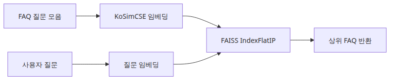
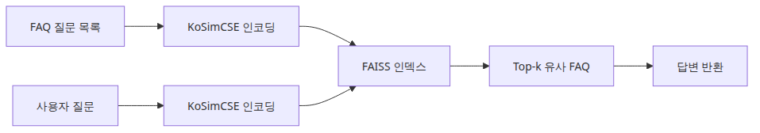
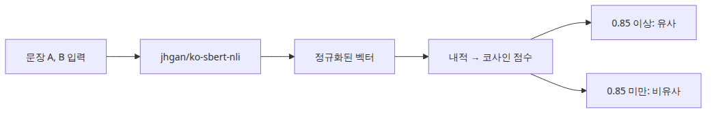
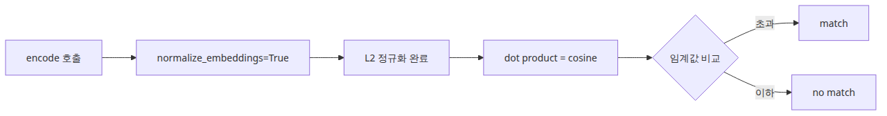
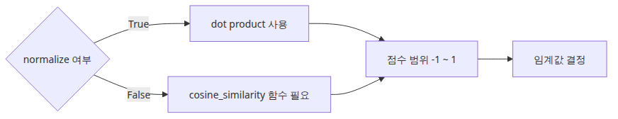

# KoSimCSE로 문장 유사도 구현하기

문장 유사도 검색의 첫 버전은 거창한 오케스트레이션보다, 질문을 어떻게 벡터로 만들고 어떤 인덱스로 비교하는지부터 투명하게 보여 주는 편이 낫습니다. 특히 한국어 FAQ 검색은 작은 설정 하나만 어긋나도 바로 엉뚱한 후보가 올라오기 때문에, 가장 단순한 검색 루프를 손으로 만들어 보는 과정이 중요합니다.

이 글은 한국어 AI 스택 101 시리즈의 2번째 글입니다. 여기서는 KoSimCSE로 한국어 문장 유사도 검색을 구현하는 최소 단위를 만들고, 정규화·인덱스·점수 해석의 기준을 다룹니다.

> 첫 문장 유사도 시스템은 복잡한 오케스트레이션이 아니라, 깔끔한 임베딩과 투명한 인덱스에서 시작됩니다.

## 핵심 질문

KoSimCSE로 문장 유사도를 구현할 때 무엇을 의식적으로 결정해야 할까요?

이 글은 그 질문에 답하기 위해 KoSimCSE 유사도 구현의 핵심 결정과 운영 함정을 살펴봅니다.

## 이 글에서 다룰 문제

이 글에서는 한국어 FAQ 검색처럼 짧은 문장 중심 태스크에 KoSimCSE를 바로 붙여 봅니다. 앞 글이 모델 비교였다면, 이번 글은 "질문을 벡터로 바꾸고 가장 비슷한 질문을 찾는다"는 가장 기본적인 검색 루프를 손으로 만들어 보는 단계입니다.

문장 유사도 검색을 별도 단계로 다루는 이유는 분명합니다. 많은 한국어 RAG 시스템이 첫 단계에서 이미 무너집니다. embedding 품질, 정규화, 인덱스 선택 중 하나만 잘못되면 LLM이 아무리 좋아도 검색이 엉뚱한 문서를 가져옵니다. KoSimCSE 같은 검증된 모델로 가장 작은 검색 루프를 손에 익혀 두면, 이후 BGE-M3나 멀티벡터 검색으로 확장할 때도 비교 기준점을 가질 수 있습니다.

## Mental Model

문장 유사도 검색은 4단계로 분해됩니다.

```text
[문장 코퍼스]                    [쿼리 문장]
     |                               |
     v                               v
[encode -> vector]            [encode -> vector]
     |                               |
     v                               v
[FAISS index] <----- search -----+
     |
     v
[top-k 결과]
```

핵심은 두 가지입니다.

- **같은 모델로 인코딩**: 코퍼스와 쿼리를 같은 모델, 같은 정규화 방식으로 인코딩해야 합니다. 다른 모델을 쓰면 거리가 의미를 잃습니다.
- **거리 함수와 인덱스의 짝**: 정규화된 벡터 + `IndexFlatIP`(내적)는 cosine similarity와 수학적으로 동일합니다. 정규화 안 한 벡터에 내적을 쓰면 길이에 휘둘립니다.

추가로 알아야 할 것:

- KoSimCSE는 BERT 계열 인코더를 contrastive 학습으로 fine-tune한 모델입니다. 짧은 문장 표현에 강합니다.
- FAISS `IndexFlatIP`는 brute-force입니다. 1만 개까지는 충분히 빠르고, 그 이상이면 IVF/HNSW로 갈아탑니다.

## 핵심 개념

| 항목 | 의미 |
| --- | --- |
| KoSimCSE | 한국어 문장 임베딩 모델. SimCSE 논문의 contrastive 학습 기법을 한국어로 적용 |
| `SentenceTransformer` | 임베딩 모델을 간단히 로드하고 사용할 수 있는 라이브러리 |
| `normalize_embeddings=True` | L2 정규화. 벡터 길이를 1로 만들어 cosine similarity 계산을 단순화 |
| `IndexFlatIP` | FAISS의 내적 기반 brute-force 인덱스. 정규화된 벡터와 짝이 맞음 |
| `IndexFlatL2` | FAISS의 L2 거리 기반 brute-force 인덱스. 정규화 안 된 벡터에 사용 |
| top-k | 검색 결과 상위 k개. 디버깅에는 k=2~3이 적당 |
| Recall@k | 정답이 상위 k개에 포함된 비율. 검색 품질의 기본 지표 |

## Before vs. After

**Before** — FAQ 페이지에서 사용자가 "비밀번호 잊어버렸어요"라고 검색하면 키워드 일치만으로는 "비밀번호 재설정"이 아닌 "비밀번호 변경 정책"이 먼저 나옵니다.

**After** — KoSimCSE 기반 검색을 도입하면 다음과 같이 동작합니다.

```python
query = '로그인 비밀번호를 다시 설정하고 싶어요.'
# top-1: '비밀번호나 패스워드를 재설정하고 싶어요.' (score 0.91)
# top-2: '결제는 됐는데 주문 내역이 보이지 않습니다.' (score 0.32)
```

핵심은 (1) 키워드 "재설정"이 없는 쿼리도 매칭된다, (2) top-1과 top-2 사이에 큰 점수 간격이 보인다, (3) 후보의 의미를 사람이 직접 읽어 확인할 수 있다는 것입니다.

## 핵심 흐름



*핵심 흐름*

## 왜 FAQ 질문만 먼저 인덱싱할까



*FAQ 질문만 먼저 인덱싱하는 첫 버전 구조*

질문과 답변을 한 번에 임베딩하면 어디서 검색이 어긋나는지 읽기 어렵습니다. 첫 버전은 질문만 인덱싱하고, 검색된 질문에 연결된 답변을 붙여 보는 편이 디버깅이 쉽습니다.

## 단계별 실습

### 1단계 — 모델과 데이터 준비

```python
import faiss
from sentence_transformers import SentenceTransformer

MODEL_NAME = 'BM-K/KoSimCSE-roberta-multitask'
FAQS = [
    {'category': 'account', 'question': '비밀번호나 패스워드를 재설정하고 싶어요.'},
    {'category': 'billing', 'question': '결제는 됐는데 주문 내역이 보이지 않습니다.'},
    {'category': 'shipping', 'question': '배송 상태는 어디에서 확인하나요?'},
]

model = SentenceTransformer(MODEL_NAME)
```

### 2단계 — 임베딩 생성과 인덱싱

```python
embeddings = model.encode(
    [item['question'] for item in FAQS],
    normalize_embeddings=True,
).astype('float32')

index = faiss.IndexFlatIP(embeddings.shape[1])
index.add(embeddings)
```

`normalize_embeddings=True`와 `IndexFlatIP`는 한 쌍입니다. 둘 중 하나라도 빠지면 점수가 엉뚱하게 나옵니다.

### 3단계 — 쿼리 검색



*최소 실행 예제*

```python
query = '로그인 비밀번호를 다시 설정하고 싶어요.'
query_vec = model.encode([query], normalize_embeddings=True).astype('float32')
distances, indices = index.search(query_vec, 2)
print(distances, indices)
```

### 4단계 — 결과 해석

```python
for score, idx in zip(distances[0], indices[0]):
    print(f"{score:.3f}  {FAQS[idx]['question']}")
```

상위 1개만 보지 말고 2~3개를 함께 보면 점수 분포가 신뢰할 만한지 한 눈에 보입니다.

### 5단계 — Recall@k 측정 (선택)

```python
test_cases = [
    ('비밀번호 변경 어떻게 해요?', 0),  # 정답: 0번 FAQ
    ('주문이 안 보여요', 1),
    ('택배 어디까지 왔나요?', 2),
]

hits = 0
for query, gold_idx in test_cases:
    vec = model.encode([query], normalize_embeddings=True).astype('float32')
    _, idx = index.search(vec, 1)
    if idx[0][0] == gold_idx:
        hits += 1
print(f"Recall@1 = {hits / len(test_cases):.2f}")
```

## 이 코드에서 봐야 할 것



*이 코드에서 봐야 할 것*

- 답변이 아니라 **질문 문장**을 인덱싱합니다.
- `normalize_embeddings=True`와 `IndexFlatIP`를 같이 쓰면 코사인 유사도를 단순하게 계산할 수 있습니다.
- 질의를 여러 표현으로 바꿔도 상위 결과가 비슷하게 유지되는지 봐야 합니다.
- 상위 1개만 보지 말고 2~3개 후보를 함께 출력해야 오답 패턴이 보입니다.

## 자주 하는 실수



*실무에서 헷갈리는 지점*

- **정규화 누락** — `normalize_embeddings=True` 없이 `IndexFlatIP`를 쓰면 긴 문장이 부당하게 높은 점수를 받습니다.
- **다른 모델로 인코딩** — 코퍼스는 KoSimCSE로, 쿼리는 BGE-M3로 인코딩하면 거리가 의미를 잃습니다. 항상 같은 모델을 사용합니다.
- **상위 1개만 신뢰** — 점수 0.92도 잘못된 답일 수 있습니다. 후보 간 간격(0.92 vs 0.91 vs 0.45)을 같이 봐야 신뢰도를 추정할 수 있습니다.
- **FAQ 설정을 긴 문서에 그대로 적용** — 긴 문서는 청킹과 다른 거리 지표가 필요합니다. KoSimCSE는 짧은 문장에 최적화되어 있습니다.
- **테스트 데이터를 인덱싱 데이터에 포함** — Recall이 비현실적으로 높게 나옵니다. 항상 분리합니다.
- **점수 임계값을 모델 변경 후에도 그대로 사용** — 모델이 바뀌면 점수 분포도 바뀝니다. 임계값은 모델별로 재조정합니다.

## 실무 적용

- **두 단 검색**: KoSimCSE로 100개 후보를 가져온 뒤, cross-encoder(`bongsoo/kpf-cross-encoder` 등)로 재정렬하면 정확도가 크게 오릅니다.
- **카테고리 필터**: 검색 전에 카테고리로 필터링하면 후보 수가 줄어 정확도와 속도가 모두 좋아집니다.
- **임베딩 캐싱**: FAQ 코퍼스는 자주 변하지 않습니다. 임베딩을 디스크에 저장하고 앱 시작 시 로드하면 cold start가 빨라집니다.
- **인덱스 선택**: 1만 개 이하 → `IndexFlatIP`. 10만 개 이상 → `IndexIVFFlat`. 100만 개 이상 → `IndexHNSWFlat`.
- **하이브리드 검색**: BM25(키워드) + KoSimCSE(의미) 점수를 가중 평균하면 도메인 특수 용어와 일반 의역을 모두 잡을 수 있습니다.
- **Recall 모니터링**: 매주 새 사용자 쿼리 50개를 sampling해 사람이 정답을 라벨링하고 Recall@5를 측정합니다. 80% 미만이면 모델 교체 검토.

## 실무에서는 이렇게 생각한다

KoSimCSE는 한국어 단일 언어 환경에서 가성비가 뛰어나지만, 영어가 섹이는 문서에서는 BGE-M3 같은 다국어 모델이 더 안정적입니다. 모델 선택은 "우리 데이터가 어떤 언어 비율인가"에서 시작하는 것이 실용적입니다.

임계값 설정은 모델보다 도메인에 더 의존합니다. FAQ 검색처럼 정확히 매칭되어야 하는 경우 임계값을 높게, 연관 문서를 넓게 가져와야 하는 RAG에서는 임계값을 낮게 잡습니다. 임계값은 고정값이 아니라 데이터와 함께 튜닝하는 대상입니다.

## 체크리스트

- [ ] 검색 대상이 질문인지 답변인지 먼저 고정한다.
- [ ] 질의 표현을 3개 이상 바꿔 본다.
- [ ] 상위 결과 2~3개를 함께 출력한다.
- [ ] 생성 단계를 붙이기 전에 검색 단계만 따로 검증한다.
- [ ] Recall@k를 한 번이라도 측정해 본 적 있다.

## 정리 · 다음 글

KoSimCSE 예제의 핵심은 검색 루프를 투명하게 유지하는 데 있습니다. 이 기준점이 있어야 다음 단계에서 다국어 모델이나 하이브리드 검색으로 확장해도 비교가 쉽습니다. 정규화, 인덱스, top-k 출력이라는 세 가지 작은 습관이 한국어 검색의 첫 버전을 만들어 줍니다.

다음 글(3편)에서는 BGE-M3를 다룹니다. 한국어와 영어가 섞인 코퍼스에서 KoSimCSE보다 어떤 지점이 강한지, dense + sparse 멀티벡터 검색이 무엇인지 코드로 확인합니다.

<!-- toc:begin -->
## 시리즈 목차

- [한국어 임베딩 모델 비교 — KoSimCSE, BGE-M3, Solar](./01-korean-embedding-models.md)
- **KoSimCSE로 문장 유사도 구현하기 (현재 글)**
- BGE-M3 다국어 임베딩 실전 (예정)
- CLOVA OCR API로 문서 텍스트 추출 (예정)
- HyperCLOVA X와 Solar API 사용하기 (예정)
- 한국어 RAG 파이프라인 조합하기 (예정)

<!-- toc:end -->

---

## 참고 자료

- [BM-K/KoSimCSE-roberta-multitask](https://huggingface.co/BM-K/KoSimCSE-roberta-multitask)
- [SimCSE 논문](https://arxiv.org/abs/2104.08821)
- [FAISS getting started](https://github.com/facebookresearch/faiss/wiki/Getting-started)
- [SentenceTransformers semantic search examples](https://www.sbert.net/examples/sentence_transformer/applications/semantic-search/README.html)

Tags: Korean NLP, LLM, Embeddings, OCR
