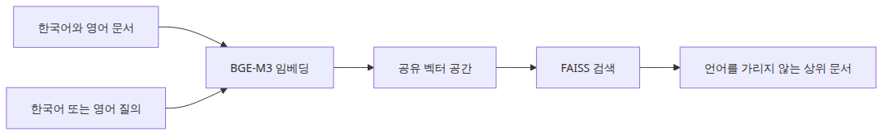
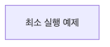
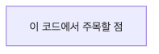
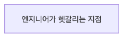

# BGE-M3 다국어 임베딩 실전

한국 팀이 다루는 검색 코퍼스는 질의는 한국어인데 문서 절반이 영어인 경우가 많습니다. 바로 이 지점에서 한국어 전용 검색 기준선은 테스트에서는 깔끔해 보여도 운영에서는 금방 부서지기 시작합니다.

이 글은 Korean AI Stack 101 시리즈의 3번째 글입니다. 여기서는 BGE-M3로 한국어·영어 혼합 코퍼스에서 dense 다국어 기준선을 측정한 뒤, 더 복잡한 검색 신호를 올리기 전에 무엇을 확인해야 하는지 살펴봅니다.

## 이 글에서 다룰 문제

- BGE-M3는 한국어와 영어가 섞인 코퍼스에서 KoSimCSE보다 어디서 강합니까?
- 하나의 모델이 dense, sparse, multi-vector 표현을 동시에 낸다는 말은 무엇을 뜻합니까?
- 다국어 검색 첫 버전에서는 dense만으로도 왜 충분한 경우가 많습니까?
- 같은 의미의 질의라도 언어에 따라 점수 분포가 왜 달라질 수 있습니까?

> 다국어 검색을 시작할 때 가장 먼저 할 일은 화려한 multi-vector 신호를 합치는 것이 아니라, dense 기준선을 깨끗하게 측정하는 일입니다.

> Korean AI Stack 101 (3/6)

예제 코드: [github.com/yeongseon-books/korean-ai-stack-101](https://github.com/yeongseon-books/korean-ai-stack-101/tree/main/en/03-bge-m3-multilingual)

## 왜 이 단계가 중요한가

이 글은 한국 회사에서 매일 마주치는 검색 상황으로 들어갑니다. 질의는 한국어인데, 문서 코퍼스 상당수가 영어로 쓰여 있는 경우입니다. 앞 글은 KoSimCSE로 한국어 짧은 문장을 다뤘습니다. 이번에는 한국어·영어 혼합 코퍼스에 BGE-M3를 적용합니다.

BGE-M3를 별도 단계로 다룰 이유는 두 가지입니다. 첫째, 다국어 인코더 없이는 한국 회사의 내부 문서 검색이 거의 성립하지 않습니다. 매뉴얼과 인시던트 회고는 영어로 쓰여 있고, 사용자는 한국어로 묻습니다. 둘째, BGE-M3는 dense, sparse, multi-vector 표현을 동시에 낼 수 있는 널리 쓰이는 공개 모델입니다. 그래서 이후 하이브리드 검색에서 같은 백본 위에서 점수를 합칠 수 있습니다. 다만 이 글은 dense 기준선에 집중합니다. sparse와 multi-vector는 다음 단계에서 다룹니다.

## 멘탈 모델

다국어 dense 검색은 네 단계로 분해됩니다.

```text
[multilingual corpus (ko+en)]      [Korean query]
        |                                |
        v                                v
[BGE-M3 encode -> 1024d]      [BGE-M3 encode -> 1024d]
        |                                |
        v                                v
[FAISS IndexFlatIP] <-------- search ----+
        |
        v
[top-k (language-agnostic)]
```

가장 중요한 것은 세 가지입니다.

- **언어 비대칭을 모델이 흡수합니다**: 코퍼스는 영어, 질의는 한국어여도 둘 다 같은 벡터 공간에 놓입니다. KoSimCSE는 언어 정렬이 강하지 않습니다.
- **정규화는 여전히 필요합니다**: BGE-M3 dense 출력은 기본적으로 단위 길이가 아닙니다. `normalize_embeddings=True`를 항상 켜야 합니다.
- **dense만으로도 의미가 있습니다**: 다국어 인코더는 이미 일부 키워드 신호를 dense 벡터에 녹여 두었기 때문에, dense 기준선만으로도 KoSimCSE보다 뚜렷한 개선이 보이는 경우가 많습니다.

추가로 두 가지를 더 기억하면 좋습니다.

- BGE-M3 dense 벡터는 1024차원입니다. KoSimCSE는 768차원이므로 FAISS 메모리가 대략 1.3배 늘어납니다.
- 모델 로드 시간도 더 깁니다. cold start에 5~10초가 추가될 수 있으므로 캐싱의 가치가 커집니다.

> 멘탈 모델을 짧게 요약하면 이렇습니다. BGE-M3의 첫 가치는 “한국어 질의와 영어 문서를 한 인덱스 안에서 같은 의미 축으로 비교하게 만든다”는 데 있습니다.

## 핵심 개념

| 항목 | 의미 |
| --- | --- |
| BGE-M3 | BAAI가 공개한 다국어 임베딩 모델. 약 100개 언어 지원 |
| `BAAI/bge-m3` | `SentenceTransformer`로 바로 불러올 수 있는 Hugging Face 모델 ID |
| Dense vector | 기본 1024차원 임베딩. 의미 검색의 기본 축 |
| Sparse vector | 토큰 가중치 기반 표현. BM25와 닮았지만 가중치는 학습됨 |
| Multi-vector (ColBERT-style) | 토큰마다 작은 벡터를 두는 late interaction 방식 |
| `normalize_embeddings=True` | L2 정규화. inner product를 코사인 유사도와 같게 만듦 |
| `IndexFlatIP` | FAISS 내적 인덱스. 정규화된 dense 벡터와 자연스럽게 짝이 맞음 |

## Before vs. After

**Before** — KoSimCSE만 쓰는 검색에서는 한국어 질의 “쿠버네티스 롤백 절차”가 한국어 문서만 끌어오고, 영어 runbook은 사실상 보이지 않습니다.

**After** — BGE-M3 dense 검색을 적용하면 동작은 다음처럼 바뀝니다.

```python
query = '배포 실패 시 쿠버네티스 롤백 절차를 찾고 싶습니다.'
# top-1: 'Kubernetes rollback playbook for failed deploys' (score 0.78, en)
# top-2: '배포 실패 시 롤백 체크리스트' (score 0.74, ko)
# top-3: 'CI 파이프라인 실패 알림 정책' (score 0.41, ko)
```

중요한 점은 세 가지입니다. 첫째, 한국어 질의가 영어 runbook을 top-1로 끌어올립니다. 둘째, 같은 의미의 한국어 문서도 top-2에서 가깝게 따라옵니다. 셋째, top-3과의 점수 간격이 커서 cut-off 임계값을 실제로 적용할 수 있습니다.

## 핵심 흐름



*Core flow*

## 왜 dense 기준선부터 시작할까



*최소 실행 예제*

BGE-M3가 dense, sparse, multi-vector 신호를 한꺼번에 낸다고 해서 첫날부터 셋을 모두 합칠 필요는 없습니다. dense 기준선만 놓고 KoSimCSE와 비교하지 않으면, 나중에 개선이 sparse에서 왔는지 dense에서 왔는지, 아니면 가중치 조합 덕분인지 알 수 없습니다. 가장 단순한 dense + `IndexFlatIP` 조합에 Recall@5를 한 번 찍어 두는 일 자체가 이후 모든 실험의 기준점이 됩니다.

## 단계별 실습

### Step 1 — Prepare the model and a multilingual corpus

```python
import faiss
from sentence_transformers import SentenceTransformer

MODEL_NAME = 'BAAI/bge-m3'
DOCS = [
    {'lang': 'en', 'text': 'Kubernetes rollback playbook for failed deploys: kubectl rollout undo'},
    {'lang': 'en', 'text': 'Customer support label taxonomy for refund and cancellation tickets'},
    {'lang': 'ko', 'text': '배포 실패 시 롤백 체크리스트: 헬스체크, 트래픽 회수, 알림 순서'},
    {'lang': 'ko', 'text': 'CI 파이프라인 실패 시 슬랙 알림 정책과 담당자 매트릭스'},
    {'lang': 'ko', 'text': '환불 요청 처리 SLA와 cancellation 사유 코드 관리'},
]

model = SentenceTransformer(MODEL_NAME)
```

### Step 2 — Embed and index

```python
embeddings = model.encode(
    [doc['text'] for doc in DOCS],
    normalize_embeddings=True,
).astype('float32')

index = faiss.IndexFlatIP(embeddings.shape[1])
index.add(embeddings)
print('dim =', embeddings.shape[1])  # 1024
```

차원을 한 번은 직접 확인해 두세요. 나중에 IVF 학습 데이터를 얼마나 모아야 할지 감을 잡는 데 도움이 됩니다.

### Step 3 — Search English+Korean documents with a Korean query



*이 코드에서 주목할 점*

```python
query = '배포 실패 시 쿠버네티스 롤백 절차를 찾고 싶습니다.'
query_vec = model.encode([query], normalize_embeddings=True).astype('float32')
distances, indices = index.search(query_vec, 3)

for score, idx in zip(distances[0], indices[0]):
    print(f"{score:.3f}  [{DOCS[idx]['lang']}]  {DOCS[idx]['text']}")
```

언어 코드를 함께 출력하면 교차 언어 매핑이 실제로 일어나는지 한눈에 보입니다.

### Step 4 — Recall by language

```python
test_cases = [
    ('배포 실패 시 쿠버네티스 롤백 절차', 0),     # gold: English runbook
    ('환불 요청 SLA 알려 주세요', 4),              # gold: Korean refund policy
    ('CI 실패 알림은 누구에게 가나요', 3),         # gold: Korean CI policy
]

hits = 0
for query, gold_idx in test_cases:
    vec = model.encode([query], normalize_embeddings=True).astype('float32')
    _, idx = index.search(vec, 1)
    if idx[0][0] == gold_idx:
        hits += 1
print(f"Recall@1 (ko query) = {hits / len(test_cases):.2f}")
```

질의 언어를 한국어로 고정하고 정답 문서 언어만 바꾸는 것이 핵심입니다. 영어 정답 케이스에서 Recall이 0.6 아래로 떨어진다면 dense만으로는 부족하다는 신호입니다.

### Step 5 — Compare with the same query in English (optional)

```python
en_query = 'kubernetes rollback procedure for failed deployment'
en_vec = model.encode([en_query], normalize_embeddings=True).astype('float32')
en_dist, en_idx = index.search(en_vec, 3)

for score, idx in zip(en_dist[0], en_idx[0]):
    print(f"{score:.3f}  [{DOCS[idx]['lang']}]  {DOCS[idx]['text']}")
```

같은 의미의 한국어 질의와 영어 질의에서 top-1이 유지된다면, 적어도 정성적으로는 모델이 언어 비대칭을 잘 흡수하고 있다고 볼 수 있습니다.

## 이 코드에서 먼저 봐야 할 점



*엔지니어가 헷갈리는 지점*

- 한국어 문서와 영어 문서는 **하나의 모델**로 인코딩해 하나의 인덱스에 넣습니다. BGE-M3에서는 언어별 인덱스를 따로 둘 필요가 거의 없습니다.
- 테스트 케이스에 정답 문서 언어를 섞어 넣어야 진짜 다국어 성능이 드러납니다.
- 1024차원은 KoSimCSE보다 메모리와 시간이 더 듭니다. 캐싱과 배치 인코딩의 중요성이 커집니다.
- dense Recall이 충분하다면 sparse나 multi-vector를 아직 추가하지 마세요.

## 자주 하는 실수

- **정규화를 빼먹는 것** — `normalize_embeddings=True` 없이 `IndexFlatIP`를 쓰면 dense 벡터 길이가 점수를 지배합니다.
- **언어별 인덱스를 따로 두는 것** — 그렇게 하면 BGE-M3의 교차 언어 정렬 효과를 스스로 깨뜨리게 됩니다. 같은 인덱스에 넣어야 합니다.
- **모델 간 절대 점수를 비교하는 것** — KoSimCSE의 0.91과 BGE-M3의 0.78은 같은 척도가 아닙니다. 모델이 다르면 분포도 다릅니다.
- **dense, sparse, multi-vector를 한 번에 켜는 것** — 개선 원인을 추적할 수 없게 됩니다. dense → sparse → multi-vector 순으로 하나씩 올리세요.
- **질의 길이를 무시하는 것** — BGE-M3는 8K 토큰까지 지원하지만, 너무 긴 질의는 의미를 묽게 만들고 점수를 평평하게 만듭니다. 200토큰 안팎이 실용적입니다.
- **GPU에서 fp32 그대로 쓰는 것** — BGE-M3는 fp16에서도 안전하고 빠릅니다. `model.half()` 한 줄로 메모리를 절반 가까이 줄일 수 있습니다.

## 실무 적용

- **다국어 내부 검색**: 영어 매뉴얼과 한국어 운영 가이드를 한 인덱스에 넣고 한국어 질의를 받는 것만으로도 쓸 만한 내부 검색 첫 버전이 빠르게 나옵니다.
- **하이브리드 검색의 dense 축**: BM25와 BGE-M3 dense를 가중 합치면 약어와 일반 의역을 함께 잡을 수 있습니다. 가중치는 0.3~0.7 범위에서 시작하면 됩니다.
- **Cross-encoder 재정렬**: BGE-M3로 top-50을 가져오고 `bge-reranker-large`로 재정렬하면 다국어 질의 정확도가 눈에 띄게 올라갑니다.
- **임베딩 캐시**: 1024차원 × 수만 문서는 메모리 부담이 큽니다. 디스크 캐싱과 mmap이 실무에서 중요해집니다.
- **인덱스 선택**: 1만 개 이하 → `IndexFlatIP`, 10만 개 이상 → `IndexIVFFlat`(nlist≈√N), 100만 개 이상 → `IndexHNSWFlat`이 일반적입니다.
- **언어별 모니터링**: 매주 Recall@5를 한국어 질의/영어 정답, 한국어 질의/한국어 정답으로 나눠 측정하면 어느 쪽에서 품질 압력이 생기는지 빨리 보입니다.

## 체크리스트

- [ ] 한국어 문서와 영어 문서를 같은 인덱스에 넣었습니다.
- [ ] dense 기준선의 Recall@5를 최소 한 번 측정해 기록했습니다.
- [ ] 정규화와 `IndexFlatIP`를 짝으로 적용했습니다.
- [ ] 같은 의미의 한국어·영어 질의에서 top-1이 일관되는지 점검했습니다.
- [ ] sparse나 multi-vector를 추가하기 전에 dense만의 한계를 적어 두었습니다.

## 연습 문제

1. 영어 문서 6개, 한국어 문서 6개로 코퍼스를 늘린 뒤 한국어 질의 5개에 대한 Recall@1을 측정해 보세요. 정답 언어별로 Recall을 나눠 비교해 보세요.
2. `normalize_embeddings=False`로 바꾸고 긴 영어 문서가 점수를 어떻게 왜곡하는지 관찰해 보세요.
3. 같은 코퍼스를 KoSimCSE로도 인덱싱한 뒤, 한국어 정답과 영어 정답 케이스에서 BGE-M3와 Recall@5를 비교해 보세요. 어떤 패턴이 보이나요?

## 정리

BGE-M3 dense 예제의 가치는 다국어 검색의 기준선을 선명하게 그어 준다는 데 있습니다. 한국어 질의로 영어 runbook을 top-1까지 끌어올리는 것만으로도 이미 큰 진전입니다. sparse와 multi-vector의 추가 이득은 그 기준선 위에서만 제대로 측정할 수 있습니다. 한국어와 영어를 한 모델로 같은 공간에 넣는다는 한 가지 약속이, 내부 검색 v1을 가능하게 만듭니다.

다음 글에서는 4편 CLOVA OCR API를 다룹니다. 한국어 문서 이미지에서 텍스트를 안정적으로 뽑아 내고, 그 결과를 BGE-M3 코퍼스가 기대하는 형태로 정리하는 과정을 코드로 살펴봅니다.

<!-- toc:begin -->
## 시리즈 목차

- [한국어 임베딩 모델 비교 — KoSimCSE, BGE-M3, Solar](./01-korean-embedding-models.md)
- [KoSimCSE로 문장 유사도 구현하기](./02-kosimcse-similarity.md)
- **BGE-M3 다국어 임베딩 실전 (현재 글)**
- CLOVA OCR API로 문서 텍스트 추출 (예정)
- HyperCLOVA X와 Solar API 사용하기 (예정)
- 한국어 RAG 파이프라인 조합하기 (예정)

<!-- toc:end -->

## 참고 자료

- [BAAI/bge-m3 model card](https://huggingface.co/BAAI/bge-m3)
- [BGE-M3 paper (M3-Embedding)](https://arxiv.org/abs/2402.03216)
- [FAISS getting started](https://github.com/facebookresearch/faiss/wiki/Getting-started)
- [SentenceTransformers semantic search examples](https://www.sbert.net/examples/sentence_transformer/applications/semantic-search/README.html)

Tags: Korean NLP, LLM, Embeddings, OCR
