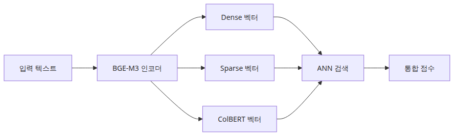
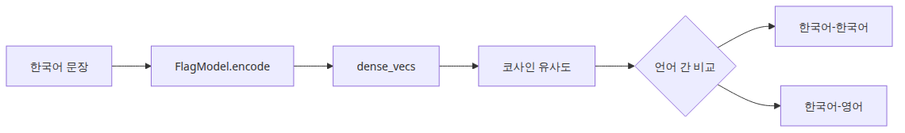
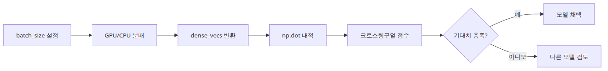
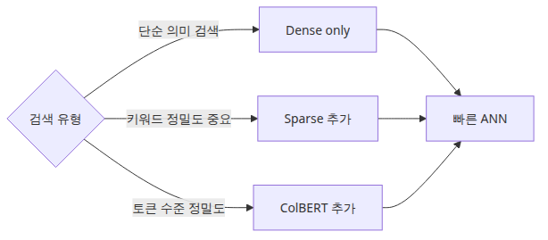

# BGE-M3 다국어 임베딩 실전

## 이 글에서 답할 질문

- 한국어와 영어가 섞인 코퍼스에서 BGE-M3가 KoSimCSE보다 강한 지점은 어디일까요?
- dense, sparse, multi-vector라는 세 종류의 표현을 한 모델이 동시에 내놓는다는 게 무슨 뜻일까요?
- 다국어 검색의 첫 버전을 dense만으로도 의미 있게 만들 수 있는 이유는 무엇일까요?
- 같은 쿼리인데도 언어별로 점수 분포가 달라지는 현상은 어디서 비롯될까요?

> 다국어 검색을 시작할 때 가장 먼저 해야 할 일은 화려한 멀티벡터 합산이 아니라, dense baseline을 정확히 측정해 두는 것입니다.

> 한국어 AI 스택 101 시리즈 (3/6)

예제 코드: [github.com/yeongseon-books/korean-ai-stack-101](https://github.com/yeongseon-books/korean-ai-stack-101/tree/main/ko/03-bge-m3-multilingual)

## 이 글에서 다룰 문제

이 글에서는 한국어와 영어가 섞인 문서 코퍼스에 BGE-M3를 붙여 봅니다. 앞 글이 KoSimCSE로 한국어 짧은 문장 검색을 만들어 봤다면, 이번 글은 "쿼리는 한국어인데 문서는 영어가 절반"인 현실 코퍼스를 다룹니다.

BGE-M3를 별도 단계로 다루는 이유는 두 가지입니다. 첫째, 다국어 임베딩 없이는 한국 회사의 내부 문서 검색이 거의 불가능합니다. 매뉴얼과 인시던트 회고는 영어로 쓰여 있고, 사용자 쿼리는 한국어로 들어옵니다. 둘째, BGE-M3는 dense·sparse·multi-vector를 한 모델로 동시에 내놓는 첫 오픈 모델이기 때문에, 이후 하이브리드 검색을 설계할 때 같은 모델 위에서 점수를 합산할 수 있다는 큰 이점을 갖습니다. 이 글에서는 dense baseline에 집중하고, sparse와 multi-vector는 다음 단계로 남겨 둡니다.

## Mental Model

다국어 dense 검색은 다음 4단계로 분해됩니다.

```
[다국어 코퍼스 (ko+en)]            [한국어 쿼리]
        |                                |
        v                                v
[BGE-M3 encode -> 1024d]      [BGE-M3 encode -> 1024d]
        |                                |
        v                                v
[FAISS IndexFlatIP] <-------- search ----+
        |
        v
[top-k (언어 무관)]
```

핵심은 세 가지입니다.

- **언어 비대칭을 모델이 흡수**: 코퍼스가 영어라도 한국어 쿼리와 같은 벡터 공간에 매핑됩니다. KoSimCSE는 이 매핑이 약합니다.
- **정규화는 여전히 필요**: BGE-M3 dense 출력은 길이가 일정하지 않으므로 `normalize_embeddings=True`를 꼭 켭니다.
- **Dense만 써도 되는 이유**: 다국어 인코더가 sparse 신호의 일부를 이미 학습으로 흡수했기 때문에, dense baseline 자체가 KoSimCSE 대비 분명한 개선폭을 보여 줍니다.

추가로 알아야 할 것:

- BGE-M3의 dense 차원은 1024입니다. KoSimCSE(768)보다 큽니다. FAISS 메모리도 약 1.3배입니다.
- 모델 로딩 시간이 KoSimCSE보다 길어 cold start가 5-10초 더 걸릴 수 있습니다. 캐싱이 더 중요합니다.

## 핵심 개념

| 항목 | 의미 |
| --- | --- |
| BGE-M3 | BAAI에서 공개한 다국어 임베딩 모델. 100여 개 언어 지원 |
| `BAAI/bge-m3` | Hugging Face 모델 ID. SentenceTransformer로 로드 가능 |
| Dense vector | 일반적인 1024차원 임베딩. 의미 검색의 기본 |
| Sparse vector | 토큰별 가중치를 갖는 표현. BM25와 비슷하나 학습된 가중치 |
| Multi-vector (ColBERT-style) | 토큰마다 작은 벡터를 두는 late-interaction 표현 |
| `normalize_embeddings=True` | dense 벡터 길이를 1로 만들어 cosine similarity를 단순화 |
| `IndexFlatIP` | FAISS 내적 인덱스. 정규화된 dense 벡터에 적합 |

## Before vs. After

**Before** — KoSimCSE만 쓰는 검색에서 한국어 쿼리 "쿠버네티스 롤백 절차"는 한국어 문서 두세 건만 찾아 옵니다. 영어로 쓰인 사내 runbook은 검색되지 않습니다.

**After** — BGE-M3 dense 검색을 도입하면 다음과 같이 동작합니다.

```python
query = '배포 실패 시 쿠버네티스 롤백 절차를 찾고 싶습니다.'
# top-1: 'Kubernetes rollback playbook for failed deploys' (score 0.78, en)
# top-2: '배포 실패 시 롤백 체크리스트' (score 0.74, ko)
# top-3: 'CI 파이프라인 실패 알림 정책' (score 0.41, ko)
```

핵심은 (1) 한국어 쿼리가 영어 runbook을 top-1로 끌어 올린다는 점, (2) 같은 의미의 한국어 문서도 작은 차이로 top-2에 자리잡는다는 점, (3) top-3과의 점수 간격이 충분히 벌어져 cut-off 신뢰도가 생긴다는 점입니다.

## 핵심 흐름


*핵심 흐름*

## 왜 dense baseline부터 시작할까



*dense baseline을 기준선으로 잡는 측정 흐름*

BGE-M3가 dense·sparse·multi-vector를 한꺼번에 내놓는다고 해서 처음부터 셋을 합산할 필요는 없습니다. dense baseline 한 가지만으로 KoSimCSE 대비 얼마나 좋아지는지 측정해 두지 않으면, 나중에 sparse를 더했을 때 그 개선이 sparse 덕분인지 dense 덕분인지 구분할 수 없습니다. 가장 단순한 dense + IndexFlatIP 조합으로 Recall@5를 한 번 찍어 두는 일이 모든 후속 실험의 기준선이 됩니다.

## 단계별 실습

### 1단계 — 모델과 다국어 코퍼스 준비

```python
import faiss
from sentence_transformers import SentenceTransformer

MODEL_NAME = 'BAAI/bge-m3'
DOCS = [
    {'lang': 'en', 'text': 'Kubernetes rollback playbook for failed deploys: kubectl rollout undo'},
    {'lang': 'en', 'text': 'Customer support label taxonomy for refund and cancellation tickets'},
    {'lang': 'ko', 'text': '배포 실패 시 롤백 체크리스트: 헬스체크, 트래픽 회수, 알림 순서'},
    {'lang': 'ko', 'text': 'CI 파이프라인 실패 시 슬랙 알림 정책과 담당자 매트릭스'},
    {'lang': 'ko', 'text': '환불 요청 처리 SLA와 cancellation 사유 코드 관리'},
]

model = SentenceTransformer(MODEL_NAME)
```

### 2단계 — Dense 임베딩과 인덱싱

```python
embeddings = model.encode(
    [doc['text'] for doc in DOCS],
    normalize_embeddings=True,
).astype('float32')

index = faiss.IndexFlatIP(embeddings.shape[1])
index.add(embeddings)
print('dim =', embeddings.shape[1])  # 1024
```

차원이 1024라는 사실을 한 번은 직접 확인해 두면, 나중에 IndexIVF로 바꿀 때 학습 데이터 양 산정에 도움이 됩니다.

### 3단계 — 한국어 쿼리로 영어+한국어 문서 검색



*최소 실행 예제*

```python
query = '배포 실패 시 쿠버네티스 롤백 절차를 찾고 싶습니다.'
query_vec = model.encode([query], normalize_embeddings=True).astype('float32')
distances, indices = index.search(query_vec, 3)

for score, idx in zip(distances[0], indices[0]):
    print(f"{score:.3f}  [{DOCS[idx]['lang']}]  {DOCS[idx]['text']}")
```

언어 코드를 함께 출력하면, 다국어 매핑이 실제로 동작하는지 한눈에 들어옵니다.

### 4단계 — 언어별 Recall 비교

```python
test_cases = [
    ('배포 실패 시 쿠버네티스 롤백 절차', 0),     # 정답: 영어 runbook
    ('환불 요청 SLA 알려 주세요', 4),              # 정답: 한국어 환불 정책
    ('CI 실패 알림은 누구에게 가나요', 3),         # 정답: 한국어 CI 정책
]

hits = 0
for query, gold_idx in test_cases:
    vec = model.encode([query], normalize_embeddings=True).astype('float32')
    _, idx = index.search(vec, 1)
    if idx[0][0] == gold_idx:
        hits += 1
print(f"Recall@1 (ko query) = {hits / len(test_cases):.2f}")
```

쿼리 언어가 한국어로 고정된 상태에서 정답 문서의 언어를 섞어 두는 것이 핵심입니다. 영어 정답에 대한 Recall이 0.6 미만이면 dense만으로는 부족하다는 신호입니다.

### 5단계 — 동일 쿼리를 영어로 바꿔 비교 (선택)

```python
en_query = 'kubernetes rollback procedure for failed deployment'
en_vec = model.encode([en_query], normalize_embeddings=True).astype('float32')
en_dist, en_idx = index.search(en_vec, 3)

for score, idx in zip(en_dist[0], en_idx[0]):
    print(f"{score:.3f}  [{DOCS[idx]['lang']}]  {DOCS[idx]['text']}")
```

같은 의미의 영어 쿼리와 한국어 쿼리에서 top-1이 같은지 비교하면, 모델이 언어 비대칭을 얼마나 잘 흡수했는지 정성적으로 평가할 수 있습니다.

## 이 코드에서 봐야 할 것



*이 코드에서 봐야 할 것*

- 코퍼스에 영어와 한국어가 섞여 있어도 **한 모델로 같이 인코딩**합니다. 언어별 모델을 따로 두는 옛 패턴은 BGE-M3에서 필요 없습니다.
- 정답 문서의 언어를 일부러 섞어 둔 test case가 다국어 retrieval의 진짜 성능을 드러냅니다.
- 차원이 1024라서 KoSimCSE보다 메모리·속도 비용이 큽니다. 캐싱과 배치 인코딩이 더 중요해집니다.
- dense 결과만으로 Recall이 충분하면 sparse·multi-vector는 굳이 추가하지 않습니다.

## 자주 하는 실수



*실무에서 헷갈리는 지점*

- **정규화 누락** — `normalize_embeddings=True` 없이 `IndexFlatIP`를 쓰면 dense 벡터 길이의 차이가 점수를 지배합니다.
- **언어 분리 인덱스** — 한국어용 인덱스, 영어용 인덱스를 따로 두면 BGE-M3의 다국어 정렬 효과가 사라집니다. 같은 인덱스에 같이 넣어야 합니다.
- **점수 절대값 비교** — KoSimCSE의 0.91과 BGE-M3의 0.78을 같은 기준으로 비교하면 안 됩니다. 모델이 다르면 분포가 다릅니다.
- **dense·sparse·multi-vector를 한 번에 추가** — 셋을 동시에 켜면 어느 신호가 개선을 만들었는지 분리할 수 없습니다. dense → sparse → multi-vector 순으로 한 번에 하나씩 켭니다.
- **쿼리 길이 무시** — BGE-M3는 8K 토큰까지 지원하지만, 너무 긴 쿼리는 의미가 분산되어 점수가 평탄해집니다. 200토큰 안팎을 권장합니다.
- **모델을 fp16 없이 GPU에서 사용** — BGE-M3는 fp16 추론이 안전하고 빠릅니다. `model.half()` 한 줄로 메모리가 절반이 됩니다.

## 실무 적용

- **다국어 사내 검색**: 영어 매뉴얼·인시던트 회고와 한국어 운영 가이드를 한 인덱스에 같이 넣고, 한국어 쿼리만 받는 검색 첫 버전을 빠르게 만들 수 있습니다.
- **Hybrid 검색의 dense 축**: BM25(sparse, 키워드)와 BGE-M3 dense를 가중 평균하면 도메인 약어와 일반 의역을 모두 잡을 수 있습니다. 가중치는 0.3-0.7 사이에서 시작합니다.
- **Cross-encoder 재정렬**: BGE-M3로 top-50 후보를 가져온 뒤 `bge-reranker-large`로 재정렬하면 다국어 쿼리에서도 정확도가 크게 오릅니다.
- **임베딩 캐싱**: 1024차원 × 수만 문서면 메모리가 큽니다. 디스크 캐싱과 mmap 사용이 더 중요합니다.
- **인덱스 선택**: 1만 개 이하 → `IndexFlatIP`. 10만 개 이상 → `IndexIVFFlat`(nlist≈√N), 학습용 샘플은 1만 개 이상 권장. 100만 개 이상 → `IndexHNSWFlat`.
- **언어 모니터링**: 매주 Recall@5를 한국어 쿼리/영어 정답, 한국어 쿼리/한국어 정답 두 그룹으로 분리해 측정합니다. 한쪽만 떨어지면 코퍼스 비율 또는 모델 교체 신호입니다.

## 실무에서는 이렇게 생각한다

BGE-M3의 가장 큰 장점은 하나의 모델로 dense와 sparse retrieval을 모두 커버할 수 있다는 점입니다. 하지만 실무에서 세 가지를 모두 쓰는 팀은 많지 않습니다. 대부분은 dense 벡터만으로 시작하고, 키워드 검색이 중요한 경우에만 sparse를 추가합니다.

BGE-M3는 모델 크기가 KoSimCSE보다 큭니다. 인퍼런스 속도와 메모리 사용량이 중요한 환경(edge device, 실시간 채팅 등)에서는 경량 모델이 더 적합할 수 있습니다. 모델 선택은 항상 성능과 비용의 트레이드오프입니다.

## 체크리스트

- [ ] 코퍼스에 한국어와 영어 문서를 모두 같은 인덱스에 넣었다.
- [ ] dense baseline의 Recall@5를 한 번 측정해 기준선을 남겼다.
- [ ] 정규화와 IndexFlatIP가 짝으로 적용돼 있다.
- [ ] 같은 의미의 한국어/영어 쿼리로 top-1이 일관된지 정성 평가해 봤다.
- [ ] sparse·multi-vector를 추가하기 전에 dense만의 한계를 문서로 남겼다.

## 정리 · 다음 글

BGE-M3 dense 예제의 핵심은 다국어 검색의 baseline을 분명히 그어 두는 것입니다. 한국어 쿼리에서 영어 문서를 끌어 올릴 수 있다는 사실이 이미 큰 진전이고, 그 위에서 sparse와 multi-vector를 더해 갈 때 비로소 개선폭을 측정할 수 있습니다. 같은 모델로 한국어와 영어를 같은 공간에 정렬한다는 단 하나의 약속이, 사내 검색 1차 버전을 가능하게 만듭니다.

다음 글(4편)에서는 CLOVA OCR API를 다룹니다. 이미지로 들어온 한국어 문서에서 텍스트를 안정적으로 뽑아 내고, 그 결과를 BGE-M3 코퍼스에 그대로 넣을 수 있는 형태로 정리하는 과정을 코드로 확인합니다.

<!-- toc:begin -->
## 시리즈 목차

- [한국어 임베딩 모델 비교 — KoSimCSE, BGE-M3, Solar](./01-korean-embedding-models.md)
- [KoSimCSE로 문장 유사도 구현하기](./02-kosimcse-similarity.md)
- **BGE-M3 다국어 임베딩 실전 (현재 글)**
- CLOVA OCR API로 문서 텍스트 추출 (예정)
- HyperCLOVA X와 Solar API 사용하기 (예정)
- 한국어 RAG 파이프라인 조합하기 (예정)

<!-- toc:end -->

---

## 참고 자료

- [BAAI/bge-m3 모델 카드](https://huggingface.co/BAAI/bge-m3)
- [BGE-M3 논문 (M3-Embedding)](https://arxiv.org/abs/2402.03216)
- [FAISS getting started](https://github.com/facebookresearch/faiss/wiki/Getting-started)
- [SentenceTransformers semantic search examples](https://www.sbert.net/examples/sentence_transformer/applications/semantic-search/README.html)

Tags: Korean NLP, LLM, Embeddings, OCR
