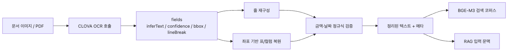
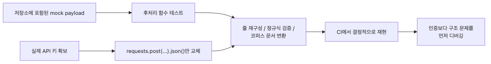
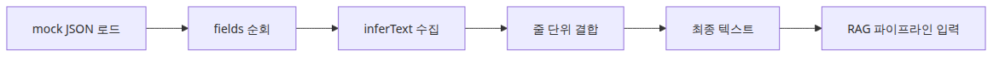
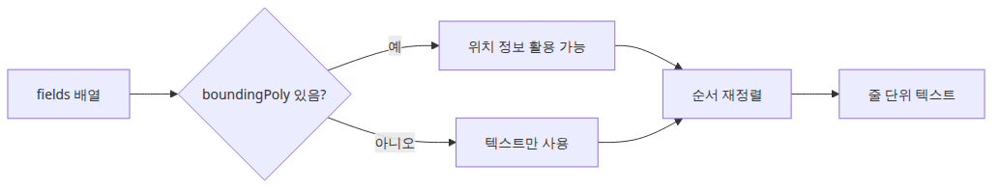
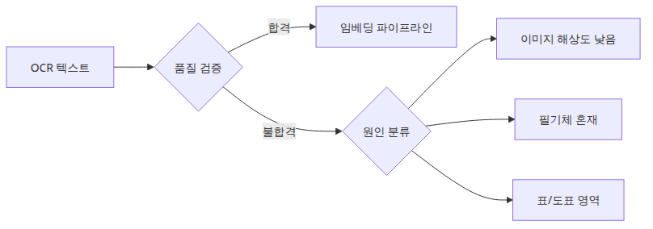

# CLOVA OCR API로 문서 텍스트 추출

## 이 글에서 답할 질문

- OCR을 붙일 때 가장 먼저 확인해야 할 것은 텍스트 정확도일까요, 응답 구조일까요?
- 바운딩 박스와 `lineBreak` 정보가 후처리에 왜 중요한가요?
- API 키가 없어도 OCR 파이프라인의 대부분을 먼저 검증할 수 있는 이유는 무엇일까요?
- RAG로 넘기기 전에 OCR 텍스트를 정리하는 단계가 왜 꼭 필요할까요?

> OCR의 첫 번째 산출물은 텍스트가 아니라 구조화된 추출 결과이고, 검색 품질은 그 구조를 어떻게 정리하느냐에 크게 좌우됩니다.

> 한국어 AI 스택 101 시리즈 (4/6)

예제 코드: [github.com/yeongseon-books/korean-ai-stack-101](https://github.com/yeongseon-books/korean-ai-stack-101/tree/main/ko/04-clova-ocr)

## 왜 중요한가

이 글에서는 한국어 영수증·세금계산서 같은 문서 이미지를 CLOVA OCR API로 처리하고, 그 결과를 BGE-M3 코퍼스에 넣을 수 있는 형태까지 정리합니다. 앞 글이 텍스트 코퍼스를 다국어로 검색하는 단계였다면, 이번 글은 그 코퍼스에 들어갈 원천 데이터를 OCR로 만들어 내는 단계입니다.

OCR을 별도 글로 다루는 이유는 분명합니다. 한국어 사내 검색의 절반은 PDF·스캔 이미지·휴대폰 사진에서 시작합니다. OCR 단계에서 줄바꿈 한 번이 어긋나면 "공급가액 45,000원"이 "공급가액"과 "45,000원"으로 쪼개진 채 인덱싱되어 의미 검색이 실패합니다. CLOVA OCR은 한국어에 특화돼 있어 인식 정확도는 높은 편이지만, 진짜 어려운 일은 응답 JSON을 줄·문단·표 단위로 다시 조립하는 후처리에 있습니다. 이번 예제는 실제 키 없이도 돌아가도록 mock 응답을 기본값으로 사용해, 후처리 로직을 먼저 손에 익히도록 구성했습니다.

## Mental Model

OCR 파이프라인은 4단계로 분해됩니다.

```
[문서 이미지/PDF]
       |
       v
[CLOVA OCR API call]  --> 응답 JSON (fields, bbox, confidence, lineBreak)
       |
       v
[후처리: 줄/문단/표 재구성]  <-- 정합성 검증, 숫자/날짜 패턴 확인
       |
       v
[clean text + meta] --> BGE-M3 / RAG 코퍼스
```

핵심은 세 가지입니다.

- **API는 fields 배열을 반환할 뿐**: 줄바꿈·문단·표 같은 구조는 응답의 `lineBreak`와 좌표에서 직접 만들어 내야 합니다.
- **confidence는 절대 진실이 아님**: 0.99도 틀릴 수 있고, 0.85도 맞을 수 있습니다. 임계값보다 분포를 봐야 합니다.
- **mock-first 개발이 안전**: 키 없이도 응답 JSON 형식을 코드로 재현할 수 있어, CI에서도 동일하게 검증 가능합니다.

추가로 알아야 할 것:

- CLOVA OCR은 General OCR과 Template OCR 두 갈래가 있습니다. 영수증·세금계산서는 Template, 자유 양식 문서는 General.
- 응답에는 `inferText`, `inferConfidence`, `boundingPoly`, `lineBreak`가 들어옵니다. 이 글은 가장 자주 쓰는 `inferText` + `lineBreak` 조합에 집중합니다.

## 핵심 개념

| 항목 | 의미 |
| --- | --- |
| CLOVA OCR | NAVER Cloud Platform의 한국어 특화 OCR API |
| General OCR | 자유 양식 문서용. 위치·줄 정보를 모두 반환 |
| Template OCR | 영수증·신분증 등 양식이 정해진 문서용. 필드명까지 자동 매핑 |
| `inferText` | 인식된 텍스트 토큰 |
| `inferConfidence` | 인식 신뢰도 (0-1) |
| `boundingPoly` | 토큰의 4점 좌표 |
| `lineBreak` | 이 토큰이 줄의 끝인지 여부 (boolean) |
| Mock response | 실제 호출 없이 같은 형식의 JSON을 코드로 만들어 후처리만 검증 |

## Before vs. After

**Before** — 응답 JSON을 그대로 코퍼스에 넣으면 `inferText`가 토큰별로 흩어져 인덱싱됩니다. 검색은 "공급가액"과 "45,000원"을 별도 문서로 다루며, "공급가액 45,000원"이라는 의미 단위가 사라집니다.

**After** — `lineBreak`를 따라 줄을 재구성한 뒤 코퍼스에 넣으면 다음과 같이 동작합니다.

```python
# 후처리 결과 (한 줄당 한 문서)
'공급가액 45,000원'      # confidence min: 0.994
'부가세 4,500원'          # confidence min: 0.991
'합계 49,500원'           # confidence min: 0.989
```

핵심은 (1) 의미 단위로 묶여 있어 BGE-M3 검색이 올바른 줄을 끌어 올린다, (2) 줄별 최소 confidence를 같이 저장해 후속 검토가 가능하다, (3) raw payload도 함께 보관해 언제든 재처리할 수 있다는 것입니다.

## 핵심 흐름



## 왜 mock 응답부터 다루는가



OCR 연동의 난점은 API 호출 자체보다 응답 후처리에 있습니다. 표 셀 순서가 뒤바뀌거나 줄바꿈이 어긋나는 문제는 mock 응답만으로도 충분히 재현할 수 있습니다. mock부터 시작하면 CI에서 같은 입력으로 매번 같은 후처리 결과를 검증할 수 있고, 실제 키가 추가됐을 때 변경 지점이 "응답을 어디서 가져오는가" 한 줄로 좁혀집니다.

## 단계별 실습

### 1단계 — Mock 응답 정의

```python
MOCK_RESPONSE = {
    'images': [
        {
            'fields': [
                {'inferText': '공급가액', 'inferConfidence': 0.997, 'lineBreak': False},
                {'inferText': '45,000원', 'inferConfidence': 0.994, 'lineBreak': True},
                {'inferText': '부가세',   'inferConfidence': 0.996, 'lineBreak': False},
                {'inferText': '4,500원',  'inferConfidence': 0.991, 'lineBreak': True},
                {'inferText': '합계',     'inferConfidence': 0.998, 'lineBreak': False},
                {'inferText': '49,500원', 'inferConfidence': 0.989, 'lineBreak': True},
            ]
        }
    ]
}
```

실제 키가 생기면 이 dict를 만드는 부분만 `requests.post(...).json()`으로 바꿉니다.

### 2단계 — 줄 단위 재구성



```python
def reconstruct_lines(payload):
    lines = []
    for image in payload['images']:
        current_text, current_conf = [], []
        for field in image['fields']:
            current_text.append(field['inferText'])
            current_conf.append(field['inferConfidence'])
            if field['lineBreak']:
                lines.append({
                    'text': ' '.join(current_text),
                    'min_confidence': min(current_conf),
                })
                current_text, current_conf = [], []
    return lines

lines = reconstruct_lines(MOCK_RESPONSE)
for line in lines:
    print(f"{line['min_confidence']:.3f}  {line['text']}")
```

`lineBreak`를 따라 토큰을 묶고, 줄별 최소 confidence를 같이 들고 다닙니다. 이 단순한 함수 하나가 표·영수증 후처리의 90%를 처리합니다.

### 3단계 — 숫자·금액 검증 규칙

```python
import re

AMOUNT_RE = re.compile(r'^[\d,]+원$')

for line in lines:
    tokens = line['text'].split()
    amounts = [t for t in tokens if AMOUNT_RE.match(t)]
    if not amounts and ('원' in line['text']):
        print('WARN 금액 형식 의심:', line['text'])
```

OCR은 "45,000원"을 "45.000원"으로 인식하는 일이 종종 있습니다. confidence 임계값보다 도메인 정규식이 훨씬 정확한 경고가 됩니다.

### 4단계 — 코퍼스용 dict로 정리

```python
def to_corpus_doc(image_id, lines):
    return {
        'image_id': image_id,
        'lines': [line['text'] for line in lines],
        'min_confidence': min(line['min_confidence'] for line in lines),
        'raw_payload_path': f's3://ocr-raw/{image_id}.json',
    }

doc = to_corpus_doc('receipt_001', lines)
print(doc)
```

raw payload 경로를 같이 저장하면, 후속 OCR 모델 교체 시 재처리가 단순해집니다. 텍스트만 들고 있으면 무엇으로부터 만들어졌는지 잃어버립니다.

### 5단계 — 실제 API 호출로 교체 (선택)

```python
import os, requests

def call_clova_ocr(image_path):
    url = os.environ['CLOVA_OCR_URL']
    secret = os.environ['CLOVA_OCR_SECRET']
    headers = {'X-OCR-SECRET': secret}
    files = {'file': open(image_path, 'rb')}
    data = {'message': '{"version":"V2","requestId":"x","timestamp":0,"images":[{"format":"jpg","name":"x"}]}'}
    return requests.post(url, headers=headers, files=files, data=data).json()
```

mock과 같은 형태의 dict를 반환하므로, 1-4단계 코드는 그대로 재사용됩니다.

## 이 코드에서 봐야 할 것



- `inferText`만 보지 않고 **`lineBreak`도 같이** 봅니다. 이 한 가지가 표·영수증 후처리 정확도를 좌우합니다.
- confidence는 줄별 최소값으로 모아 두면 후속 단계에서 재검토 우선순위가 자연스럽게 나옵니다.
- raw payload와 후처리 결과를 함께 저장하는 습관이 모델 교체 시 가장 큰 자산이 됩니다.
- 실제 API 키가 있더라도 mock 응답 기반 테스트를 함께 유지하면 CI가 항상 결정적으로 동작합니다.

## 자주 하는 실수



- **OCR 정확도가 높으면 RAG도 좋아진다는 가정** — 토큰 정확도와 의미 단위 정확도는 다른 문제입니다. 줄 재구성이 틀리면 99% OCR도 무용지물.
- **confidence 절대 임계값 사용** — 0.95 같은 절대값은 모델 버전에 따라 의미가 달라집니다. 분포의 하위 5%를 검토하는 편이 안전합니다.
- **PDF와 이미지 OCR을 같은 코드로 처리** — PDF는 텍스트 레이어가 있을 수 있어 OCR보다 `pdfplumber`가 빠르고 정확합니다. 먼저 텍스트 레이어 유무를 검사합니다.
- **raw payload를 버리고 텍스트만 저장** — OCR 모델을 교체하거나 후처리 로직을 고칠 때 처음부터 다시 호출해야 합니다. 비용·시간 모두 큽니다.
- **다중 컬럼 문서를 단일 줄로 처리** — 좌표(`boundingPoly`) 없이 `lineBreak`만 따르면 좌측·우측 컬럼이 한 줄로 합쳐집니다. 컬럼 구분이 필요하면 x좌표 기준으로 그룹핑합니다.
- **mock 응답을 production 코드 경로 안에 둠** — 환경 변수로 분기하지 않으면 실수로 mock이 production에서 동작합니다. `os.environ.get('CLOVA_OCR_MODE', 'mock')` 같은 명시적 스위치를 둡니다.

## 실무 적용

- **두 단 OCR**: General OCR로 페이지 전체를 뽑고, 영수증·신분증 같은 영역만 Template OCR로 다시 처리하면 비용과 정확도가 모두 균형을 잡습니다.
- **PDF 분기**: `pdfplumber`로 텍스트 레이어를 먼저 시도하고, 실패한 페이지만 OCR로 보냅니다. 비용이 70% 이상 줄어드는 경우가 많습니다.
- **재처리 큐**: confidence 분포 하위 5%인 줄에 `needs_review` 태그를 달아 사람 검수 큐로 보냅니다. 절대 임계값 알람보다 운영 효율이 좋습니다.
- **표 재구성**: `boundingPoly`의 y좌표로 행을 묶고 x좌표로 열을 정렬하면 표 셀이 정확히 복원됩니다. `lineBreak`만으로는 부족합니다.
- **이미지 전처리**: 회전·기울기 보정과 흑백 변환을 OCR 호출 전에 수행하면 confidence 평균이 0.05-0.1 오릅니다. `opencv-python` 한 줄짜리 전처리도 효과 큽니다.
- **모니터링**: 매일 처리량, 평균 confidence, 줄 재구성 실패율 세 지표를 대시보드에 둡니다. 모델 업데이트 직후 분포가 어떻게 흔들리는지 한눈에 보입니다.

## 체크리스트

- [ ] raw OCR payload와 후처리 결과를 함께 저장한다.
- [ ] `lineBreak`, 좌표, confidence 중 무엇을 쓸지 먼저 정한다.
- [ ] 숫자·금액·날짜 필드는 별도 검증 규칙(정규식)을 둔다.
- [ ] 임베딩 단계로 넘기기 전에 줄 또는 문단 재구성을 확인한다.
- [ ] mock-first 테스트가 CI에 포함돼 있다.

## 연습 문제

1. Mock 응답에 줄을 3개 더 추가하고, 일부러 한 줄에 `lineBreak: False`만 두 번 들어가게 만들어 보세요. 줄 재구성 함수가 어떻게 처리하는지 관찰하고 보강 방법을 토론해 보세요.
2. `boundingPoly`를 추가한 mock 응답을 만들고, x좌표 기준으로 좌측·우측 컬럼을 분리하는 함수를 작성해 보세요.
3. 실제 PDF 한 페이지를 `pdfplumber`로 먼저 시도하고, 실패한 경우에만 mock CLOVA 호출로 분기하는 wrapper 함수를 작성해 보세요.

## 정리 · 다음 글

CLOVA OCR 예제의 핵심은 응답 구조에 대한 이해를 텍스트 추출보다 먼저 두는 것입니다. `lineBreak`를 따라 줄을 묶고, 줄별 confidence를 보존하고, raw payload를 같이 저장하는 세 가지 작은 약속만 지켜도 OCR이 RAG 코퍼스에 안전하게 들어갑니다. 이 단계가 깔끔해야 다음 글에서 생성 API에 어떤 문맥을 넘기는지가 분명해집니다.

다음 글(5편)에서는 HyperCLOVA X와 Solar API를 다룹니다. 이번 글에서 정리한 OCR 텍스트 또는 BGE-M3 검색 결과를 한국어 LLM에 넘길 때 어떤 prompt 패턴이 안전한지, API 호출 코드와 함께 살펴봅니다.

<!-- toc:begin -->
## 시리즈 목차

- [한국어 임베딩 모델 비교 — KoSimCSE, BGE-M3, Solar](./01-korean-embedding-models.md)
- [KoSimCSE로 문장 유사도 구현하기](./02-kosimcse-similarity.md)
- [BGE-M3 다국어 임베딩 실전](./03-bge-m3-multilingual.md)
- **CLOVA OCR API로 문서 텍스트 추출 (현재 글)**
- HyperCLOVA X와 Solar API 사용하기 (예정)
- 한국어 RAG 파이프라인 조합하기 (예정)

<!-- toc:end -->

---

## 참고 자료

- [NAVER Cloud CLOVA OCR overview](https://www.ncloud.com/product/aiService/ocr)
- [CLOVA OCR API guide](https://api.ncloud-docs.com/docs/ai-application-service-ocr-ocr)
- [pdfplumber](https://github.com/jsvine/pdfplumber)
- [OCR post-processing patterns](https://cloud.google.com/document-ai/docs/process-documents-client-libraries)

Tags: Korean NLP, LLM, Embeddings, OCR
