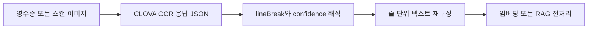

# CLOVA OCR API로 문서 텍스트 추출

## 이 글에서 답할 질문

- OCR을 붙일 때 가장 먼저 확인해야 할 것은 텍스트 정확도일까요, 응답 구조일까요?
- 바운딩 박스와 lineBreak 정보가 후처리에 왜 중요한가요?
- API 키가 없어도 OCR 파이프라인의 대부분을 먼저 검증할 수 있는 이유는 무엇일까요?
- RAG로 넘기기 전에 OCR 텍스트를 정리하는 단계가 왜 꼭 필요할까요?

> OCR의 첫 번째 산출물은 텍스트가 아니라 구조화된 추출 결과이고, 검색 품질은 그 구조를 어떻게 정리하느냐에 크게 좌우됩니다.

> 한국어 AI 스택 101 시리즈 (4/6)

예제 코드: [github.com/yeongseon-books/korean-ai-stack-101](https://github.com/yeongseon-books/korean-ai-stack-101/tree/main/ko/04-clova-ocr)

이번 예제는 실제 CLOVA OCR 키가 없어도 돌아가도록 mock 응답을 기본값으로 사용합니다. 중요한 것은 네트워크 호출이 아니라, 응답 JSON을 어떻게 읽고 줄 단위 텍스트로 재구성하는지 보여 주는 것입니다.

---

## 핵심 흐름



---

## 왜 mock 응답부터 다루는가

OCR 연동의 난점은 API 호출 자체보다 응답 후처리에 있는 경우가 많습니다. 표 셀 순서가 뒤바뀌거나 줄바꿈이 어긋나는 문제는 mock 응답만으로도 충분히 재현할 수 있습니다.

---

## 최소 실행 예제

```python
MOCK_RESPONSE = {
    'images': [
        {
            'fields': [
                {'inferText': '공급가액', 'inferConfidence': 0.997, 'lineBreak': False},
                {'inferText': '45,000원', 'inferConfidence': 0.994, 'lineBreak': True},
                {'inferText': '부가세', 'inferConfidence': 0.996, 'lineBreak': False},
                {'inferText': '4,500원', 'inferConfidence': 0.991, 'lineBreak': True},
            ]
        }
    ]
}

for image in MOCK_RESPONSE['images']:
    current = []
    for field in image['fields']:
        current.append(field['inferText'])
        if field['lineBreak']:
            print(' '.join(current))
            current = []
```

---

## 이 코드에서 봐야 할 것

- `inferText`만 보는 것이 아니라 `lineBreak`를 같이 봅니다.
- confidence를 남겨 둬야 후속 단계에서 재검토가 가능합니다.
- raw payload와 후처리 결과를 함께 출력하는 습관이 중요합니다.
- 실제 API 키가 있더라도 샘플 이미지를 강제하지 않는 mock 예제가 재현성은 더 좋습니다.

---

## 실무에서 헷갈리는 지점

- OCR 정확도가 높다고 바로 RAG 품질이 좋아지지는 않습니다.
- confidence는 절대 진실값이 아닙니다.
- PDF와 이미지 OCR은 전처리 포인트가 다릅니다.

---

## 체크리스트

- [ ] raw OCR payload와 후처리 결과를 함께 저장한다.
- [ ] lineBreak, 좌표, confidence 중 무엇을 쓸지 먼저 정한다.
- [ ] 숫자·금액·날짜 필드는 별도 검증 규칙을 둔다.
- [ ] 임베딩 단계로 넘기기 전에 줄 또는 문단 재구성을 확인한다.

---

## 마무리

OCR은 부가 기능이 아니라 문서 파이프라인의 입력 정합성을 결정하는 단계입니다. 응답 구조를 먼저 이해해 두면, 다음 글에서 생성 API를 붙일 때도 어떤 문맥이 넘어가는지 훨씬 분명해집니다.

<!-- blog-only:start -->
다음 글: [HyperCLOVA X와 Solar API 사용하기](./05-hyperclova-solar-api.md)
<!-- blog-only:end -->

<!-- toc:begin -->
## 시리즈 목차

- [한국어 임베딩 모델 비교 — KoSimCSE, BGE-M3, Solar](./01-korean-embedding-models.md)
- [KoSimCSE로 문장 유사도 구현하기](./02-kosimcse-similarity.md)
- [BGE-M3 다국어 임베딩 실전](./03-bge-m3-multilingual.md)
- **CLOVA OCR API로 문서 텍스트 추출 (현재 글)**
- HyperCLOVA X와 Solar API 사용하기 (예정)
- 한국어 RAG 파이프라인 조합하기 (예정)

<!-- toc:end -->

---

## 참고 자료

- [NAVER Cloud CLOVA OCR overview](https://www.ncloud.com/product/aiService/ocr)
- [CLOVA OCR API guide](https://api.ncloud-docs.com/docs/ai-application-service-ocr-ocr)
- [OCR post-processing patterns](https://cloud.google.com/document-ai/docs/process-documents-client-libraries)

Tags: Korean NLP, LLM, Embeddings, OCR
