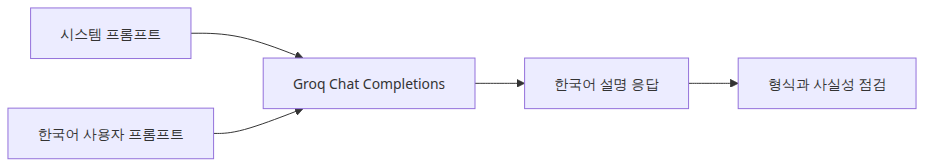

# HyperCLOVA X와 Solar API 사용하기

## 이 글에서 답할 질문

- 한국어 생성 모델 API를 붙일 때 프롬프트보다 먼저 고정해야 할 호출 계약은 무엇일까요?
- HyperCLOVA X·Solar 같은 한국어 중심 API를 실전에 도입할 때 어떤 점을 먼저 검증해야 할까요?
- 왜 이 글의 실행 예제는 Groq llama-3.1-8b-instant를 대체 실습으로 쓰나요?
- 한국어 응답 품질과 검색 기반 문맥 제어는 어떤 식으로 분리해서 봐야 할까요?

> 생성 API를 바꾸는 일은 모델 이름만 바꾸는 일이 아니라, 인증·호출 형식·프롬프트 계약·후처리 규칙을 함께 바꾸는 일입니다.

> 한국어 AI 스택 101 시리즈 (5/6)

예제 코드: [github.com/yeongseon-books/korean-ai-stack-101](https://github.com/yeongseon-books/korean-ai-stack-101/tree/main/ko/05-hyperclova-solar-api)

제목은 HyperCLOVA X와 Solar를 다루지만, 실행 예제는 Groq의 `llama-3.1-8b-instant`를 사용합니다. 이유는 저장소 예제가 독자 환경에서 바로 재현돼야 하기 때문입니다.

---

## 핵심 흐름


---

## 왜 공급자 대체 실습이 유효한가

독자가 항상 HyperCLOVA X나 Solar 키를 가지고 있지는 않습니다. 예제가 실행되지 않으면 프롬프트 설계와 후처리 포인트를 체감하기 어렵습니다. 호출 인터페이스와 운영 감각을 먼저 잡는 데는 Groq 예제로도 충분합니다.

---

## 최소 실행 예제

```python
import os
from groq import Groq

client = Groq(api_key=os.environ['GROQ_API_KEY'])
response = client.chat.completions.create(
    model='llama-3.1-8b-instant',
    temperature=0.3,
    max_completion_tokens=300,
    messages=[
        {'role': 'system', 'content': '당신은 한국어 제품 문서를 설명하는 시니어 개발자입니다.'},
        {'role': 'user', 'content': '벡터 검색과 키워드 검색의 차이를 한국어로 설명해 주세요.'},
    ],
)
print(response.choices[0].message.content)
```

```
출력 결과
벡터 검색과 키워드 검색은 두 가지 다른 검색 방법입니다. 각각의 특징과 용도를 이해하는 것이 중요합니다.

**벡터 검색**

벡터 검색은 텍스트를 벡터로 변환하여 검색합니다. 벡터는 텍스트의 의미를 숫자로 표현한 것입니다. 벡터 검색은 텍스트의 의미를 이해하여 검색 결과를 제공합니다. 예를 들어, "서울"과 "대전"이라는 단어를 벡터로 변환하면, 두 단어 사이의 의미적 유사성을 계산할 수 있습니다.

벡터 검색의 장점은 다음과 같습니다.

* 의미적 유사성을 계산할 수 있습니다.
* 텍스트의 의미를 이해하여 검색 결과를 제공합니다.
* 키워드 검색보다 더 정확한 검색 결과를 제공합니다.

벡터 검색의 단점은 다음과 같습니다.

* 텍스트를 벡터로 변환하는 과정이 복잡하고 시간이 많이 걸립니다.
* 벡터 검색 알고리즘을 학습시키는 데이터가 충분하지 않으면, 검색 결과가 정확하지 않을 수 있습니다.

**키워드 검색**

키워드 검색은 단어를 일치시키는 방식으로 검색합니다. 키워드 검색은 단어의 정확한 일치를 확인하여 검색 결과를 제공합니다. 예를 들어, "서울"이라는
```

---

## 이 코드에서 봐야 할 것

- 시스템 메시지를 한국어로 구체화합니다.
- `temperature`를 낮게 두면 설명형 응답의 흔들림이 줄어듭니다.
- 출력 형식을 미리 제한하면 후처리가 쉬워집니다.
- 실제 제품에서는 timeout, retry, 로그 마스킹도 함께 필요합니다.

---

## 실무에서 헷갈리는 지점

- 한국어에 자연스럽게 답한다고 해서 사실성까지 자동으로 보장되지는 않습니다.
- OpenAI 호환 인터페이스라고 해도 모델별 한도와 오류 특성은 다를 수 있습니다.
- 자세한 프롬프트와 응답 검증은 별개입니다.

---

## 체크리스트

- [ ] 시스템 메시지에 대상 독자와 문체를 명시한다.
- [ ] temperature와 max token 값을 고정하고 비교한다.
- [ ] 출력 형식을 bullet, JSON, 요약문 중 하나로 제한한다.
- [ ] 공급자를 바꿀 때 인증·오류 처리·latency 차이를 점검한다.

---

## 마무리

이 글에서 가져갈 핵심은 한국어 생성 API를 다루는 호출 감각입니다. 어떤 모델을 쓰든 입력 계약과 출력 계약을 먼저 고정해야 다음 글의 RAG 파이프라인에서 검색 문맥을 안전하게 얹을 수 있습니다.

<!-- toc:begin -->
## 시리즈 목차

- [한국어 임베딩 모델 비교 — KoSimCSE, BGE-M3, Solar](./01-korean-embedding-models.md)
- [KoSimCSE로 문장 유사도 구현하기](./02-kosimcse-similarity.md)
- [BGE-M3 다국어 임베딩 실전](./03-bge-m3-multilingual.md)
- [CLOVA OCR API로 문서 텍스트 추출](./04-clova-ocr.md)
- **HyperCLOVA X와 Solar API 사용하기 (현재 글)**
- 한국어 RAG 파이프라인 조합하기 (예정)

<!-- toc:end -->

---

## 참고 자료

- [Groq Python library](https://github.com/groq/groq-python)
- [Groq API reference](https://console.groq.com/docs/api-reference)
- [Upstage Solar documentation](https://developers.upstage.ai/docs/getting-started/overview)

Tags: Korean NLP, LLM, Embeddings, OCR
