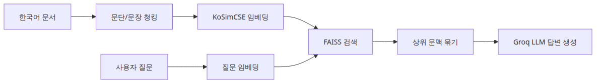
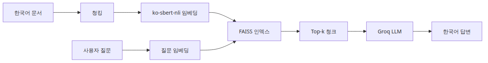
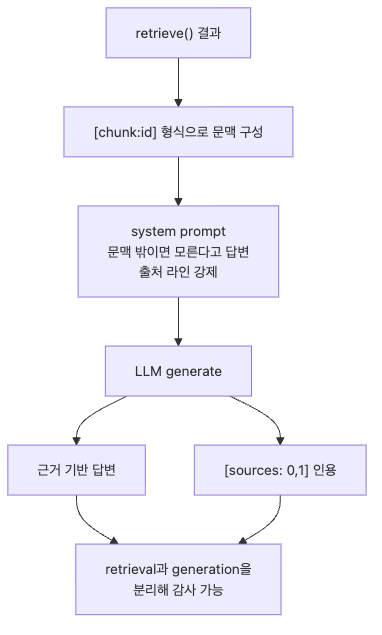
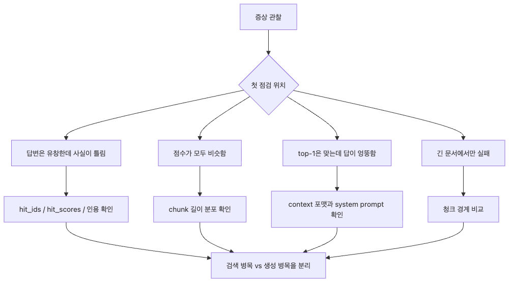
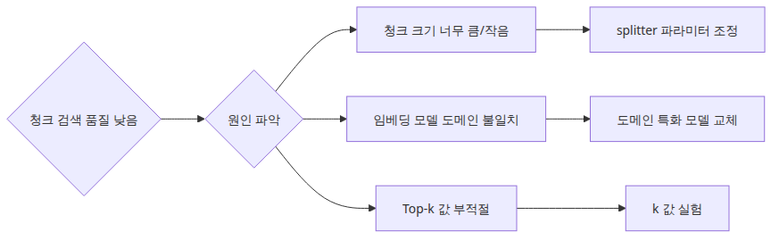

# 한국어 RAG 파이프라인 조합하기

## 이 글에서 답할 질문

- 한국어 RAG 파이프라인을 최소 구성으로 묶으려면 어떤 단계가 꼭 필요할까요?
- 문서 청킹·임베딩·검색·생성 중 어느 단계가 가장 자주 품질 병목이 되나요?
- 검색된 문맥을 LLM에 넘길 때 어떤 형태로 정리해야 추측을 줄일 수 있을까요?
- 시리즈 앞선 글의 요소(KoSimCSE, BGE-M3, CLOVA OCR, HyperCLOVA/Solar)들이 실제로 어떻게 이어질까요?

> RAG의 품질은 한 번의 마법 같은 호출에서 나오지 않습니다. 청크 경계, 검색 후보, 문맥 전달 방식이 맞물려 쌓이는 합성 결과입니다.

> 한국어 AI 스택 101 시리즈 (6/6)

예제 코드: [github.com/yeongseon-books/korean-ai-stack-101](https://github.com/yeongseon-books/korean-ai-stack-101/tree/main/ko/06-korean-rag-pipeline)

---

## 이 글에서 배울 것

이 글에서는 시리즈를 통해 다룬 부품들을 한 줄로 연결합니다. 한국어 문서를 청크로 나누고, KoSimCSE 또는 BGE-M3 임베딩으로 벡터화하고, FAISS로 상위 청크를 찾고, 마지막으로 Groq LLM(또는 Solar/HyperCLOVA X)에 검색된 문맥만 넘겨 답을 생성하는 minimum viable Korean RAG 파이프라인을 직접 만들어 봅니다.

구체적으로 다음 4가지를 익힙니다.

1. **4단계 파이프라인 분해** — Ingest, Index, Retrieve, Generate 단계를 각각 함수로 분리해, 어느 단계가 품질 병목인지 격리해서 진단하는 습관.
2. **청크 경계 설계** — 문장 단위·문단 단위·고정 토큰 단위 청킹의 차이와 한국어에서의 실패 패턴.
3. **검색 평가 분리** — Recall@k(검색 정확도)와 Faithfulness(생성 충실도)를 따로 측정해야 하는 이유와 최소 측정 코드.
4. **추측 차단 프롬프트** — system 메시지에 "문맥에 없는 내용은 추측하지 말라"를 명시하고, 출처(citation) 라인을 강제하는 패턴.

이 글이 끝나면 30~50개 문서로 작은 사내 위키 RAG를 만들고, 검색 실패와 생성 hallucination을 분리해서 디버깅할 수 있는 기본기를 갖게 됩니다.

---

## 왜 중요한가

LLM 단독 호출과 RAG의 차이는 출처가 있느냐 없느냐입니다. "결제는 됐는데 주문 내역이 없다"는 사용자 문의에 LLM이 그럴듯한 답변을 만들어 주더라도, 그 답이 실제 사내 정책 문서에 근거하지 않으면 운영팀은 신뢰할 수 없습니다.

RAG가 어려운 이유는 단계가 많아서가 아니라 **단계 간 책임 분리**가 안 돼서입니다. 답변이 이상할 때 청킹이 잘못된 것인지, 임베딩이 의미를 못 잡은 것인지, top-k가 부족한 것인지, LLM이 문맥을 무시한 것인지를 먼저 가려내야 합니다. 한 번의 end-to-end 호출만 보면 이 진단이 거의 불가능합니다.

이 글의 코드는 의도적으로 단계마다 print를 남기고, 검색된 청크와 점수를 함께 출력합니다. 한국어 RAG에서는 특히 토크나이저 차이(공백 기준 vs 형태소) 때문에 청킹이 흔한 실패 지점이 되므로, 어느 청크가 선택됐는지 눈으로 확인하는 습관이 디버깅 시간을 크게 줄여 줍니다.

---

## Mental Model — 4단계 파이프라인



*핵심 흐름*

RAG는 4개의 독립 단계로 분해됩니다.

| 단계 | 입력 | 출력 | 품질 지표 |
|---|---|---|---|
| **Ingest** | 원문 문서(PDF, HTML, OCR 결과) | 청크 리스트 | 청크 길이 분포, 경계 위치 |
| **Index** | 청크 + 임베딩 모델 | FAISS 인덱스 | 벡터 차원, 인덱스 크기 |
| **Retrieve** | 질문 임베딩 + 인덱스 | top-k 청크 + score | Recall@k |
| **Generate** | 질문 + 검색된 청크 | 답변 + 출처 | Faithfulness, 추측률 |

각 단계는 독립적으로 교체·측정·디버깅됩니다. Ingest의 청크 경계만 바꿔도 Recall@k가 크게 변할 수 있고, Generate의 프롬프트만 바꿔도 hallucination 비율이 달라집니다. 이 분리가 이 글 전체의 핵심 mental model입니다.

---

## 핵심 개념

### 청킹 (Chunking)

긴 문서를 검색 가능한 단위로 자르는 작업입니다. 한국어에서는 보통 다음 3가지 전략을 씁니다.

- **문단 단위** — `\n\n` 기준 분할. 가장 단순하고 의미 경계가 잘 살아납니다.
- **고정 토큰** — 256~512 토큰 단위로 자르고 50~100 토큰 overlap. 길이가 일정해 인덱싱이 안정적입니다.
- **문장 단위** — KSS 또는 kiwi로 문장 분리. 짧은 FAQ에 적합하지만 컨텍스트가 부족할 수 있습니다.

### 임베딩 (Embedding)

청크를 벡터로 바꿉니다. 한국어 단일 언어면 KoSimCSE(2편), 다국어 코퍼스면 BGE-M3(3편)가 일반적인 선택입니다. `normalize_embeddings=True`로 정규화한 뒤 `IndexFlatIP`(inner product)를 쓰면 코사인 유사도와 동일한 결과가 나옵니다.

### 검색 (Retrieval)

질문 벡터와 가장 가까운 top-k 청크를 가져옵니다. k는 보통 3~5로 시작하고, LLM context 한도에 맞춰 조정합니다. 점수(distance)는 항상 함께 로깅해야 검색 품질을 사후 분석할 수 있습니다.

### 생성 (Generation)

검색된 청크만 system 메시지에 주입해 LLM이 답하게 합니다. 핵심은 두 가지: (1) "문맥에 없는 내용은 모른다고 답하라" 명시, (2) 답변에 출처 청크 번호를 인용하도록 강제.

---

## Before / After

### Before — LLM 단독 호출

```python
client.chat.completions.create(
    model='llama-3.3-70b-versatile',
    messages=[{'role': 'user', 'content': '결제는 됐는데 주문 내역이 없을 때는?'}],
)
```

LLM이 일반적인 답을 만들어 주지만, 사내 정책과 다를 수 있고 출처가 없습니다.

### After — RAG 파이프라인

```python
chunks = retrieve(question, top_k=3)        # 검색된 사내 문서 청크
answer = generate(question, chunks)         # 청크만 근거로 답변
print('출처:', [c['id'] for c in chunks])    # 출처 명시
```

답이 사내 문서에 근거하고, 어느 청크가 사용됐는지 추적 가능합니다.

---

## 단계별 실습

### 단계 1 — 청킹과 인덱싱



*단순한 RAG 파이프라인의 단계별 구성*

```python
import faiss
from sentence_transformers import SentenceTransformer

model = SentenceTransformer('BM-K/KoSimCSE-roberta-multitask')

chunks = [
    '결제는 성공했지만 주문이 생성되지 않은 경우에는 주문 동기화 지연 여부를 먼저 확인합니다.',
    '결제 실패 문의는 카드 승인 실패와 주문 저장 실패를 분리해서 대응해야 합니다.',
    '환불 요청은 결제 채널별로 처리 시간이 다르며, 카드사 환불은 영업일 기준 3~5일이 소요됩니다.',
    '쿠폰이 적용되지 않을 때는 적용 조건(최소 주문 금액, 카테고리 제한, 만료일)을 먼저 확인합니다.',
]

vectors = model.encode(chunks, normalize_embeddings=True).astype('float32')
index = faiss.IndexFlatIP(vectors.shape[1])
index.add(vectors)
```

### 단계 2 — 검색



*최소 실행 예제*

```python
def retrieve(question: str, top_k: int = 2) -> list[dict]:
    query_vec = model.encode([question], normalize_embeddings=True).astype('float32')
    distances, indices = index.search(query_vec, top_k)
    return [
        {'id': int(idx), 'score': float(score), 'text': chunks[idx]}
        for score, idx in zip(distances[0], indices[0])
    ]

question = '결제는 됐는데 주문 내역이 없을 때 어떤 순서로 점검해야 하나요?'
hits = retrieve(question, top_k=2)
for h in hits:
    print(f"[{h['id']}] score={h['score']:.3f}  {h['text'][:40]}...")
```

### 단계 3 — 생성



*이 코드에서 봐야 할 것*

```python
from groq import Groq

client = Groq()

def generate(question: str, hits: list[dict]) -> str:
    context = '\n\n'.join(f"[{h['id']}] {h['text']}" for h in hits)
    response = client.chat.completions.create(
        model='llama-3.3-70b-versatile',
        messages=[
            {
                'role': 'system',
                'content': (
                    '주어진 문맥만 근거로 답하세요. '
                    '문맥에 없는 내용은 "관련 정책을 찾지 못했습니다"라고 답하고 추측하지 마세요. '
                    '답변 끝에 사용한 청크 번호를 [출처: 0,1] 형식으로 명시하세요.'
                ),
            },
            {'role': 'user', 'content': f'문맥:\n{context}\n\n질문: {question}'},
        ],
        temperature=0.0,
    )
    return response.choices[0].message.content

answer = generate(question, hits)
print(answer)
```

### 단계 4 — 최소 평가 세트

```python
eval_set = [
    {'q': '결제는 됐는데 주문 내역이 없을 때는?', 'expected_chunk': 0},
    {'q': '환불은 며칠 걸리나요?', 'expected_chunk': 2},
    {'q': '쿠폰이 적용 안 될 때 확인할 점은?', 'expected_chunk': 3},
]

recall_hits = sum(
    1 for case in eval_set
    if case['expected_chunk'] in [h['id'] for h in retrieve(case['q'], top_k=3)]
)
print(f'Recall@3 = {recall_hits}/{len(eval_set)}')
```

평가 세트가 10개만 있어도 청킹·임베딩 변경의 영향이 숫자로 보이기 시작합니다.

---

## 자주 하는 실수



*실무에서 헷갈리는 지점*

1. **좋은 LLM이 RAG를 구해 준다는 착각** — 검색이 잘못된 청크를 가져오면 GPT-4o든 Claude Opus든 잘못 답합니다. 먼저 Recall@k를 측정하세요.
2. **검색 점수를 로깅하지 않음** — 답변만 보면 어느 단계가 망가졌는지 알 수 없습니다. 검색 결과·점수·선택된 청크 ID는 항상 같이 기록합니다.
3. **top-k를 너무 크게 잡음** — k=20 같은 값은 노이즈만 늘리고 LLM이 핵심 문맥을 놓치게 만듭니다. k=3~5에서 시작하세요.
4. **출처 인용을 생략** — citation이 없으면 사용자도 운영팀도 답을 검증할 수 없습니다. system 프롬프트로 강제하세요.
5. **청크가 너무 길거나 짧음** — 너무 길면(1000+ 토큰) LLM이 무관한 부분에 집중하고, 너무 짧으면(50 토큰 미만) 컨텍스트가 부족합니다. 200~500 토큰을 권장합니다.
6. **민감 정보 무방비 전송** — 외부 LLM API에 보내기 전에 주민번호·카드번호·계정 ID를 마스킹해야 합니다.
7. **평가 세트 없이 튜닝** — "느낌이 더 좋아진 것 같다"는 회귀를 부릅니다. 10개라도 작성하고 매 변경마다 측정하세요.

---

## 실무 적용 — 사내 위키 RAG

실제 운영에서 다음 추가 요소를 고려합니다.

- **메타데이터 필터** — `{'team': 'payments', 'updated_at': '2026-04-01'}` 같은 필드를 청크에 붙여, 팀별·기간별 검색 범위를 좁힙니다. FAISS 단독으로는 부족하고 보통 Qdrant·Weaviate·Milvus 같은 vector DB를 같이 씁니다.
- **하이브리드 검색** — BM25(키워드) + dense(임베딩)를 RRF(Reciprocal Rank Fusion)로 합치면 한국어 고유명사·약어 검색이 크게 개선됩니다.
- **재랭킹** — top-20을 검색한 뒤 cross-encoder(예: `BAAI/bge-reranker-v2-m3`)로 다시 점수를 매겨 top-3만 LLM에 전달하면 정확도가 올라갑니다.
- **OCR 입력** — PDF/이미지 문서는 4편의 CLOVA OCR로 텍스트화한 뒤 청킹 단계에 합류시킵니다.
- **모델 선택** — 외부 API가 어려우면 5편의 Solar나 HyperCLOVA X로 LLM만 교체합니다. retrieve/generate 인터페이스가 분리돼 있으면 모델 교체 비용이 거의 0입니다.
- **로깅과 운영** — 질문, 검색된 청크 ID, 점수, 답변, 사용자 피드백을 모두 한 라인 JSON으로 남깁니다. 며칠만 쌓아도 다음 평가 세트와 청킹 개선 아이디어가 나옵니다.

---

## 실무에서는 이렇게 생각한다

한국어 RAG 파이프라인을 조합할 때 가장 흔한 실수는 모든 컴포넌트를 최적 성능으로 맞추려는 것입니다. 실무에서는 "되는 조합"을 먼저 만들고, 병목을 측정해서 하나씩 개선하는 것이 훨씬 효율적입니다. 임베딩 모델, 벡터 DB, LLM 세 가지를 동시에 바꾸면 무엇이 개선되었는지 알 수 없습니다.

한국어 특유의 이슈로 띄어쓰기 흔들림, 조사 처리, 영어 혼용 표현이 있습니다. 이런 문제는 임베딩 모델 교체로 해결되지 않는 경우가 많습니다. 전처리 단계에서 정규화(normalization)를 추가하거나, 쿼리 확장(query expansion)을 넣는 것이 더 효과적일 때가 있습니다.

## 체크리스트

- [ ] Ingest, Index, Retrieve, Generate를 각각 별도 함수로 분리한다.
- [ ] 청크 경계를 먼저 정하고 검색 결과를 직접 읽어 본다 (200~500 토큰 권장).
- [ ] 검색 점수와 선택된 청크 ID를 답변과 함께 항상 로깅한다.
- [ ] system 프롬프트에 "추측 금지"와 "출처 인용 강제"를 명시한다.
- [ ] 최소 10개 질문/정답 청크 쌍의 평가 세트를 만들고 Recall@k를 측정한다.
- [ ] 민감 정보 마스킹 규칙을 generate 호출 직전에 적용한다.
- [ ] top-k는 3~5에서 시작하고 LLM context 한도와 비교해 조정한다.

---

## 연습 문제

1. **청킹 전략 비교** — 같은 문서를 (a) 문단 단위와 (b) 고정 300토큰+50 overlap으로 각각 인덱싱하고, 동일 질문 5개에 대해 Recall@3을 측정해 비교하세요.
2. **추측 차단 검증** — 평가 세트에 "문맥에 답이 없는 질문" 3개를 추가하고, system 프롬프트의 추측 금지 문구가 있을 때와 없을 때 LLM이 얼마나 자주 추측하는지 비교하세요.
3. **하이브리드 검색** — `rank_bm25`로 BM25 점수를 추가하고, dense 점수와 RRF로 결합한 결과가 dense 단독보다 Recall@3이 얼마나 개선되는지 측정하세요.
4. **citation 강제** — 답변 끝에 `[출처: 0,1]` 형식이 없으면 다시 호출하는 retry 로직을 추가하세요.

---

## 정리·다음 글

이 시리즈의 핵심은 특정 도구 이름이 아니라 **한국어 문서 처리 단계를 분해해서 보는 습관**입니다. 임베딩 비교(1편), 문장 유사도(2편), 다국어 검색(3편), OCR(4편), 생성 API(5편)를 차례로 쌓아 올리면 한국어 RAG 파이프라인을 더 차분하게 설계할 수 있습니다.

이 글로 시리즈가 마무리됩니다. 다음 단계로는 다음 두 시리즈를 추천합니다.

- **vector-search-101** — FAISS, Qdrant, Milvus를 깊이 다루며 metadata filter·하이브리드 검색·인덱스 튜닝을 학습합니다.
- **ai-evaluation-101** — Recall@k, MRR, Faithfulness, RAGAS를 활용한 RAG 평가 체계를 만듭니다.

작은 평가 세트와 4단계 분해 파이프라인 하나만 손에 익혀도, 더 큰 RAG 시스템을 두려움 없이 확장할 수 있습니다.

<!-- toc:begin -->
## 시리즈 목차

- [한국어 임베딩 모델 비교 — KoSimCSE, BGE-M3, Solar](./01-korean-embedding-models.md)
- [KoSimCSE로 문장 유사도 구현하기](./02-kosimcse-similarity.md)
- [BGE-M3 다국어 임베딩 실전](./03-bge-m3-multilingual.md)
- [CLOVA OCR API로 문서 텍스트 추출](./04-clova-ocr.md)
- [HyperCLOVA X와 Solar API 사용하기](./05-hyperclova-solar-api.md)
- **한국어 RAG 파이프라인 조합하기 (현재 글)**

<!-- toc:end -->

---

## 참고 자료

- [FAISS getting started](https://github.com/facebookresearch/faiss/wiki/Getting-started)
- [BM-K/KoSimCSE-roberta-multitask](https://huggingface.co/BM-K/KoSimCSE-roberta-multitask)
- [BAAI/bge-reranker-v2-m3](https://huggingface.co/BAAI/bge-reranker-v2-m3)
- [Groq API reference](https://console.groq.com/docs/api-reference)
- [RAGAS — RAG evaluation framework](https://github.com/explodinggradients/ragas)
- [Reciprocal Rank Fusion 설명](https://plg.uwaterloo.ca/~gvcormac/cormacksigir09-rrf.pdf)

Tags: Korean NLP, LLM, Embeddings, OCR
