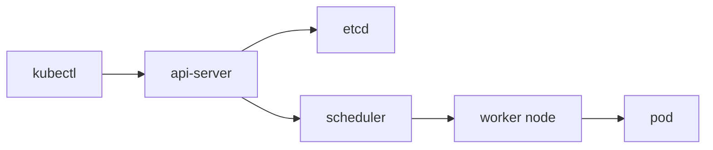

# What is Kubernetes?

> Kubernetes 101 series (1/10)

<!-- a-grade-intro:begin -->

**Core question**: Can a *human* really manage *tens or hundreds* of containers by hand?

> *Kubernetes* is the *orchestrator* that keeps your *containers* in their *desired state*.

<!-- a-grade-intro:end -->

## What You Will Learn

- The meaning of *orchestration*
- *Control plane* vs *worker nodes*
- The *desired state* model
- Where *kubectl* fits
- *When* to adopt it

## Why It Matters

A handful of containers fits on *Compose*. From *dozens* upward, an *orchestrator* is a *survival requirement*.

## Concept at a Glance



## Key Terms

- **cluster**: a *control plane + worker nodes* bundle.
- **control plane**: *api-server, etcd, scheduler, controller-manager*.
- **node**: a machine where *containers actually run*.
- **desired state**: the *target state* declared in *YAML*.
- **kubectl**: the *CLI* that talks to the cluster.

## Before / After

**Before**: each server runs *manual docker run* — *not reproducible*.

**After**: one *YAML* yields the same result *anywhere*.

## Hands-on: Tour Your First Cluster

### Step 1 — Show context

```python
import subprocess

def current_context():
    res = subprocess.run(
        ["kubectl", "config", "current-context"],
        capture_output=True, text=True, check=True,
    )
    return res.stdout.strip()
```

### Step 2 — List nodes

```python
def get_nodes():
    res = subprocess.run(
        ["kubectl", "get", "nodes", "-o", "wide"],
        capture_output=True, text=True, check=True,
    )
    return res.stdout
```

### Step 3 — List namespaces

```python
def list_namespaces():
    res = subprocess.run(
        ["kubectl", "get", "ns"],
        capture_output=True, text=True, check=True,
    )
    return res.stdout
```

### Step 4 — System pods

```python
def system_pods():
    res = subprocess.run(
        ["kubectl", "-n", "kube-system", "get", "pods"],
        capture_output=True, text=True, check=True,
    )
    return res.stdout
```

### Step 5 — Cluster health

```python
def cluster_info():
    res = subprocess.run(
        ["kubectl", "cluster-info"],
        capture_output=True, text=True, check=True,
    )
    return res.stdout
```

## What to Notice in This Code

- *kubectl* talks only to the *api-server*.
- You *never touch etcd directly*.
- *Namespaces* are the *default isolation unit*.

## Five Common Mistakes

1. **Treating *Kubernetes* as a synonym for *containers*.**
2. **Believing more *nodes* alone *solve* problems.**
3. **Trying to *manage etcd directly*.**
4. **Mixing up *kubectl* contexts and applying to *production*.**
5. **Adopting Kubernetes for *tiny* workloads.**

## How This Shows Up in Production

*EKS / GKE / AKS* — *managed Kubernetes* — operates the *control plane for you*, leaving the team to focus on *workload YAML*.

## How a Senior Engineer Thinks

- *Desired state* is the *philosophy*.
- *Control plane* is the *brain*, *nodes* are the *limbs*.
- *Kubernetes* is *overkill* for tiny teams.
- *Managed* is the default choice.
- *kubectl* is a *thin client*.

## Checklist

- [ ] Switch *contexts explicitly*.
- [ ] Split into *namespaces*.
- [ ] Keep *desired state* in *YAML*.
- [ ] Prefer *managed* first.

## Practice Problems

1. Describe the *role of the control plane* in one line.
2. Explain in one line *why desired state matters*.
3. Name *one situation* where you should delay Kubernetes.

## Wrap-up and Next Steps

The *big picture* of orchestration is in place. The next post covers the *smallest unit*: the *Pod*.

<!-- toc:begin -->
- **What is Kubernetes? (current)**
- Pod (upcoming)
- Deployment (upcoming)
- Service (upcoming)
- Ingress (upcoming)
- ConfigMap and Secret (upcoming)
- Volume (upcoming)
- HPA (upcoming)
- Helm (upcoming)
- Kubernetes in Operation (upcoming)
<!-- toc:end -->

## References

- [Kubernetes Overview](https://kubernetes.io/docs/concepts/overview/)
- [Kubernetes components](https://kubernetes.io/docs/concepts/overview/components/)
- [kubectl reference](https://kubernetes.io/docs/reference/kubectl/)
- [CNCF landscape](https://landscape.cncf.io/)

Tags: Kubernetes, Orchestration, Containers, DevOps, SRE
