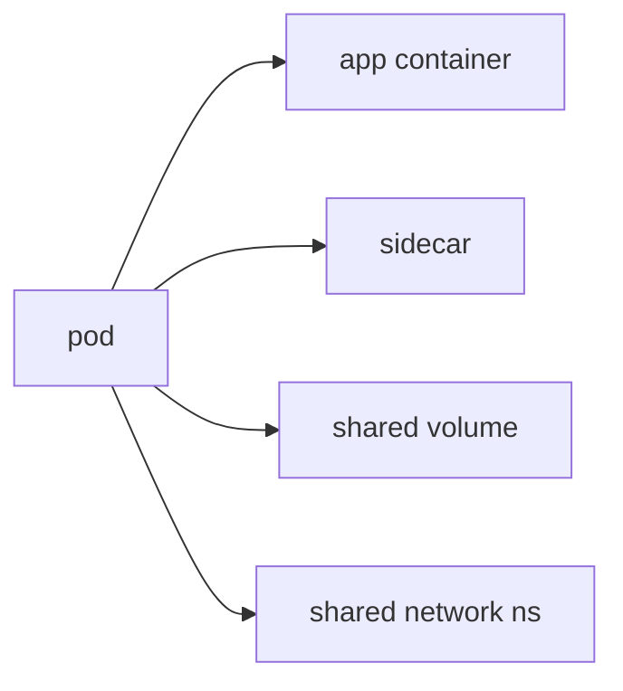

# Pod

> Kubernetes 101 series (2/10)

<!-- a-grade-intro:begin -->

**Core question**: Why is the *base unit* a *Pod*, and not a *container*?

> A *Pod* is a *bundle of containers* that *live and die together* — the *smallest deployable unit* in *Kubernetes*.

<!-- a-grade-intro:end -->

This is post 2 in the Kubernetes 101 series.

## What You Will Learn

- The definition of a *Pod*
- How it differs from a *container*
- The *sidecar* pattern
- The *lifecycle* phases
- *Why* you should not create one directly

## Why It Matters

*Every workload* eventually runs *on a Pod*. You must understand the *Pod model* before higher-level objects make sense.

## Concept at a Glance



## Key Terms

- **pod**: a *shared bundle* of *one or more containers*.
- **sidecar**: a helper container *next to* the main one.
- **init container**: a container that runs *once before start*.
- **lifecycle**: *Pending → Running → Succeeded/Failed*.
- **ephemeral**: a Pod *does not come back* after it dies.

## Before / After

**Before**: lone *containers* struggle to share resources.

**After**: a *Pod* shares *network and volumes* naturally.

## Hands-on: Work with Pod YAML

### Step 1 — Pod manifest

```python
"""
apiVersion: v1
kind: Pod
metadata:
  name: web
spec:
  containers:
  - name: app
    image: nginx:1.25
    ports: [{containerPort: 80}]
"""
```

### Step 2 — Apply

```python
import subprocess

def apply(path):
    subprocess.run(["kubectl", "apply", "-f", path], check=True)
```

### Step 3 — Describe

```python
def describe(name):
    res = subprocess.run(
        ["kubectl", "describe", "pod", name],
        capture_output=True, text=True, check=True,
    )
    return res.stdout
```

### Step 4 — Logs

```python
def logs(name):
    res = subprocess.run(
        ["kubectl", "logs", name],
        capture_output=True, text=True, check=True,
    )
    return res.stdout
```

### Step 5 — Delete

```python
def delete(name):
    subprocess.run(["kubectl", "delete", "pod", name], check=True)
```

## What to Notice in This Code

- The *Pod name* must be *unique*.
- *containers* is an *array* — more than one is allowed.
- Creating a *bare Pod* is *for learning only*.

## Five Common Mistakes

1. **Assuming *Pod = one container*.**
2. **Creating a *bare Pod* and expecting *restarts*.**
3. **Assuming the *IP is stable*.**
4. **Losing *shared-volume* gains by splitting containers.**
5. **Reading *logs* only from inside the container.**

## How This Shows Up in Production

*Sidecars* such as *log collectors*, *Envoy proxies*, and *secret syncers* sit *next to* the main container.

## How a Senior Engineer Thinks

- *Pods are ephemeral.* Do not resurrect them.
- *Restarts* are the job of *higher objects*.
- *Sidecars* are both a *coupling tool* and a *coupling cost*.
- *Pod IPs* are *temporary*.
- Outside of learning, do not create *bare Pods*.

## Checklist

- [ ] Bare-Pod creation only for *debugging*.
- [ ] *Sidecar* role clearly defined.
- [ ] *Logs* go to *stdout*.
- [ ] *Pod lifecycle* monitored.

## Practice Problems

1. State the *difference* between Pod and container in one line.
2. Name a *real example* of a sidecar.
3. Explain in one line *why* you should not create bare Pods.

## Wrap-up and Next Steps

With *Pods* understood, the next step is the *Deployment*, which owns *restarts and rolling updates*.

<!-- toc:begin -->
- [What is Kubernetes?](./01-what-is-kubernetes.md)
- **Pod (current)**
- Deployment (upcoming)
- Service (upcoming)
- Ingress (upcoming)
- ConfigMap and Secret (upcoming)
- Volume (upcoming)
- HPA (upcoming)
- Helm (upcoming)
- Kubernetes in Operation (upcoming)
<!-- toc:end -->

## References

- [Pods (Kubernetes)](https://kubernetes.io/docs/concepts/workloads/pods/)
- [Pod lifecycle](https://kubernetes.io/docs/concepts/workloads/pods/pod-lifecycle/)
- [Init containers](https://kubernetes.io/docs/concepts/workloads/pods/init-containers/)
- [Sidecar containers](https://kubernetes.io/blog/2023/08/25/native-sidecar-containers/)

Tags: Kubernetes, Pod, Containers, YAML, DevOps
