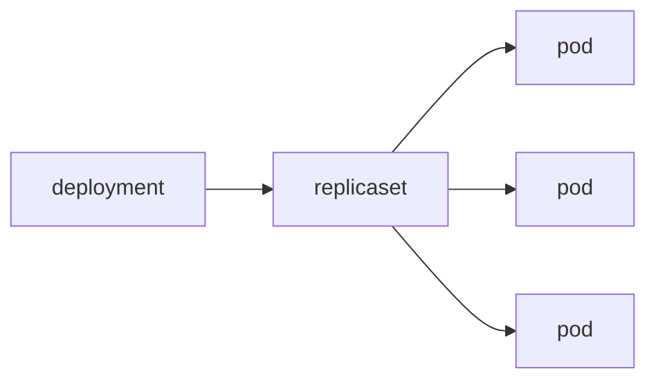

# Deployment

> Kubernetes 101 series (3/10)

<!-- a-grade-intro:begin -->

**Core question**: When a *Pod dies*, *who* brings one back?

> A *Deployment* keeps the *desired number* of *Pods* alive and owns *zero-downtime rollout* and *rollback*.

<!-- a-grade-intro:end -->

This is post 3 in the Kubernetes 101 series.

## What You Will Learn

- *Deployment* and *ReplicaSet* relationship
- The meaning of *replicas*
- The *RollingUpdate* strategy
- The *rollout* command
- The *rollback* flow

## Why It Matters

*Zero-downtime deploy* and *self-healing* are the *biggest reasons* to adopt *Kubernetes*. The object that owns them is the *Deployment*.

## Concept at a Glance



## Key Terms

- **deployment**: declares the *desired state* of a *Pod set*.
- **replicaset**: a controller that *holds the Pod count*.
- **replicas**: the *desired Pod count*.
- **rollout**: a *gradual swap* to a new version.
- **rollback**: returning to the *previous ReplicaSet*.

## Before / After

**Before**: a dead *Pod* means *service down*.

**After**: a *Deployment* recreates Pods *and* swaps *with no downtime*.

## Hands-on: Automate a Zero-Downtime Rollout

### Step 1 — Deployment manifest

```python
"""
apiVersion: apps/v1
kind: Deployment
metadata: {name: web}
spec:
  replicas: 3
  selector: {matchLabels: {app: web}}
  template:
    metadata: {labels: {app: web}}
    spec:
      containers:
      - name: app
        image: nginx:1.25
"""
```

### Step 2 — Apply

```python
import subprocess

def apply(path):
    subprocess.run(["kubectl", "apply", "-f", path], check=True)
```

### Step 3 — Update image

```python
def set_image(dep, container, image):
    subprocess.run([
        "kubectl", "set", "image",
        f"deployment/{dep}", f"{container}={image}",
    ], check=True)
```

### Step 4 — Watch rollout

```python
def rollout_status(dep):
    res = subprocess.run(
        ["kubectl", "rollout", "status", f"deployment/{dep}"],
        capture_output=True, text=True, check=True,
    )
    return res.stdout
```

### Step 5 — Rollback

```python
def rollback(dep):
    subprocess.run(
        ["kubectl", "rollout", "undo", f"deployment/{dep}"],
        check=True,
    )
```

## What to Notice in This Code

- *selector* and *labels* must *match exactly*.
- Changing only the *image* triggers a *strategy-driven swap*.
- *undo* returns to the *previous ReplicaSet*.

## Five Common Mistakes

1. **Creating *bare Pods* and expecting *restarts*.**
2. **Setting *replicas: 1* and expecting *high availability*.**
3. **Skipping *RollingUpdate* options and causing a *swap stampede*.**
4. **Missing *liveness/readiness*, leaving *half-broken rollouts*.**
5. **Never trimming *rollout history*.**

## How This Shows Up in Production

*Argo CD / Flux* treat *Deployment YAML* in *Git* as the *source of truth* and *sync* the cluster.

## How a Senior Engineer Thinks

- *Deployment* is the *workload baseline*.
- *RollingUpdate* options are the *risk-control core*.
- *Readiness* is the real *zero-downtime* condition.
- *Rollback* must be *practiced* to actually work.
- *YAML lives in Git*.

## Checklist

- [ ] *replicas ≥ 2*.
- [ ] *Readiness probe* defined.
- [ ] *RollingUpdate* options explicit.
- [ ] *Rollback* procedure *documented*.

## Practice Problems

1. State the *difference* between Deployment and ReplicaSet in one line.
2. Explain in one line *why* readiness is the *core* of zero downtime.
3. Name *one situation* where rollback is *not* fast.

## Wrap-up and Next Steps

Even with *Pods* up, *external access* needs an *address*. The next post covers the *Service*.

<!-- toc:begin -->
- [What is Kubernetes?](./01-what-is-kubernetes.md)
- [Pod](./02-pod.md)
- **Deployment (current)**
- Service (upcoming)
- Ingress (upcoming)
- ConfigMap and Secret (upcoming)
- Volume (upcoming)
- HPA (upcoming)
- Helm (upcoming)
- Kubernetes in Operation (upcoming)
<!-- toc:end -->

## References

- [Deployments](https://kubernetes.io/docs/concepts/workloads/controllers/deployment/)
- [ReplicaSet](https://kubernetes.io/docs/concepts/workloads/controllers/replicaset/)
- [Rolling update strategy](https://kubernetes.io/docs/tutorials/kubernetes-basics/update/update-intro/)
- [kubectl rollout](https://kubernetes.io/docs/reference/generated/kubectl/kubectl-commands#rollout)

Tags: Kubernetes, Deployment, ReplicaSet, RollingUpdate, DevOps
