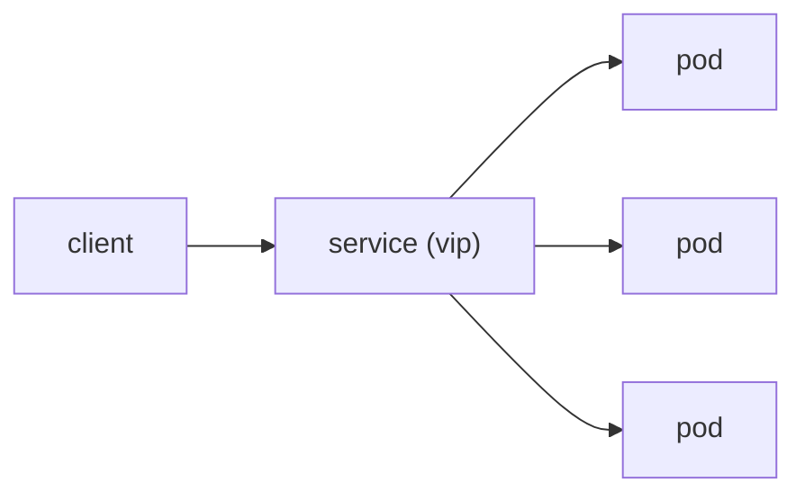

# Service

> Kubernetes 101 series (4/10)

<!-- a-grade-intro:begin -->

**Core question**: When *Pod IPs change all the time*, *how* do you call them *reliably*?

> A *Service* gives a *Pod set selected by labels* a *stable virtual IP* and a *DNS name*.

<!-- a-grade-intro:end -->

This is post 4 in the Kubernetes 101 series.

## What You Will Learn

- The problem a *Service* solves
- *ClusterIP / NodePort / LoadBalancer*
- How *selectors* match
- The *cluster DNS*
- *Headless Service*

## Why It Matters

For *microservices* to call each other by *name*, a *Service* is mandatory.

## Concept at a Glance



## Key Terms

- **ClusterIP**: an internal *virtual IP* (default).
- **NodePort**: exposes a *port on every node*.
- **LoadBalancer**: provisions a *cloud LB*.
- **selector**: matches *Pods by labels*.
- **DNS name**: `svc.namespace.svc.cluster.local`.

## Before / After

**Before**: calling a *Pod IP* directly breaks on *restart*.

**After**: calling the *Service name* through *DNS* is *stable*.

## Hands-on: Expose a Service

### Step 1 — Service manifest

```python
"""
apiVersion: v1
kind: Service
metadata: {name: web}
spec:
  selector: {app: web}
  ports:
  - port: 80
    targetPort: 80
"""
```

### Step 2 — Apply and read

```python
import subprocess

def apply_and_get(path):
    subprocess.run(["kubectl", "apply", "-f", path], check=True)
    return subprocess.run(
        ["kubectl", "get", "svc", "web"],
        capture_output=True, text=True, check=True,
    ).stdout
```

### Step 3 — DNS check

```python
def dns_check(target):
    res = subprocess.run([
        "kubectl", "run", "tmp", "--rm", "-i", "--restart=Never",
        "--image=busybox", "--", "nslookup", target,
    ], capture_output=True, text=True, check=True)
    return res.stdout
```

### Step 4 — Switch to NodePort

```python
def to_nodeport(svc):
    subprocess.run([
        "kubectl", "patch", "svc", svc, "-p",
        '{"spec": {"type": "NodePort"}}',
    ], check=True)
```

### Step 5 — Cleanup

```python
def delete(svc):
    subprocess.run(["kubectl", "delete", "svc", svc], check=True)
```

## What to Notice in This Code

- The *selector* must match *Deployment labels*.
- *targetPort* is the *container port*.
- The *DNS name* standardizes calls.

## Five Common Mistakes

1. **Mismatched *selector* and *labels* break routing.**
2. **Using *NodePort* as the *production entry point*.**
3. **Calling a *Pod IP* directly.**
4. **Using *Headless Service* for the *common case*.**
5. **Dropping the *namespace* from the *DNS name*.**

## How This Shows Up in Production

*ClusterIP* handles *internal* traffic, *LoadBalancer* the *external entry*, and *Ingress* the *L7 routing*.

## How a Senior Engineer Thinks

- The *Service name* is an *API contract*.
- *Internal* traffic uses *ClusterIP*.
- *External* uses *LoadBalancer + Ingress*.
- *Headless* is for *stateful* workloads.
- *DNS TTL* is also a *variable*.

## Checklist

- [ ] *Selector* match verified.
- [ ] *type* explicit.
- [ ] Calls go through the *DNS name*.
- [ ] *External exposure* via *Ingress* first.

## Practice Problems

1. State the *difference* between ClusterIP and LoadBalancer in one line.
2. Explain in one line *why* the selector is critical.
3. Name *one typical use* of a Headless Service.

## Wrap-up and Next Steps

Internal traffic is solved. The next post covers *Ingress*, which splits *external HTTP* by *path*.

<!-- toc:begin -->
- [What is Kubernetes?](./01-what-is-kubernetes.md)
- [Pod](./02-pod.md)
- [Deployment](./03-deployment.md)
- **Service (current)**
- Ingress (upcoming)
- ConfigMap and Secret (upcoming)
- Volume (upcoming)
- HPA (upcoming)
- Helm (upcoming)
- Kubernetes in Operation (upcoming)
<!-- toc:end -->

## References

- [Service (Kubernetes)](https://kubernetes.io/docs/concepts/services-networking/service/)
- [DNS for Services and Pods](https://kubernetes.io/docs/concepts/services-networking/dns-pod-service/)
- [Service types](https://kubernetes.io/docs/concepts/services-networking/service/#publishing-services-service-types)
- [Headless Services](https://kubernetes.io/docs/concepts/services-networking/service/#headless-services)

Tags: Kubernetes, Service, Networking, DNS, DevOps
