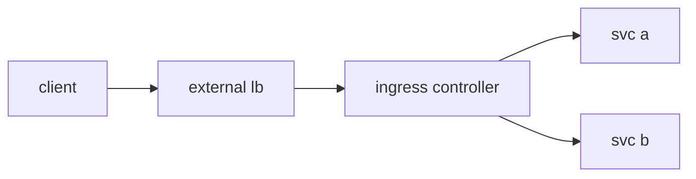

# Ingress

> Kubernetes 101 series (5/10)

<!-- a-grade-intro:begin -->

**Core question**: How do you split *several services* under *one domain* by *path*?

> *Ingress* consolidates *L7 HTTP routing* and *TLS termination* into a *single entry point*.

<!-- a-grade-intro:end -->

This is post 5 in the Kubernetes 101 series.

## What You Will Learn

- Splitting *Ingress* and *IngressController*
- *Host / path* routing
- *TLS termination*
- Relation to the *external LoadBalancer*
- *Gateway API* in one line

## Why It Matters

A *LoadBalancer Service per app* explodes *cost*. *Ingress* collapses everything into a *single entry*.

## Concept at a Glance



## Key Terms

- **Ingress**: an *L7 routing rule* object.
- **IngressController**: the *proxy that enforces the rules* (nginx, Envoy).
- **host**: a *domain name*.
- **path**: a *URL path*.
- **TLS termination**: *decryption at the Ingress*.

## Before / After

**Before**: an *LB per service* — *cost* and *ops burden*.

**After**: one *Ingress* and one *Controller* split traffic *by path*.

## Hands-on: Host and Path Routing

### Step 1 — Ingress manifest

```python
"""
apiVersion: networking.k8s.io/v1
kind: Ingress
metadata: {name: web}
spec:
  rules:
  - host: example.com
    http:
      paths:
      - path: /api
        pathType: Prefix
        backend:
          service: {name: api, port: {number: 80}}
      - path: /
        pathType: Prefix
        backend:
          service: {name: web, port: {number: 80}}
"""
```

### Step 2 — Apply

```python
import subprocess

def apply(path):
    subprocess.run(["kubectl", "apply", "-f", path], check=True)
```

### Step 3 — Create a TLS secret

```python
def tls_secret(name, cert, key):
    subprocess.run([
        "kubectl", "create", "secret", "tls", name,
        "--cert", cert, "--key", key,
    ], check=True)
```

### Step 4 — Apply TLS

```python
"""
spec:
  tls:
  - hosts: [example.com]
    secretName: example-tls
"""
```

### Step 5 — Verify

```python
def curl(host, path):
    res = subprocess.run(
        ["curl", "-sk", f"https://{host}{path}"],
        capture_output=True, text=True, check=True,
    )
    return res.stdout
```

## What to Notice in This Code

- *Ingress* is the *rule*; the *Controller* is the *executor*.
- *pathType: Prefix* is the *common default*.
- *TLS* terminates at the *Ingress*.

## Five Common Mistakes

1. **Expecting traffic without an *IngressController*.**
2. **Skipping *pathType* and hitting compatibility issues.**
3. **Putting the *TLS secret* in the *wrong namespace*.**
4. **Failing to fix *LB cost explosion* with Ingress.**
5. **Misreading *path priority*.**

## How This Shows Up in Production

*nginx-ingress* or the *AWS ALB Controller* reflects *Ingress objects* into the *external LB*, while *cert-manager* issues *TLS* automatically.

## How a Senior Engineer Thinks

- *Ingress* is a *routing rule*.
- *Controller* features *vary widely*.
- *TLS* is delegated to *cert-manager*.
- *Gateway API* is the *next standard*.
- *Entry points* are kept *minimal*.

## Checklist

- [ ] *Controller* installed.
- [ ] *pathType* explicit.
- [ ] *TLS* automated.
- [ ] *Entry points* consolidated.

## Practice Problems

1. State the *difference* between Ingress and IngressController in one line.
2. Name *one reason* TLS termination at the Ingress is good.
3. Describe in one line *what limit* the Gateway API addresses.

## Wrap-up and Next Steps

With routing in place, the next step is *separating config and secrets*. The next post covers *ConfigMap and Secret*.

<!-- toc:begin -->
- [What is Kubernetes?](./01-what-is-kubernetes.md)
- [Pod](./02-pod.md)
- [Deployment](./03-deployment.md)
- [Service](./04-service.md)
- **Ingress (current)**
- ConfigMap and Secret (upcoming)
- Volume (upcoming)
- HPA (upcoming)
- Helm (upcoming)
- Kubernetes in Operation (upcoming)
<!-- toc:end -->

## References

- [Ingress (Kubernetes)](https://kubernetes.io/docs/concepts/services-networking/ingress/)
- [Ingress Controllers](https://kubernetes.io/docs/concepts/services-networking/ingress-controllers/)
- [cert-manager](https://cert-manager.io/docs/)
- [Gateway API](https://gateway-api.sigs.k8s.io/)

Tags: Kubernetes, Ingress, HTTP, TLS, DevOps
