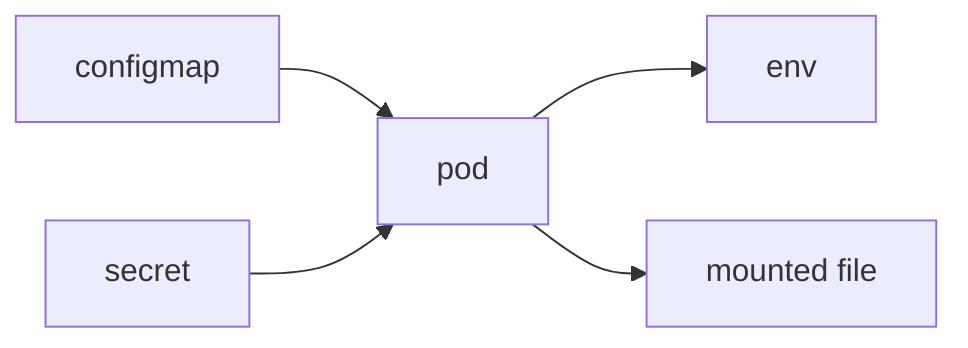

# ConfigMap and Secret

> Kubernetes 101 series (6/10)

<!-- a-grade-intro:begin -->

**Core question**: How do you *inject* settings and *passwords* without *baking them into the image*?

> *ConfigMap* delivers *non-secret config*; *Secret* delivers *sensitive values* — both safely into a *Pod*.

<!-- a-grade-intro:end -->

## What You Will Learn

- Splitting *ConfigMap* and *Secret*
- *Env vars* vs *file mounts*
- The *base64* fact and the *encryption gap*
- Integrating an *external secret manager*
- *Restart on change*

## Why It Matters

Pulling *environment differences* out of the image is what makes things *reproducible*. *Secrets* must be tracked *separately*.

## Concept at a Glance



## Key Terms

- **ConfigMap**: a bundle of *non-secret key/value*.
- **Secret**: a bundle of *secret key/value* (base64).
- **envFrom**: bulk-injects keys as *env vars*.
- **volume mount**: mounts data as *files*.
- **External Secrets**: syncs from an *external manager*.

## Before / After

**Before**: *baking the DB password* into the image.

**After**: *injecting via Secret*; the *image is environment-agnostic*.

## Hands-on: Split Config and Secrets

### Step 1 — ConfigMap

```python
"""
apiVersion: v1
kind: ConfigMap
metadata: {name: app-config}
data:
  LOG_LEVEL: "info"
  FEATURE_FLAG: "true"
"""
```

### Step 2 — Secret

```python
"""
apiVersion: v1
kind: Secret
metadata: {name: app-secret}
type: Opaque
stringData:
  DB_PASSWORD: "s3cret"
"""
```

### Step 3 — Inject into a Pod

```python
"""
spec:
  containers:
  - name: app
    image: myorg/app:1.0
    envFrom:
    - configMapRef: {name: app-config}
    - secretRef: {name: app-secret}
"""
```

### Step 4 — Mount as files

```python
"""
volumes:
- name: cfg
  configMap: {name: app-config}
volumeMounts:
- name: cfg
  mountPath: /etc/app
"""
```

### Step 5 — Restart after change

```python
import subprocess

def restart(dep):
    subprocess.run(
        ["kubectl", "rollout", "restart", f"deployment/{dep}"],
        check=True,
    )
```

## What to Notice in This Code

- *stringData* handles *base64 encoding for you*.
- *envFrom* injects the *whole bundle*.
- A *change* requires an *explicit restart*.

## Five Common Mistakes

1. **Equating *Secret* with *encryption*.**
2. **Storing *Secret values* in *Git in the clear*.**
3. **Expecting *ConfigMap* changes to *auto-reload*.**
4. **Cramming *long config* into *env vars only*.**
5. **Skipping *Secret RBAC*.**

## How This Shows Up in Production

The *External Secrets Operator* keeps *Vault / AWS Secrets Manager* as the *source of truth* and *syncs cluster Secrets* automatically.

## How a Senior Engineer Thinks

- *Secrets* are *base64*, not *encryption*.
- The *external manager* is the *source of truth*.
- *RBAC* is the *last line of defense*.
- *Change means restart*.
- *Per-environment ConfigMap* gives *reproducibility*.

## Checklist

- [ ] No *plain Secrets* in *Git*.
- [ ] *RBAC* applied.
- [ ] *rollout restart* after a change.
- [ ] *External manager* considered first.

## Practice Problems

1. State the *difference* between ConfigMap and Secret in one line.
2. Explain in one line *what* "Secret is not encryption" means.
3. Name *one benefit* of External Secrets.

## Wrap-up and Next Steps

Config is solved. The next post covers persisting *state data* with *Volumes*.

<!-- toc:begin -->
- [What is Kubernetes?](./01-what-is-kubernetes.md)
- [Pod](./02-pod.md)
- [Deployment](./03-deployment.md)
- [Service](./04-service.md)
- [Ingress](./05-ingress.md)
- **ConfigMap and Secret (current)**
- Volume (upcoming)
- HPA (upcoming)
- Helm (upcoming)
- Kubernetes in Operation (upcoming)
<!-- toc:end -->

## References

- [ConfigMap](https://kubernetes.io/docs/concepts/configuration/configmap/)
- [Secret](https://kubernetes.io/docs/concepts/configuration/secret/)
- [External Secrets Operator](https://external-secrets.io/)
- [RBAC](https://kubernetes.io/docs/reference/access-authn-authz/rbac/)

Tags: Kubernetes, ConfigMap, Secret, Configuration, DevOps
