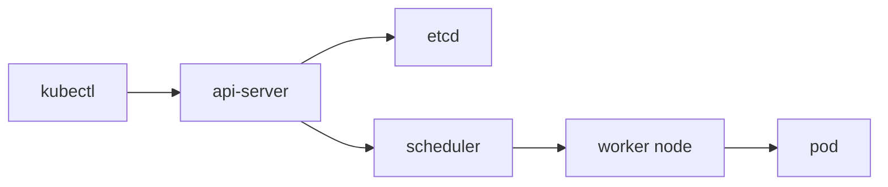

# Kubernetes란 무엇인가?

컨테이너를 처음 다룰 때는 `docker run` 몇 번으로도 충분해 보입니다. 앱 하나, 데이터베이스 하나, 프록시 하나 정도라면 사람이 직접 상태를 맞춰도 큰 문제 없이 굴러갑니다. 하지만 서비스가 커지고 컨테이너 수가 늘어나면 상황이 달라집니다. 어느 서버에 무엇이 떠 있는지, 죽은 컨테이너를 누가 다시 띄우는지, 버전 교체를 어떻게 안전하게 할지부터 사람이 기억하고 맞추기 어려워집니다.

이 글은 Kubernetes 101 시리즈의 첫 번째 글입니다.

여기서는 Kubernetes를 단순히 "컨테이너를 많이 돌리는 도구"가 아니라, 원하는 상태를 선언하면 시스템이 그 상태로 계속 수렴하도록 만드는 오케스트레이터라는 관점에서 정리하겠습니다.

## 이 글에서 다룰 문제

> Kubernetes는 컨테이너를 직접 하나씩 조작하는 도구가 아니라, 클러스터가 어떤 상태여야 하는지를 선언하고 그 상태를 계속 맞추는 운영 시스템입니다.

- 오케스트레이션이라는 말은 실제로 무엇을 대신해 줄까요?
- 컨트롤 플레인과 워커 노드는 어떤 식으로 역할을 나눌까요?
- 원하는 상태 모델이 왜 Kubernetes의 핵심 철학일까요?
- `kubectl`은 클러스터 안에서 어느 위치에 있을까요?
- 어떤 규모부터 Kubernetes가 의미 있고, 어떤 경우에는 과할까요?

## 왜 중요한가

컨테이너 몇 개는 Docker Compose만으로도 충분합니다. 하지만 수십 개가 넘어가면 누가 어떤 컨테이너를 어디에 배치할지, 장애가 나면 어떻게 복구할지, 새 버전으로 어떻게 교체할지 같은 문제가 한꺼번에 밀려옵니다. 이때부터는 컨테이너 런타임보다 오케스트레이터가 더 중요해집니다.

Kubernetes를 배우는 이유도 여기 있습니다. 많은 입문자가 Kubernetes를 "컨테이너 플랫폼" 정도로 받아들이지만, 실제로는 사람이 반복하던 운영 결정을 시스템 규칙으로 옮기는 도구에 가깝습니다. 이 관점을 먼저 잡아 두면 뒤에서 나오는 Pod, Deployment, Service도 훨씬 자연스럽게 이어집니다.

## 한눈에 보는 구조



이 그림을 볼 때 가장 먼저 기억할 점은 `kubectl`이 직접 컨테이너를 띄우지 않는다는 사실입니다. 사용자는 `kubectl`로 원하는 상태를 API 서버에 전달하고, 이후의 배치와 조정은 컨트롤 플레인 구성요소가 맡습니다. Kubernetes를 이해하려면 이 제어 흐름부터 알아야 합니다.

## 핵심 용어

- 클러스터: 컨트롤 플레인과 워커 노드를 묶은 전체 실행 환경입니다.
- 컨트롤 플레인: API 서버, etcd, scheduler, controller-manager처럼 클러스터의 제어를 맡는 영역입니다.
- 노드: 실제로 컨테이너가 실행되는 머신입니다.
- 원하는 상태: YAML에 선언한 목표 상태입니다.
- `kubectl`: 클러스터 API와 통신하는 CLI입니다.

## 도입 전과 후

Kubernetes가 없을 때는 서버마다 수동으로 `docker run`을 실행하고, 죽은 컨테이너가 있으면 사람이 다시 올립니다. 같은 환경을 다른 서버에 재현하기도 쉽지 않습니다.

Kubernetes를 도입하면 상황이 달라집니다. 원하는 상태를 YAML로 선언하면 같은 구성을 다른 환경에 반복해서 적용할 수 있고, 시스템이 현재 상태를 계속 목표 상태에 맞추려 합니다. 재현성과 자동 복구가 여기서 시작됩니다.

## 단계별로 첫 클러스터 둘러보기

### 1단계 — 현재 컨텍스트 확인

```python
import subprocess

def current_context():
    res = subprocess.run(
        ["kubectl", "config", "current-context"],
        capture_output=True, text=True, check=True,
    )
    return res.stdout.strip()
```

가장 먼저 볼 값은 현재 컨텍스트입니다. `kubectl`은 단일 클러스터 전용 도구가 아니므로, 지금 어떤 클러스터를 바라보는지부터 확인해야 합니다. 입문 단계에서도 이 습관이 중요합니다.

### 2단계 — 노드 목록 확인

```python
def get_nodes():
    res = subprocess.run(
        ["kubectl", "get", "nodes", "-o", "wide"],
        capture_output=True, text=True, check=True,
    )
    return res.stdout
```

노드 목록은 이 클러스터가 실제로 어떤 실행 자원을 갖고 있는지 보여 줍니다. Kubernetes가 논리적인 제어 시스템처럼 보여도, 결국 워크로드는 워커 노드 위에서 돌아갑니다.

### 3단계 — 네임스페이스 확인

```python
def list_namespaces():
    res = subprocess.run(
        ["kubectl", "get", "ns"],
        capture_output=True, text=True, check=True,
    )
    return res.stdout
```

네임스페이스는 Kubernetes에서 가장 기본적인 격리 단위입니다. 워크로드를 그냥 한곳에 모두 넣는 대신, 환경이나 팀 단위로 나눠 운영하기 시작하는 출발점이라고 보면 됩니다.

### 4단계 — 시스템 파드 보기

```python
def system_pods():
    res = subprocess.run(
        ["kubectl", "-n", "kube-system", "get", "pods"],
        capture_output=True, text=True, check=True,
    )
    return res.stdout
```

`kube-system` 네임스페이스를 보면 클러스터가 스스로를 운영하기 위해 어떤 구성요소를 띄우는지 감이 옵니다. Kubernetes는 단일 바이너리 하나가 아니라 여러 컴포넌트가 함께 움직이는 시스템이라는 점이 여기서 드러납니다.

### 5단계 — 클러스터 상태 확인

```python
def cluster_info():
    res = subprocess.run(
        ["kubectl", "cluster-info"],
        capture_output=True, text=True, check=True,
    )
    return res.stdout
```

`cluster-info`는 클러스터 접근 경로를 빠르게 확인할 때 유용합니다. 처음에는 단순 조회처럼 보이지만, 실제 운영에서는 API 서버 접근 문제를 확인하는 첫 단계가 되기도 합니다.

## 이 코드에서 먼저 봐야 할 점

- `kubectl`은 API 서버와 통신합니다.
- `etcd`를 직접 만지는 흐름은 일반적인 운영 경로가 아닙니다.
- 네임스페이스가 기본 격리 단위라는 감각을 일찍 익히는 편이 좋습니다.

이 세 가지를 먼저 잡아 두면 Kubernetes를 "명령을 내리면 즉시 컨테이너가 뜨는 도구"로 오해하지 않게 됩니다. 사용자가 하는 일은 대부분 선언이고, 실제 조정은 컨트롤 플레인이 맡습니다.

## 자주 하는 실수 다섯 가지

1. Kubernetes를 단순히 컨테이너와 같은 뜻으로 받아들입니다.
2. 노드 수만 늘리면 운영 문제가 자동으로 해결된다고 생각합니다.
3. `etcd`를 일반 데이터 저장소처럼 직접 다루려 합니다.
4. `kubectl` 컨텍스트를 확인하지 않고 잘못된 클러스터에 적용합니다.
5. 워크로드 규모가 아주 작은데도 Kubernetes부터 도입합니다.

## 실무에서는 이렇게 봅니다

실무에서는 EKS, GKE, AKS 같은 관리형 Kubernetes를 기본 선택지로 두는 경우가 많습니다. 이유는 단순합니다. 팀이 직접 운영하고 싶은 것은 대개 애플리케이션이지, 컨트롤 플레인 자체가 아니기 때문입니다.

시니어 엔지니어는 Kubernetes를 볼 때 기능 목록보다 멘탈 모델을 먼저 봅니다. 원하는 상태를 선언하는 도구인지, 현재 상태를 그쪽으로 계속 밀어 붙이는 제어 시스템인지, 그리고 그 제어를 사람이 어디까지 직접 맡아야 하는지부터 구분합니다. 이 관점이 있어야 뒤에서 Deployment와 HPA를 볼 때도 흐름이 이어집니다.

## 체크리스트

- [ ] 적용 전 현재 컨텍스트를 확인했는가
- [ ] 워크로드를 네임스페이스로 나눌 계획이 있는가
- [ ] 원하는 상태를 YAML로 관리할 준비가 되었는가
- [ ] 관리형 Kubernetes를 먼저 검토했는가

## 연습 문제

1. 컨트롤 플레인의 역할을 한 줄로 설명해 보세요.
2. 원하는 상태가 왜 Kubernetes의 핵심인지 한 줄로 적어 보세요.
3. Kubernetes 도입을 미루는 편이 나은 상황을 하나 떠올려 보세요.

## 마무리와 다음 글

이 글에서는 Kubernetes를 컨테이너 실행 도구가 아니라 원하는 상태를 유지하는 오케스트레이터로 보는 기본 관점을 잡았습니다. 컨트롤 플레인, 워커 노드, `kubectl`, 네임스페이스 같은 용어도 결국 이 모델 안에서 이해해야 서로 연결됩니다.

다음 글에서는 이 전체 시스템이 실제로 다루는 가장 작은 배포 단위인 Pod를 보겠습니다. Kubernetes의 많은 추상화는 결국 Pod를 중심으로 쌓여 있습니다.

<!-- toc:begin -->
- **Kubernetes란 무엇인가? (현재 글)**
- Pod (예정)
- Deployment (예정)
- Service (예정)
- Ingress (예정)
- ConfigMap과 Secret (예정)
- Volume (예정)
- HPA (예정)
- Helm (예정)
- 운영 관점의 Kubernetes (예정)
<!-- toc:end -->

## 참고 자료

- [Kubernetes Overview](https://kubernetes.io/docs/concepts/overview/)
- [Kubernetes components](https://kubernetes.io/docs/concepts/overview/components/)
- [kubectl reference](https://kubernetes.io/docs/reference/kubectl/)
- [CNCF landscape](https://landscape.cncf.io/)

Tags: Kubernetes, Orchestration, Containers, DevOps, SRE
