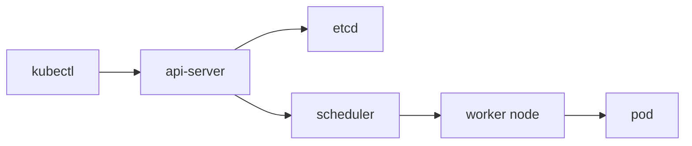

# What is Kubernetes?

> Kubernetes 101 시리즈 (1/10)


## 이 글에서 다룰 문제

컨테이너 한두 개는 Compose로도 충분합니다. 하지만 수십 개 규모부터는 오케스트레이터가 사실상 생존 조건이 됩니다.

## 전체 흐름


## Before/After

**Before**: 서버마다 수동 `docker run`을 실행해서 재현성이 떨어집니다.

**After**: YAML 한 장으로 어디서나 같은 결과를 만들 수 있습니다.

## 첫 클러스터 둘러보기

### 1단계 — 컨텍스트 확인

```python
import subprocess

def current_context():
    res = subprocess.run(
        ["kubectl", "config", "current-context"],
        capture_output=True, text=True, check=True,
    )
    return res.stdout.strip()
```

### 2단계 — 노드 조회

```python
def get_nodes():
    res = subprocess.run(
        ["kubectl", "get", "nodes", "-o", "wide"],
        capture_output=True, text=True, check=True,
    )
    return res.stdout
```

### 3단계 — 네임스페이스

```python
def list_namespaces():
    res = subprocess.run(
        ["kubectl", "get", "ns"],
        capture_output=True, text=True, check=True,
    )
    return res.stdout
```

### 4단계 — 시스템 파드

```python
def system_pods():
    res = subprocess.run(
        ["kubectl", "-n", "kube-system", "get", "pods"],
        capture_output=True, text=True, check=True,
    )
    return res.stdout
```

### 5단계 — 헬스 체크

```python
def cluster_info():
    res = subprocess.run(
        ["kubectl", "cluster-info"],
        capture_output=True, text=True, check=True,
    )
    return res.stdout
```

## 이 코드에서 주목할 점

- `kubectl`은 `api-server`와만 통신합니다.
- `etcd`는 직접 다루지 않습니다.
- `namespace`가 기본 격리 단위입니다.

## 자주 하는 실수 5가지

1. ***Kubernetes = 컨테이너* 와 동의어로 오해.**
2. **노드 수만 늘리면 문제가 해결된다고 착각합니다.**
3. **`etcd`를 직접 만지려 합니다.**
4. **`kubectl` 컨텍스트를 헷갈려 프로덕션에 적용합니다.**
5. **소규모인데 *Kubernetes* 부터 도입.**

## 실무에서는 이렇게 쓰입니다

EKS, GKE, AKS 같은 managed Kubernetes가 컨트롤 플레인 운영을 대신 맡고, 팀은 워크로드 YAML에 집중합니다.

## 체크리스트

- [ ] 컨텍스트를 명시적으로 전환.
- [ ] *네임스페이스* 분리.
- [ ] *희망 상태* 를 *YAML* 로 보관.
- [ ] *managed* 우선 검토.

## 정리 및 다음 단계

오케스트레이션의 큰 그림이 잡혔습니다. 다음 글에서는 가장 작은 단위인 Pod를 봅니다.

<!-- toc:begin -->
- **Kubernetes란 무엇인가? (현재 글)**
- Pod (예정)
- Deployment (예정)
- Service (예정)
- Ingress (예정)
- ConfigMap과 Secret (예정)
- Volume (예정)
- HPA (예정)
- Helm (예정)
- 운영 관점의 Kubernetes (예정)
<!-- toc:end -->

## 참고 자료

- [Kubernetes Overview](https://kubernetes.io/docs/concepts/overview/)
- [Kubernetes components](https://kubernetes.io/docs/concepts/overview/components/)
- [kubectl reference](https://kubernetes.io/docs/reference/kubectl/)
- [Managed Kubernetes options](https://landscape.cncf.io/)

Tags: Kubernetes, Orchestration, Containers, DevOps, SRE
