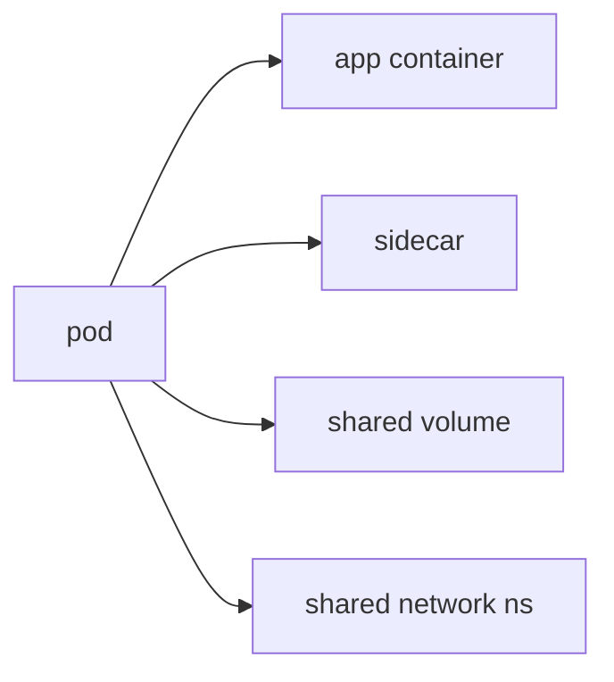

# Pod

> Kubernetes 101 시리즈 (2/10)


## 이 글에서 다룰 문제

모든 워크로드는 결국 Pod 위에서 돕니다. Pod의 모델을 이해해야 상위 객체도 제대로 보입니다.

## 전체 흐름


## Before/After

**Before**: 컨테이너를 단독으로 다루면 공유 자원 처리가 어렵습니다.

**After**: Pod 안에서는 네트워크와 볼륨을 자연스럽게 공유합니다.

## Pod YAML 다루기

### 1단계 — Pod manifest

```python
"""
apiVersion: v1
kind: Pod
metadata:
  name: web
spec:
  containers:
  - name: app
    image: nginx:1.25
    ports: [{containerPort: 80}]
"""
```

### 2단계 — apply

```python
import subprocess

def apply(path):
    subprocess.run(["kubectl", "apply", "-f", path], check=True)
```

### 3단계 — 상태 조회

```python
def describe(name):
    res = subprocess.run(
        ["kubectl", "describe", "pod", name],
        capture_output=True, text=True, check=True,
    )
    return res.stdout
```

### 4단계 — 로그

```python
def logs(name):
    res = subprocess.run(
        ["kubectl", "logs", name],
        capture_output=True, text=True, check=True,
    )
    return res.stdout
```

### 5단계 — 삭제

```python
def delete(name):
    subprocess.run(["kubectl", "delete", "pod", name], check=True)
```

## 이 코드에서 주목할 점

- Pod 이름은 고유해야 합니다.
- `containers`는 배열이며 둘 이상 들어갈 수 있습니다.
- Pod만 단독으로 만드는 방식은 주로 학습용입니다.

## 자주 하는 실수 5가지

1. ***Pod = 컨테이너 1개* 라고 단정.**
2. ***Pod 직접* 생성 후 *재시작 기대*.**
3. **IP가 고정이라고 가정합니다.**
4. ***볼륨 공유* 효과를 *컨테이너 분리* 후 잃음.**
5. ***로그* 를 *컨테이너 안* 에서만 본다.**

## 실무에서는 이렇게 쓰입니다

로그 수집기, Envoy 프록시, 시크릿 동기화기 같은 사이드카가 주 컨테이너 옆에 함께 배치됩니다.

## 체크리스트

- [ ] Pod 직접 생성은 디버깅 상황으로 한정합니다.
- [ ] 사이드카의 역할을 명확히 정의합니다.
- [ ] 로그는 `stdout`으로 보냅니다.
- [ ] *Pod 라이프사이클* 추적.

## 정리 및 다음 단계

Pod를 이해했다면, 다음은 재시작과 롤링 업데이트를 맡는 Deployment입니다.

<!-- toc:begin -->
- [Kubernetes란 무엇인가?](./01-what-is-kubernetes.md)
- **Pod (현재 글)**
- Deployment (예정)
- Service (예정)
- Ingress (예정)
- ConfigMap과 Secret (예정)
- Volume (예정)
- HPA (예정)
- Helm (예정)
- 운영 관점의 Kubernetes (예정)
<!-- toc:end -->

## 참고 자료

- [Pods (Kubernetes)](https://kubernetes.io/docs/concepts/workloads/pods/)
- [Pod lifecycle](https://kubernetes.io/docs/concepts/workloads/pods/pod-lifecycle/)
- [Init containers](https://kubernetes.io/docs/concepts/workloads/pods/init-containers/)
- [Sidecar pattern](https://kubernetes.io/blog/2023/08/25/native-sidecar-containers/)

Tags: Kubernetes, Pod, Containers, YAML, DevOps
