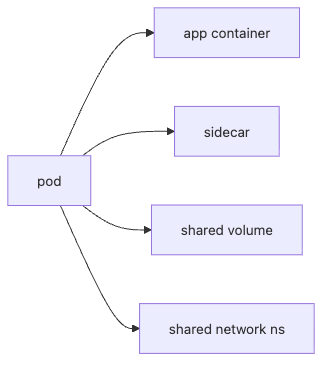

# Pod

Kubernetes를 처음 배우면 가장 먼저 헷갈리는 지점이 있습니다. 컨테이너를 실행하는 플랫폼이라면서 왜 가장 작은 단위가 컨테이너가 아니라 Pod인지입니다. Docker를 먼저 익힌 사람일수록 이 질문이 더 자연스럽습니다.

이 글은 Kubernetes 101 시리즈의 2번째 글입니다.

여기서는 Pod를 단순히 "컨테이너 하나를 싸는 껍데기"로 보지 않고, 함께 뜨고 함께 내려가며 네트워크와 볼륨을 공유하는 실행 묶음이라는 관점에서 정리하겠습니다.

## 이 글에서 다룰 문제

> Pod는 컨테이너 하나를 가리키는 이름이 아니라, 하나 이상의 컨테이너가 같은 네트워크와 저장소를 공유하며 함께 수명을 가지는 가장 작은 배포 단위입니다.

- Pod와 컨테이너는 정확히 어떻게 다를까요?
- 왜 Kubernetes는 컨테이너가 아니라 Pod를 기본 단위로 삼을까요?
- 사이드카 패턴은 어떤 상황에서 필요할까요?
- Pod의 수명 주기는 어떤 식으로 끝나고 다시 시작될까요?
- 왜 실무에서는 Pod를 직접 만들기보다 상위 객체를 더 자주 사용할까요?

## 왜 중요한가

모든 워크로드는 결국 Pod 위에서 실행됩니다. Deployment를 쓰든 StatefulSet을 쓰든, 마지막에 실제로 스케줄되는 것은 Pod입니다. 그래서 Pod 모델을 이해하지 못하면 뒤에 나오는 상위 객체도 이름만 다르게 보일 뿐입니다.

특히 입문 단계에서는 "컨테이너가 하나면 Pod도 하나"라는 식으로 단순화해서 외우기 쉽습니다. 물론 그런 경우가 많기는 합니다. 하지만 그 정도로만 이해하면 사이드카, init container, 공유 볼륨, 임시 IP 같은 중요한 운영 포인트를 놓치게 됩니다.

## 한눈에 보는 구조


*Pod는 앱 컨테이너, 사이드카, 공유 볼륨, 공유 네트워크를 하나의 실행 묶음으로 다룹니다.*


이 구조에서 핵심은 Pod 안의 컨테이너가 완전히 독립적이지 않다는 점입니다. 같은 Pod에 들어간 컨테이너는 네트워크 네임스페이스와 볼륨을 공유합니다. 그래서 하나의 애플리케이션 본체와 그 옆에서 돕는 보조 컨테이너를 함께 묶는 패턴이 자연스럽게 나옵니다.

## 핵심 용어

- Pod: 하나 이상의 컨테이너가 공유된 환경에서 함께 실행되는 묶음입니다.
- 사이드카: 주 컨테이너 옆에서 로그 수집, 프록시, 동기화 같은 보조 역할을 하는 컨테이너입니다.
- init container: 애플리케이션 시작 전에 한 번 실행되는 컨테이너입니다.
- 수명 주기: Pending에서 Running으로 가고, 끝나면 Succeeded 또는 Failed로 마무리되는 흐름입니다.
- 일시성: Pod는 죽은 뒤 같은 개체가 다시 살아나는 방식이 아니라 새로 만들어지는 방식에 가깝습니다.

## 도입 전과 후

컨테이너를 개별 단위로만 바라보면 리소스를 공유해야 하는 구조를 매번 사람이 직접 설계해야 합니다. 로그 프록시, 보안 에이전트, 보조 프로세스를 어떻게 함께 배치할지 일관된 기준을 잡기도 어렵습니다.

Pod 모델을 받아들이면 이야기가 단순해집니다. 함께 살아야 하는 컨테이너를 한 Pod에 두고, 네트워크와 볼륨을 자연스럽게 공유하도록 만들 수 있습니다. Kubernetes가 왜 컨테이너보다 Pod를 먼저 보는지 이해되는 지점입니다.

## 단계별로 Pod YAML 다뤄 보기

### 1단계 — Pod 매니페스트 작성

```python
"""
apiVersion: v1
kind: Pod
metadata:
  name: web
spec:
  containers:
  - name: app
    image: nginx:1.25
    ports: [{containerPort: 80}]
"""
```

가장 작은 형태의 Pod입니다. 여기서는 컨테이너가 하나뿐이지만, `containers`가 배열이라는 사실이 중요합니다. Kubernetes는 처음부터 "하나 이상"을 전제로 설계돼 있습니다.

### 2단계 — 적용

```python
import subprocess

def apply(path):
    subprocess.run(["kubectl", "apply", "-f", path], check=True)
```

Pod를 직접 적용하는 과정은 학습용으로는 좋습니다. 다만 실무에서는 이 단계에서 끝나지 않고, 보통 Deployment 같은 상위 객체가 Pod 생성을 대신 맡습니다.

### 3단계 — 상세 상태 확인

```python
def describe(name):
    res = subprocess.run(
        ["kubectl", "describe", "pod", name],
        capture_output=True, text=True, check=True,
    )
    return res.stdout
```

`describe`는 Pod를 처음 배울 때 가장 유용한 명령 중 하나입니다. 스케줄링 이벤트, 이미지 풀 상태, 컨테이너 시작 여부까지 함께 보여 주기 때문입니다. 단순히 떴는지 아닌지만 볼 때보다 훨씬 많은 정보를 읽을 수 있습니다.

### 4단계 — 로그 확인

```python
def logs(name):
    res = subprocess.run(
        ["kubectl", "logs", name],
        capture_output=True, text=True, check=True,
    )
    return res.stdout
```

Pod 안의 컨테이너 로그는 기본적으로 표준 출력으로 보는 흐름이 중요합니다. 컨테이너 안에 직접 들어가 로그 파일을 뒤지는 방식은 Kubernetes의 기본 운영 모델과 잘 맞지 않습니다.

### 5단계 — 삭제

```python
def delete(name):
    subprocess.run(["kubectl", "delete", "pod", name], check=True)
```

직접 만든 Pod는 지우면 끝입니다. 다시 살아나지 않습니다. 이 지점이 바로 "Pod를 직접 만들지 말라"는 조언의 핵심과 이어집니다. 자동 복구와 재시작은 Pod 자체가 아니라 상위 컨트롤러의 책임입니다.

## 검증 흐름

```bash
kubectl get pod web -o wide
kubectl describe pod web
kubectl logs web
```

**예상되는 결과:** `get pod`에서는 `Running` 또는 준비 직전 상태가 보여야 하고, `describe`에서는 이미지 풀·스케줄링·컨테이너 시작 이벤트가 시간순으로 보여야 합니다. 로그는 애플리케이션이 표준 출력으로 남긴 초기화 메시지를 확인하는 용도로 읽습니다.

**먼저 의심할 실패 모드:**

- `Pending`이 길면 이미지가 아니라 스케줄링 자원 부족이나 taint를 먼저 봅니다.
- `ImagePullBackOff`면 YAML 문법보다 레지스트리 인증과 이미지 태그를 우선 확인합니다.
- 로그가 비어 있으면 애플리케이션이 파일 로그만 쓰는지, 혹은 컨테이너가 시작 직후 죽는지 나눠서 봐야 합니다.

## 이 코드에서 먼저 봐야 할 점

- Pod 이름은 고유해야 합니다.
- `containers`는 배열이므로 하나 이상의 컨테이너를 둘 수 있습니다.
- 직접 만든 Pod는 학습용으로는 괜찮지만 운영 기본값은 아닙니다.

여기서 중요한 감각은 Pod를 애플리케이션 인스턴스 자체로 보는 것이 아니라, 상위 객체가 만들고 교체하는 실행 단위로 보는 것입니다. 이 관점을 잡아야 Deployment가 왜 필요한지 자연스럽게 이어집니다.

## 자주 하는 실수 다섯 가지

1. Pod를 컨테이너 하나와 완전히 같은 뜻으로 이해합니다.
2. 직접 만든 Pod가 장애 시 자동으로 복구될 것이라고 기대합니다.
3. Pod IP가 안정적으로 유지된다고 가정합니다.
4. 함께 붙어 있어야 할 컨테이너를 억지로 분리해 공유 이점을 잃습니다.
5. 로그를 컨테이너 내부 파일 기준으로만 보려 합니다.

## 실무에서는 이렇게 봅니다

실무에서는 로그 수집기, 프록시, 비밀 동기화기 같은 보조 컨테이너를 사이드카 형태로 붙이는 경우가 많습니다. 이때 Pod는 단순 배포 단위가 아니라 결합 경계를 결정하는 도구가 됩니다.

시니어 엔지니어는 Pod를 볼 때 "무엇이 함께 살아야 하는가"를 먼저 생각합니다. 동시에 사이드카는 편리한 도구이면서 결합 비용이기도 하다는 점도 함께 봅니다. 너무 쉽게 같은 Pod에 넣으면 배포와 스케일링 단위까지 함께 묶이기 때문입니다.

## 체크리스트

- [ ] Pod 직접 생성은 학습이나 디버깅 상황으로 한정했는가
- [ ] 사이드카가 정말 같은 수명 주기를 가져야 하는가
- [ ] 로그가 표준 출력으로 나가도록 구성했는가
- [ ] Pod 수명 주기를 상위 객체와 함께 이해하고 있는가

## 연습 문제

1. Pod와 컨테이너의 차이를 한 줄로 설명해 보세요.
2. 사이드카의 실제 예시를 하나 적어 보세요.
3. 왜 직접 Pod를 만들고 운영 기본값으로 삼으면 안 되는지 한 줄로 정리해 보세요.

## 마무리와 다음 글

이 글에서는 Pod를 Kubernetes의 최소 실행 단위로 정리했습니다. 컨테이너 하나와 비슷해 보일 때도 있지만, 실제로는 여러 컨테이너가 네트워크와 볼륨을 공유하며 함께 수명을 가지는 묶음이라는 점이 핵심입니다.

다음 글에서는 이 Pod를 사람이 직접 관리하지 않고, 원하는 개수를 유지하고 롤링 업데이트까지 맡는 Deployment를 보겠습니다.

<!-- toc:begin -->
- [Kubernetes란 무엇인가?](./01-what-is-kubernetes.md)
- **Pod (현재 글)**
- Deployment (예정)
- Service (예정)
- Ingress (예정)
- ConfigMap과 Secret (예정)
- Volume (예정)
- HPA (예정)
- Helm (예정)
- 운영 관점의 Kubernetes (예정)
<!-- toc:end -->

## 참고 자료

- [Pods (Kubernetes)](https://kubernetes.io/docs/concepts/workloads/pods/)
- [Pod lifecycle](https://kubernetes.io/docs/concepts/workloads/pods/pod-lifecycle/)
- [Init containers](https://kubernetes.io/docs/concepts/workloads/pods/init-containers/)
- [Sidecar containers](https://kubernetes.io/blog/2023/08/25/native-sidecar-containers/)
- [Debug Pods](https://kubernetes.io/docs/tasks/debug/debug-application/debug-pods/)

Tags: Kubernetes, Pod, Containers, YAML, DevOps
