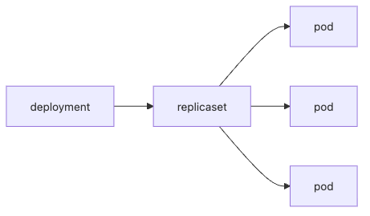

# Deployment

Pod를 이해한 다음 바로 마주치는 질문은 이것입니다. 파드가 죽었을 때 누가 다시 띄우는가입니다. Pod 자체는 실행 단위일 뿐이고, 스스로 자신의 개수를 유지하거나 버전을 안전하게 교체하지는 못합니다.

이 글은 Kubernetes 101 시리즈의 3번째 글입니다.

여기서는 Deployment를 파드를 여러 개 띄우는 단순 설정이 아니라, 원하는 개수를 유지하고 버전 교체와 롤백까지 책임지는 기본 워크로드 컨트롤러라는 관점에서 정리하겠습니다.

## 이 글에서 다룰 문제

> Deployment는 단순히 파드를 많이 만드는 객체가 아니라, 원하는 파드 수를 유지하고 새 버전으로 안전하게 교체하며 필요하면 직전 상태로 되돌리는 운영 계약입니다.

- Deployment와 ReplicaSet은 어떤 관계일까요?
- `replicas`는 단순 숫자 이상의 어떤 의미를 가질까요?
- 이미지 변경이 왜 무중단 배포 흐름으로 이어질까요?
- `rollout`과 `rollback`은 어떤 식으로 연결될까요?
- 왜 대부분의 stateless 워크로드가 Deployment를 기본값으로 삼을까요?

## 왜 중요한가

Kubernetes를 도입하는 가장 큰 이유 가운데 하나는 자동 복구와 점진적 배포입니다. 그런데 이 두 기능은 클러스터가 막연히 제공하는 마법이 아닙니다. 원하는 개수의 파드를 유지하고, 새 버전으로 서서히 갈아 끼우고, 문제가 생기면 이전 상태로 되돌릴 수 있도록 관리하는 객체가 필요합니다.

그 역할을 맡는 것이 Deployment입니다. 입문 단계에서 이 객체를 제대로 이해하면 이후의 HPA, Helm, GitOps까지도 훨씬 자연스럽게 읽힙니다. 반대로 Pod만 알고 Deployment를 건너뛰면 Kubernetes 운영이 매번 수동 조작처럼 보이기 쉽습니다.

## 한눈에 보는 구조


*Deployment는 ReplicaSet을 통해 원하는 파드 수를 유지하고 버전 교체를 단계적으로 진행합니다.*


Deployment는 직접 파드 수를 세는 대신 ReplicaSet을 통해 파드를 관리합니다. 그래서 이미지가 바뀌면 새 ReplicaSet이 생기고, 이전 ReplicaSet은 점진적으로 줄어듭니다. 이 중간 계층이 있어야 롤링 업데이트와 롤백이 구조적으로 가능해집니다.

## 핵심 용어

- Deployment: 파드 집합의 원하는 상태를 선언하는 상위 객체입니다.
- ReplicaSet: 원하는 파드 개수를 맞추는 컨트롤러입니다.
- replicas: 유지하고 싶은 파드 수입니다.
- rollout: 새 버전으로 점진적으로 교체하는 흐름입니다.
- rollback: 이전 ReplicaSet으로 되돌리는 흐름입니다.

## 도입 전과 후

Deployment가 없으면 파드 하나가 죽었을 때 서비스가 바로 흔들릴 수 있습니다. 새 버전 배포도 기존 파드를 지우고 새 파드를 띄우는 식으로 거칠게 끝나기 쉽습니다.

Deployment를 사용하면 죽은 파드는 다시 만들어지고, 이미지 변경은 배포 전략에 따라 서서히 적용되며, 이전 버전 이력도 남습니다. Kubernetes 운영이 훨씬 예측 가능해지는 이유가 바로 여기에 있습니다.

## 단계별로 무중단 배포 흐름 보기

### 1단계 — Deployment 매니페스트 작성

```python
"""
apiVersion: apps/v1
kind: Deployment
metadata: {name: web}
spec:
  replicas: 3
  selector: {matchLabels: {app: web}}
  template:
    metadata: {labels: {app: web}}
    spec:
      containers:
      - name: app
        image: nginx:1.25
"""
```

이 예제에서 가장 먼저 볼 값은 `replicas: 3`입니다. 이는 단순한 숫자가 아니라 서비스가 감당해야 할 최소 실행 개수에 대한 선언입니다. 하나가 죽어도 세 개를 유지하려는 의도가 여기에 담깁니다.

### 2단계 — 적용

```python
import subprocess

def apply(path):
    subprocess.run(["kubectl", "apply", "-f", path], check=True)
```

적용 이후부터는 Deployment와 ReplicaSet이 현재 상태를 원하는 상태에 맞추기 시작합니다. 사용자가 일일이 파드를 세거나 다시 만들지 않아도 되는 이유가 바로 여기에 있습니다.

### 3단계 — 이미지 업데이트

```python
def set_image(dep, container, image):
    subprocess.run([
        "kubectl", "set", "image",
        f"deployment/{dep}", f"{container}={image}",
    ], check=True)
```

이미지 태그만 바꿔도 Deployment는 이를 새 버전 배포로 해석합니다. 기존 파드를 한 번에 모두 없애는 대신, 전략에 따라 새 파드를 띄우고 준비 상태를 확인하면서 교체합니다.

### 4단계 — rollout 상태 확인

```python
def rollout_status(dep):
    res = subprocess.run(
        ["kubectl", "rollout", "status", f"deployment/{dep}"],
        capture_output=True, text=True, check=True,
    )
    return res.stdout
```

배포는 명령이 끝났다고 끝나는 일이 아닙니다. 새 파드가 실제로 준비 완료 상태가 되어 트래픽을 받을 수 있는지 확인해야 비로소 배포가 끝났다고 볼 수 있습니다.

### 5단계 — 롤백

```python
def rollback(dep):
    subprocess.run(
        ["kubectl", "rollout", "undo", f"deployment/{dep}"],
        check=True,
    )
```

롤백은 마지막 안전장치입니다. 자동화가 잘 되어 있어도, 실제로 이전 ReplicaSet으로 되돌리는 흐름을 알고 있어야 야간 장애 대응 속도가 달라집니다.

## 검증 흐름

```bash
kubectl get deploy,rs,pods -l app=web
kubectl rollout status deployment/web
kubectl rollout history deployment/web
```

**예상되는 결과:** Deployment와 ReplicaSet, Pod 수가 서로 맞아야 하고, `rollout status`는 새 ReplicaSet이 준비 완료될 때까지 대기한 뒤 성공 메시지를 반환해야 합니다. `rollout history`에는 최소 한 개 이상의 revision이 남아 있어야 롤백 판단이 쉬워집니다.

**먼저 의심할 실패 모드:**

- Deployment는 있는데 Pod가 없으면 selector와 template labels가 어긋난 경우가 많습니다.
- rollout이 멈추면 이미지 문제보다 readiness probe 실패를 먼저 확인하는 편이 실무에서 더 자주 맞습니다.
- revision 이력이 없거나 너무 짧으면 rollback 자체보다 배포 기록 정책부터 손봐야 합니다.

## 이 코드에서 먼저 봐야 할 점

- `selector`와 `labels`는 정확히 일치해야 합니다.
- 이미지 변경은 작아 보여도 실제로는 배포 이벤트입니다.
- `undo`는 직전 ReplicaSet 기준으로 돌아갑니다.

이 세 가지를 놓치면 Deployment는 "파드를 많이 띄우는 YAML" 정도로만 보입니다. 하지만 실제로는 배포 이력과 복구 흐름까지 포함한 운영 객체입니다.

## 자주 하는 실수 다섯 가지

1. Pod를 직접 만들고 재시작과 복구를 Kubernetes가 알아서 해 줄 거라고 기대합니다.
2. `replicas: 1`로 두고도 고가용성을 기대합니다.
3. RollingUpdate 관련 옵션을 대충 넘겨 한 번에 너무 많이 교체합니다.
4. readiness 없이 배포해서 절반만 살아 있는 상태로 rollout을 끝냅니다.
5. 롤백이 있다고 믿지만 실제 절차를 한 번도 연습하지 않습니다.

## 실무에서는 이렇게 봅니다

실무에서는 Deployment YAML을 Git에 두고, Argo CD나 Flux가 그 선언을 클러스터와 맞추는 구조를 자주 봅니다. 이때 Deployment는 단순 리소스가 아니라 배포 단위의 기준점이 됩니다.

시니어 엔지니어는 Deployment를 볼 때 두 가지를 특히 봅니다. 첫째, 대부분의 stateless 워크로드에서 Deployment는 기본값입니다. 둘째, 무중단 배포의 본질은 Deployment라는 이름이 아니라 readiness와 배포 전략을 얼마나 제대로 잡았는가에 달려 있습니다.

## 체크리스트

- [ ] `replicas`를 2 이상으로 둘지 검토했는가
- [ ] Readiness probe를 정의했는가
- [ ] RollingUpdate 옵션을 명시했는가
- [ ] 롤백 절차를 문서화했는가

## 연습 문제

1. Deployment와 ReplicaSet의 차이를 한 줄로 설명해 보세요.
2. readiness가 무중단 배포의 핵심인 이유를 한 줄로 적어 보세요.
3. 롤백이 느리거나 어려워지는 상황을 하나 떠올려 보세요.

## 마무리와 다음 글

이 글에서는 Deployment를 파드 개수 유지, 롤링 업데이트, 롤백을 맡는 기본 워크로드 컨트롤러로 정리했습니다. Pod만 직접 다룰 때보다 운영이 훨씬 안정되고, 배포를 반복 가능한 절차로 바꾸는 출발점도 바로 여기입니다.

다음 글에서는 이렇게 떠 있는 파드 집합을 내부와 외부에서 어떻게 안정적으로 찾고 호출하는지, Service를 중심으로 보겠습니다.

<!-- toc:begin -->
- [Kubernetes란 무엇인가?](./01-what-is-kubernetes.md)
- [Pod](./02-pod.md)
- **Deployment (현재 글)**
- Service (예정)
- Ingress (예정)
- ConfigMap과 Secret (예정)
- Volume (예정)
- HPA (예정)
- Helm (예정)
- 운영 관점의 Kubernetes (예정)
<!-- toc:end -->

## 참고 자료

- [Deployments](https://kubernetes.io/docs/concepts/workloads/controllers/deployment/)
- [ReplicaSet](https://kubernetes.io/docs/concepts/workloads/controllers/replicaset/)
- [Rolling update strategy](https://kubernetes.io/docs/tutorials/kubernetes-basics/update/update-intro/)
- [kubectl rollout](https://kubernetes.io/docs/reference/generated/kubectl/kubectl-commands#rollout)
- [Update a Deployment](https://kubernetes.io/docs/concepts/workloads/controllers/deployment/#updating-a-deployment)

Tags: Kubernetes, Deployment, ReplicaSet, RollingUpdate, DevOps
