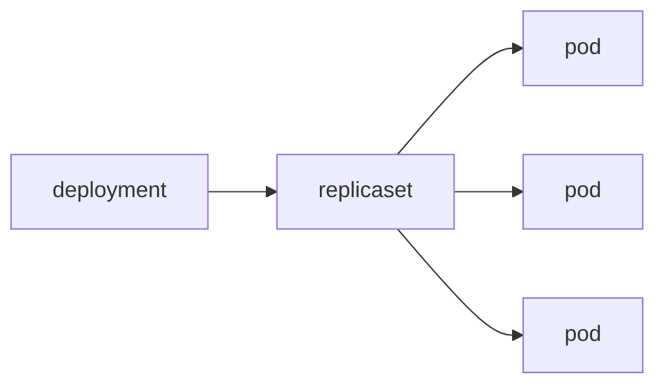

# Deployment

> Kubernetes 101 시리즈 (3/10)


## 이 글에서 다룰 문제

*무중단 배포* 와 *자동 복구* 가 *Kubernetes* 도입의 *가장 큰 이유*. 그것을 *직접* 담당하는 객체가 *Deployment*.

## 전체 흐름


## Before/After

**Before**: *Pod 죽음* → *서비스 중단*.

**After**: *Deployment* 가 *자동 재생성* + *무중단 교체*.

## 무중단 배포 자동화

### 1단계 — Deployment manifest

```python
"""
apiVersion: apps/v1
kind: Deployment
metadata: {name: web}
spec:
  replicas: 3
  selector: {matchLabels: {app: web}}
  template:
    metadata: {labels: {app: web}}
    spec:
      containers:
      - name: app
        image: nginx:1.25
"""
```

### 2단계 — apply

```python
import subprocess

def apply(path):
    subprocess.run(["kubectl", "apply", "-f", path], check=True)
```

### 3단계 — 이미지 업데이트

```python
def set_image(dep, container, image):
    subprocess.run([
        "kubectl", "set", "image",
        f"deployment/{dep}", f"{container}={image}",
    ], check=True)
```

### 4단계 — rollout 상태

```python
def rollout_status(dep):
    res = subprocess.run(
        ["kubectl", "rollout", "status", f"deployment/{dep}"],
        capture_output=True, text=True, check=True,
    )
    return res.stdout
```

### 5단계 — 롤백

```python
def rollback(dep):
    subprocess.run(
        ["kubectl", "rollout", "undo", f"deployment/{dep}"],
        check=True,
    )
```

## 이 코드에서 주목할 점

- *selector* 와 *labels* 가 *반드시* 일치.
- *image* 만 바꿔도 *전략* 에 따라 *교체*.
- *undo* 는 *직전 ReplicaSet* 으로.

## 자주 하는 실수 5가지

1. ***Pod* 를 *직접* 만들고 *재시작 기대*.**
2. ***replicas: 1* 로 *고가용성 기대*.**
3. ***RollingUpdate* 옵션 미설정으로 *동시 교체 폭주*.**
4. ***liveness/readiness* 누락으로 *반쪽 배포*.**
5. ***rollout 기록* 을 *주기적* 으로 *정리* 하지 않음.**

## 실무에서는 이렇게 쓰입니다

*Argo CD / Flux* 가 *Git* 의 *Deployment YAML* 을 *진실 원천* 으로 두고, *클러스터* 를 *동기화* 합니다.

## 체크리스트

- [ ] *replicas ≥ 2*.
- [ ] *readiness probe* 정의.
- [ ] *RollingUpdate* 옵션 명시.
- [ ] *롤백* 절차 *문서화*.

## 정리 및 다음 단계

*Pod* 가 *떠 있어도* *외부* 에서 *접근* 하려면 *주소* 가 필요합니다. 다음 글은 *Service*.

<!-- toc:begin -->
- [Kubernetes란 무엇인가?](./01-what-is-kubernetes.md)
- [Pod](./02-pod.md)
- **Deployment (현재 글)**
- Service (예정)
- Ingress (예정)
- ConfigMap과 Secret (예정)
- Volume (예정)
- HPA (예정)
- Helm (예정)
- 운영 관점의 Kubernetes (예정)
<!-- toc:end -->

## 참고 자료

- [Deployments](https://kubernetes.io/docs/concepts/workloads/controllers/deployment/)
- [ReplicaSet](https://kubernetes.io/docs/concepts/workloads/controllers/replicaset/)
- [Rolling update strategy](https://kubernetes.io/docs/tutorials/kubernetes-basics/update/update-intro/)
- [kubectl rollout](https://kubernetes.io/docs/reference/generated/kubectl/kubectl-commands#rollout)

Tags: Kubernetes, Deployment, ReplicaSet, RollingUpdate, DevOps
