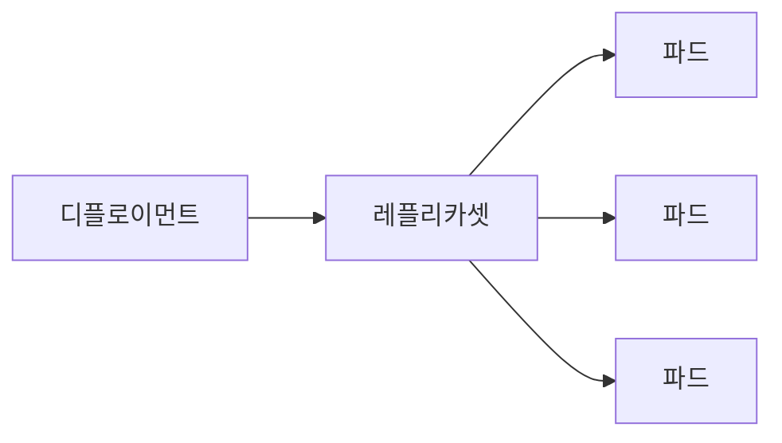

# Deployment

## 이 글에서 다룰 문제

- 파드가 죽었을 때 새 파드를 다시 띄우는 주체는 누구일까요?
- replicas 값은 단순한 숫자가 아니라 어떤 운영 약속을 뜻할까요?
- 이미지 버전을 바꾸면 서비스 중단 없이 교체되는 이유는 무엇일까요?
- rollout, rollback, readiness는 왜 같이 이해해야 할까요?
- 실무에서 Deployment를 기본 워크로드로 보는 이유는 무엇일까요?

> Kubernetes 101 시리즈 (3/10)
>
> 핵심 질문: 파드가 사라졌을 때 누가 원하는 개수를 다시 맞출까요?

파드는 애플리케이션을 실행하는 가장 작은 단위이지만, 파드만 직접 만들면 운영은 금방 불안해집니다. 노드가 재시작될 수 있고, 컨테이너가 비정상 종료될 수 있으며, 새 버전을 올릴 때 기존 파드를 바로 지워 버리면 사용자는 빈 화면이나 오류를 먼저 보게 됩니다.

Deployment는 이런 문제를 사람이 매번 손으로 처리하지 않게 해 주는 기본 컨트롤러입니다. 원하는 파드 개수를 유지하고, 새 버전으로 천천히 교체하고, 문제가 생기면 이전 상태로 되돌리는 흐름까지 맡습니다. Kubernetes를 처음 배울 때 Pod 다음으로 Deployment를 바로 이해해야 하는 이유가 여기에 있습니다.

이 글에서는 Deployment와 ReplicaSet의 관계부터 롤링 업데이트, 롤백, 그리고 실무 체크포인트까지 한 번에 정리하겠습니다.

## 왜 중요한가

Kubernetes를 도입하는 가장 큰 이유 가운데 하나는 자동 복구와 무중단 배포입니다. 그런데 이 두 기능은 클러스터가 자동으로 알아서 해 주는 마법이 아니라, Deployment라는 객체가 원하는 상태를 계속 감시하고 맞추기 때문에 가능합니다.

예를 들어 웹 애플리케이션 파드 3개를 운영한다고 가정해 보겠습니다. 파드 하나가 죽어도 서비스는 계속 열려 있어야 하고, 새 이미지를 배포해도 사용자는 중간 끊김을 거의 느끼지 않아야 합니다. 이 기대를 운영 계약으로 바꿔 주는 객체가 Deployment입니다.

## 한눈에 보는 구조



Deployment는 직접 파드를 하나씩 관리하지 않습니다. 중간에 ReplicaSet을 두고, ReplicaSet이 실제 파드 수를 유지합니다. 그래서 이미지를 업데이트하면 새 ReplicaSet이 만들어지고, 이전 ReplicaSet은 점진적으로 줄어듭니다.

## 핵심 용어

- Deployment: 파드 집합의 원하는 상태를 선언하는 상위 객체입니다.
- ReplicaSet: 실제 파드 개수를 원하는 수로 맞추는 컨트롤러입니다.
- replicas: 유지하고 싶은 파드 개수입니다.
- rollout: 새 버전으로 점진적으로 교체하는 과정입니다.
- rollback: 직전 정상 버전으로 되돌리는 과정입니다.

## 배포 전후 달라지는 점

Deployment가 없을 때는 파드 하나가 죽으면 서비스가 바로 흔들릴 수 있습니다. 새 버전 배포도 기존 파드를 지우고 새 파드를 띄우는 식으로 거칠게 끝나기 쉽습니다.

Deployment를 쓰면 상황이 달라집니다. 죽은 파드는 다시 만들어지고, 이미지 변경은 전략에 따라 천천히 교체되며, 직전 버전 이력도 남습니다. Kubernetes 운영이 훨씬 예측 가능해지는 이유입니다.

## 단계별 실습

### 1단계 — Deployment manifest 작성

```python
"""
apiVersion: apps/v1
kind: Deployment
metadata: {name: web}
spec:
  replicas: 3
  selector: {matchLabels: {app: web}}
  template:
    metadata: {labels: {app: web}}
    spec:
      containers:
      - name: app
        image: nginx:1.25
"""
```

여기서 가장 먼저 볼 값은 replicas입니다. 원하는 파드 수를 3으로 선언했으므로 Kubernetes는 파드가 몇 개 죽든 다시 3개를 맞추려 합니다.

### 2단계 — 적용

```python
import subprocess

def apply(path):
    subprocess.run(["kubectl", "apply", "-f", path], check=True)
```

apply는 선언한 원하는 상태를 클러스터에 전달하는 시작점입니다. 이후부터는 Deployment와 ReplicaSet이 실제 상태를 계속 원하는 상태로 수렴시킵니다.

### 3단계 — 이미지 업데이트

```python
def set_image(dep, container, image):
    subprocess.run([
        "kubectl", "set", "image",
        f"deployment/{dep}", f"{container}={image}",
    ], check=True)
```

이미지 태그만 바꿔도 새 ReplicaSet이 생성됩니다. 기존 파드를 한 번에 모두 내리지 않고, 전략에 따라 새 파드를 띄우고 준비 상태를 확인한 뒤 점진적으로 바꿉니다.

### 4단계 — rollout 상태 확인

```python
def rollout_status(dep):
    res = subprocess.run(
        ["kubectl", "rollout", "status", f"deployment/{dep}"],
        capture_output=True, text=True, check=True,
    )
    return res.stdout
```

배포에서 가장 중요한 것은 명령이 끝났는지가 아니라 새 파드가 실제로 준비 완료됐는지입니다. rollout status는 바로 그 지점을 확인합니다.

### 5단계 — 롤백

```python
def rollback(dep):
    subprocess.run(
        ["kubectl", "rollout", "undo", f"deployment/{dep}"],
        check=True,
    )
```

새 버전이 기대한 대로 동작하지 않으면 rollback으로 이전 ReplicaSet으로 돌아갈 수 있습니다. 배포 자동화가 잘 되어 있어도 롤백 절차가 준비돼 있지 않으면 운영 복구 속도는 느려집니다.

## 이 코드에서 봐야 할 포인트

- selector와 template.labels는 정확히 일치해야 합니다. 이 둘이 어긋나면 Deployment가 자신이 관리해야 할 파드를 제대로 찾지 못합니다.
- image만 바꿔도 새 ReplicaSet이 생깁니다. 작은 변경처럼 보여도 실제로는 배포 이벤트입니다.
- rollout은 readiness와 함께 봐야 의미가 있습니다. 새 파드가 떴더라도 준비 완료가 아니면 트래픽을 받으면 안 됩니다.
- undo는 직전 ReplicaSet으로 돌아갑니다. 그래서 배포 이력 관리가 중요합니다.

## 자주 하는 실수 5가지

1. 파드를 직접 만들고 재시작이나 복구를 Kubernetes가 알아서 해 줄 거라고 기대합니다.
2. replicas를 1로 두고도 고가용성을 기대합니다.
3. RollingUpdate 옵션을 대충 넘겨서 한꺼번에 많이 교체되는 상황을 만듭니다.
4. liveness와 readiness 없이 배포해서 절반만 살아 있는 상태로 rollout을 끝냅니다.
5. 롤백은 있다고 믿지만 실제로 한 번도 연습하지 않습니다.

## 실무에서는 이렇게 본다

실무 팀은 Deployment YAML을 Git에 두고, Argo CD나 Flux 같은 GitOps 도구가 그 선언을 클러스터와 맞추게 합니다. 이때 Deployment는 단순한 리소스 하나가 아니라 배포 단위의 기준점이 됩니다.

시니어 엔지니어 관점에서 중요한 것은 두 가지입니다. 첫째, Deployment는 대부분의 stateless 워크로드의 기본값입니다. 둘째, 무중단 배포의 핵심은 Deployment라는 이름이 아니라 readiness와 배포 전략을 얼마나 제대로 설정했는가에 달려 있습니다.

## 체크리스트

- [ ] replicas 값을 2 이상으로 두었는가
- [ ] Readiness probe를 정의했는가
- [ ] RollingUpdate 옵션을 명시했는가
- [ ] rollback 절차를 문서로 남겼는가

## 연습 문제

1. Deployment와 ReplicaSet의 차이를 한 줄로 설명해 보세요.
2. readiness가 무중단 배포의 핵심인 이유를 한 줄로 적어 보세요.
3. rollback이 느리거나 어려워지는 상황을 한 가지 떠올려 보세요.

## 정리와 다음 글

Deployment는 파드 수를 유지하고, 새 버전을 점진적으로 배포하고, 필요하면 이전 상태로 되돌리는 기본 워크로드 컨트롤러입니다. 파드만 직접 다룰 때보다 운영이 훨씬 안정되고, 배포를 반복 가능한 절차로 만들 수 있습니다.

다음 글에서는 외부와 내부에서 이 파드 집합에 어떻게 안정적으로 접근하는지 보겠습니다. 주제는 Service입니다.

<!-- toc:begin -->
- [Kubernetes란 무엇인가?](./01-what-is-kubernetes.md)
- [Pod](./02-pod.md)
- **Deployment (현재 글)**
- Service (예정)
- Ingress (예정)
- ConfigMap과 Secret (예정)
- Volume (예정)
- HPA (예정)
- Helm (예정)
- 운영 관점의 Kubernetes (예정)
<!-- toc:end -->

## 참고 자료

- [Deployments](https://kubernetes.io/docs/concepts/workloads/controllers/deployment/)
- [ReplicaSet](https://kubernetes.io/docs/concepts/workloads/controllers/replicaset/)
- [Rolling update strategy](https://kubernetes.io/docs/tutorials/kubernetes-basics/update/update-intro/)
- [kubectl rollout](https://kubernetes.io/docs/reference/generated/kubectl/kubectl-commands#rollout)

Tags: Kubernetes, Deployment, ReplicaSet, RollingUpdate, DevOps
