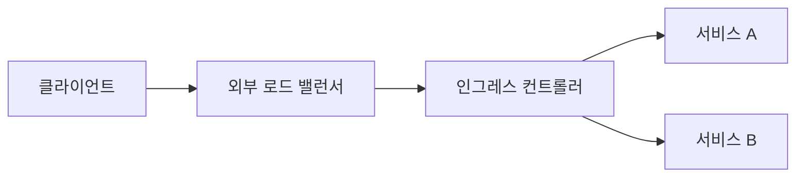

# Ingress

## 이 글에서 다룰 문제

- 여러 서비스를 하나의 도메인 아래에서 경로별로 나누려면 무엇이 필요할까요?
- Ingress와 IngressController는 왜 따로 이해해야 할까요?
- 외부 로드 밸런서와 Ingress는 어떤 식으로 역할을 나눌까요?
- TLS 종료를 Ingress에서 처리하면 무엇이 편해질까요?
- 실무에서 왜 서비스마다 LoadBalancer를 만들지 않으려 할까요?

> Kubernetes 101 시리즈 (5/10)
>
> 핵심 질문: 하나의 도메인으로 들어온 HTTP 요청을 여러 서비스로 어떻게 나눌까요?

Service까지 배우면 클러스터 내부 통신은 어느 정도 정리됩니다. 하지만 사용자가 브라우저나 모바일 앱에서 요청을 보내는 순간 이야기가 달라집니다. 외부 진입점을 어떻게 만들지, 여러 서비스를 어떤 규칙으로 나눌지, TLS 인증서를 어디에서 처리할지 결정해야 합니다.

이때 등장하는 객체가 Ingress입니다. Ingress는 HTTP 계층의 라우팅 규칙을 선언하고, 실제 트래픽 처리는 IngressController가 맡습니다. 둘을 한 덩어리로 보면 초반에는 편해 보여도, 나중에 왜 규칙은 있는데 트래픽이 안 들어오는지 이해하기 어려워집니다.

## 왜 중요한가

앱마다 LoadBalancer Service를 하나씩 두는 방식은 단순하지만 곧 비용과 운영 부담이 커집니다. 서비스 수가 늘어날수록 외부 IP, 인증서, 라우팅 규칙, 보안 정책을 따로 관리해야 하기 때문입니다.

Ingress를 두면 여러 서비스를 하나의 진입점으로 모으고, 호스트명과 URL 경로를 기준으로 나눌 수 있습니다. 초보자에게는 단순히 진입점 하나를 줄인다는 의미처럼 보이지만, 운영 관점에서는 외부 노출 정책을 한 곳에 모으는 구조라는 점이 더 중요합니다.

## 한눈에 보는 구조



Ingress는 규칙이고, IngressController는 그 규칙을 실제 프록시 설정으로 바꿔 적용하는 실행체입니다. 외부 로드 밸런서는 보통 컨트롤러 앞단에 놓여 외부 트래픽을 클러스터 안으로 들여보냅니다.

## 핵심 용어

- Ingress: L7 HTTP 라우팅 규칙을 담는 객체입니다.
- IngressController: Ingress 규칙을 실제로 적용하는 프록시입니다. nginx, Envoy, ALB Controller 같은 구현이 여기에 해당합니다.
- host: 도메인 이름입니다.
- path: URL 경로입니다.
- TLS termination: 암호화된 HTTPS 트래픽을 Ingress 지점에서 복호화하는 방식입니다.

## 적용 전후 달라지는 점

Ingress가 없으면 서비스마다 외부 LoadBalancer를 따로 만들기 쉽습니다. 구조가 단순해 보이지만 비용이 늘고, 인증서와 라우팅 설정도 흩어집니다.

Ingress를 도입하면 외부 진입점을 줄이고, `/api`는 API 서비스로 보내고 `/`는 웹 서비스로 보내는 식의 HTTP 라우팅을 한곳에서 선언할 수 있습니다. 특히 여러 앱을 한 도메인 아래에 배치할 때 차이가 크게 드러납니다.

## 단계별 실습

### 1단계 — Ingress manifest 작성

```python
"""
apiVersion: networking.k8s.io/v1
kind: Ingress
metadata: {name: web}
spec:
  rules:
  - host: example.com
    http:
      paths:
      - path: /api
        pathType: Prefix
        backend:
          service: {name: api, port: {number: 80}}
      - path: /
        pathType: Prefix
        backend:
          service: {name: web, port: {number: 80}}
"""
```

이 예시는 `example.com/api` 요청을 `api` 서비스로 보내고, 나머지 `/` 요청은 `web` 서비스로 보냅니다. 가장 먼저 눈여겨볼 값은 host, path, pathType입니다.

### 2단계 — 적용

```python
import subprocess

def apply(path):
    subprocess.run(["kubectl", "apply", "-f", path], check=True)
```

Ingress 리소스를 적용했다고 바로 외부 트래픽이 들어오지는 않습니다. 클러스터 안에 IngressController가 있어야 규칙이 실제 동작으로 이어집니다.

### 3단계 — TLS 시크릿 생성

```python
def tls_secret(name, cert, key):
    subprocess.run([
        "kubectl", "create", "secret", "tls", name,
        "--cert", cert, "--key", key,
    ], check=True)
```

TLS 인증서는 보통 Secret으로 관리합니다. 인증서와 개인 키가 올바른 네임스페이스에 있어야 Ingress가 해당 도메인에 HTTPS를 붙일 수 있습니다.

### 4단계 — TLS 적용

```python
"""
spec:
  tls:
  - hosts: [example.com]
    secretName: example-tls
"""
```

TLS 블록을 추가하면 해당 호스트에 대한 HTTPS 종료 지점을 Ingress로 모을 수 있습니다. 애플리케이션 컨테이너마다 인증서를 따로 다루지 않아도 된다는 장점이 큽니다.

### 5단계 — 동작 확인

```python
def curl(host, path):
    res = subprocess.run(
        ["curl", "-sk", f"https://{host}{path}"],
        capture_output=True, text=True, check=True,
    )
    return res.stdout
```

curl로 실제 경로별 응답을 확인하면 규칙이 기대한 서비스로 연결되는지 바로 볼 수 있습니다. `/api`와 `/`를 각각 호출해 응답이 달라지는지 점검하면 좋습니다.

## 이 코드에서 봐야 할 포인트

- Ingress는 규칙이고, Controller는 실행체입니다. 규칙만 있어서는 트래픽이 흐르지 않습니다.
- `pathType: Prefix`는 가장 흔한 기본 선택입니다. 경로 매칭 방식을 명시해 두는 편이 안전합니다.
- TLS는 Ingress 지점에서 종료할 수 있습니다. 인증서 운영을 애플리케이션에서 분리하는 데 도움이 됩니다.
- 외부 로드 밸런서와 Ingress는 경쟁 관계가 아니라 앞단과 뒷단 역할 분담에 가깝습니다.

## 자주 하는 실수 5가지

1. IngressController를 설치하지 않았는데도 Ingress만 만들면 외부 요청이 들어올 거라고 생각합니다.
2. pathType을 생략해 구현체별 차이나 호환성 문제를 만납니다.
3. TLS Secret을 다른 네임스페이스에 만들어서 인증서가 적용되지 않습니다.
4. 서비스마다 LoadBalancer를 계속 만들어 비용 문제를 키웁니다.
5. 경로 우선순위를 잘못 이해해 예상과 다른 백엔드로 요청이 갑니다.

## 실무에서는 이렇게 본다

실무에서는 nginx-ingress, AWS Load Balancer Controller 같은 구현이 Ingress 객체를 읽어 외부 로드 밸런서와 프록시 설정을 맞춥니다. TLS는 cert-manager와 연결해 자동 발급과 자동 갱신까지 묶는 경우가 많습니다.

또 하나 기억할 점이 있습니다. Ingress는 오래 쓰인 표준이지만, 기능 차이가 구현체마다 꽤 큽니다. 그래서 시니어 엔지니어는 Ingress 문법만 보지 않고, 지금 사용하는 Controller가 어떤 기능과 제약을 갖는지 함께 확인합니다. Gateway API가 주목받는 이유도 바로 이 지점입니다.

## 체크리스트

- [ ] IngressController가 설치되어 있는가
- [ ] pathType을 명시했는가
- [ ] TLS 자동화 방안을 준비했는가
- [ ] 외부 진입점을 가능한 한 통합했는가

## 연습 문제

1. Ingress와 IngressController의 차이를 한 줄로 설명해 보세요.
2. TLS 종료를 Ingress에서 처리할 때 좋은 점을 하나 적어 보세요.
3. Gateway API가 해결하려는 한계를 한 줄로 정리해 보세요.

## 정리와 다음 글

Ingress는 여러 서비스를 하나의 외부 진입점 뒤에 두고, 도메인과 경로 기준으로 HTTP 트래픽을 나누는 규칙 객체입니다. 실제 동작은 IngressController가 책임지고, TLS 종료까지 함께 다루면 외부 노출 구조를 훨씬 단순하게 만들 수 있습니다.

다음 글에서는 라우팅과 별개로 애플리케이션 설정값과 민감 정보를 어떻게 분리해야 하는지 보겠습니다. 주제는 ConfigMap과 Secret입니다.

<!-- toc:begin -->
- [Kubernetes란 무엇인가?](./01-what-is-kubernetes.md)
- [Pod](./02-pod.md)
- [Deployment](./03-deployment.md)
- [Service](./04-service.md)
- **Ingress (현재 글)**
- ConfigMap과 Secret (예정)
- Volume (예정)
- HPA (예정)
- Helm (예정)
- 운영 관점의 Kubernetes (예정)
<!-- toc:end -->

## 참고 자료

- [Ingress (Kubernetes)](https://kubernetes.io/docs/concepts/services-networking/ingress/)
- [Ingress Controllers](https://kubernetes.io/docs/concepts/services-networking/ingress-controllers/)
- [cert-manager](https://cert-manager.io/docs/)
- [Gateway API](https://gateway-api.sigs.k8s.io/)

Tags: Kubernetes, Ingress, HTTP, TLS, DevOps
