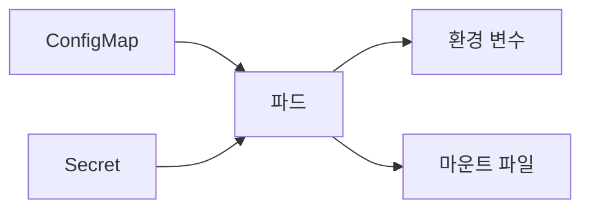

# ConfigMap과 Secret

## 이 글에서 다룰 문제

- 이미지 안에 설정값과 비밀번호를 함께 넣으면 왜 운영이 어려워질까요?
- ConfigMap과 Secret은 무엇이 다르고 어디까지 분리해야 할까요?
- 환경 변수 주입과 파일 마운트는 언제 다르게 선택할까요?
- Secret이 base64라는 사실은 왜 보안과 같지 않을까요?
- 설정 변경 후 재시작이 필요한 이유는 무엇일까요?

> Kubernetes 101 시리즈 (6/10)
>
> 핵심 질문: 환경별 설정과 비밀번호를 이미지에 굽지 않고 어떻게 파드에 넣을까요?

애플리케이션을 처음 컨테이너로 만들 때는 `.env` 파일이나 하드코딩된 값으로도 금방 동작합니다. 하지만 개발, 스테이징, 운영 환경이 나뉘고 팀이 커지기 시작하면 그 방식은 빠르게 한계에 부딪힙니다. 같은 이미지를 여러 환경에서 재사용하기 어렵고, 민감한 값이 Git이나 이미지 레지스트리에 남을 위험도 커집니다.

Kubernetes는 이 문제를 ConfigMap과 Secret으로 나눠 다룹니다. 이름은 단순하지만 운영 감각까지 같이 이해해야 실수가 줄어듭니다. ConfigMap은 공개 가능한 설정 묶음이고, Secret은 민감한 값 묶음입니다. 둘 다 파드에 주입할 수 있지만 보안과 변경 반영 방식까지 생각하면 선택 기준이 훨씬 선명해집니다.

## 왜 중요한가

환경 차이를 이미지 바깥으로 빼야 같은 이미지를 여러 환경에서 재현 가능하게 쓸 수 있습니다. 그래야 개발 환경에서 만든 이미지를 스테이징과 운영에서도 그대로 검증할 수 있습니다.

민감한 값은 더 엄격하게 다뤄야 합니다. 데이터베이스 비밀번호, API 토큰, 인증서 같은 값이 이미지나 Git에 평문으로 남는 순간, 배포 편의성보다 훨씬 큰 리스크를 안게 됩니다. ConfigMap과 Secret을 구분하는 이유는 기능 분리가 아니라 책임 분리입니다.

## 한눈에 보는 구조



ConfigMap과 Secret은 모두 파드 안으로 들어가지만, 주입 방식과 보안 정책은 다르게 볼 필요가 있습니다. 특히 Secret은 단순히 별도 객체라는 사실만으로 안전해지지 않습니다.

## 핵심 용어

- ConfigMap: 민감하지 않은 키/값 설정 묶음입니다.
- Secret: 민감한 키/값 설정 묶음입니다.
- envFrom: 여러 키를 한 번에 환경 변수로 주입하는 방식입니다.
- volume mount: 설정을 파일 형태로 마운트하는 방식입니다.
- External Secrets: 외부 비밀 관리 시스템과 클러스터 Secret을 동기화하는 방식입니다.

## 적용 전후 달라지는 점

이미지 안에 데이터베이스 비밀번호를 넣으면 이미지를 새로 빌드하지 않고는 값을 바꾸기 어렵습니다. 환경별 차이를 분리하기도 힘듭니다.

반대로 ConfigMap과 Secret으로 나누면 이미지는 환경에 덜 묶이고, 값은 배포 시점에 주입할 수 있습니다. 운영 환경의 차이를 이미지가 아니라 배포 설정에서 관리하게 되므로 재현성과 보안이 함께 좋아집니다.

## 단계별 실습

### 1단계 — ConfigMap 작성

```python
"""
apiVersion: v1
kind: ConfigMap
metadata: {name: app-config}
data:
  LOG_LEVEL: "info"
  FEATURE_FLAG: "true"
"""
```

로그 레벨이나 기능 플래그처럼 민감하지 않은 값은 ConfigMap에 두는 편이 자연스럽습니다. 값이 바뀌어도 보안 사고로 이어질 가능성이 낮은 항목이 여기에 해당합니다.

### 2단계 — Secret 작성

```python
"""
apiVersion: v1
kind: Secret
metadata: {name: app-secret}
type: Opaque
stringData:
  DB_PASSWORD: "s3cret"
"""
```

예제에서는 `stringData`를 사용했습니다. 사람이 읽을 수 있는 문자열로 값을 넣으면 Kubernetes가 내부에서 base64 인코딩을 처리해 줍니다. 다만 base64는 표현 형식일 뿐 암호화가 아닙니다.

### 3단계 — 파드에 주입

```python
"""
spec:
  containers:
  - name: app
    image: myorg/app:1.0
    envFrom:
    - configMapRef: {name: app-config}
    - secretRef: {name: app-secret}
"""
```

`envFrom`은 여러 키를 한 번에 환경 변수로 넣을 때 편합니다. 애플리케이션이 환경 변수 기반 설정을 기본으로 쓴다면 가장 빠른 선택입니다.

### 4단계 — 파일로 마운트

```python
"""
volumes:
- name: cfg
  configMap: {name: app-config}
volumeMounts:
- name: cfg
  mountPath: /etc/app
"""
```

설정 파일 형식이 필요한 애플리케이션이라면 파일 마운트가 더 잘 맞습니다. 예를 들어 여러 줄짜리 설정이나 라이브러리가 특정 파일 경로를 기대하는 경우에는 환경 변수보다 자연스럽습니다.

### 5단계 — 변경 후 재시작

```python
import subprocess

def restart(dep):
    subprocess.run(
        ["kubectl", "rollout", "restart", f"deployment/{dep}"],
        check=True,
    )
```

설정값을 바꿨다고 애플리케이션이 항상 자동 반영되는 것은 아닙니다. 특히 환경 변수 기반 주입은 새 파드가 떠야 적용되므로 rollout restart를 함께 기억하는 편이 좋습니다.

## 이 코드에서 봐야 할 포인트

- `stringData`를 쓰면 base64 인코딩을 직접 만들지 않아도 됩니다.
- `envFrom`은 전체 묶음을 한 번에 주입할 때 편하지만, 어떤 키가 들어오는지 관리 기준은 더 분명해야 합니다.
- ConfigMap과 Secret 변경은 애플리케이션 재시작 전략과 같이 봐야 합니다.
- Secret은 분리 저장일 뿐 자동 암호화가 아닙니다. 접근 제어와 외부 비밀 관리가 따로 필요합니다.

## 자주 하는 실수 5가지

1. Secret이면 곧 암호화라고 오해합니다.
2. Secret 값을 Git에 평문으로 올립니다.
3. ConfigMap 값을 바꾸면 애플리케이션이 즉시 자동 반영된다고 기대합니다.
4. 긴 설정 파일도 모두 환경 변수 하나로만 처리하려 합니다.
5. Secret에 대한 RBAC를 느슨하게 둡니다.

## 실무에서는 이렇게 본다

실무에서는 Vault, AWS Secrets Manager, Azure Key Vault 같은 외부 비밀 관리 시스템을 진실 원천으로 두고, External Secrets Operator가 클러스터 Secret을 동기화하는 구조를 많이 씁니다. 이렇게 하면 비밀 값의 회전, 접근 감사, 권한 분리가 더 쉬워집니다.

또한 ConfigMap과 Secret은 단순히 객체를 만드는 단계로 끝나지 않습니다. 값이 바뀌었을 때 어떤 워크로드를 언제 다시 시작할지, 누가 값을 바꿀 수 있는지, Git 저장소에는 어떤 형태로 남길지까지 정해야 비로소 운영 가능한 구조가 됩니다.

## 체크리스트

- [ ] Secret 값을 Git에 평문으로 두지 않았는가
- [ ] Secret 접근에 RBAC를 적용했는가
- [ ] 변경 후 rollout restart 절차를 준비했는가
- [ ] 가능하면 외부 비밀 관리 시스템을 우선 검토했는가

## 연습 문제

1. ConfigMap과 Secret의 차이를 한 줄로 설명해 보세요.
2. “Secret은 암호화가 아니다”라는 말을 한 줄로 풀어 보세요.
3. External Secrets를 쓰는 장점을 하나 적어 보세요.

## 정리와 다음 글

ConfigMap과 Secret은 이미지를 환경별 차이와 민감한 값에서 분리하기 위한 기본 도구입니다. ConfigMap은 일반 설정을, Secret은 민감한 값을 담고, 둘 다 환경 변수나 파일 마운트로 파드에 주입할 수 있습니다. 다만 Secret은 안전한 운영의 출발점일 뿐이며, 접근 제어와 외부 비밀 관리까지 이어져야 실제 보안 수준이 올라갑니다.

다음 글에서는 설정이 아니라 데이터 자체를 오래 보존하는 방법을 보겠습니다. 주제는 Volume입니다.

<!-- toc:begin -->
- [Kubernetes란 무엇인가?](./01-what-is-kubernetes.md)
- [Pod](./02-pod.md)
- [Deployment](./03-deployment.md)
- [Service](./04-service.md)
- [Ingress](./05-ingress.md)
- **ConfigMap과 Secret (현재 글)**
- Volume (예정)
- HPA (예정)
- Helm (예정)
- 운영 관점의 Kubernetes (예정)
<!-- toc:end -->

## 참고 자료

- [ConfigMap](https://kubernetes.io/docs/concepts/configuration/configmap/)
- [Secret](https://kubernetes.io/docs/concepts/configuration/secret/)
- [External Secrets Operator](https://external-secrets.io/)
- [RBAC](https://kubernetes.io/docs/reference/access-authn-authz/rbac/)

Tags: Kubernetes, ConfigMap, Secret, Configuration, DevOps
