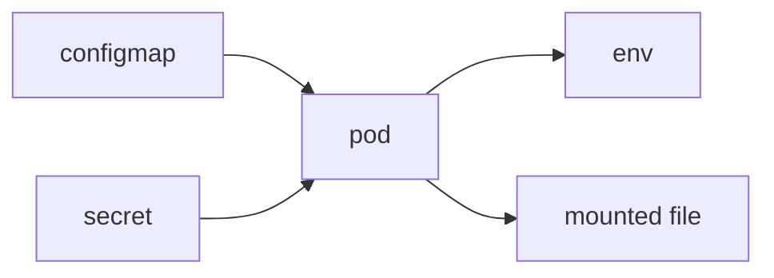

# ConfigMap과 Secret

> Kubernetes 101 시리즈 (6/10)


## 이 글에서 다룰 문제

*환경별 차이* 를 *이미지 외부* 로 빼야 *재현 가능* 합니다. *비밀* 은 *별도 추적* 이 필수입니다.

## 전체 흐름


## Before/After

**Before**: *이미지* 에 *DB 비밀번호* 를 *박아* 빌드.

**After**: *Secret* 으로 *주입*, *이미지* 는 *환경 무관*.

## 설정과 비밀 분리

### 1단계 — ConfigMap

```python
"""
apiVersion: v1
kind: ConfigMap
metadata: {name: app-config}
data:
  LOG_LEVEL: "info"
  FEATURE_FLAG: "true"
"""
```

### 2단계 — Secret

```python
"""
apiVersion: v1
kind: Secret
metadata: {name: app-secret}
type: Opaque
stringData:
  DB_PASSWORD: "s3cret"
"""
```

### 3단계 — Pod에 주입

```python
"""
spec:
  containers:
  - name: app
    image: myorg/app:1.0
    envFrom:
    - configMapRef: {name: app-config}
    - secretRef: {name: app-secret}
"""
```

### 4단계 — 파일 마운트

```python
"""
volumes:
- name: cfg
  configMap: {name: app-config}
volumeMounts:
- name: cfg
  mountPath: /etc/app
"""
```

### 5단계 — 변경 후 재시작

```python
import subprocess

def restart(dep):
    subprocess.run(
        ["kubectl", "rollout", "restart", f"deployment/{dep}"],
        check=True,
    )
```

## 이 코드에서 주목할 점

- *stringData* 가 *base64 자동 인코딩*.
- *envFrom* 으로 *전체 일괄* 주입.
- *변경* 후 *재시작* 명시 필요.

## 자주 하는 실수 5가지

1. ***Secret = 암호화* 라 단정.**
2. ***Secret* 을 *Git* 에 *평문* 저장.**
3. ***ConfigMap* 변경 후 *자동 반영* 기대.**
4. ***긴 설정* 을 *환경변수* 로만 처리.**
5. ***Secret RBAC* 미설정.**

## 실무에서는 이렇게 쓰입니다

*External Secrets Operator* 가 *Vault / AWS Secrets Manager* 를 *진실 원천* 으로 두고, *클러스터 Secret* 을 *동기화* 합니다.

## 체크리스트

- [ ] *Secret* 평문 *Git 금지*.
- [ ] *RBAC* 적용.
- [ ] *변경* 후 *rollout restart*.
- [ ] *외부 매니저* 우선 검토.

## 정리 및 다음 단계

설정이 잡혔으면 *상태 데이터* 를 *유지* 할 차례입니다. 다음 글은 *Volume*.

<!-- toc:begin -->
- [Kubernetes란 무엇인가?](./01-what-is-kubernetes.md)
- [Pod](./02-pod.md)
- [Deployment](./03-deployment.md)
- [Service](./04-service.md)
- [Ingress](./05-ingress.md)
- **ConfigMap과 Secret (현재 글)**
- Volume (예정)
- HPA (예정)
- Helm (예정)
- 운영 관점의 Kubernetes (예정)
<!-- toc:end -->

## 참고 자료

- [ConfigMap](https://kubernetes.io/docs/concepts/configuration/configmap/)
- [Secret](https://kubernetes.io/docs/concepts/configuration/secret/)
- [External Secrets Operator](https://external-secrets.io/)
- [RBAC](https://kubernetes.io/docs/reference/access-authn-authz/rbac/)

Tags: Kubernetes, ConfigMap, Secret, Configuration, DevOps
