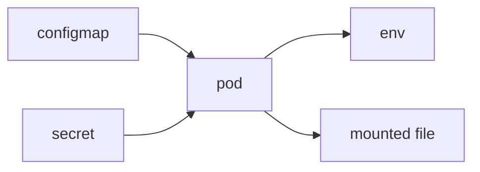

# ConfigMap과 Secret

컨테이너 이미지를 처음 만들 때는 설정값과 비밀번호를 같이 넣어도 금방 동작합니다. 하지만 환경이 늘어나고 팀이 커지면 그 방식은 빠르게 한계에 닿습니다. 같은 이미지를 개발과 운영에서 재사용하기 어렵고, 민감한 값이 이미지나 Git에 남는 위험도 커집니다.

이 글은 Kubernetes 101 시리즈의 6번째 글입니다.

여기서는 ConfigMap과 Secret을 단순한 키/값 저장소가 아니라, 이미지를 환경별 차이와 민감한 값에서 분리하기 위한 기본 운영 도구라는 관점에서 정리하겠습니다.

## 이 글에서 다룰 문제

> ConfigMap은 일반 설정을, Secret은 민감한 값을 파드 바깥에서 관리해 주입하게 함으로써 이미지를 환경에 덜 묶고 보안 경계를 분리합니다.

- 이미지 안에 설정과 비밀번호를 같이 넣으면 왜 운영이 어려워질까요?
- ConfigMap과 Secret은 무엇이 다르고 어디서 나뉠까요?
- 환경 변수 주입과 파일 마운트는 언제 다르게 선택할까요?
- Secret이 base64라는 사실은 왜 암호화와 같지 않을까요?
- 값이 바뀐 뒤 재시작이 필요한 이유는 무엇일까요?

## 왜 중요한가

환경 차이를 이미지 바깥으로 빼야 같은 이미지를 여러 환경에서 재현 가능하게 쓸 수 있습니다. 그래야 개발에서 검증한 이미지를 스테이징과 운영에서도 그대로 올릴 수 있습니다.

민감한 값은 더 엄격하게 다뤄야 합니다. 데이터베이스 비밀번호, API 토큰, 인증서 같은 값이 이미지나 Git에 평문으로 남으면 배포 편의성보다 훨씬 큰 리스크를 떠안게 됩니다. ConfigMap과 Secret을 구분하는 이유는 단순한 기능 차이가 아니라 운영 책임을 나누기 위해서입니다.

## 한눈에 보는 구조



ConfigMap과 Secret은 모두 파드 안으로 들어갈 수 있지만, 같은 방식으로 다뤄도 된다는 뜻은 아닙니다. 주입 방식과 접근 제어, 변경 반영 전략까지 같이 봐야 실제 운영 모델이 완성됩니다.

## 핵심 용어

- ConfigMap: 민감하지 않은 키/값 설정 묶음입니다.
- Secret: 민감한 키/값 설정 묶음입니다.
- `envFrom`: 여러 키를 한 번에 환경 변수로 주입하는 방식입니다.
- 볼륨 마운트: 설정을 파일 형태로 연결하는 방식입니다.
- External Secrets: 외부 비밀 관리 시스템과 클러스터 Secret을 동기화하는 방식입니다.

## 도입 전과 후

이미지 안에 데이터베이스 비밀번호를 넣으면 값을 바꾸려 할 때마다 이미지를 다시 빌드해야 합니다. 환경 차이도 이미지 변형으로 흩어지기 쉽습니다.

ConfigMap과 Secret으로 나누면 이미지는 환경에 덜 묶이고, 값은 배포 시점에 주입할 수 있습니다. 운영에서는 이 차이가 매우 큽니다. 이미지 재사용성과 비밀 값 관리가 동시에 좋아지기 때문입니다.

## 단계별로 설정과 비밀 값 분리하기

### 1단계 — ConfigMap 작성

```python
"""
apiVersion: v1
kind: ConfigMap
metadata: {name: app-config}
data:
  LOG_LEVEL: "info"
  FEATURE_FLAG: "true"
"""
```

로그 레벨이나 기능 플래그처럼 민감하지 않은 설정은 ConfigMap에 두는 편이 자연스럽습니다. 바뀌어도 보안 사고로 이어질 가능성이 낮은 값들이 여기에 해당합니다.

### 2단계 — Secret 작성

```python
"""
apiVersion: v1
kind: Secret
metadata: {name: app-secret}
type: Opaque
stringData:
  DB_PASSWORD: "s3cret"
"""
```

`stringData`를 사용하면 사람이 읽을 수 있는 문자열을 넣어도 Kubernetes가 내부에서 base64 인코딩을 처리해 줍니다. 다만 이 인코딩은 표현 형식일 뿐, 보안적으로 완전한 암호화와는 다릅니다.

### 3단계 — 파드에 주입

```python
"""
spec:
  containers:
  - name: app
    image: myorg/app:1.0
    envFrom:
    - configMapRef: {name: app-config}
    - secretRef: {name: app-secret}
"""
```

`envFrom`은 환경 변수 기반 애플리케이션에서 가장 빠른 선택입니다. 다만 어떤 키가 한 번에 들어오는지 관리 기준이 함께 있어야 나중에 추적이 쉽습니다.

### 4단계 — 파일로 마운트

```python
"""
volumes:
- name: cfg
  configMap: {name: app-config}
volumeMounts:
- name: cfg
  mountPath: /etc/app
"""
```

설정을 파일 형태로 읽는 애플리케이션이라면 마운트 방식이 더 자연스럽습니다. 여러 줄짜리 설정이나 특정 경로를 기대하는 라이브러리에서는 환경 변수보다 파일이 잘 맞습니다.

### 5단계 — 변경 후 재시작

```python
import subprocess

def restart(dep):
    subprocess.run(
        ["kubectl", "rollout", "restart", f"deployment/{dep}"],
        check=True,
    )
```

설정값을 바꿨다고 애플리케이션이 항상 자동 반영되는 것은 아닙니다. 특히 환경 변수 기반 주입은 새 파드가 떠야 적용되므로, 설정 변경과 재시작을 함께 생각해야 합니다.

## 이 코드에서 먼저 봐야 할 점

- `stringData`를 쓰면 base64 인코딩을 직접 만들 필요가 없습니다.
- `envFrom`은 전체 묶음을 한 번에 넣습니다.
- 값이 바뀌면 재시작 전략도 함께 봐야 합니다.

이 세 가지를 같이 이해하면 ConfigMap과 Secret을 단순 객체 생성으로 끝내지 않게 됩니다. 실제 운영은 주입 방식, 반영 방식, 접근 권한까지 이어집니다.

## 자주 하는 실수 다섯 가지

1. Secret이면 곧 암호화라고 오해합니다.
2. Secret 값을 Git에 평문으로 올립니다.
3. ConfigMap 값을 바꾸면 애플리케이션이 즉시 자동 반영된다고 기대합니다.
4. 긴 설정도 모두 환경 변수만으로 처리하려 합니다.
5. Secret에 대한 RBAC를 느슨하게 둡니다.

## 실무에서는 이렇게 봅니다

실무에서는 Vault, AWS Secrets Manager, Azure Key Vault 같은 외부 비밀 관리 시스템을 진실 원천으로 두고, External Secrets Operator가 클러스터 Secret을 동기화하는 구조를 자주 씁니다. 이렇게 해야 값 회전과 접근 감사, 권한 분리가 더 쉬워집니다.

시니어 엔지니어는 ConfigMap과 Secret을 만들 때 객체 생성만 보지 않습니다. 누가 값을 바꾸는지, 값이 바뀌면 어떤 워크로드를 재시작할지, Git에는 어떤 형태로 남길지까지 함께 봅니다. 그래야 비로소 운영 가능한 구성이 됩니다.

## 체크리스트

- [ ] Secret 값을 Git에 평문으로 두지 않았는가
- [ ] Secret 접근에 RBAC를 적용했는가
- [ ] 변경 후 `rollout restart` 절차를 준비했는가
- [ ] 외부 비밀 관리 시스템을 먼저 검토했는가

## 연습 문제

1. ConfigMap과 Secret의 차이를 한 줄로 설명해 보세요.
2. "Secret은 암호화가 아니다"라는 말을 한 줄로 풀어 보세요.
3. External Secrets를 쓰는 장점을 하나 적어 보세요.

## 마무리와 다음 글

이 글에서는 ConfigMap과 Secret을 이미지를 환경 차이와 민감한 값에서 분리하는 기본 도구로 정리했습니다. ConfigMap은 일반 설정을, Secret은 민감한 값을 담고, 둘 다 환경 변수나 파일 마운트로 파드에 주입할 수 있습니다.

다음 글에서는 설정값이 아니라 실제 데이터를 오래 보존하는 방법을 보겠습니다. 주제는 Volume입니다.

<!-- toc:begin -->
- [Kubernetes란 무엇인가?](./01-what-is-kubernetes.md)
- [Pod](./02-pod.md)
- [Deployment](./03-deployment.md)
- [Service](./04-service.md)
- [Ingress](./05-ingress.md)
- **ConfigMap과 Secret (현재 글)**
- Volume (예정)
- HPA (예정)
- Helm (예정)
- 운영 관점의 Kubernetes (예정)
<!-- toc:end -->

## 참고 자료

- [ConfigMap](https://kubernetes.io/docs/concepts/configuration/configmap/)
- [Secret](https://kubernetes.io/docs/concepts/configuration/secret/)
- [External Secrets Operator](https://external-secrets.io/)
- [RBAC](https://kubernetes.io/docs/reference/access-authn-authz/rbac/)

Tags: Kubernetes, ConfigMap, Secret, Configuration, DevOps
