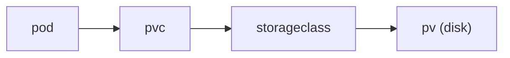

# Volume

> Kubernetes 101 시리즈 (7/10)

<!-- a-grade-intro:begin -->

**핵심 질문**: *Pod* 가 *죽어도* *데이터* 를 *살아 있게* 하려면 무엇이 필요할까요?

> *PersistentVolumeClaim* 이 *StorageClass* 를 통해 *동적* 으로 *영속 디스크* 를 *Pod* 에 붙입니다.

<!-- a-grade-intro:end -->

## 이 글에서 배울 것

- *emptyDir* 과 *PV/PVC* 차이
- *StorageClass* 의 역할
- *동적 프로비저닝*
- *접근 모드*
- *데이터 백업* 관점

## 왜 중요한가

*컨테이너 파일시스템* 은 *Pod* 와 함께 *사라집니다*. *상태* 가 있는 워크로드에는 *Volume* 이 *필수*.

## 개념 한눈에 보기



## 핵심 용어 정리

- **Volume**: *Pod* 안에서 *공유/영속* 되는 저장소.
- **PersistentVolume (PV)**: *클러스터 자원* 인 디스크.
- **PersistentVolumeClaim (PVC)**: *Pod 가 요청* 하는 디스크.
- **StorageClass**: *어떻게 만들지* 정의 (ssd, gp3 등).
- **AccessMode**: *RWO / ROX / RWX*.

## Before/After

**Before**: *DB* 데이터를 *Pod 내부* 에 → *재시작 시 손실*.

**After**: *PVC + PV* 로 *외부 디스크* 보관.

## 실습: PVC로 Pod에 디스크 연결

### 1단계 — PVC

```python
"""
apiVersion: v1
kind: PersistentVolumeClaim
metadata: {name: data}
spec:
  accessModes: [ReadWriteOnce]
  resources: {requests: {storage: 5Gi}}
  storageClassName: gp3
"""
```

### 2단계 — Pod에서 사용

```python
"""
spec:
  containers:
  - name: app
    image: postgres:16
    volumeMounts:
    - name: data
      mountPath: /var/lib/postgresql/data
  volumes:
  - name: data
    persistentVolumeClaim: {claimName: data}
"""
```

### 3단계 — apply

```python
import subprocess

def apply(path):
    subprocess.run(["kubectl", "apply", "-f", path], check=True)
```

### 4단계 — 상태 조회

```python
def get_pvc():
    res = subprocess.run(
        ["kubectl", "get", "pvc"],
        capture_output=True, text=True, check=True,
    )
    return res.stdout
```

### 5단계 — 정리 (주의)

```python
def delete(name):
    subprocess.run(["kubectl", "delete", "pvc", name], check=True)
```

## 이 코드에서 주목할 점

- *PVC* 가 *PV* 를 *동적* 으로 받음.
- *RWO* 는 *한 노드* 에서만 *읽기/쓰기*.
- *PVC 삭제* 가 *디스크 삭제* 일 수 있음.

## 자주 하는 실수 5가지

1. ***emptyDir* 에 *상태* 보관.**
2. ***RWX* 가 *기본 가능* 이라 단정.**
3. ***reclaimPolicy* 무지로 *데이터 유실*.**
4. ***백업 시스템* 없이 *PVC* 만 신뢰.**
5. ***스토리지 클래스* 미지정으로 *기본* 만 사용.**

## 실무에서는 이렇게 쓰입니다

*StatefulSet* 이 *Pod 별 PVC* 를 자동 생성하고, *Velero* 같은 도구가 *볼륨 스냅샷* 을 정기 *백업* 합니다.

## 시니어 엔지니어는 이렇게 생각합니다

- *상태* 는 *클러스터 외부* 가 안전.
- *RWX* 는 *비용/성능* 을 본다.
- *백업* 이 진짜 *복구 능력*.
- *reclaimPolicy* 명시.
- *StatefulSet* 은 *상태 패턴* 의 시작.

## 체크리스트

- [ ] *상태* 는 *PVC* 또는 *managed DB*.
- [ ] *백업* 정책 존재.
- [ ] *AccessMode* 명시.
- [ ] *reclaimPolicy* 명시.

## 연습 문제

1. *emptyDir* 과 *PVC* 의 *차이* 한 줄로.
2. *RWO* 의 *제약* 한 가지.
3. *백업* 이 *왜* PVC 만으로 *부족* 한지 한 줄로.

## 정리 및 다음 단계

상태가 잡혔으면 *부하 변화* 에 *Pod* 수를 *맞추는* 차례입니다. 다음 글은 *HPA*.

<!-- toc:begin -->
- [Kubernetes란 무엇인가?](./01-what-is-kubernetes.md)
- [Pod](./02-pod.md)
- [Deployment](./03-deployment.md)
- [Service](./04-service.md)
- [Ingress](./05-ingress.md)
- [ConfigMap과 Secret](./06-configmap-and-secret.md)
- **Volume (현재 글)**
- HPA (예정)
- Helm (예정)
- 운영 관점의 Kubernetes (예정)
<!-- toc:end -->

## 참고 자료

- [Volumes](https://kubernetes.io/docs/concepts/storage/volumes/)
- [Persistent Volumes](https://kubernetes.io/docs/concepts/storage/persistent-volumes/)
- [Storage Classes](https://kubernetes.io/docs/concepts/storage/storage-classes/)
- [Velero](https://velero.io/)

Tags: Kubernetes, Volume, PersistentVolume, StorageClass, DevOps
