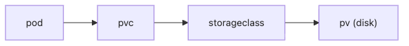

# Volume

컨테이너는 가볍고 교체가 쉽다는 장점이 있습니다. 하지만 그 장점은 동시에 컨테이너 파일시스템이 영구 저장소가 아니라는 뜻이기도 합니다. 파드가 다시 스케줄되거나 새 컨테이너로 교체되면, 그 안에만 저장한 데이터는 함께 사라집니다.

이 글은 Kubernetes 101 시리즈의 7번째 글입니다.

여기서는 Volume을 단순히 디스크를 붙이는 기능이 아니라, 파드의 수명과 데이터의 수명을 분리해 stateful 워크로드를 운영 가능하게 만드는 저장소 모델로 정리하겠습니다.

## 이 글에서 다룰 문제

> Kubernetes의 저장소 모델은 컨테이너 내부 파일시스템에 상태를 두지 않고, PVC와 StorageClass를 통해 파드 바깥의 영속 저장소를 연결하는 방식으로 설계됩니다.

- 파드가 재시작되면 컨테이너 파일시스템은 왜 사라질까요?
- `emptyDir`와 PVC는 어떤 순간에 갈라질까요?
- StorageClass는 단순 옵션이 아니라 무엇을 결정할까요?
- PVC만 있으면 백업도 해결됐다고 보면 왜 위험할까요?
- stateful 워크로드에서 가장 먼저 조심해야 할 점은 무엇일까요?

## 왜 중요한가

웹 API처럼 stateless한 애플리케이션은 파드가 교체돼도 큰 문제가 없을 수 있습니다. 하지만 데이터베이스, 파일 업로드, 작업 큐처럼 상태를 직접 다루는 워크로드는 저장 위치를 잘못 잡는 순간 장애가 바로 데이터 손실로 이어집니다.

초보자가 자주 하는 실수도 여기서 나옵니다. 파드가 다시 살아났으니 데이터도 남아 있을 것이라고 기대하는 것입니다. Kubernetes는 프로세스를 다시 띄우는 일에는 강하지만, 데이터 보존은 별도의 스토리지 계층을 제대로 연결했을 때만 가능합니다.

## 한눈에 보는 구조


*PVC와 StorageClass를 거치면 파드 수명과 데이터 수명을 분리한 저장소 모델이 만들어집니다.*


애플리케이션은 보통 PVC를 통해 저장소를 요청하고, StorageClass는 어떤 종류의 디스크를 어떤 방식으로 만들지 결정합니다. 이 흐름을 이해하면 애플리케이션이 원하는 것과 클러스터가 실제로 제공하는 것이 분리되어 보입니다.

## 핵심 용어

- Volume: 파드 안에서 공유하거나 지속할 수 있는 저장소입니다.
- PersistentVolume: 클러스터 관점의 실제 저장소 리소스입니다.
- PersistentVolumeClaim: 워크로드가 원하는 저장소를 요청하는 객체입니다.
- StorageClass: 디스크를 어떤 방식으로 만들지 정의합니다.
- AccessMode: 저장소에 어떤 방식으로 접근할 수 있는지 나타냅니다.

## 도입 전과 후

파드 내부 파일시스템에 데이터베이스 파일을 두면 재시작이나 재배치 때 데이터가 사라질 수 있습니다. 개발 환경에서는 운 좋게 지나가도 운영에서는 반드시 문제가 됩니다.

PVC와 PV를 사용하면 데이터는 파드 바깥 디스크에 놓이고, 파드는 그 저장소를 마운트해 씁니다. 파드가 교체돼도 같은 저장소를 다시 붙일 수 있으므로 상태를 비교적 안정적으로 유지할 수 있습니다.

## 단계별로 파드에 디스크 붙이기

### 1단계 — PVC 작성

```python
"""
apiVersion: v1
kind: PersistentVolumeClaim
metadata: {name: data}
spec:
  accessModes: [ReadWriteOnce]
  resources: {requests: {storage: 5Gi}}
  storageClassName: gp3
"""
```

이 PVC는 5Gi 저장소를 요청합니다. `storageClassName: gp3`는 어떤 종류의 디스크를 만들지 클러스터에 알려 주는 값입니다.

### 2단계 — 파드에서 사용

```python
"""
spec:
  containers:
  - name: app
    image: postgres:16
    volumeMounts:
    - name: data
      mountPath: /var/lib/postgresql/data
  volumes:
  - name: data
    persistentVolumeClaim: {claimName: data}
"""
```

컨테이너는 이 경로를 로컬 폴더처럼 보지만, 실제로는 PVC를 통해 연결된 외부 저장소를 사용합니다. 상태를 파드 바깥으로 밀어내는 핵심 지점입니다.

### 3단계 — 적용

```python
import subprocess

def apply(path):
    subprocess.run(["kubectl", "apply", "-f", path], check=True)
```

PVC를 적용하면 클러스터는 StorageClass를 참고해 PV를 동적으로 만들거나 기존 PV와 바인딩합니다. 이 과정을 동적 프로비저닝이라고 부릅니다.

### 4단계 — 상태 확인

```python
def get_pvc():
    res = subprocess.run(
        ["kubectl", "get", "pvc"],
        capture_output=True, text=True, check=True,
    )
    return res.stdout
```

`Pending` 상태가 오래 이어지면 StorageClass, 용량, 권한, AccessMode를 함께 확인해야 합니다. 상태 조회는 단순 목록 확인이 아니라 스토리지 문제를 읽는 출발점입니다.

### 5단계 — 정리

```python
def delete(name):
    subprocess.run(["kubectl", "delete", "pvc", name], check=True)
```

PVC 삭제는 특히 조심해야 합니다. reclaimPolicy에 따라 실제 디스크가 함께 삭제될 수 있기 때문입니다. 상태 데이터는 생성보다 삭제가 더 위험한 경우가 많습니다.

## 검증 흐름

```bash
kubectl get pvc
kubectl describe pvc data
kubectl get pv
```

**예상되는 결과:** PVC는 `Bound` 상태가 되어야 하고, describe 결과에는 어떤 StorageClass와 PV에 연결됐는지가 보여야 합니다. PV 목록까지 같이 보면 실제 디스크가 동적으로 만들어졌는지와 reclaim 정책을 한 번에 확인할 수 있습니다.

**먼저 의심할 실패 모드:**

- PVC가 `Pending`이면 애플리케이션보다 StorageClass, 용량, AccessMode를 먼저 봅니다.
- `Bound`인데 마운트가 실패하면 PVC 자체보다 Pod spec의 volumeMount 경로를 확인합니다.
- 삭제가 무서운 이유는 reclaimPolicy가 `Delete`일 때 실제 디스크까지 사라질 수 있기 때문입니다.

## 이 코드에서 먼저 봐야 할 점

- PVC는 직접 디스크를 고르는 객체가 아니라 저장소를 요청하는 객체입니다.
- `ReadWriteOnce`는 보통 한 노드에서만 읽기와 쓰기를 허용합니다.
- PVC 삭제는 데이터 삭제로 이어질 수 있습니다.

이 셋을 이해하면 Volume을 단순 마운트 설정으로 보지 않게 됩니다. 실제로는 워크로드와 저장소 수명을 분리하는 운영 규약입니다.

## 자주 하는 실수 다섯 가지

1. 상태 데이터를 `emptyDir`에 둡니다.
2. RWX가 어디서나 기본 지원된다고 생각합니다.
3. reclaimPolicy를 보지 않고 삭제합니다.
4. PVC만 있으면 백업도 끝났다고 오해합니다.
5. StorageClass를 신경 쓰지 않고 기본값만 사용합니다.

## 실무에서는 이렇게 봅니다

실무에서는 StatefulSet이 파드마다 PVC를 자동으로 만들고, Velero 같은 도구가 스냅샷과 백업을 맡는 구조를 자주 봅니다. 이때 중요한 점은 PVC가 운영 중인 저장소이고, 백업은 복구 전략이라는 사실입니다. 둘은 서로 대체되지 않습니다.

시니어 엔지니어는 가능하면 상태 데이터 자체를 관리형 데이터베이스로 분리하는 편도 많이 선택합니다. Kubernetes가 못 해서가 아니라, 스토리지 운영 난도가 애플리케이션 운영 난도와 다른 축이기 때문입니다.

## 체크리스트

- [ ] 상태 데이터가 PVC 또는 관리형 DB에 있는가
- [ ] 백업 정책을 준비했는가
- [ ] AccessMode를 명시했는가
- [ ] reclaimPolicy를 확인했는가

## 연습 문제

1. `emptyDir`와 PVC의 차이를 한 줄로 설명해 보세요.
2. RWO의 제약을 한 가지 적어 보세요.
3. PVC만으로는 백업이 끝나지 않는 이유를 한 줄로 써 보세요.

## 마무리와 다음 글

이 글에서는 Volume을 파드의 수명과 데이터의 수명을 분리하는 기본 도구로 정리했습니다. PVC는 워크로드가 원하는 저장소를 선언하고, StorageClass와 PV는 그 요청을 실제 디스크로 연결합니다.

다음 글에서는 저장소가 아니라 트래픽 변화에 따라 파드 수를 자동으로 조절하는 방법, HPA를 보겠습니다.

<!-- toc:begin -->
- [Kubernetes란 무엇인가?](./01-what-is-kubernetes.md)
- [Pod](./02-pod.md)
- [Deployment](./03-deployment.md)
- [Service](./04-service.md)
- [Ingress](./05-ingress.md)
- [ConfigMap과 Secret](./06-configmap-and-secret.md)
- **Volume (현재 글)**
- HPA (예정)
- Helm (예정)
- 운영 관점의 Kubernetes (예정)
<!-- toc:end -->

## 참고 자료

- [Volumes](https://kubernetes.io/docs/concepts/storage/volumes/)
- [Persistent Volumes](https://kubernetes.io/docs/concepts/storage/persistent-volumes/)
- [Storage Classes](https://kubernetes.io/docs/concepts/storage/storage-classes/)
- [Velero](https://velero.io/)
- [Change the reclaim policy of a PersistentVolume](https://kubernetes.io/docs/tasks/administer-cluster/change-pv-reclaim-policy/)

Tags: Kubernetes, Volume, PersistentVolume, StorageClass, DevOps
