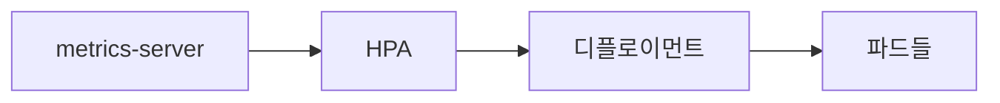

# HPA

## 이 글에서 다룰 문제

- 트래픽이 바뀔 때마다 사람이 직접 파드 수를 조절하면 왜 느리고 비싸질까요?
- HPA는 어떤 지표를 보고 스케일 아웃과 스케일 인을 결정할까요?
- resource requests가 없으면 HPA가 왜 제대로 동작하지 않을까요?
- metrics-server와 커스텀 지표는 어떤 순서로 이해해야 할까요?
- HPA와 Cluster Autoscaler는 왜 함께 봐야 할까요?

> Kubernetes 101 시리즈 (8/10)
>
> 핵심 질문: 트래픽 변화에 따라 파드 수를 사람이 직접 늘리고 줄여야 할까요?

애플리케이션 부하는 하루 종일 일정하지 않습니다. 출근 시간에 요청이 몰릴 수도 있고, 야간에는 한가할 수도 있습니다. 이런 변화를 운영자가 수동으로 따라가면 대응은 늦고, 여유 있게 많이 띄워 두면 비용은 계속 낭비됩니다.

HPA(HorizontalPodAutoscaler)는 이 문제를 해결하기 위해 파드 수를 자동으로 조절합니다. 다만 “CPU가 높으면 늘린다” 정도로만 이해하면 금방 한계에 부딪힙니다. 어떤 기준값을 쓰는지, 지표가 어디서 오는지, 노드가 부족할 때는 어떻게 되는지까지 함께 알아야 실제 운영에서 쓸 수 있습니다.

## 왜 중요한가

수동 스케일링은 항상 한 박자 늦습니다. 이미 응답 시간이 느려진 뒤에 파드를 늘리거나, 반대로 한가한 시간에도 파드를 줄이지 못해 비용을 계속 지불하게 됩니다.

HPA는 현재 부하를 기준으로 파드 수를 조절해 가용성과 비용 사이 균형을 맞춥니다. 물론 만능은 아닙니다. 지표가 부정확하면 엉뚱하게 동작할 수 있고, 파드를 늘려도 노드가 부족하면 실제 스케일은 진행되지 않습니다. 그래서 HPA는 지표와 클러스터 용량을 같이 봐야 합니다.

## 한눈에 보는 구조



HPA는 metrics-server나 외부 메트릭 시스템에서 값을 읽고, Deployment의 replica 수를 조절합니다. 결국 HPA는 파드를 직접 관리한다기보다 Deployment의 원하는 개수를 바꾸는 자동화 계층이라고 보는 편이 정확합니다.

## 핵심 용어

- HPA: 파드 개수를 자동으로 조절하는 오토스케일러입니다.
- metrics-server: CPU, 메모리 같은 기본 메트릭을 수집하는 구성요소입니다.
- target utilization: requests 대비 목표 사용률입니다.
- custom metric: 큐 길이, 요청 수처럼 외부에서 가져오는 지표입니다.
- VPA: 파드 수가 아니라 파드 하나의 자원 요청값을 조절하는 도구입니다.

## 적용 전후 달라지는 점

HPA가 없으면 피크 시간에 503이 늘어나거나, 반대로 한가한 시간에도 파드가 계속 많이 떠 있어 비용이 낭비됩니다. 운영자는 트래픽 패턴을 보고 수동으로 값을 바꿔야 합니다.

HPA를 두면 현재 부하에 맞춰 파드 수를 자동으로 조절할 수 있습니다. 물론 완전 자동이라는 말에 기대기보다, 어떤 지표를 믿을지와 최대·최소 파드 수를 어떻게 잡을지가 더 중요합니다.

## 단계별 실습

### 1단계 — Deployment에 자원 요청 설정

```python
"""
spec:
  template:
    spec:
      containers:
      - name: app
        image: myorg/app:1.0
        resources:
          requests: {cpu: 200m, memory: 256Mi}
"""
```

HPA가 CPU 사용률을 계산하려면 기준점이 필요합니다. 그 기준이 바로 requests입니다. requests가 없으면 사용률 비율을 제대로 계산할 수 없습니다.

### 2단계 — HPA manifest 작성

```python
"""
apiVersion: autoscaling/v2
kind: HorizontalPodAutoscaler
metadata: {name: web}
spec:
  scaleTargetRef:
    apiVersion: apps/v1
    kind: Deployment
    name: web
  minReplicas: 2
  maxReplicas: 10
  metrics:
  - type: Resource
    resource:
      name: cpu
      target: {type: Utilization, averageUtilization: 60}
"""
```

이 설정은 평균 CPU 사용률이 requests 대비 60% 수준을 유지하도록 파드 수를 조절합니다. `minReplicas: 2`는 가용성의 최소선이고, `maxReplicas: 10`은 비용과 용량의 상한선입니다.

### 3단계 — 적용

```python
import subprocess

def apply(path):
    subprocess.run(["kubectl", "apply", "-f", path], check=True)
```

HPA를 적용한 뒤에는 리소스가 생성됐다는 사실보다 메트릭이 실제로 들어오는지 확인하는 편이 더 중요합니다. 리소스만 있고 메트릭이 없으면 자동화는 멈춰 있습니다.

### 4단계 — 부하 발생

```python
def load(target):
    subprocess.run([
        "kubectl", "run", "load", "--rm", "-i", "--restart=Never",
        "--image=busybox", "--", "sh", "-c",
        f"while true; do wget -q -O- {target}; done",
    ], check=False)
```

인위적으로 부하를 만들어 보면 HPA가 실제로 스케일 아웃하는지 확인할 수 있습니다. 테스트 없이 운영에 바로 적용하면 기준값이 너무 높거나 낮은 상태로 오래 남기 쉽습니다.

### 5단계 — HPA 상태 확인

```python
def hpa_status(name):
    res = subprocess.run(
        ["kubectl", "get", "hpa", name, "-o", "wide"],
        capture_output=True, text=True, check=True,
    )
    return res.stdout
```

현재 메트릭, 목표값, 최소·최대 replica, 실제 replica 수를 함께 확인해야 합니다. HPA는 숫자를 자동으로 바꾸는 기능이므로, 상태 조회가 곧 디버깅의 출발점입니다.

## 이 코드에서 봐야 할 포인트

- requests가 없으면 HPA는 제대로 계산할 기준이 없습니다.
- `averageUtilization`은 절대값이 아니라 requests 대비 비율입니다.
- `minReplicas >= 2`는 고가용성의 시작점입니다.
- 파드를 늘릴 수 있어도 노드가 부족하면 실제 스케일은 막힐 수 있습니다.

## 자주 하는 실수 5가지

1. requests를 설정하지 않아 메트릭이 0%처럼 보이거나 계산이 꼬입니다.
2. maxReplicas를 너무 낮게 잡아 피크 트래픽을 못 받습니다.
3. 기본 메트릭 검증도 없이 커스텀 지표부터 붙입니다.
4. 노드 한계를 보지 않아 HPA가 늘리려 해도 실제 파드가 뜨지 않습니다.
5. 스케일 인과 스케일 아웃이 너무 자주 반복되는 플래핑을 방치합니다.

## 실무에서는 이렇게 본다

실무에서는 HPA와 Cluster Autoscaler를 함께 둬서 파드 수 증가가 노드 수 증가로 이어지게 만드는 경우가 많습니다. 파드는 늘리고 싶은데 노드 자리가 없으면 오토스케일링의 절반만 동작하는 셈이기 때문입니다.

또한 커스텀 지표는 처음부터 욕심내지 않는 편이 좋습니다. CPU와 메모리처럼 이해하기 쉬운 기준으로 먼저 안정성을 확인한 뒤, 큐 길이, 초당 요청 수, 지연 시간 같은 서비스별 지표로 넓혀 가는 흐름이 보통 더 안전합니다.

## 체크리스트

- [ ] requests를 설정했는가
- [ ] minReplicas를 2 이상으로 두었는가
- [ ] Cluster Autoscaler와의 조합을 검토했는가
- [ ] 플래핑 여부를 모니터링하고 있는가

## 연습 문제

1. requests가 없으면 HPA가 왜 실패하는지 한 줄로 설명해 보세요.
2. VPA와 HPA의 차이를 한 줄로 정리해 보세요.
3. Cluster Autoscaler의 역할을 한 줄로 적어 보세요.

## 정리와 다음 글

HPA는 메트릭을 바탕으로 Deployment의 replica 수를 자동 조절하는 도구입니다. 하지만 자동화의 품질은 메트릭 품질과 자원 요청 설정에 달려 있습니다. requests, 적절한 최소·최대 replica, 노드 오토스케일링까지 함께 맞춰야 운영에서 기대한 효과를 얻을 수 있습니다.

다음 글에서는 이렇게 늘고 줄어드는 워크로드를 더 반복 가능하게 배포하기 위한 패키징 단위를 보겠습니다. 주제는 Helm입니다.

<!-- toc:begin -->
- [Kubernetes란 무엇인가?](./01-what-is-kubernetes.md)
- [Pod](./02-pod.md)
- [Deployment](./03-deployment.md)
- [Service](./04-service.md)
- [Ingress](./05-ingress.md)
- [ConfigMap과 Secret](./06-configmap-and-secret.md)
- [Volume](./07-volume.md)
- **HPA (현재 글)**
- Helm (예정)
- 운영 관점의 Kubernetes (예정)
<!-- toc:end -->

## 참고 자료

- [HorizontalPodAutoscaler](https://kubernetes.io/docs/tasks/run-application/horizontal-pod-autoscale/)
- [metrics-server](https://github.com/kubernetes-sigs/metrics-server)
- [Cluster Autoscaler](https://github.com/kubernetes/autoscaler/tree/master/cluster-autoscaler)
- [VPA](https://github.com/kubernetes/autoscaler/tree/master/vertical-pod-autoscaler)

Tags: Kubernetes, HPA, Autoscaling, Metrics, DevOps
