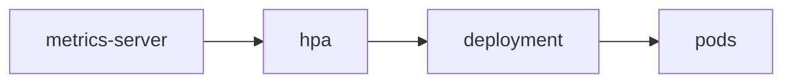

# HPA

트래픽은 하루 종일 일정하지 않습니다. 어떤 시간에는 요청이 몰리고, 어떤 시간에는 거의 비어 있습니다. 이런 변화를 운영자가 수동으로 따라가면 대응은 늘 늦고, 넉넉하게 파드를 띄워 두면 비용이 계속 낭비됩니다.

이 글은 Kubernetes 101 시리즈의 8번째 글입니다.

여기서는 HPA를 단순히 CPU가 높으면 파드를 늘리는 기능이 아니라, 메트릭을 기준으로 Deployment의 원하는 개수를 자동 조절하는 운영 자동화 계층이라는 관점에서 정리하겠습니다.

## 이 글에서 다룰 문제

> HPA는 메트릭을 읽어 Deployment의 replica 수를 자동으로 바꾸며, 이 자동화의 품질은 requests 설정과 메트릭 신뢰도에 크게 좌우됩니다.

- 트래픽이 바뀔 때마다 사람이 직접 파드 수를 조절하면 왜 느리고 비싸질까요?
- HPA는 어떤 지표를 보고 스케일 아웃과 스케일 인을 결정할까요?
- resource requests가 없으면 왜 제대로 동작하지 않을까요?
- metrics-server와 커스텀 지표는 어떤 순서로 이해하는 편이 좋을까요?
- HPA와 Cluster Autoscaler는 왜 함께 봐야 할까요?

## 왜 중요한가

수동 스케일링은 거의 항상 한 박자 늦습니다. 이미 응답 시간이 나빠진 뒤에 파드를 늘리거나, 한가한 시간에도 그대로 둬서 비용을 낭비하기 쉽습니다. 운영자가 직접 숫자를 바꾸는 방식은 규모가 커질수록 더 취약해집니다.

HPA는 이 문제를 메트릭 기반 자동화로 줄입니다. 다만 자동화라고 해서 무조건 똑똑한 것은 아닙니다. 기준 지표가 부정확하면 엉뚱한 결정을 내릴 수 있고, 파드를 늘려도 노드가 부족하면 실제 스케일은 진행되지 않습니다. 그래서 HPA는 메트릭과 클러스터 용량을 함께 봐야 합니다.

## 한눈에 보는 구조



HPA는 파드를 직접 만들고 지우기보다 Deployment의 원하는 개수를 조정합니다. 즉, 자동 스케일링의 판단 계층이라고 보는 편이 더 정확합니다. 뒤의 실제 파드 생성과 유지 작업은 여전히 Deployment가 맡습니다.

## 핵심 용어

- HPA: 파드 개수를 자동으로 조절하는 오토스케일러입니다.
- metrics-server: CPU, 메모리 같은 기본 메트릭을 수집하는 구성요소입니다.
- 목표 사용률: requests 대비 목표 CPU 또는 메모리 비율입니다.
- 커스텀 메트릭: 큐 길이, 요청 수 같은 외부 지표입니다.
- VPA: 파드 수가 아니라 파드 하나의 자원 요청값을 조절하는 도구입니다.

## 도입 전과 후

HPA가 없으면 피크 시간에는 503이 늘어나고, 한가한 시간에는 파드가 과하게 떠 있을 수 있습니다. 운영자는 트래픽 패턴을 보고 수동으로 replicas를 바꿔야 합니다.

HPA를 두면 현재 부하에 맞춰 파드 수를 자동으로 조절할 수 있습니다. 물론 자동화의 핵심은 기능 자체보다 기준값과 한계값을 어떻게 잡느냐에 있습니다. 최소 개수, 최대 개수, 메트릭 품질이 함께 맞아야 기대한 효과가 납니다.

## 단계별로 CPU 기반 HPA 구성하기

### 1단계 — Deployment에 자원 요청 설정

```python
"""
spec:
  template:
    spec:
      containers:
      - name: app
        image: myorg/app:1.0
        resources:
          requests: {cpu: 200m, memory: 256Mi}
"""
```

HPA가 CPU 사용률을 계산하려면 기준점이 필요합니다. 그 기준이 바로 requests입니다. requests가 없으면 사용률 비율을 계산할 수 없어서 자동화가 기대한 대로 움직이지 않습니다.

### 2단계 — HPA 매니페스트 작성

```python
"""
apiVersion: autoscaling/v2
kind: HorizontalPodAutoscaler
metadata: {name: web}
spec:
  scaleTargetRef:
    apiVersion: apps/v1
    kind: Deployment
    name: web
  minReplicas: 2
  maxReplicas: 10
  metrics:
  - type: Resource
    resource:
      name: cpu
      target: {type: Utilization, averageUtilization: 60}
"""
```

이 설정은 평균 CPU 사용률이 requests 대비 60% 수준을 유지하도록 파드 수를 조절합니다. `minReplicas: 2`는 가용성의 시작점이고, `maxReplicas: 10`은 비용과 용량의 상한선입니다.

### 3단계 — 적용

```python
import subprocess

def apply(path):
    subprocess.run(["kubectl", "apply", "-f", path], check=True)
```

리소스를 적용했다고 끝난 것은 아닙니다. HPA는 메트릭이 실제로 들어오는지 확인해야 비로소 의미가 있습니다. 객체가 있어도 메트릭이 없으면 자동화는 멈춰 있습니다.

### 4단계 — 부하 만들기

```python
def load(target):
    subprocess.run([
        "kubectl", "run", "load", "--rm", "-i", "--restart=Never",
        "--image=busybox", "--", "sh", "-c",
        f"while true; do wget -q -O- {target}; done",
    ], check=False)
```

테스트 부하를 만들어 보면 HPA가 실제로 스케일 아웃하는지 확인할 수 있습니다. 기준값을 검증하지 않고 운영에 바로 넣으면 너무 늦거나 너무 민감한 자동화가 오래 남기 쉽습니다.

### 5단계 — HPA 상태 확인

```python
def hpa_status(name):
    res = subprocess.run(
        ["kubectl", "get", "hpa", name, "-o", "wide"],
        capture_output=True, text=True, check=True,
    )
    return res.stdout
```

현재 메트릭, 목표값, 최소·최대 replicas, 실제 replicas를 함께 봐야 합니다. HPA는 숫자를 자동으로 바꾸는 기능이므로 상태 조회가 곧 디버깅의 출발점입니다.

## 이 코드에서 먼저 봐야 할 점

- requests가 없으면 HPA는 계산 기준을 잃습니다.
- `averageUtilization`은 절대값이 아니라 requests 대비 비율입니다.
- `minReplicas >= 2`는 고가용성의 시작점입니다.

이 세 가지를 놓치면 HPA를 켰는데도 왜 반응하지 않는지, 혹은 왜 과하게 반응하는지 이해하기 어렵습니다. 자동화는 숫자를 어떻게 읽는지부터 봐야 합니다.

## 자주 하는 실수 다섯 가지

1. requests를 설정하지 않아 메트릭 계산이 꼬입니다.
2. `maxReplicas`를 너무 낮게 잡아 피크 트래픽을 못 받습니다.
3. 기본 메트릭 검증도 없이 커스텀 지표부터 붙입니다.
4. 노드 한계를 보지 않아 HPA가 늘리려 해도 파드가 뜨지 않습니다.
5. 플래핑을 방치해 비용과 안정성을 함께 잃습니다.

## 실무에서는 이렇게 봅니다

실무에서는 HPA와 Cluster Autoscaler를 함께 둬서 파드 증가가 노드 증가로 이어지게 만드는 경우가 많습니다. 파드를 늘리고 싶어도 노드 자리가 없으면 자동화의 절반만 동작하는 셈이기 때문입니다.

시니어 엔지니어는 커스텀 메트릭을 처음부터 욕심내지 않습니다. CPU와 메모리처럼 이해하기 쉬운 기준으로 먼저 안정성을 확인한 뒤, 큐 길이와 요청 수 같은 서비스별 지표로 넓혀 가는 흐름이 더 안전합니다.

## 체크리스트

- [ ] requests를 설정했는가
- [ ] `minReplicas`를 2 이상으로 둘지 검토했는가
- [ ] Cluster Autoscaler와의 조합을 검토했는가
- [ ] 플래핑 여부를 모니터링하고 있는가

## 연습 문제

1. requests가 없으면 HPA가 왜 실패하는지 한 줄로 설명해 보세요.
2. VPA와 HPA의 차이를 한 줄로 정리해 보세요.
3. Cluster Autoscaler의 역할을 한 줄로 적어 보세요.

## 마무리와 다음 글

이 글에서는 HPA를 메트릭 기반으로 Deployment의 replica 수를 자동 조절하는 계층으로 정리했습니다. 자동화의 품질은 requests 설정, 메트릭 신뢰도, 노드 확장 전략에 달려 있다는 점도 함께 봤습니다.

다음 글에서는 이렇게 늘고 줄어드는 워크로드를 더 반복 가능하게 배포하기 위한 패키징 단위, Helm을 보겠습니다.

<!-- toc:begin -->
- [Kubernetes란 무엇인가?](./01-what-is-kubernetes.md)
- [Pod](./02-pod.md)
- [Deployment](./03-deployment.md)
- [Service](./04-service.md)
- [Ingress](./05-ingress.md)
- [ConfigMap과 Secret](./06-configmap-and-secret.md)
- [Volume](./07-volume.md)
- **HPA (현재 글)**
- Helm (예정)
- 운영 관점의 Kubernetes (예정)
<!-- toc:end -->

## 참고 자료

- [HorizontalPodAutoscaler](https://kubernetes.io/docs/tasks/run-application/horizontal-pod-autoscale/)
- [metrics-server](https://github.com/kubernetes-sigs/metrics-server)
- [Cluster Autoscaler](https://github.com/kubernetes/autoscaler/tree/master/cluster-autoscaler)
- [VPA](https://github.com/kubernetes/autoscaler/tree/master/vertical-pod-autoscaler)

Tags: Kubernetes, HPA, Autoscaling, Metrics, DevOps
