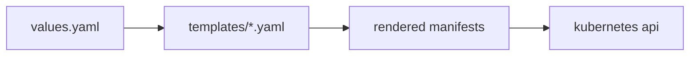

# Helm

> Kubernetes 101 시리즈 (9/10)

<!-- a-grade-intro:begin -->

**핵심 질문**: *수십 개* 의 *manifest* 를 *환경* 별로 *복붙* 해야 할까요?

> *Helm* 이 *차트* 라는 *패키지 단위* 로 *템플릿* 과 *값* 을 분리합니다.

<!-- a-grade-intro:end -->

## 이 글에서 배울 것

- *Chart* 의 구성
- *values.yaml* 사용법
- *install / upgrade / rollback*
- *Repo* 와 *dependency*
- *helm template* 의 역할

## 왜 중요한가

*환경별* *복붙* 은 *드리프트* 를 만듭니다. *Helm* 으로 *값* 만 바꿔서 *동일 템플릿* 을 재사용합니다.

## 개념 한눈에 보기



## 핵심 용어 정리

- **Chart**: *Helm* 의 *패키지* 단위.
- **values.yaml**: *기본값* 모음.
- **release**: *차트* 의 *설치 인스턴스*.
- **repository**: *차트* 의 *배포 채널*.
- **dependency**: *서브차트* 의존성.

## Before/After

**Before**: *dev/stage/prod* 별 *YAML 사본* 3 벌.

**After**: 하나의 *Chart* + *환경별 values*.

## 실습: 간단한 Chart

### 1단계 — Chart 생성

```python
import subprocess

def create(name):
    subprocess.run(["helm", "create", name], check=True)
```

### 2단계 — values.yaml

```python
"""
replicaCount: 2
image:
  repository: myorg/app
  tag: "1.0"
service:
  type: ClusterIP
  port: 80
"""
```

### 3단계 — install

```python
def install(release, chart, values):
    subprocess.run(
        ["helm", "install", release, chart, "-f", values],
        check=True,
    )
```

### 4단계 — upgrade

```python
def upgrade(release, chart, values):
    subprocess.run(
        ["helm", "upgrade", release, chart, "-f", values, "--atomic"],
        check=True,
    )
```

### 5단계 — rollback

```python
def rollback(release, revision):
    subprocess.run(
        ["helm", "rollback", release, str(revision)],
        check=True,
    )
```

## 이 코드에서 주목할 점

- *--atomic* 은 *실패 시 자동 롤백*.
- *helm template* 으로 *렌더 결과* 를 *미리 검증*.
- *values* 는 *환경별 분리*, *Chart* 는 *공유*.

## 자주 하는 실수 5가지

1. ***values* 와 *Chart* 를 *같은 파일* 에 섞기.**
2. ***민감 정보* 를 *values* 에 *평문* 으로.**
3. ***버전 핀* 없이 *latest* 사용.**
4. ***rollback* 절차 미숙지.**
5. ***dependency* 의 *update* 누락.**

## 실무에서는 이렇게 쓰입니다

*GitOps* 와 결합하여 *values* 변경만으로 *PR* 기반 배포가 이루어집니다.

## 시니어 엔지니어는 이렇게 생각합니다

- *Chart* 는 *공통 계약*.
- *values* 는 *환경 차이* 만.
- *--atomic* 은 *야간 배포의 안전벨트*.
- *rollback* 은 *훈련* 이 필요.
- *Secret* 은 *외부 매니저* 에 위임.

## 체크리스트

- [ ] *Chart* 와 *values* 분리.
- [ ] *버전 핀*.
- [ ] *--atomic* 사용.
- [ ] *Secret* 외부화.

## 연습 문제

1. *helm template* 의 *용도* 한 줄로.
2. *values* 와 *Chart* 의 *책임 차이* 한 줄로.
3. *--atomic* 이 *왜* 안전한지 한 줄로.

## 정리 및 다음 단계

배포 단위가 잡혔으면 마지막으로 *운영 관점* 을 봅니다. 다음 글은 *운영 관점의 Kubernetes*.

<!-- toc:begin -->
- [Kubernetes란 무엇인가?](./01-what-is-kubernetes.md)
- [Pod](./02-pod.md)
- [Deployment](./03-deployment.md)
- [Service](./04-service.md)
- [Ingress](./05-ingress.md)
- [ConfigMap과 Secret](./06-configmap-and-secret.md)
- [Volume](./07-volume.md)
- [HPA](./08-hpa.md)
- **Helm (현재 글)**
- 운영 관점의 Kubernetes (예정)
<!-- toc:end -->

## 참고 자료

- [Helm 공식 문서](https://helm.sh/docs/)
- [Chart 구조](https://helm.sh/docs/topics/charts/)
- [Helm best practices](https://helm.sh/docs/chart_best_practices/)
- [Artifact Hub](https://artifacthub.io/)

Tags: Kubernetes, Helm, Chart, PackageManager, DevOps
