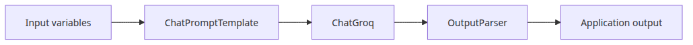
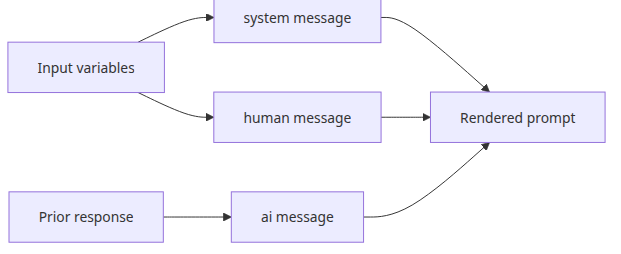
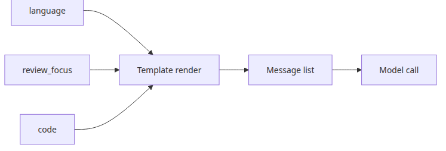
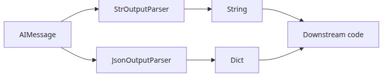
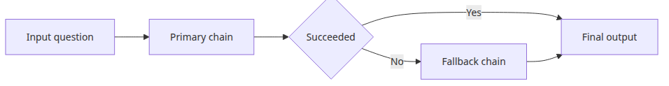

# Prompt and LLM chain — assembling your first chain

Once LCEL makes sense, the next question is where the real chain logic actually lives. In practice, that usually means prompt construction, output parsing, and the small input-shaping decisions that determine whether the rest of the pipeline stays readable.

This is the second post in the LangChain 101 series. It shows how prompt templates, parsers, and passthrough steps turn LCEL basics into a practical first chain.

## Questions this post answers

- How do `system` and `human` messages divide responsibility in `ChatPromptTemplate`
- How should you model prompts that need multiple input variables
- When is `StrOutputParser` enough, and when do you need structured parsing
- How do you forward part of the input unchanged through a chain

> A prompt chain is not string concatenation with extra steps; it is a typed conversion from app inputs into model-ready messages.


*Questions this post answers*
## Minimal runnable example

```python
import os

from langchain_core.output_parsers import StrOutputParser
from langchain_core.prompts import ChatPromptTemplate
from langchain_groq import ChatGroq

prompt = ChatPromptTemplate.from_messages([
    ("system", "You are a tutor explaining concepts to {audience}."),
    ("human", "Explain {topic} in three sentences."),
])
chain = prompt | ChatGroq(model="llama-3.1-8b-instant", api_key=os.environ["GROQ_API_KEY"]) | StrOutputParser()

print(chain.invoke({"audience": "junior backend engineers", "topic": "PromptTemplate"}))
```

<!-- injected-output:start -->
**Output**

    In the context of OpenAI's API, a PromptTemplate is a pre-defined template used to generate human-like responses by providing a framework for constructing input prompts. By using a PromptTemplate, developers can create a structure for their input, including placeholders for specific information that can be filled in at runtime. This approach enables the model to generate more accurate and relevant responses by leveraging the context provided in the template.

<!-- injected-output:end -->

## The flow at a glance



*The flow at a glance*
Post 1 established the LCEL structure. This post builds on it with the patterns that appear most often in real code: multi-variable prompt templates, output parser selection, and passing values through a chain unchanged.

Topics:

- the message roles in `ChatPromptTemplate`
- building prompts with multiple variables
- choosing between `StrOutputParser` and `JsonOutputParser`
- using `RunnablePassthrough` to forward inputs unchanged
- testing a completed chain

---

## ChatPromptTemplate structure



*System human ai message roles*
`ChatPromptTemplate` constructs conversation-style prompts and renders them into the message format the LLM expects.

Three message roles are available:

- `system`: sets the model's behavior — persona, constraints, output format
- `human`: represents user input
- `ai`: represents previous assistant responses, used to inject conversation history in multi-turn setups

```python
import os

from langchain_core.prompts import ChatPromptTemplate
from langchain_groq import ChatGroq

prompt = ChatPromptTemplate.from_messages([
    ("system", "You are a {language} expert. Explain things clearly and concisely."),
    ("human", "{question}"),
])

llm = ChatGroq(
    model="llama-3.1-8b-instant",
    api_key=os.environ["GROQ_API_KEY"],
)

chain = prompt | llm

response = chain.invoke({
    "language": "Python",
    "question": "When is a list comprehension a better choice than a for loop?",
})

print(response.content)
```

<!-- injected-output:start -->
**Output**

    **List Comprehensions vs For Loops**

    List comprehensions and for loops are both used to create lists in Python, but they serve different purposes and have different use cases.

    **When to Use List Comprehensions:**

    1. **Concise Code:** List comprehensions are a more concise way to create lists, especially when the transformation of each element is simple.
    2. **Performance:** List comprehensions are generally faster than for loops because they create a new list in a single operation.
    3. **Readability:** List comprehensions can be more readable than for loops when the transformation of each element is complex, as they avoid the need for explicit loop control.

    **When to Use For Loops:**

    1. **Mutation:** If the list needs to be modified in place, a for loop is usually a better choice.
    2. **Complex Logic:** When the logic for creating each element is complex and involves multiple conditional statements or functions, a for loop is often easier to read and understand.
    3. **Debugging:** For loops provide more control over the loop and are often easier to debug than list comprehensions.

    **Example Use Cases:**

    ```python
    # List comprehension
    numbers = [1, 2, 3, 4, 5]
    squared_numbers = [x**2 for x in numbers]
    print(squared_numbers)  # [1, 4, 9, 16, 25]

    # For loop equivalent
    numbers = [1, 2, 3, 4, 5]
    squared_numbers = []
    for x in numbers:
        squared_numbers.append(x**2)
    print(squared_numbers)  # [1, 4, 9, 16, 25]
    ```

    In this example, the list comprehension is a better choice because it is more concise and easier to read.

    ```python
    # For loop with mutation
    numbers = [1, 2, 3, 4, 5]
    numbers = [x**2 for x in numbers]
    print(numbers)  # [1, 4, 9, 16, 25]
    ```

    In this example, the for loop is a better choice because it allows us to modify the original list in place.

    In summary, list comprehensions are a better choice when you need to create a new list and the transformation of each element is simple. For loops are a better choice when the list needs to be modified in place, or when the logic for creating each element is complex.

<!-- injected-output:end -->

Placeholder names like `{language}` and `{question}` must match the keys in the dict passed to `invoke()`.

---

## Prompts with multiple variables



*Multiple variables into one prompt*
More complex tasks need more template variables. Pass them all in the same dict.

```python
import os

from langchain_core.output_parsers import StrOutputParser
from langchain_core.prompts import ChatPromptTemplate
from langchain_groq import ChatGroq

prompt = ChatPromptTemplate.from_messages([
    (
        "system",
        "You are a code review expert. "
        "Language: {language}. Review focus: {review_focus}.",
    ),
    ("human", "Review the following code:\n\n```{language}\n{code}\n```"),
])

llm = ChatGroq(
    model="llama-3.1-8b-instant",
    api_key=os.environ["GROQ_API_KEY"],
)

chain = prompt | llm | StrOutputParser()

result = chain.invoke({
    "language": "python",
    "review_focus": "readability and error handling",
    "code": """
def read_file(path):
    f = open(path)
    return f.read()
""",
})

print(result)
```

---

## StrOutputParser vs JsonOutputParser



*String parser and JSON parser outputs*
Output parsers convert the LLM response into the format you need.

**StrOutputParser**: extracts `AIMessage.content` as a plain string. This covers most use cases.

**JsonOutputParser**: prompts the model to output JSON and parses the result into a Python dict. The prompt must explicitly request JSON format.

```python
import os

from langchain_core.output_parsers import JsonOutputParser
from langchain_core.prompts import ChatPromptTemplate
from langchain_groq import ChatGroq

prompt = ChatPromptTemplate.from_messages([
    (
        "system",
        "You output JSON only. Do not include any other text.",
    ),
    (
        "human",
        "Output information about {topic} in this JSON format:\n"
        '{{"name": "name", "description": "description", "use_case": "use case"}}',
    ),
])

llm = ChatGroq(
    model="llama-3.1-8b-instant",
    api_key=os.environ["GROQ_API_KEY"],
)

chain = prompt | llm | JsonOutputParser()

result = chain.invoke({"topic": "FAISS"})

print(f"type: {type(result)}")
print(f"name: {result.get('name')}")
print(f"description: {result.get('description')}")
print(f"use_case: {result.get('use_case')}")
```

<!-- injected-output:start -->
**Output**

    type: <class 'dict'>
    name: FAISS
    description: Facebook AI Similarity Search is an open-source library for efficient similarity search and clustering of dense vectors, written in C++ with optional Python bindings.
    use_case: ['Anomaly detection in high-dimensional data', 'Image and video search', 'Recommendation systems', 'Clustering and dimensionality reduction', 'Nearest neighbor search in large datasets']

<!-- injected-output:end -->

If JSON parsing is unreliable, `with_structured_output()` is more robust. That method is covered in the llm-api-production-101 series.

---

## RunnablePassthrough — forwarding inputs unchanged

`RunnablePassthrough` passes its input through to the next step without modification. It becomes useful when one part of a chain needs data from a previous step that was not modified along the way.

```python
import os

from langchain_core.output_parsers import StrOutputParser
from langchain_core.prompts import ChatPromptTemplate
from langchain_core.runnables import RunnablePassthrough
from langchain_groq import ChatGroq

prompt = ChatPromptTemplate.from_messages([
    ("system", "Answer the question using the provided document."),
    ("human", "Document: {context}\n\nQuestion: {question}"),
])

llm = ChatGroq(
    model="llama-3.1-8b-instant",
    api_key=os.environ["GROQ_API_KEY"],
)

chain = prompt | llm | StrOutputParser()

result = chain.invoke({
    "context": "FAISS is a vector search library developed at Facebook AI Research.",
    "question": "Who developed FAISS?",
})

print(result)
```

<!-- injected-output:start -->
**Output**

    FAISS was developed at Facebook AI Research.

<!-- injected-output:end -->

`RunnablePassthrough` appears most often when connecting a Retriever to a prompt. Post 3 shows that pattern in detail.

---

## Adding a fallback to a chain



*Primary failure and fallback switch*
`.with_fallbacks()` runs an alternative chain when the primary call fails.

```python
import os

from langchain_core.output_parsers import StrOutputParser
from langchain_core.prompts import ChatPromptTemplate
from langchain_groq import ChatGroq

prompt = ChatPromptTemplate.from_messages([
    ("human", "{question}"),
])

primary_llm = ChatGroq(
    model="llama-3.1-8b-instant",
    api_key=os.environ["GROQ_API_KEY"],
)

fallback_llm = ChatGroq(
    model="llama-3.1-8b-instant",
    api_key=os.environ["GROQ_API_KEY"],
)

primary_chain = prompt | primary_llm | StrOutputParser()
fallback_chain = prompt | fallback_llm | StrOutputParser()

chain_with_fallback = primary_chain.with_fallbacks([fallback_chain])

result = chain_with_fallback.invoke({"question": "How does Python handle exceptions?"})
print(result)
```

<!-- injected-output:start -->
**Output**

    **Handling Exceptions in Python**
    =====================================

    Python provides a robust exception handling mechanism to deal with runtime errors and other exceptional conditions. Here's an overview of how Python handles exceptions:

    ### Types of Exceptions

    Python has two types of exceptions:

    1.  **Built-in Exceptions**: These are exceptions that are built into the Python language, such as `TypeError`, `ValueError`, `IndexError`, etc.
    2.  **Custom Exceptions**: These are exceptions that are created by the developer to represent specific error conditions in their code.

    ### Exception Handling

    Python uses a `try`-`except` block to handle exceptions. The basic syntax is as follows:

    ```python
    try:
        # Code that might raise an exception
    except ExceptionType:
        # Code to handle the exception
    ```

    Here's an example:

    ```python
    try:
        x = 5 / 0
    except ZeroDivisionError:
        print("Cannot divide by zero!")
    ```

    In this example, the `try` block attempts to divide `5` by `0`, which raises a `ZeroDivisionError`. The `except` block catches this exception and prints an error message.

    ### Multiple Except Blocks

    You can have multiple `except` blocks to handle different types of exceptions:

    ```python
    try:
        x = 5 / 0
    except ZeroDivisionError:
        print("Cannot divide by zero!")
    except TypeError:
        print("Invalid data type!")
    ```

    ### Raising Exceptions

    You can raise exceptions using the `raise` keyword:

    ```python
    def divide(a, b):
        if b == 0:
            raise ZeroDivisionError("Cannot divide by zero!")
        return a / b
    ```

    In this example, the `divide` function raises a `ZeroDivisionError` if the divisor is zero.

    ... (truncated)

<!-- injected-output:end -->

This pattern switches automatically to the fallback model when the primary model is unavailable or rate-limited.

---

## What to notice in this code

- Prompt chains usually take dictionaries as input, and the keys must line up with the variables used in the template.
- Choosing between `StrOutputParser` and `JsonOutputParser` is mostly about what downstream code expects to receive.
- `RunnablePassthrough` matters because it makes data flow explicit even when a value should remain unchanged.
- A fallback is not just defensive code. It is a second chain that preserves the same input and output contract when the primary path fails.

## Where engineers get confused

- If you treat a prompt template as plain string interpolation, you miss the value of role-separated chat messages.
- JSON parsing is only reliable when the prompt strongly constrains the schema the model should emit.
- Fallback chains become hard to debug if they return a different shape from the primary chain.

## Checklist

- [ ] I can build a dictionary input for a `ChatPromptTemplate` with multiple variables
- [ ] I know when `StrOutputParser` is enough and when structured parsing is worth the extra constraint
- [ ] I understand why fallback chains must preserve the same output shape

## Conclusion

You can now build prompt templates with multiple variables, select the right output parser for the job, and pass inputs unchanged when a chain step needs earlier data.

The next post connects a Retriever to a chain and uses retrieved document chunks as context for the LLM.

<!-- toc:begin -->
## In this series

- [LangChain introduction — LCEL and the Runnable interface](./01-lcel-runnable-basics.md)
- **Prompt and LLM chain — assembling your first chain (current)**
- Retriever — document search and context injection (upcoming)
- Tool calling — connecting external tools (upcoming)
- Streaming — handling real-time output (upcoming)
- Putting it together — a complete chain in one file (upcoming)

<!-- toc:end -->

---

## References

- [ChatPromptTemplate documentation](https://python.langchain.com/docs/modules/model_io/prompts/quick_start/)
- [Output parsers](https://python.langchain.com/docs/modules/model_io/output_parsers/)
- [RunnablePassthrough](https://python.langchain.com/docs/expression_language/primitives/passthrough/)

Tags: LangChain, LCEL, Python, LLM
