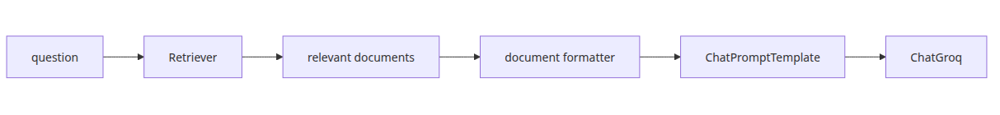
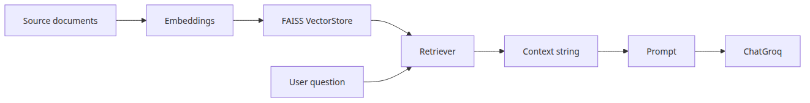
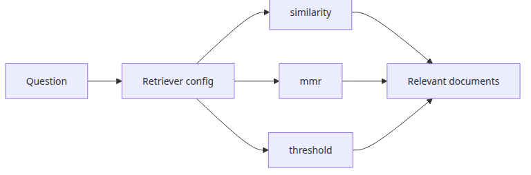
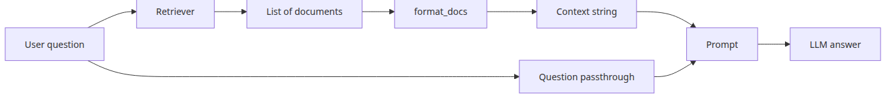

# Retriever — document search and context injection

## Questions this post answers

- Why does LangChain separate a Retriever from the underlying VectorStore
- What input and output contract does `as_retriever()` expose inside a chain
- How should retrieved documents be formatted before they enter the prompt
- How much of RAG quality is determined before the LLM is even called

> A Retriever does not store knowledge by itself; it turns a question into the subset of documents worth showing the model.


## Minimal runnable example

```python
from langchain_community.embeddings import HuggingFaceEmbeddings
from langchain_community.vectorstores import FAISS

embedding = HuggingFaceEmbeddings(model_name="sentence-transformers/all-MiniLM-L6-v2")
vectorstore = FAISS.from_texts([
    "FAISS is a high-speed vector search library.",
    "A Retriever finds documents relevant to a question.",
], embedding)
retriever = vectorstore.as_retriever(search_kwargs={"k": 1})

print(retriever.invoke("What does a Retriever do?")[0].page_content)
```

<!-- injected-output:start -->
**Output**

    A Retriever finds documents relevant to a question.

<!-- injected-output:end -->

## What to notice in this code

- The embedding model turns text into vectors, while the Retriever exposes a query-to-documents interface.
- The rest of the chain only needs to know `question -> list[Document]`.
- Retrieved output is not yet prompt-ready; you still need a formatting step.
- In RAG systems, retrieval quality often matters more than prompt wording at the start.

## Where engineers get confused

- Building a VectorStore does not automatically give you a usable RAG chain.
- Raising `k` is not always better; it often adds noise as well as recall.
- A Retriever does not answer the question. It selects context for the model.

## Checklist

- [ ] I can explain the difference between a VectorStore and a Retriever
- [ ] I can turn `list[Document]` into a context string for a prompt
- [ ] I can connect a Retriever to an LCEL chain

LangChain 101 (3/6)

Example code: [github.com/yeongseon-books/langchain-101](https://github.com/yeongseon-books/langchain-101/tree/main/03-retriever)

## Questions this post answers

- How does a Retriever relate to a VectorStore?
- Which search parameters matter after calling `as_retriever()`?
- What should you watch when turning retrieved documents into prompt context?
- Where does the retriever sit inside a basic RAG chain?

> A Retriever is LangChain's search boundary: it selects relevant documents for a question and hands the next chain step the context needed to answer.

## The flow at a glance


A Retriever accepts a query and returns a list of relevant documents. LangChain defines the Retriever interface around a single method: `get_relevant_documents(query)`. Whatever search system sits behind it — FAISS, Chroma, Elasticsearch — the chain uses it the same way.

This post builds a FAISS-based Retriever, connects it to a prompt, and assembles the basic form of a RAG pattern.

Topics:

- creating a FAISS VectorStore and Retriever
- `as_retriever()` and its search parameters
- connecting a Retriever to a chain
- injecting retrieved documents as context
- combining multiple documents into one context string

---

## Creating a FAISS VectorStore


LangChain's `FAISS` class wraps the FAISS index behind a VectorStore interface. Pass a list of text strings and an embedding model — the class handles the rest.

```bash
pip install langchain langchain-community faiss-cpu sentence-transformers langchain-groq
```

```python
from langchain_community.embeddings import HuggingFaceEmbeddings
from langchain_community.vectorstores import FAISS

embedding_model = HuggingFaceEmbeddings(
    model_name="sentence-transformers/all-MiniLM-L6-v2",
    model_kwargs={"device": "cpu"},
    encode_kwargs={"normalize_embeddings": True},
)

documents = [
    "FAISS is a high-speed vector search library developed at Facebook AI Research.",
    "Cosine similarity measures the directional similarity between two vectors.",
    "Embedding models project text into a high-dimensional vector space.",
    "sentence-transformers specializes in sentence-level embeddings.",
    "Vector search captures semantic similarity that keyword search misses.",
    "RAG combines retrieved documents with an LLM prompt.",
    "Chunking strategies split long documents into embedding-sized units.",
]

vectorstore = FAISS.from_texts(
    texts=documents,
    embedding=embedding_model,
)

print(f"index vector count: {vectorstore.index.ntotal}")
```

<!-- injected-output:start -->
**Output**

    index vector count: 7

<!-- injected-output:end -->

---

## Creating a Retriever


`as_retriever()` wraps the VectorStore in the Retriever interface.

```python
retriever = vectorstore.as_retriever(
    search_type="similarity",  # default: cosine similarity
    search_kwargs={"k": 3},    # number of results to return
)

docs = retriever.invoke("how vector search works")

for i, doc in enumerate(docs):
    print(f"[{i}] {doc.page_content}")
```

Three `search_type` options are available:

- `"similarity"`: cosine similarity, returns top k results
- `"mmr"`: maximal marginal relevance — balances relevance and diversity
- `"similarity_score_threshold"`: returns only documents above a similarity threshold

```python
# MMR — prioritize diversity
retriever_mmr = vectorstore.as_retriever(
    search_type="mmr",
    search_kwargs={"k": 3, "fetch_k": 10, "lambda_mult": 0.5},
)
```

---

## Connecting a Retriever to a chain


The standard RAG pattern: retrieve relevant documents, inject them as context, pass to the LLM.

```python
import os

from langchain_community.embeddings import HuggingFaceEmbeddings
from langchain_community.vectorstores import FAISS
from langchain_core.output_parsers import StrOutputParser
from langchain_core.prompts import ChatPromptTemplate
from langchain_core.runnables import RunnablePassthrough
from langchain_groq import ChatGroq

def format_docs(docs: list) -> str:
    """Combine a list of documents into a single context string."""
    return "\n\n".join(doc.page_content for doc in docs)

embedding_model = HuggingFaceEmbeddings(
    model_name="sentence-transformers/all-MiniLM-L6-v2",
    model_kwargs={"device": "cpu"},
    encode_kwargs={"normalize_embeddings": True},
)

documents = [
    "FAISS is a high-speed vector search library developed at Facebook AI Research.",
    "Cosine similarity measures the directional similarity between two vectors.",
    "Embedding models project text into a high-dimensional vector space.",
    "sentence-transformers specializes in sentence-level embeddings.",
    "Vector search captures semantic similarity that keyword search misses.",
    "RAG combines retrieved documents with an LLM prompt.",
]

vectorstore = FAISS.from_texts(texts=documents, embedding=embedding_model)
retriever = vectorstore.as_retriever(search_kwargs={"k": 3})

prompt = ChatPromptTemplate.from_messages([
    (
        "system",
        "Answer the question using only the provided documents. "
        "If the answer is not in the documents, say you don't know.\n\n"
        "Documents:\n{context}",
    ),
    ("human", "{question}"),
])

llm = ChatGroq(
    model="llama-3.1-8b-instant",
    api_key=os.environ["GROQ_API_KEY"],
)

rag_chain = (
    {
        "context": retriever | format_docs,
        "question": RunnablePassthrough(),
    }
    | prompt
    | llm
    | StrOutputParser()
)

questions = [
    "What is FAISS?",
    "How does the RAG pattern work?",
    "What do embedding models do?",
]

for question in questions:
    print(f"\nquestion: {question}")
    answer = rag_chain.invoke(question)
    print(f"answer: {answer}")
```

<!-- injected-output:start -->
**Output**


    question: What is FAISS?
    answer: FAISS is a high-speed vector search library developed at Facebook AI Research.

    question: How does the RAG pattern work?
    answer: According to the documents, RAG (Retrieval Augmented Generator) combines retrieved documents with an LLM (Large Language Model) prompt, but it doesn't explain the specifics of the pattern.

    question: What do embedding models do?
    answer: Embedding models project text into a high-dimensional vector space.

<!-- injected-output:end -->

The key is the chain input dict:

```python
{
    "context": retriever | format_docs,
    "question": RunnablePassthrough(),
}
```

`retriever | format_docs` receives the query → retrieves relevant documents → combines them into a string. `RunnablePassthrough()` forwards the query unchanged to the `"question"` key.

---

## Saving and reloading a VectorStore


```python
from langchain_community.embeddings import HuggingFaceEmbeddings
from langchain_community.vectorstores import FAISS

embedding_model = HuggingFaceEmbeddings(
    model_name="sentence-transformers/all-MiniLM-L6-v2",
    model_kwargs={"device": "cpu"},
    encode_kwargs={"normalize_embeddings": True},
)

documents = [
    "FAISS is a high-speed vector search library developed at Facebook AI Research.",
    "RAG combines retrieved documents with an LLM prompt.",
]

vectorstore = FAISS.from_texts(texts=documents, embedding=embedding_model)

# save
vectorstore.save_local("faiss_store")
print("saved")

# reload
loaded_store = FAISS.load_local(
    "faiss_store",
    embeddings=embedding_model,
    allow_dangerous_deserialization=True,
)
print(f"reloaded: {loaded_store.index.ntotal} vectors")

# verify
results = loaded_store.similarity_search("vector search", k=1)
print(f"\nresult: {results[0].page_content}")
```

<!-- injected-output:start -->
**Output**

    saved
    reloaded: 2 vectors

    result: FAISS is a high-speed vector search library developed at Facebook AI Research.

<!-- injected-output:end -->

---

## What to notice in this code

- The VectorStore is the storage layer, while the Retriever is the query interface layered on top of it.
- `retriever | format_docs` is the standard LCEL bridge from search results into prompt-ready context.
- `RunnablePassthrough()` preserves the original user question as a separate key so the prompt can see both context and question.
- The save and reload example matters because retrievers usually sit on top of reusable indexes, not one-off in-memory demos.

## Where engineers get confused

- The retriever does not generate the answer. It only selects documents; the LLM still synthesizes the response.
- Poor retrieval quality is often misdiagnosed as a prompt problem. Check chunking, embeddings, and `k` before rewriting the prompt.
- Simple document concatenation can overflow the context window, so `format_docs` is also a control point for length.

## Checklist

- [ ] I can explain the difference between a VectorStore and a Retriever
- [ ] I know which `search_kwargs` values I am likely to tune first
- [ ] I understand why retrieved documents must be formatted before prompt injection

## Conclusion

The Retriever interface abstracts whatever search system sits behind it. The `context: retriever | format_docs, question: RunnablePassthrough()` pattern is the standard structure for RAG chains in LangChain.

The next post covers Tool Calling — how an LLM can call external functions and incorporate their results into its response.

<!-- toc:begin -->
## In this series

- [LangChain introduction — LCEL and the Runnable interface](./01-lcel-runnable-basics.md)
- [Prompt and LLM chain — assembling your first chain](./02-prompt-llm-chain.md)
- **Retriever — document search and context injection (current)**
- Tool calling — connecting external tools (upcoming)
- Streaming — handling real-time output (upcoming)
- Putting it together — a complete chain in one file (upcoming)

<!-- toc:end -->

---

## References

- [LangChain Retriever interface](https://python.langchain.com/docs/modules/data_connection/retrievers/)
- [FAISS VectorStore](https://python.langchain.com/docs/integrations/vectorstores/faiss/)
- [Building a RAG chain](https://python.langchain.com/docs/use_cases/question_answering/)

Tags: LangChain, LCEL, Python, LLM
