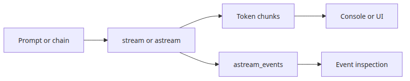

# Streaming — handling real-time output

## Questions this post answers

- How does the return shape change when you switch from `invoke()` to `stream()`
- What is the practical difference between chain streaming and model-only streaming
- When do you need `astream()` or `astream_events()` instead of plain `stream()`
- How should streamed output be forwarded to a UI or API response

> Streaming is not a different chain design; it is a different way of consuming the chain while the model is still generating.


## Minimal runnable example

```python
import os

from langchain_core.output_parsers import StrOutputParser
from langchain_core.prompts import ChatPromptTemplate
from langchain_groq import ChatGroq

chain = (
    ChatPromptTemplate.from_template("Explain {topic} in three sentences.")
    | ChatGroq(model="llama-3.1-8b-instant", api_key=os.environ["GROQ_API_KEY"])
    | StrOutputParser()
)

for chunk in chain.stream({"topic": "astream"}):
    print(chunk, end="", flush=True)
```

~~~
Output
Astream is a free, open-source, and community-driven platform for hosting and monetizing live streams, podcasts, and videos. It offers features such as customizable player designs, real-time chat, and membership programs, allowing creators to engage with their audience and earn revenue. Astream also provides tools for analytics and tracking, making it easier for content creators to analyze their performance and grow their online presence.
~~~

## What to notice in this code

- The chain definition is identical to `invoke()`; only the consumption pattern changes.
- With a parser attached, streaming yields text chunks. Without one, it yields message chunks.
- You can forward chunks immediately to the client or buffer them into a final string.
- Streaming improves perceived latency more than total wall-clock time.

## Where engineers get confused

- Streaming does not guarantee the full response finishes sooner.
- In async applications, `astream()` fits the event loop better than `stream()`.
- When you need lifecycle visibility, `astream_events()` is more useful than raw text chunks.

## Checklist

- [ ] I can consume the output of `stream()` incrementally
- [ ] I understand the difference between text chunks and message chunks
- [ ] I know when to switch to `astream()` in async code

LangChain 101 (5/6)

Example code: [github.com/yeongseon-books/langchain-101](https://github.com/yeongseon-books/langchain-101/tree/main/05-streaming)

## Questions this post answers

- How much code changes when you replace `invoke()` with `stream()`?
- When should you choose `astream()` versus `astream_events()`?
- What pattern works for reassembling streamed chunks into one string?
- What do you need to send streaming output through FastAPI?

> Streaming is not a different chain design. It is the same chain executed in a way that yields partial output instead of waiting for the final string.

## The flow at a glance


When an LLM generates a long response, waiting for the full text before displaying anything makes the experience feel slow. Streaming sends tokens to the output as they are generated. That is what you see in ChatGPT or Claude when text appears character by character.

In LangChain, streaming starts with `stream()`. Chain construction is identical to `invoke()` — only the call method changes.

Topics:

- using `stream()` with an LLM and a chain
- async streaming with `astream()`
- collecting streamed output into a string
- a practical FastAPI streaming endpoint
- `astream_events()` for fine-grained event control

---

## Basic streaming

`stream()` returns a generator. Iterate over it with a `for` loop.

```python
import os

from langchain_core.output_parsers import StrOutputParser
from langchain_core.prompts import ChatPromptTemplate
from langchain_groq import ChatGroq

llm = ChatGroq(
    model="llama-3.1-8b-instant",
    api_key=os.environ["GROQ_API_KEY"],
)

# stream directly from the LLM
print("=== LLM direct streaming ===")
for chunk in llm.stream("List five advantages of Python."):
    print(chunk.content, end="", flush=True)

print("\n\n=== chain streaming ===")
prompt = ChatPromptTemplate.from_messages([
    ("human", "Explain {topic} in three paragraphs."),
])

chain = prompt | llm | StrOutputParser()

for chunk in chain.stream({"topic": "vector search"}):
    print(chunk, end="", flush=True)

print()
```

~~~
Output
=== LLM direct streaming ===
Here are five advantages of Python:

1. **Easy to Learn**: Python has a simple syntax and is relatively easy to learn, making it a great language for beginners. It's also a great language for those who want to learn programming quickly.

2. **High-Level Language**: Python is a high-level language, meaning it abstracts away many low-level details, allowing developers to focus on the logic of their program without worrying about memory management, pointers, etc.

3. **Fast Development**: Python's syntax and nature make it ideal for rapid prototyping and development. It's often used in data science, machine learning, and web development for its ability to quickly develop and test ideas.

4. **Large Community**: Python has a massive and active community, which means there are many resources available for learning and troubleshooting. This also means there are many libraries and frameworks available, making it easier to find the right tool for the job.

5. **Cross-Platform**: Python can run on multiple operating systems, including Windows, macOS, and Linux. This makes it a great choice for projects that need to be deployed on multiple platforms.

These advantages make Python a popular choice for many applications, including data science, machine learning, web development, automation, and more.

=== chain streaming ===
Vector search is an operation used in various applications, including information retrieval, recommendation systems, and natural language processing. It involves comparing a query vector with a set of stored vectors to find the most similar ones. These vectors can represent various types of data, such as text documents, images, or user behavior. The key concept behind vector search is to use a vector space model, where each data item is represented as a set of numerical features or dimensions. This allows for efficient comparison and similarity measurement between vectors.

In traditional search algorithms, such as exact matching or Boolean search, the comparison is typically done using string or keyword matching. However, vector search algorithms focus on the semantic meaning of the data, using techniques like word embeddings (e.g., Word2Vec, GloVe) to map words or phrases into dense vector representations. These vector representations capture the underlying relationships and patterns in the data, enabling more accurate similarity measurements. By computing the similarity between the query vector and the stored vectors, vector search algorithms can retrieve the most relevant and similar data items.

Popular algorithms used for vector search include similarity search (e.g., k-nearest neighbors), indexing techniques (e.g., inverted indexes, hierarchical tree structures), and specialized libraries like Faiss (Facebook AI Similarity Search) or Annoy (Approximate Nearest Neighbors Oh Yeah!). These algorithms and libraries provide efficient and scalable solutions for vector search, allowing applications to handle large datasets and perform complex similarity searches in real-time. By leveraging vector search, developers can build more effective recommendation systems, improve search results, and gain valuable insights from complex data.
~~~

`end=""` and `flush=True` suppress the newline and force immediate output. `StrOutputParser()` extracts the string content from each `AIMessageChunk` during streaming.

---

## Collecting streamed output

When you need the full text after streaming, accumulate chunks in a list.

```python
import os

from langchain_core.output_parsers import StrOutputParser
from langchain_core.prompts import ChatPromptTemplate
from langchain_groq import ChatGroq

llm = ChatGroq(
    model="llama-3.1-8b-instant",
    api_key=os.environ["GROQ_API_KEY"],
)

chain = (
    ChatPromptTemplate.from_messages([("human", "{question}")])
    | llm
    | StrOutputParser()
)

chunks = []
print("streaming: ", end="")
for chunk in chain.stream({"question": "What is FAISS?"}):
    print(chunk, end="", flush=True)
    chunks.append(chunk)

full_text = "".join(chunks)
print(f"\n\ntotal characters: {len(full_text)}")
```

~~~
Output
streaming: FAISS (Facebook AI Similarity Search) is an open-source library developed by Facebook AI Research (FAIR) for efficient similarity search and clustering of dense vectors. It's a widely used tool in the field of natural language processing, computer vision, and machine learning.

FAISS provides a set of optimized algorithms for searching and clustering high-dimensional vectors, such as those generated by word embeddings (e.g., Word2Vec, GloVe), image embeddings (e.g., ResNet), or other deep learning models. Its primary goals are to:

1. **Speed up similarity search**: FAISS achieves this by using techniques like quantization, product quantization, and hierarchical k-means to reduce the dimensionality of the search space.
2. **Improve scalability**: The library is designed to handle massive datasets and can be easily parallelized to take advantage of multi-core processors and distributed computing environments.
3. **Provide a flexible and modular architecture**: FAISS allows users to choose from various indexing algorithms, distance metrics, and clustering techniques to suit their specific use cases.

Some common applications of FAISS include:

1. **Text search**: Efficiently searching for similar documents or sentences in a large corpus.
2. **Image search**: Searching for similar images in a large database, such as in self-driving cars or image classification tasks.
3. **Anomaly detection**: Identifying unusual patterns or outliers in high-dimensional data.
4. **Recommendation systems**: Suggesting relevant items to users based on their past behavior or preferences.
5. **Clustering**: Grouping similar data points into clusters, such as in customer segmentation or market research.

Overall, FAISS is a powerful tool for efficiently searching and clustering high-dimensional vectors, making it a valuable resource for many data-intensive applications.

total characters: 1876
~~~

---

## astream() — async streaming

In async frameworks like FastAPI, use `astream()` with `async for`.

```python
import asyncio
import os

from langchain_core.output_parsers import StrOutputParser
from langchain_core.prompts import ChatPromptTemplate
from langchain_groq import ChatGroq

llm = ChatGroq(
    model="llama-3.1-8b-instant",
    api_key=os.environ["GROQ_API_KEY"],
)

chain = (
    ChatPromptTemplate.from_messages([("human", "Explain {topic} briefly.")])
    | llm
    | StrOutputParser()
)

async def stream_response(topic: str) -> None:
    print(f"streaming: {topic}")
    async for chunk in chain.astream({"topic": topic}):
        print(chunk, end="", flush=True)
    print()

async def main() -> None:
    await stream_response("embedding vectors")
    await stream_response("FAISS indexes")

asyncio.run(main())
```

~~~
Output
streaming: embedding vectors
**Embedding Vectors**

Embedding vectors is a technique used in natural language processing (NLP) and machine learning to represent words, phrases, or other entities as numerical vectors in a high-dimensional space. The goal is to capture the semantic meaning of each entity in a way that allows for efficient comparison and similarity calculation.

**Key Properties:**

1. **Dimensionality Reduction**: Embedding vectors reduce the dimensionality of the input data, making it more manageable for machine learning algorithms.
2. **Semantic Similarity**: Embedding vectors preserve the semantic relationships between entities, allowing for similarity calculations between words or phrases.
3. **Continuous Space**: Embedding vectors are represented in a continuous numerical space, enabling efficient computation and comparison.

**Common Use Cases:**

1. **Word Embeddings**: Represent words in a vector space to capture their semantic meanings and relationships (e.g., Word2Vec, GloVe).
2. **Sentence Embeddings**: Represent sentences or phrases as vectors to capture their meaning and context (e.g., Sentence-BERT).
3. **Image Embeddings**: Represent images as vectors to capture their visual features and similarities (e.g., Convolutional Neural Networks).

**Example:**

Suppose we have two words: "dog" and "cat". A word embedding might represent them as vectors in a 200-dimensional space:

* "dog" → [0.23, 0.56, 0.78, ...]
* "cat" → [0.12, 0.34, 0.92, ...]

The similarity between these vectors can be calculated using various metrics (e.g., cosine similarity), allowing us to determine that "dog" and "cat" are semantically similar.

By representing entities as vectors, embedding vectors provide a powerful tool for NLP and machine learning tasks, enabling efficient comparison and similarity calculations.
streaming: FAISS indexes
FAISS (Facebook AI Similarity Search) is an open-source library developed by Facebook AI Research (FAIR) for efficient similarity search and clustering of dense vectors. It provides a range of algorithms and data structures (indexes) for indexing and searching high-dimensional vectors efficiently.

The most commonly used indexes in FAISS are:

1. **IVF (Inverted File)**: A hierarchical k-means based index, which divides the search space into a hierarchy of clusters. Each cluster is represented by a centroid, and the index is built by storing the centroids and their corresponding clusters.
2. **IVFFLAT (Inverted File with Flat Index)**: A variant of the IVF index that uses a flat index to speed up the search process. It's particularly useful when the search space is very large.
3. **HNSW (Hierarchical Navigable Small World)**: A graph-based index that constructs a graph where each node represents a vector, and two nodes are connected if the vectors are similar.
4. **PQ (Product Quantization)**: A quantization-based index that divides the search space into smaller subspaces and represents each vector as a combination of indices into these subspaces.

These indexes are designed to trade off between search time and memory usage, allowing users to choose the best approach for their specific use case.
~~~

---

## FastAPI streaming endpoint

In production, stream to the client over HTTP using Server-Sent Events.

```python
import os

from fastapi import FastAPI
from fastapi.responses import StreamingResponse
from langchain_core.output_parsers import StrOutputParser
from langchain_core.prompts import ChatPromptTemplate
from langchain_groq import ChatGroq

app = FastAPI()

llm = ChatGroq(
    model="llama-3.1-8b-instant",
    api_key=os.environ["GROQ_API_KEY"],
)

chain = (
    ChatPromptTemplate.from_messages([("human", "{question}")])
    | llm
    | StrOutputParser()
)

@app.get("/stream")
async def stream_endpoint(question: str):
    async def generate():
        async for chunk in chain.astream({"question": question}):
            yield chunk

    return StreamingResponse(generate(), media_type="text/plain")
```

Start the server:

```bash
pip install fastapi uvicorn
uvicorn main:app --reload
```

Test it:

```bash
curl "http://localhost:8000/stream?question=What+is+RAG"
```

---

## astream_events() for fine-grained control

`astream_events()` exposes individual events from each component in the chain.

```python
import asyncio
import os

from langchain_core.output_parsers import StrOutputParser
from langchain_core.prompts import ChatPromptTemplate
from langchain_groq import ChatGroq

llm = ChatGroq(
    model="llama-3.1-8b-instant",
    api_key=os.environ["GROQ_API_KEY"],
)

chain = (
    ChatPromptTemplate.from_messages([("human", "Explain {topic}.")])
    | llm
    | StrOutputParser()
)

async def main() -> None:
    async for event in chain.astream_events({"topic": "FAISS"}, version="v2"):
        event_type = event["event"]
        if event_type == "on_llm_stream":
            chunk = event["data"].get("chunk", "")
            if hasattr(chunk, "content") and chunk.content:
                print(chunk.content, end="", flush=True)
    print()

asyncio.run(main())
```

`astream_events()` is useful when a chain has multiple components and you need to distinguish which one is producing output. For simple streaming, `astream()` is easier.

---

## What to notice in this code

- The chain definition barely changes from the `invoke()` version. The real change is how you consume output.
- `stream()` means synchronous iteration, while `astream()` means asynchronous iteration over the same logical response.
- Collecting chunks into a list and joining them later is a common pattern for logging, caching, or post-processing.
- `astream_events()` exposes chain-level events, which is useful for debugging and instrumentation beyond simple token display.

## Where engineers get confused

- Streaming does not change the final answer format. It changes when the application receives each piece.
- Async streaming affects the caller too, so your framework and endpoint style must support async flow.
- Event streams are powerful, but they are unnecessary overhead if all you need is progressive text rendering.

## Checklist

- [ ] I can run the same chain with both `invoke()` and `stream()`
- [ ] I can explain the difference between `astream()` and `astream_events()`
- [ ] I understand how `StreamingResponse` fits around streamed chunks in FastAPI

## Conclusion

Streaming in LangChain requires one change: replace `invoke()` with `stream()` or `astream()`. Chain structure stays the same. With FastAPI, `StreamingResponse` delivers the output to clients in real time.

The final post assembles all the components covered in this series into one complete chain.

<!-- toc:begin -->
## In this series

- [LangChain introduction — LCEL and the Runnable interface](./01-lcel-runnable-basics.md)
- [Prompt and LLM chain — assembling your first chain](./02-prompt-llm-chain.md)
- [Retriever — document search and context injection](./03-retriever.md)
- [Tool calling — connecting external tools](./04-tool-calling.md)
- **Streaming — handling real-time output (current)**
- Putting it together — a complete chain in one file (upcoming)

<!-- toc:end -->

---

## References

- [LangChain streaming guide](https://python.langchain.com/docs/expression_language/streaming/)
- [astream_events reference](https://python.langchain.com/docs/expression_language/interface/)
- [FastAPI StreamingResponse](https://fastapi.tiangolo.com/advanced/custom-response/#streamingresponse)

Tags: LangChain, LCEL, Python, LLM
