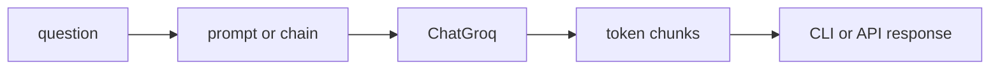
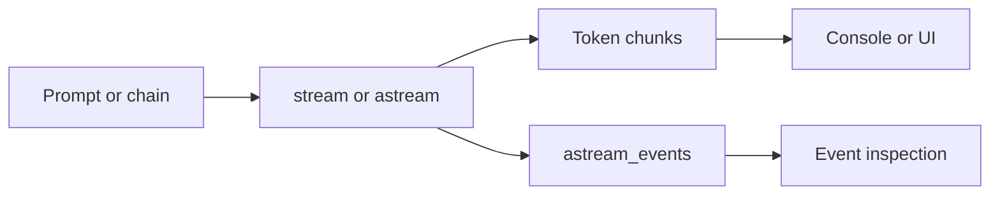

# Streaming — handling real-time output

## Questions this post answers

- How does the return shape change when you switch from `invoke()` to `stream()`
- What is the practical difference between chain streaming and model-only streaming
- When do you need `astream()` or `astream_events()` instead of plain `stream()`
- How should streamed output be forwarded to a UI or API response

> Streaming is not a different chain design; it is a different way of consuming the chain while the model is still generating.



## Minimal runnable example

```python
import os

from langchain_core.output_parsers import StrOutputParser
from langchain_core.prompts import ChatPromptTemplate
from langchain_groq import ChatGroq

chain = (
    ChatPromptTemplate.from_template("Explain {topic} in three sentences.")
    | ChatGroq(model="llama-3.1-8b-instant", api_key=os.environ["GROQ_API_KEY"])
    | StrOutputParser()
)

for chunk in chain.stream({"topic": "astream"}):
    print(chunk, end="", flush=True)
```

## What to notice in this code

- The chain definition is identical to `invoke()`; only the consumption pattern changes.
- With a parser attached, streaming yields text chunks. Without one, it yields message chunks.
- You can forward chunks immediately to the client or buffer them into a final string.
- Streaming improves perceived latency more than total wall-clock time.

## Where engineers get confused

- Streaming does not guarantee the full response finishes sooner.
- In async applications, `astream()` fits the event loop better than `stream()`.
- When you need lifecycle visibility, `astream_events()` is more useful than raw text chunks.

## Checklist

- [ ] I can consume the output of `stream()` incrementally
- [ ] I understand the difference between text chunks and message chunks
- [ ] I know when to switch to `astream()` in async code

LangChain 101 (5/6)

Example code: [github.com/yeongseon-books/langchain-101](https://github.com/yeongseon-books/langchain-101/tree/main/05-streaming)

## Questions this post answers

- How much code changes when you replace `invoke()` with `stream()`?
- When should you choose `astream()` versus `astream_events()`?
- What pattern works for reassembling streamed chunks into one string?
- What do you need to send streaming output through FastAPI?

> Streaming is not a different chain design. It is the same chain executed in a way that yields partial output instead of waiting for the final string.

## The flow at a glance



When an LLM generates a long response, waiting for the full text before displaying anything makes the experience feel slow. Streaming sends tokens to the output as they are generated. That is what you see in ChatGPT or Claude when text appears character by character.

In LangChain, streaming starts with `stream()`. Chain construction is identical to `invoke()` — only the call method changes.

Topics:

- using `stream()` with an LLM and a chain
- async streaming with `astream()`
- collecting streamed output into a string
- a practical FastAPI streaming endpoint
- `astream_events()` for fine-grained event control

---

<!-- ebook-only:start -->

**The key idea**: Streaming sends tokens as they are generated. `stream()` returns a generator and the client receives output in real time.

## Where this chapter fits

This is chapter 5 of 6 in the series.
The previous chapter covered **Tool calling — connecting external tools**.
After this chapter, the next one moves on to **Putting it together — a complete chain in one file**.
<!-- ebook-only:end -->

## Basic streaming

`stream()` returns a generator. Iterate over it with a `for` loop.

```python
import os

from langchain_core.output_parsers import StrOutputParser
from langchain_core.prompts import ChatPromptTemplate
from langchain_groq import ChatGroq

llm = ChatGroq(
    model="llama-3.1-8b-instant",
    api_key=os.environ["GROQ_API_KEY"],
)

# stream directly from the LLM
print("=== LLM direct streaming ===")
for chunk in llm.stream("List five advantages of Python."):
    print(chunk.content, end="", flush=True)

print("\n\n=== chain streaming ===")
prompt = ChatPromptTemplate.from_messages([
    ("human", "Explain {topic} in three paragraphs."),
])

chain = prompt | llm | StrOutputParser()

for chunk in chain.stream({"topic": "vector search"}):
    print(chunk, end="", flush=True)

print()
```

`end=""` and `flush=True` suppress the newline and force immediate output. `StrOutputParser()` extracts the string content from each `AIMessageChunk` during streaming.

---

## Collecting streamed output

When you need the full text after streaming, accumulate chunks in a list.

```python
import os

from langchain_core.output_parsers import StrOutputParser
from langchain_core.prompts import ChatPromptTemplate
from langchain_groq import ChatGroq

llm = ChatGroq(
    model="llama-3.1-8b-instant",
    api_key=os.environ["GROQ_API_KEY"],
)

chain = (
    ChatPromptTemplate.from_messages([("human", "{question}")])
    | llm
    | StrOutputParser()
)

chunks = []
print("streaming: ", end="")
for chunk in chain.stream({"question": "What is FAISS?"}):
    print(chunk, end="", flush=True)
    chunks.append(chunk)

full_text = "".join(chunks)
print(f"\n\ntotal characters: {len(full_text)}")
```

---

## astream() — async streaming

In async frameworks like FastAPI, use `astream()` with `async for`.

```python
import asyncio
import os

from langchain_core.output_parsers import StrOutputParser
from langchain_core.prompts import ChatPromptTemplate
from langchain_groq import ChatGroq

llm = ChatGroq(
    model="llama-3.1-8b-instant",
    api_key=os.environ["GROQ_API_KEY"],
)

chain = (
    ChatPromptTemplate.from_messages([("human", "Explain {topic} briefly.")])
    | llm
    | StrOutputParser()
)

async def stream_response(topic: str) -> None:
    print(f"streaming: {topic}")
    async for chunk in chain.astream({"topic": topic}):
        print(chunk, end="", flush=True)
    print()

async def main() -> None:
    await stream_response("embedding vectors")
    await stream_response("FAISS indexes")

asyncio.run(main())
```

---

## FastAPI streaming endpoint

In production, stream to the client over HTTP using Server-Sent Events.

```python
import os

from fastapi import FastAPI
from fastapi.responses import StreamingResponse
from langchain_core.output_parsers import StrOutputParser
from langchain_core.prompts import ChatPromptTemplate
from langchain_groq import ChatGroq

app = FastAPI()

llm = ChatGroq(
    model="llama-3.1-8b-instant",
    api_key=os.environ["GROQ_API_KEY"],
)

chain = (
    ChatPromptTemplate.from_messages([("human", "{question}")])
    | llm
    | StrOutputParser()
)

@app.get("/stream")
async def stream_endpoint(question: str):
    async def generate():
        async for chunk in chain.astream({"question": question}):
            yield chunk

    return StreamingResponse(generate(), media_type="text/plain")
```

Start the server:

```bash
pip install fastapi uvicorn
uvicorn main:app --reload
```

Test it:

```bash
curl "http://localhost:8000/stream?question=What+is+RAG"
```

---

## astream_events() for fine-grained control

`astream_events()` exposes individual events from each component in the chain.

```python
import asyncio
import os

from langchain_core.output_parsers import StrOutputParser
from langchain_core.prompts import ChatPromptTemplate
from langchain_groq import ChatGroq

llm = ChatGroq(
    model="llama-3.1-8b-instant",
    api_key=os.environ["GROQ_API_KEY"],
)

chain = (
    ChatPromptTemplate.from_messages([("human", "Explain {topic}.")])
    | llm
    | StrOutputParser()
)

async def main() -> None:
    async for event in chain.astream_events({"topic": "FAISS"}, version="v2"):
        event_type = event["event"]
        if event_type == "on_llm_stream":
            chunk = event["data"].get("chunk", "")
            if hasattr(chunk, "content") and chunk.content:
                print(chunk.content, end="", flush=True)
    print()

asyncio.run(main())
```

`astream_events()` is useful when a chain has multiple components and you need to distinguish which one is producing output. For simple streaming, `astream()` is easier.

---

## What to notice in this code

- The chain definition barely changes from the `invoke()` version. The real change is how you consume output.
- `stream()` means synchronous iteration, while `astream()` means asynchronous iteration over the same logical response.
- Collecting chunks into a list and joining them later is a common pattern for logging, caching, or post-processing.
- `astream_events()` exposes chain-level events, which is useful for debugging and instrumentation beyond simple token display.

## Where engineers get confused

- Streaming does not change the final answer format. It changes when the application receives each piece.
- Async streaming affects the caller too, so your framework and endpoint style must support async flow.
- Event streams are powerful, but they are unnecessary overhead if all you need is progressive text rendering.

## Checklist

- [ ] I can run the same chain with both `invoke()` and `stream()`
- [ ] I can explain the difference between `astream()` and `astream_events()`
- [ ] I understand how `StreamingResponse` fits around streamed chunks in FastAPI

## Conclusion

Streaming in LangChain requires one change: replace `invoke()` with `stream()` or `astream()`. Chain structure stays the same. With FastAPI, `StreamingResponse` delivers the output to clients in real time.

The final post assembles all the components covered in this series into one complete chain.

<!-- blog-only:start -->
Next: [Putting it together — a complete chain in one file](./06-putting-it-together.md)
<!-- blog-only:end -->

<!-- toc:begin -->
## In this series

- [LangChain introduction — LCEL and the Runnable interface](./01-lcel-runnable-basics.md)
- [Prompt and LLM chain — assembling your first chain](./02-prompt-llm-chain.md)
- [Retriever — document search and context injection](./03-retriever.md)
- [Tool calling — connecting external tools](./04-tool-calling.md)
- **Streaming — handling real-time output (current)**
- Putting it together — a complete chain in one file (upcoming)

<!-- toc:end -->

---

## References

- [LangChain streaming guide](https://python.langchain.com/docs/expression_language/streaming/)
- [astream_events reference](https://python.langchain.com/docs/expression_language/interface/)
- [FastAPI StreamingResponse](https://fastapi.tiangolo.com/advanced/custom-response/#streamingresponse)

Tags: LangChain, LCEL, Python, LLM
