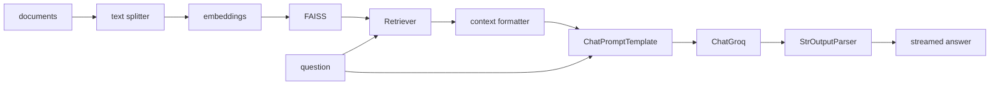
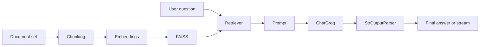

# Putting it together — a complete chain in one file

## Questions this post answers

- How do the Runnables from the previous posts combine into one executable RAG chain
- Where is the boundary between indexing, retrieval, prompting, and generation
- What does the full data flow look like once streaming is added
- Which component should you replace first when adapting the example to a real project

> The integrated chain is not a new abstraction; it is the same Runnables from earlier posts lined up in input-output order.



## Minimal runnable example

```python
import os

from langchain_community.embeddings import HuggingFaceEmbeddings
from langchain_community.vectorstores import FAISS
from langchain_core.output_parsers import StrOutputParser
from langchain_core.prompts import ChatPromptTemplate
from langchain_core.runnables import RunnablePassthrough
from langchain_groq import ChatGroq

vectorstore = FAISS.from_texts(["LCEL connects Runnables with a pipe."], HuggingFaceEmbeddings(model_name="sentence-transformers/all-MiniLM-L6-v2"))
retriever = vectorstore.as_retriever(search_kwargs={"k": 1})
chain = ({"context": retriever | (lambda docs: docs[0].page_content), "question": RunnablePassthrough()} | ChatPromptTemplate.from_template("Context: {context}\nQuestion: {question}") | ChatGroq(model="llama-3.1-8b-instant", api_key=os.environ["GROQ_API_KEY"]) | StrOutputParser())

print(chain.invoke("What is LCEL?"))
```

## What to notice in this code

- Indexing and query execution happen on different timelines, so the code should keep them separate.
- Retriever output should be formatted before it enters the prompt.
- `RunnablePassthrough()` preserves the user's question while other keys in the prompt dictionary are assembled.
- When an integrated chain fails, inspecting retrieval output is usually faster than tweaking the prompt first.

## Where engineers get confused

- When RAG answers are weak, the retrieval stage is often the real issue rather than the prompt.
- A complete example does not mean every stage belongs in one giant function.
- Once conversation history is added, the chain's input schema changes and the Runnable composition changes with it.

## Checklist

- [ ] I can connect retriever, prompt, llm, and parser into one chain
- [ ] I can explain the difference between indexing time and question-answering time
- [ ] I know where to start debugging an integrated RAG chain

LangChain 101 (6/6)

Example code: [github.com/yeongseon-books/langchain-101](https://github.com/yeongseon-books/langchain-101/tree/main/06-putting-it-together)

## Questions this post answers

- What is the minimum structure for combining the first five posts into one chain?
- Where should you separate indexing, retrieval, prompting, and generation concerns?
- How should multi-turn history enter the prompt?
- How do you keep a one-file integrated example readable?

> An integrated LangChain pipeline separates indexing from query-time execution, and the query path itself is still a simple retriever → prompt → llm → parser composition.

## The flow at a glance



The previous five posts covered LCEL, prompt templates, Retrievers, Tool Calling, and Streaming individually. This post assembles them into one executable application: index documents, search by query, generate an answer, and stream the output.

Topics:

- document chunking → embedding → FAISS index
- assembling a RAG chain with streaming output
- multi-turn RAG with conversation history
- a self-contained application in one file

---

<!-- ebook-only:start -->

**The key idea**: a production chain is a composition of retriever, prompt, LLM, and parser. Each component can be swapped independently.

## Where this chapter fits

This is chapter 6 of 6 in the series.
The previous chapter covered **Streaming — handling real-time output**.
<!-- ebook-only:end -->

## Document indexing pipeline

```python
from langchain_community.embeddings import HuggingFaceEmbeddings
from langchain_community.vectorstores import FAISS
from langchain_text_splitters import RecursiveCharacterTextSplitter

embedding_model = HuggingFaceEmbeddings(
    model_name="sentence-transformers/all-MiniLM-L6-v2",
    model_kwargs={"device": "cpu"},
    encode_kwargs={"normalize_embeddings": True},
)

splitter = RecursiveCharacterTextSplitter(
    chunk_size=300,
    chunk_overlap=30,
    separators=["\n\n", "\n", ". ", " ", ""],
)

documents = [
    """
Vector search converts text into numeric vectors for meaning-based retrieval.
Unlike keyword search, it matches content even when phrasing differs.
Embedding models place semantically similar text close together in vector space.
""",
    """
FAISS is a high-speed vector search library developed at Facebook AI Research.
It supports both exact and approximate search and can handle billions of vectors.
IndexFlatIP is an exact inner-product index.
""",
    """
LangChain connects LLM components as a pipeline using LCEL.
Retriever, Tool, and OutputParser all implement the Runnable interface.
The pipe operator (|) composes components into a chain.
""",
    """
RAG (Retrieval-Augmented Generation) combines retrieved documents with an LLM prompt.
The system retrieves relevant chunks for the question and provides them as context.
Vector search is the core retrieval component in most RAG pipelines.
""",
]

chunks = []
for doc in documents:
    chunks.extend(splitter.split_text(doc))

vectorstore = FAISS.from_texts(texts=chunks, embedding=embedding_model)
retriever = vectorstore.as_retriever(search_kwargs={"k": 3})

print(f"index vector count: {vectorstore.index.ntotal}")
```

---

## Assembling the RAG chain

```python
import os

from langchain_core.output_parsers import StrOutputParser
from langchain_core.prompts import ChatPromptTemplate
from langchain_core.runnables import RunnablePassthrough
from langchain_groq import ChatGroq

def format_docs(docs: list) -> str:
    return "\n\n".join(doc.page_content for doc in docs)

llm = ChatGroq(
    model="llama-3.1-8b-instant",
    api_key=os.environ["GROQ_API_KEY"],
)

prompt = ChatPromptTemplate.from_messages([
    (
        "system",
        "Answer the question using only the provided documents. "
        "If the answer is not in the documents, say so.\n\n"
        "Documents:\n{context}",
    ),
    ("human", "{question}"),
])

rag_chain = (
    {
        "context": retriever | format_docs,
        "question": RunnablePassthrough(),
    }
    | prompt
    | llm
    | StrOutputParser()
)
```

---

## Running with streaming

```python
questions = [
    "How is vector search different from keyword search?",
    "Where was FAISS developed?",
    "Why does RAG improve LLM accuracy?",
    "What is LCEL in LangChain?",
]

for question in questions:
    print(f"\nquestion: {question}")
    print("answer: ", end="")
    for chunk in rag_chain.stream(question):
        print(chunk, end="", flush=True)
    print()
```

---

## Multi-turn RAG with conversation history

A simple RAG chain treats each question independently. To reference earlier turns, pass conversation history to the chain.

```python
import os

from langchain_community.embeddings import HuggingFaceEmbeddings
from langchain_community.vectorstores import FAISS
from langchain_core.messages import AIMessage, HumanMessage
from langchain_core.output_parsers import StrOutputParser
from langchain_core.prompts import ChatPromptTemplate, MessagesPlaceholder
from langchain_core.runnables import RunnablePassthrough
from langchain_groq import ChatGroq

embedding_model = HuggingFaceEmbeddings(
    model_name="sentence-transformers/all-MiniLM-L6-v2",
    model_kwargs={"device": "cpu"},
    encode_kwargs={"normalize_embeddings": True},
)

documents = [
    "FAISS is a high-speed vector search library developed at Facebook AI Research.",
    "Embedding models project text into a high-dimensional vector space.",
    "RAG combines retrieved documents with an LLM prompt.",
    "LangChain connects LLM components using LCEL.",
]

vectorstore = FAISS.from_texts(texts=documents, embedding=embedding_model)
retriever = vectorstore.as_retriever(search_kwargs={"k": 2})

llm = ChatGroq(
    model="llama-3.1-8b-instant",
    api_key=os.environ["GROQ_API_KEY"],
)

prompt = ChatPromptTemplate.from_messages([
    (
        "system",
        "Answer the question using only the provided documents.\n\nDocuments:\n{context}",
    ),
    MessagesPlaceholder("chat_history"),
    ("human", "{question}"),
])

rag_chain = (
    {
        "context": retriever | (lambda docs: "\n\n".join(d.page_content for d in docs)),
        "question": RunnablePassthrough(),
        "chat_history": lambda x: x.get("chat_history", []),
    }
    | prompt
    | llm
    | StrOutputParser()
)

def chat(question: str, history: list) -> tuple[str, list]:
    result = rag_chain.invoke({"question": question, "chat_history": history})
    history.append(HumanMessage(content=question))
    history.append(AIMessage(content=result))
    return result, history

chat_history: list = []

turn1, chat_history = chat("What is FAISS?", chat_history)
print(f"[1] {turn1}\n")

turn2, chat_history = chat("What are its main features?", chat_history)
print(f"[2] {turn2}\n")

turn3, chat_history = chat("How does it connect to LangChain?", chat_history)
print(f"[3] {turn3}")
```

---

## Self-contained application

```python
"""
langchain_rag_app.py

Run: python langchain_rag_app.py
Requires: langchain langchain-community langchain-groq faiss-cpu sentence-transformers langchain-text-splitters
"""
import os

from langchain_community.embeddings import HuggingFaceEmbeddings
from langchain_community.vectorstores import FAISS
from langchain_core.output_parsers import StrOutputParser
from langchain_core.prompts import ChatPromptTemplate
from langchain_core.runnables import RunnablePassthrough
from langchain_groq import ChatGroq
from langchain_text_splitters import RecursiveCharacterTextSplitter

def build_rag_chain(documents: list[str]):
    embedding_model = HuggingFaceEmbeddings(
        model_name="sentence-transformers/all-MiniLM-L6-v2",
        model_kwargs={"device": "cpu"},
        encode_kwargs={"normalize_embeddings": True},
    )

    splitter = RecursiveCharacterTextSplitter(chunk_size=300, chunk_overlap=30)
    chunks = []
    for doc in documents:
        chunks.extend(splitter.split_text(doc))

    vectorstore = FAISS.from_texts(texts=chunks, embedding=embedding_model)
    retriever = vectorstore.as_retriever(search_kwargs={"k": 3})

    llm = ChatGroq(
        model="llama-3.1-8b-instant",
        api_key=os.environ["GROQ_API_KEY"],
    )

    prompt = ChatPromptTemplate.from_messages([
        (
            "system",
            "Answer the question using only the provided documents.\n\nDocuments:\n{context}",
        ),
        ("human", "{question}"),
    ])

    return (
        {
            "context": retriever | (lambda docs: "\n\n".join(d.page_content for d in docs)),
            "question": RunnablePassthrough(),
        }
        | prompt
        | llm
        | StrOutputParser()
    )

def main() -> None:
    documents = [
        "FAISS is a high-speed vector search library developed at Facebook AI Research.",
        "Embedding models project text into a high-dimensional vector space.",
        "RAG combines retrieved documents with an LLM prompt.",
        "LangChain connects LLM components using LCEL.",
    ]

    chain = build_rag_chain(documents)

    while True:
        question = input("\nQuestion (q to quit): ").strip()
        if question.lower() == "q":
            break
        if not question:
            continue

        print("Answer: ", end="")
        for chunk in chain.stream(question):
            print(chunk, end="", flush=True)
        print()

if __name__ == "__main__":
    main()
```

---

## What to notice in this code

- Separating the indexing pipeline from the query pipeline makes document preparation costs and request-time costs easier to reason about.
- Even the integrated chain is still built from small LCEL pieces such as `retriever | format_docs` and `prompt | llm | parser`.
- `MessagesPlaceholder` is the insertion point that lets multi-turn history enter the prompt without collapsing the structure.
- The full application is long, but the maintainable pattern is still to split small Runnable assemblies into focused helper functions.

## Where engineers get confused

- A RAG application feels complex when viewed all at once, but it becomes much simpler once you split indexing from query-time work.
- Retrieval, prompting, and history management often get debugged together even though each can be validated independently.
- Adding streaming to the integrated example changes output consumption far more than it changes the chain definition itself.

## Checklist

- [ ] I can explain the difference between indexing time and query time in this application
- [ ] I can name the role of retriever, prompt, llm, and parser inside the final chain
- [ ] I understand where conversation history enters the prompt structure

## Conclusion

This series covered the LangChain API from first principles: LCEL and the Runnable interface, prompt templates, Retrievers, Tool Calling, Streaming, and a full RAG chain. Each component implements the same interface, which is why they compose cleanly with `|`.

The next series, ai-app-patterns-101, applies these components to real application patterns: chatbots, document Q&A, agents, and workflow automation.

<!-- toc:begin -->
## In this series

- [LangChain introduction — LCEL and the Runnable interface](./01-lcel-runnable-basics.md)
- [Prompt and LLM chain — assembling your first chain](./02-prompt-llm-chain.md)
- [Retriever — document search and context injection](./03-retriever.md)
- [Tool calling — connecting external tools](./04-tool-calling.md)
- [Streaming — handling real-time output](./05-streaming.md)
- **Putting it together — a complete chain in one file (current)**

<!-- toc:end -->

---

## References

- [LangChain RAG tutorial](https://python.langchain.com/docs/use_cases/question_answering/)
- [LCEL reference](https://python.langchain.com/docs/expression_language/)
- [MessagesPlaceholder](https://python.langchain.com/docs/modules/model_io/prompts/quick_start/#messagesplaceholder)

Tags: LangChain, LCEL, Python, LLM
