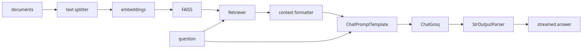
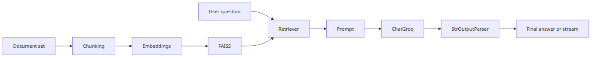
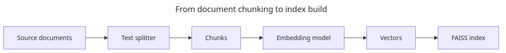
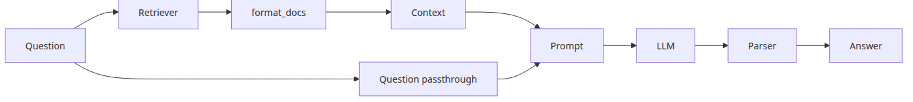
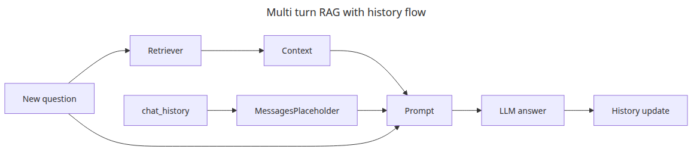

# Putting it together — a complete chain in one file

By the time you reach a real LangChain application, the challenge is no longer understanding each component in isolation. The real work is keeping indexing, retrieval, prompting, tool use, and output delivery separate enough that one integrated chain still stays debuggable.

This is the final post in the LangChain 101 series. It assembles the earlier pieces into one executable RAG chain without losing the boundaries that make the system maintainable.

## Questions this post answers

- How do the Runnables from the previous posts combine into one executable RAG chain
- Where is the boundary between indexing, retrieval, prompting, and generation
- What does the full data flow look like once streaming is added
- Which component should you replace first when adapting the example to a real project

> The integrated chain is not a new abstraction; it is the same Runnables from earlier posts lined up in input-output order.



*Questions this post answers*
## Minimal runnable example

```python
import os

from langchain_huggingface import HuggingFaceEmbeddings
from langchain_community.vectorstores import FAISS
from langchain_core.output_parsers import StrOutputParser
from langchain_core.prompts import ChatPromptTemplate
from langchain_core.runnables import RunnablePassthrough
from langchain_groq import ChatGroq

vectorstore = FAISS.from_texts(["LCEL connects Runnables with a pipe."], HuggingFaceEmbeddings(model_name="sentence-transformers/all-MiniLM-L6-v2"))
retriever = vectorstore.as_retriever(search_kwargs={"k": 1})
chain = ({"context": retriever | (lambda docs: docs[0].page_content), "question": RunnablePassthrough()} | ChatPromptTemplate.from_template("Context: {context}\nQuestion: {question}") | ChatGroq(model="llama-3.1-8b-instant", api_key=os.environ["GROQ_API_KEY"]) | StrOutputParser())

print(chain.invoke("What is LCEL?"))
```

## The flow at a glance



*The flow at a glance*
The previous five posts covered LCEL, prompt templates, Retrievers, Tool Calling, and Streaming individually. This post assembles them into one executable application: index documents, search by query, generate an answer, and stream the output.

Topics:

- document chunking → embedding → FAISS index
- assembling a RAG chain with streaming output
- multi-turn RAG with conversation history
- a self-contained application in one file

---

## Document indexing pipeline



*From document chunking to index build*
```python
from langchain_huggingface import HuggingFaceEmbeddings
from langchain_community.vectorstores import FAISS
from langchain_text_splitters import RecursiveCharacterTextSplitter

embedding_model = HuggingFaceEmbeddings(
    model_name="sentence-transformers/all-MiniLM-L6-v2",
    model_kwargs={"device": "cpu"},
    encode_kwargs={"normalize_embeddings": True},
)

splitter = RecursiveCharacterTextSplitter(
    chunk_size=300,
    chunk_overlap=30,
    separators=["\n\n", "\n", ". ", " ", ""],
)

documents = [
    """
Vector search converts text into numeric vectors for meaning-based retrieval.
Unlike keyword search, it matches content even when phrasing differs.
Embedding models place semantically similar text close together in vector space.
""",
    """
FAISS is a high-speed vector search library developed at Facebook AI Research.
It supports both exact and approximate search and can handle billions of vectors.
IndexFlatIP is an exact inner-product index.
""",
    """
LangChain connects LLM components as a pipeline using LCEL.
Retriever, Tool, and OutputParser all implement the Runnable interface.
The pipe operator (|) composes components into a chain.
""",
    """
RAG (Retrieval-Augmented Generation) combines retrieved documents with an LLM prompt.
The system retrieves relevant chunks for the question and provides them as context.
Vector search is the core retrieval component in most RAG pipelines.
""",
]

chunks = []
for doc in documents:
    chunks.extend(splitter.split_text(doc))

vectorstore = FAISS.from_texts(texts=chunks, embedding=embedding_model)
retriever = vectorstore.as_retriever(search_kwargs={"k": 3})

print(f"index vector count: {vectorstore.index.ntotal}")
```

<!-- injected-output:start -->
**Output**

    index vector count: 4

<!-- injected-output:end -->

---

## Inspect retrieval before blaming the model

The fastest way to debug an integrated RAG chain is to inspect the retrieved chunks before rewriting the prompt. If the wrong documents come back, the model never had a fair chance.

```python
queries = [
    "Where was FAISS developed?",
    "How does vector search differ from keyword search?",
]

for query in queries:
    print(f"\nquery: {query}")
    hits = vectorstore.similarity_search_with_score(query, k=2)
    for idx, (doc, score) in enumerate(hits, start=1):
        preview = doc.page_content.replace("\n", " ")[:90]
        print(f"  [{idx}] score={score:.4f} text={preview}...")
```

<!-- injected-output:start -->
**Output**

    query: Where was FAISS developed?
      [1] score=0.7851 text=FAISS is a high-speed vector search library developed at Facebook AI Research....
      [2] score=1.1062 text=LangChain connects LLM components as a pipeline using LCEL....

    query: How does vector search differ from keyword search?
      [1] score=0.5128 text=Vector search converts text into numeric vectors for meaning-based retrieval....
      [2] score=0.7440 text=RAG (Retrieval-Augmented Generation) combines retrieved documents with an LLM prompt....

<!-- injected-output:end -->

That one inspection step lets you separate three failure modes quickly: wrong top-k documents means a retrieval problem, correct documents with a bad answer means a prompt or model problem, and too many noisy documents means `k` or chunking needs work.

---

## Assembling the RAG chain



*Retriever prompt llm parser assembly*
```python
import os

from langchain_core.output_parsers import StrOutputParser
from langchain_core.prompts import ChatPromptTemplate
from langchain_core.runnables import RunnablePassthrough
from langchain_groq import ChatGroq

def format_docs(docs: list) -> str:
    return "\n\n".join(doc.page_content for doc in docs)

llm = ChatGroq(
    model="llama-3.1-8b-instant",
    api_key=os.environ["GROQ_API_KEY"],
)

prompt = ChatPromptTemplate.from_messages([
    (
        "system",
        "Answer the question using only the provided documents. "
        "If the answer is not in the documents, say so.\n\n"
        "Documents:\n{context}",
    ),
    ("human", "{question}"),
])

rag_chain = (
    {
        "context": retriever | format_docs,
        "question": RunnablePassthrough(),
    }
    | prompt
    | llm
    | StrOutputParser()
)
```

---

## Guard against empty or noisy context

In a real application, "no useful documents found" should not look the same as "here are ten barely related chunks." Add one guardrail before the prompt so the chain can fail cleanly when retrieval quality drops.

```python
from langchain_core.runnables import RunnableLambda

def format_docs_guarded(docs: list) -> str:
    if not docs:
        return "NO_CONTEXT_FOUND"

    selected = docs[:2]
    return "\n\n".join(doc.page_content for doc in selected)

guarded_chain = (
    {
        "context": retriever | RunnableLambda(format_docs_guarded),
        "question": RunnablePassthrough(),
    }
    | prompt
    | llm
    | StrOutputParser()
)

print(guarded_chain.invoke("What does the corpus say about LangSmith?"))
```

<!-- injected-output:start -->
**Output**

    The provided documents do not mention LangSmith, so I cannot answer that from this corpus.

<!-- injected-output:end -->

This guard looks small, but it removes one of the most common failure patterns in demo RAG apps: forcing the model to guess when the index does not actually contain the answer.

---

## Running with streaming


*Integrated RAG streaming execution path*
```python
questions = [
    "How is vector search different from keyword search?",
    "Where was FAISS developed?",
    "Why does RAG improve LLM accuracy?",
    "What is LCEL in LangChain?",
]

for question in questions:
    print(f"\nquestion: {question}")
    print("answer: ", end="")
    for chunk in rag_chain.stream(question):
        print(chunk, end="", flush=True)
    print()
```

That is useful beyond UX. Running the same question once with `invoke()` and once with `stream()` proves that retrieval, prompting, and generation stayed the same while only the delivery path changed.

---

## Multi-turn RAG with conversation history



*Multi turn RAG with history flow*
A simple RAG chain treats each question independently. To reference earlier turns, pass conversation history to the chain.

```python
import os

from langchain_huggingface import HuggingFaceEmbeddings
from langchain_community.vectorstores import FAISS
from langchain_core.messages import AIMessage, HumanMessage
from langchain_core.output_parsers import StrOutputParser
from langchain_core.prompts import ChatPromptTemplate, MessagesPlaceholder
from langchain_core.runnables import RunnablePassthrough
from langchain_groq import ChatGroq

embedding_model = HuggingFaceEmbeddings(
    model_name="sentence-transformers/all-MiniLM-L6-v2",
    model_kwargs={"device": "cpu"},
    encode_kwargs={"normalize_embeddings": True},
)

documents = [
    "FAISS is a high-speed vector search library developed at Facebook AI Research.",
    "Embedding models project text into a high-dimensional vector space.",
    "RAG combines retrieved documents with an LLM prompt.",
    "LangChain connects LLM components using LCEL.",
]

vectorstore = FAISS.from_texts(texts=documents, embedding=embedding_model)
retriever = vectorstore.as_retriever(search_kwargs={"k": 2})

llm = ChatGroq(
    model="llama-3.1-8b-instant",
    api_key=os.environ["GROQ_API_KEY"],
)

prompt = ChatPromptTemplate.from_messages([
    (
        "system",
        "Answer the question using only the provided documents.\n\nDocuments:\n{context}",
    ),
    MessagesPlaceholder("chat_history"),
    ("human", "{question}"),
])

rag_chain = (
    {
        "context": retriever | (lambda docs: "\n\n".join(d.page_content for d in docs)),
        "question": RunnablePassthrough(),
        "chat_history": lambda x: x.get("chat_history", []),
    }
    | prompt
    | llm
    | StrOutputParser()
)

def chat(question: str, history: list) -> tuple[str, list]:
    result = rag_chain.invoke({"question": question, "chat_history": history})
    history.append(HumanMessage(content=question))
    history.append(AIMessage(content=result))
    return result, history

chat_history: list = []

turn1, chat_history = chat("What is FAISS?", chat_history)
print(f"[1] {turn1}\n")

turn2, chat_history = chat("What are its main features?", chat_history)
print(f"[2] {turn2}\n")

turn3, chat_history = chat("How does it connect to LangChain?", chat_history)
print(f"[3] {turn3}")
```

---

## Self-contained application

```python
"""
langchain_rag_app.py

Run: python langchain_rag_app.py
Requires: langchain langchain-community langchain-huggingface langchain-groq faiss-cpu sentence-transformers langchain-text-splitters
"""
import os

from langchain_huggingface import HuggingFaceEmbeddings
from langchain_community.vectorstores import FAISS
from langchain_core.output_parsers import StrOutputParser
from langchain_core.prompts import ChatPromptTemplate
from langchain_core.runnables import RunnablePassthrough
from langchain_groq import ChatGroq
from langchain_text_splitters import RecursiveCharacterTextSplitter

def build_rag_chain(documents: list[str]):
    embedding_model = HuggingFaceEmbeddings(
        model_name="sentence-transformers/all-MiniLM-L6-v2",
        model_kwargs={"device": "cpu"},
        encode_kwargs={"normalize_embeddings": True},
    )

    splitter = RecursiveCharacterTextSplitter(chunk_size=300, chunk_overlap=30)
    chunks = []
    for doc in documents:
        chunks.extend(splitter.split_text(doc))

    vectorstore = FAISS.from_texts(texts=chunks, embedding=embedding_model)
    retriever = vectorstore.as_retriever(search_kwargs={"k": 3})

    llm = ChatGroq(
        model="llama-3.1-8b-instant",
        api_key=os.environ["GROQ_API_KEY"],
    )

    prompt = ChatPromptTemplate.from_messages([
        (
            "system",
            "Answer the question using only the provided documents.\n\nDocuments:\n{context}",
        ),
        ("human", "{question}"),
    ])

    return (
        {
            "context": retriever | (lambda docs: "\n\n".join(d.page_content for d in docs)),
            "question": RunnablePassthrough(),
        }
        | prompt
        | llm
        | StrOutputParser()
    )

def main() -> None:
    documents = [
        "FAISS is a high-speed vector search library developed at Facebook AI Research.",
        "Embedding models project text into a high-dimensional vector space.",
        "RAG combines retrieved documents with an LLM prompt.",
        "LangChain connects LLM components using LCEL.",
    ]

    chain = build_rag_chain(documents)

    while True:
        question = input("\nQuestion (q to quit): ").strip()
        if question.lower() == "q":
            break
        if not question:
            continue

        print("Answer: ", end="")
        for chunk in chain.stream(question):
            print(chunk, end="", flush=True)
        print()

if __name__ == "__main__":
    main()
```

---

## What to notice in this code

- Separating the indexing pipeline from the query pipeline makes document preparation costs and request-time costs easier to reason about.
- A quick `similarity_search_with_score()` check tells you whether to debug retrieval, prompting, or generation first.
- Even the integrated chain is still built from small LCEL pieces such as `retriever | format_docs` and `prompt | llm | parser`.
- A small context guard is often enough to turn "hallucinate anyway" into a clean, verifiable refusal.
- `MessagesPlaceholder` is the insertion point that lets multi-turn history enter the prompt without collapsing the structure.
- The full application is long, but the maintainable pattern is still to split small Runnable assemblies into focused helper functions.

## Where engineers get confused

- A RAG application feels complex when viewed all at once, but it becomes much simpler once you split indexing from query-time work.
- Retrieval, prompting, and history management often get debugged together even though each can be validated independently.
- Adding streaming to the integrated example changes output consumption far more than it changes the chain definition itself.

## Checklist

- [ ] I can explain the difference between indexing time and query time in this application
- [ ] I can name the role of retriever, prompt, llm, and parser inside the final chain
- [ ] I understand where conversation history enters the prompt structure

## Conclusion

This series covered the LangChain API from first principles: LCEL and the Runnable interface, prompt templates, Retrievers, Tool Calling, Streaming, and a full RAG chain. Each component implements the same interface, which is why they compose cleanly with `|`.

The next series, ai-app-patterns-101, applies these components to real application patterns: chatbots, document Q&A, agents, and workflow automation.

<!-- toc:begin -->
## In this series

- [LangChain introduction — LCEL and the Runnable interface](./01-lcel-runnable-basics.md)
- [Prompt and LLM chain — assembling your first chain](./02-prompt-llm-chain.md)
- [Retriever — document search and context injection](./03-retriever.md)
- [Tool calling — connecting external tools](./04-tool-calling.md)
- [Streaming — handling real-time output](./05-streaming.md)
- **Putting it together — a complete chain in one file (current)**

<!-- toc:end -->

---

## References

- [LangChain RAG tutorial](https://python.langchain.com/docs/use_cases/question_answering/)
- [LCEL reference](https://python.langchain.com/docs/expression_language/)
- [MessagesPlaceholder](https://python.langchain.com/docs/modules/model_io/prompts/quick_start/#messagesplaceholder)
- [FAISS VectorStore integration](https://python.langchain.com/docs/integrations/vectorstores/faiss/)
- [RecursiveCharacterTextSplitter](https://python.langchain.com/docs/how_to/recursive_text_splitter/)

### Related Series

- [LangGraph 101](../../langgraph-101/en/01-graph-basics.md) — this is the natural next step once a single RAG chain grows into branching workflows, approvals, or long-lived state.

Tags: LangChain, LCEL, Python, LLM
