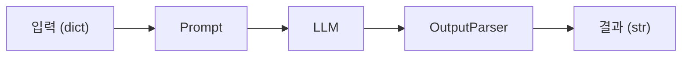

# LangChain 소개 — LCEL과 Runnable 기본

> LangChain 101 시리즈 (1/6)

## 이 글에서 다룰 문제

*같은* *기능* 도 *글루 코드* 가 *길수록* *오류* 가 *섞입니다*. *LCEL* 은 *컴포넌트 합성* 을 *한 줄* 로 *바꿉니다*.

## 전체 흐름


## Before/After

**Before**: "*프롬프트* 를 *문자열* 로 *조립* 하고 *LLM* 호출 결과를 *수동* 으로 *파싱* 합니다."

**After**: "`prompt | llm | parser` 한 줄이 *같은* *흐름* 을 *대체* 합니다."

## LCEL 첫 체인 5단계

### 1단계 — Prompt 준비

```python
from langchain_core.prompts import ChatPromptTemplate

prompt = ChatPromptTemplate.from_messages([
    ("system", "당신은 친절한 한국어 도우미입니다."),
    ("human", "{topic} 을 한 문장으로 설명해 주세요."),
])
```

### 2단계 — LLM 준비

```python
import os
from langchain_groq import ChatGroq

os.environ.setdefault("GROQ_API_KEY", "your-key-here")
llm = ChatGroq(model="llama-3.1-8b-instant", temperature=0)
```

### 3단계 — Parser 준비

```python
from langchain_core.output_parsers import StrOutputParser

parser = StrOutputParser()
```

### 4단계 — `|` 로 잇기

```python
chain = prompt | llm | parser
```

### 5단계 — `invoke`

```python
answer = chain.invoke({"topic": "LCEL"})
print(answer)
# 예상 출력: LCEL은 LangChain 컴포넌트를 파이프로 잇는 표현식 언어입니다.
```

## 이 코드에서 주목할 점

- `|` 는 *왼쪽* *Runnable* 의 *출력 타입* 이 *오른쪽* *입력 타입* 과 *맞아야* *동작* 합니다.
- *체인* 자체도 *Runnable* 입니다. 다시 `|` 로 *잇을* *수* *있습니다*.
- *입력* 은 *항상* *dict* 입니다. *템플릿 변수* 와 *키* 가 *일치* *해야* 합니다.

## 자주 하는 실수 5가지

1. ***템플릿 변수* 와 *invoke 키* 가 *불일치*** — `{topic}` 인데 `{"input": ...}` 을 넘기면 실패합니다.
2. ***OutputParser* 빠뜨리기** — *AIMessage* 객체가 그대로 나와 *문자열* 처럼 *쓰지* *못* 합니다.
3. ***async/sync 혼용*** — `chain.invoke()` 와 `await chain.ainvoke()` 를 *섞어* *씁니다*.
4. ***API 키 미설정*** — `GROQ_API_KEY` 가 *없으면* *401* 입니다.
5. ***체인 변수* *재할당*** — `chain | x` 의 *결과* 를 *새 변수* 에 *받지 않으면* *체인* 이 *그대로* 입니다.

## 실무에서는 이렇게 쓰입니다

*프로덕션* 에서는 *프롬프트 템플릿*, *LLM*, *파서*, *후처리 함수* 를 *한 체인* 으로 *묶고* `invoke` / `stream` / `batch` 를 *상황* 에 *맞게* *호출* 합니다.

*트레이싱* 도구 (LangSmith) 를 *연결* 하면 *체인* 의 *각* *단계* *입출력* 이 *자동* *기록* 됩니다.

## 체크리스트

- [ ] `prompt | llm | parser` 형태를 *한 번* *작성*.
- [ ] *템플릿 변수* 와 *입력 키* *일치* *확인*.
- [ ] `GROQ_API_KEY` *환경 변수* *설정*.
- [ ] *예상 출력* 을 *직접* *invoke* 로 *확인*.

## 정리 및 다음 단계

다음 글은 *Prompt와 LLM Chain — 체인 첫 번째 구성* 입니다.

<!-- toc:begin -->
## 시리즈 목차

- **LangChain 소개 — LCEL과 Runnable 기본 (현재 글)**
- Prompt와 LLM Chain — 체인 첫 번째 구성 (예정)
- Retriever — 문서 검색과 컨텍스트 주입 (예정)
- Tool Calling — 외부 도구 연결하기 (예정)
- Streaming — 실시간 출력 처리 (예정)
- 실전 체인 조립 — 컴포넌트를 하나로 연결하기 (예정)

<!-- toc:end -->

## 참고 자료

- [LangChain Expression Language](https://python.langchain.com/docs/concepts/lcel/)
- [Runnable interface](https://python.langchain.com/docs/concepts/runnables/)
- [ChatGroq integration](https://python.langchain.com/docs/integrations/chat/groq/)
- [LangChain GitHub](https://github.com/langchain-ai/langchain)

Tags: LangChain, LCEL, Python, LLM
