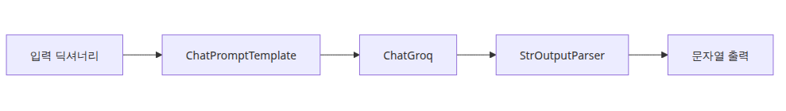
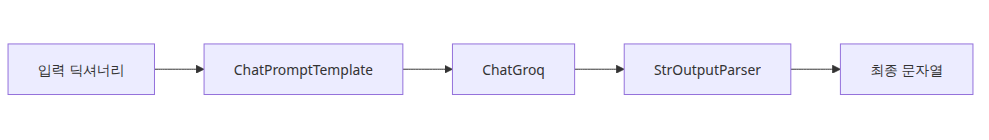
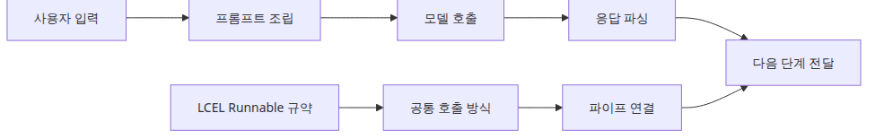
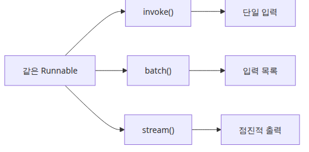
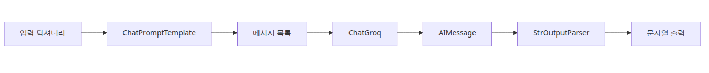
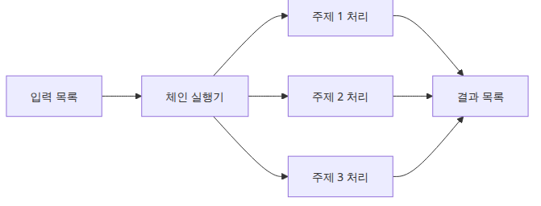

# LangChain 소개 — LCEL과 Runnable 기본

이 글은 LangChain 101 시리즈의 첫 번째 글입니다.

LangChain을 처음 보면 용어가 먼저 몰려옵니다. LCEL, Runnable, Chain, Pipe 같은 단어가 연달아 나오는데, 정작 손에 잡히는 것은 "프롬프트 만들고 모델 호출하고 결과 파싱하는 코드"입니다. 그래서 입문 단계에서는 개념을 외우기보다, **반복되는 글루 코드를 LangChain이 어떤 공통 계약으로 정리했는지**부터 보는 편이 훨씬 빠릅니다.

이렇게 생각하면 됩니다. LangChain은 새로운 마법을 만든 라이브러리가 아닙니다. 이미 여러분이 애플리케이션에서 하던 일을, 서로 교체 가능한 부품으로 나눈 뒤 같은 실행 인터페이스로 묶어 놓은 도구입니다. 그 인터페이스가 *Runnable*이고, 그 부품들을 `|`로 잇는 문법이 *LCEL*입니다.

---

## 이 글에서 다룰 문제

- LCEL은 왜 생겼고, 기존 LLM 코드에서 어떤 글루 코드를 줄여 줄까요?
- LangChain 컴포넌트가 모두 *Runnable*이라는 말은 정확히 어떤 계약을 뜻할까요?
- `invoke()`, `batch()`, `stream()`은 언제 각각 써야 할까요?
- `prompt | llm | parser` 같은 체인 안에서는 실제로 어떤 데이터가 흐를까요?
- 체인을 길게 만들수록 어디서 가장 자주 헷갈릴까요?

> LangChain에서는 입력과 출력 모양만 맞으면, 많은 컴포넌트를 서로 바꿔 끼울 수 있습니다.



*이 글에서 답할 질문*

## 최소 실행 예제

```python
import os

from langchain_core.output_parsers import StrOutputParser
from langchain_core.prompts import ChatPromptTemplate
from langchain_groq import ChatGroq

prompt = ChatPromptTemplate.from_template("Explain {topic} in one paragraph.")
llm = ChatGroq(model="llama-3.1-8b-instant", api_key=os.environ["GROQ_API_KEY"])
chain = prompt | llm | StrOutputParser()

print(chain.invoke({"topic": "LCEL"}))
```

<!-- injected-output:start -->
**Output**

    LCEL, or LangChain Expression Language, is a declarative way to compose chains in LangChain by piping together components — such as prompts, chat models, output parsers, and retrievers — using the `|` operator. Every component in an LCEL chain implements the same Runnable interface, which means you can invoke, batch, or stream the whole chain with a single method call without writing glue code between steps. Because LCEL is just function composition over a shared contract, the resulting chains are easy to reason about, swap parts in and out of, and run efficiently in parallel or async contexts.

<!-- injected-output:end -->

이 짧은 예제만 봐도 LangChain의 핵심 구조가 드러납니다. 프롬프트는 입력 dict를 메시지로 바꾸고, 모델은 그 메시지를 받아 응답을 만들고, 파서는 응답 객체를 애플리케이션이 다루기 쉬운 문자열로 바꿉니다. 세 단계가 모두 *Runnable* 계약을 따르기 때문에 `|` 하나로 연결됩니다.

## 전체 흐름 한눈에 보기



*전체 흐름 한눈에 보기*

LangChain 입문에서 가장 중요한 것은 용어 정의보다 멘탈 모델입니다. **LLM 앱은 결국 "입력을 가공해 프롬프트를 만들고, 모델을 호출하고, 결과를 후처리하는 파이프라인"** 이라고 보면 됩니다. LangChain은 이 반복 구조를 라이브러리 레벨에서 재사용 가능하게 만든 것입니다.

이 시리즈는 LangChain을 애플리케이션 패턴이 아니라 **API 조립 도구**로 이해하는 데 초점을 둡니다. 챗봇, RAG, 에이전트 같은 상위 수준 패턴은 별도 시리즈에서 다루고, 여기서는 LangChain 컴포넌트가 어떻게 맞물리는지부터 차근차근 쌓겠습니다.

이 글에서 다룰 범위는 다음과 같습니다.

- LangChain이 줄이려는 반복 글루 코드
- *Runnable* 인터페이스의 세 핵심 메서드: `invoke()`, `batch()`, `stream()`
- LCEL 파이프 연산자 `|`로 체인을 조립하는 방식
- 가장 단순한 체인을 직접 실행해 보는 흐름
- 이 구조를 익혀 두면 이후 글이 왜 쉬워지는지

---

## LangChain이 해결하려는 문제



*반복되는 글루 코드와 LCEL 추상화 흐름*

LLM 애플리케이션 코드는 금방 비슷한 패턴으로 굳어집니다. 프롬프트 문자열을 만들고, 모델 API를 호출하고, 응답에서 텍스트를 꺼내고, 그 결과를 다음 단계 입력으로 다시 조립합니다. 한 번은 단순하지만 단계가 늘어나면 glue code가 빠르게 쌓입니다.

```python
# 반복해서 쌓이는 글루 코드
prompt_text = f"Summarize this text: {user_input}"
response = client.chat.completions.create(model="...", messages=[{"role": "user", "content": prompt_text}])
raw_output = response.choices[0].message.content
parsed = raw_output.strip()
next_prompt = f"Translate this summary: {parsed}"
# ...같은 패턴이 이어집니다
```

운영 관점에서 더 중요한 문제는 코드 길이보다 **데이터 형식 관리**입니다. 어느 단계는 문자열을 받고, 어느 단계는 메시지 리스트를 받고, 어느 단계는 객체를 돌려줍니다. 이 형식 전환이 매번 수동으로 들어가면, 코드는 금방 읽기 어려워지고 디버깅 포인트도 늘어납니다.

LangChain의 핵심 아이디어는 간단합니다. **모든 컴포넌트가 같은 실행 계약을 구현하면, 입력과 출력 형식만 맞는 한 부품처럼 연결할 수 있다**는 것입니다. 이 계약이 *Runnable*이고, 그 연결 문법이 LCEL입니다.

---

## Runnable 인터페이스



*invoke batch stream 실행 모드*

LangChain의 거의 모든 핵심 컴포넌트는 *Runnable* 인터페이스를 구현합니다. 그래서 프롬프트도, 모델도, 파서도, 심지어 간단한 사용자 정의 변환 단계도 같은 방식으로 실행할 수 있습니다.

핵심 메서드는 세 가지입니다.

- `invoke(input)` — 입력 하나를 받아 출력 하나를 반환합니다. 가장 기본적인 동기 실행입니다.
- `batch(inputs)` — 입력 리스트를 받아 출력 리스트를 반환합니다. 같은 체인을 여러 입력에 반복 적용할 때 씁니다.
- `stream(input)` — 결과를 한 번에 주지 않고 점진적으로 흘려보냅니다.

이 일관성이 중요한 이유는, 코드 레벨에서 "이건 모델이니까 특별히 다뤄야 해" 같은 예외 처리가 줄어들기 때문입니다. 컴포넌트 종류보다 **입력과 출력 계약**이 더 중요해집니다.

```python
import os

from langchain_groq import ChatGroq

llm = ChatGroq(
    model="llama-3.1-8b-instant",
    api_key=os.environ["GROQ_API_KEY"],
)

response = llm.invoke("Explain the advantages of Python in two sentences.")
print(response.content)
```

<!-- injected-output:start -->
**Output**

    Python is a versatile and widely-used programming language that offers several advantages, including its simplicity, readability, and ease of use, making it an ideal choice for beginners and experienced developers alike. Additionally, Python's extensive libraries and frameworks, such as NumPy, pandas, and Django, provide a powerful toolset for data analysis, machine learning, web development, and more.

<!-- injected-output:end -->

여기서 눈여겨볼 점은 `ChatGroq` 자체가 이미 *Runnable*이라는 사실입니다. 즉, 체인을 만들기 전에도 `invoke()`로 바로 실행할 수 있습니다. 체인은 특별한 다른 세계가 아니라, 이런 *Runnable* 여러 개를 조합한 결과물일 뿐입니다.

---

## LCEL과 파이프 연산자



*프롬프트 모델 파서 타입 흐름*

LCEL은 `|` 연산자로 *Runnable*들을 연결합니다. 왼쪽 출력이 오른쪽 입력으로 들어가므로, 결국 체인 설계는 "각 단계가 어떤 형식을 내보내고 다음 단계가 무엇을 받는가"를 맞추는 작업입니다.

```python
chain = component_a | component_b | component_c
result = chain.invoke(input)
```

이 문법이 자주 보이는 이유는 단순히 예쁘기 때문이 아닙니다. 실무에서 LLM 파이프라인의 대부분이 **순차적 변환** 구조이기 때문입니다. 프롬프트 생성 → 모델 호출 → 출력 파싱은 가장 대표적인 예입니다.

```bash
pip install langchain langchain-groq
```

```python
import os

from langchain_core.output_parsers import StrOutputParser
from langchain_core.prompts import ChatPromptTemplate
from langchain_groq import ChatGroq

prompt = ChatPromptTemplate.from_messages([
    ("system", "You are an expert at concise explanations."),
    ("human", "Explain {topic} in two sentences."),
])

llm = ChatGroq(
    model="llama-3.1-8b-instant",
    api_key=os.environ["GROQ_API_KEY"],
)

parser = StrOutputParser()

chain = prompt | llm | parser

result = chain.invoke({"topic": "embedding vectors"})
print(result)
```

<!-- injected-output:start -->
**Output**

    Embedding vectors is a technique in natural language processing and machine learning where high-dimensional data is represented as dense, fixed-size vectors in a lower-dimensional space, allowing for efficient computation and improved model performance. This is typically achieved through techniques like word2vec or GloVe, which map words or other inputs to vectors in a way that captures semantic relationships and word meanings.

<!-- injected-output:end -->

각 컴포넌트 역할을 나눠 보면 더 분명합니다.

- **`ChatPromptTemplate`**: dict를 받아 `{topic}`이 채워진 메시지 리스트를 만듭니다.
- **`ChatGroq`**: 메시지 리스트를 받아 `AIMessage` 객체를 반환합니다.
- **`StrOutputParser`**: `AIMessage`에서 `.content`를 꺼내 문자열로 바꿉니다.

즉, `chain.invoke({"topic": "embedding vectors"})`는 이 세 단계를 순서대로 실행한 것입니다. 파이프가 문자열을 이어 붙이는 것이 아니라, **호환되는 타입 변환 단계를 조합하는 것**이라는 점이 중요합니다.

---

## 각 컴포넌트를 따로 실행해 보기

체인을 한 줄로 보면 편하지만, 입문 단계에서는 각 단계가 실제로 무엇을 주고받는지 따로 보는 편이 이해에 도움이 됩니다. 특히 디버깅할 때는 이 방식이 거의 필수입니다.

```python
import os

from langchain_core.output_parsers import StrOutputParser
from langchain_core.prompts import ChatPromptTemplate
from langchain_groq import ChatGroq

prompt = ChatPromptTemplate.from_messages([
    ("system", "You are an expert at concise explanations."),
    ("human", "Explain {topic} in two sentences."),
])

llm = ChatGroq(
    model="llama-3.1-8b-instant",
    api_key=os.environ["GROQ_API_KEY"],
)

parser = StrOutputParser()

# 1단계: 프롬프트 렌더링
messages = prompt.invoke({"topic": "embedding vectors"})
print("=== step 1: messages ===")
for m in messages.messages:
    print(f"  [{m.type}] {m.content}")

# 2단계: LLM 호출
ai_message = llm.invoke(messages)
print(f"\n=== step 2: AIMessage ===")
print(f"  type: {type(ai_message).__name__}")
print(f"  content: {ai_message.content[:80]}...")

# 3단계: 문자열로 파싱
text = parser.invoke(ai_message)
print(f"\n=== step 3: string ===")
print(f"  {text}")
```

<!-- injected-output:start -->
**Output**

    === step 1: messages ===
      [system] You are an expert at concise explanations.
      [human] Explain embedding vectors in two sentences.

    === step 2: AIMessage ===
      type: AIMessage
      content: Embedding vectors is a technique in natural language processing (NLP) where word...

    === step 3: string ===
      Embedding vectors is a technique in natural language processing (NLP) where words or phrases are represented as numerical vectors in a high-dimensional space, allowing machines to capture semantic relationships and nuances between them. These vectors are often learned through neural networks, where similar words are mapped to nearby points in the vector space, enabling tasks like text classification, sentiment analysis, and language translation.

<!-- injected-output:end -->

운영 관점에서 이 예제가 좋은 이유는 문제를 빨리 좁힐 수 있기 때문입니다. 결과가 이상할 때 프롬프트 렌더링이 잘못된 것인지, 모델 응답이 이상한 것인지, 파서 단계가 부적절한 것인지 한 단계씩 분리해서 확인할 수 있습니다.

---

## RunnableLambda — 일반 함수를 체인에 넣기

LangChain을 쓰다 보면 "여기서 문자열 조금 다듬고 싶은데" 같은 순간이 자주 옵니다. 이럴 때 간단한 Python 함수를 *Runnable*처럼 끼워 넣을 수 있게 해 주는 것이 `RunnableLambda`입니다.

```python
import os

from langchain_core.output_parsers import StrOutputParser
from langchain_core.prompts import ChatPromptTemplate
from langchain_core.runnables import RunnableLambda
from langchain_groq import ChatGroq

prompt = ChatPromptTemplate.from_messages([
    ("human", "Summarize {text} in one sentence."),
])

llm = ChatGroq(
    model="llama-3.1-8b-instant",
    api_key=os.environ["GROQ_API_KEY"],
)

def add_char_count(text: str) -> str:
    return f"{text}\n\n(character count: {len(text)})"

chain = prompt | llm | StrOutputParser() | RunnableLambda(add_char_count)

result = chain.invoke({
    "text": "Vector search converts text into numeric vectors for meaning-based retrieval."
})
print(result)
```

<!-- injected-output:start -->
**Output**

    Vector search converts text into numeric vectors, allowing for efficient and meaningful retrieval by comparing the semantic similarity between text inputs.

    (character count: 155)

<!-- injected-output:end -->

`RunnableLambda`는 출력 후처리, 짧은 로깅, 가벼운 포맷 변환에는 매우 편리합니다. 다만 여기서 흔히 생기는 실수는 비즈니스 로직 대부분을 체인 안에 욱여넣는 것입니다. 그러면 체인은 짧아 보여도, 실제 책임 분리는 오히려 나빠집니다. **짧은 변환은 체인에, 큰 애플리케이션 로직은 일반 함수나 서비스 계층에** 두는 편이 유지보수에 유리합니다.

---

## 여러 입력을 한 번에 처리하는 `batch()`



*여러 입력을 펼쳐 처리한 뒤 모으는 흐름*

동일한 체인을 여러 입력에 반복 적용해야 할 때는 `batch()`를 씁니다. 체인을 새로 만들 필요는 없습니다. 같은 체인을 다른 실행 모드로 호출하는 것뿐입니다.

```python
import os

from langchain_core.output_parsers import StrOutputParser
from langchain_core.prompts import ChatPromptTemplate
from langchain_groq import ChatGroq

prompt = ChatPromptTemplate.from_messages([
    ("human", "Explain {topic} in one sentence."),
])

llm = ChatGroq(
    model="llama-3.1-8b-instant",
    api_key=os.environ["GROQ_API_KEY"],
)

chain = prompt | llm | StrOutputParser()

topics = [
    {"topic": "embeddings"},
    {"topic": "FAISS"},
    {"topic": "RAG"},
]

results = chain.batch(topics)

for topic_dict, result in zip(topics, results):
    print(f"[{topic_dict['topic']}] {result}\n")
```

<!-- injected-output:start -->
**Output**

    [embeddings] In machine learning and natural language processing, embeddings are a way of representing words, phrases, or other data as numerical vectors in a high-dimensional space, allowing similar concepts to be clustered together and enabling models to capture nuanced relationships and patterns.

    [FAISS] FAISS (Facebook AI Similarity Search) is an open-source library developed by Facebook and Carnegie Mellon University for efficient similarity search and clustering of dense vectors, typically used in large-scale machine learning and data analytics applications.

    [RAG] RAG stands for Red, Amber, and Green, which is a traffic-light system used to categorize and track project progress, risks, and issues, with Red indicating critical problems, Amber signifying potential issues, and Green denoting successful completion or progress.

<!-- injected-output:end -->

실무에서는 여기에 API 한도 문제가 곧바로 따라옵니다. `batch()`는 내부적으로 병렬 처리를 시도할 수 있으므로, 공급자 rate limit에 맞춰 동시성을 제한해야 할 때가 많습니다.

```python
results = chain.batch(topics, config={"max_concurrency": 2})
```

이 한 줄이 중요한 이유는, LLM 앱 성능 문제 상당수가 체인 구조보다 **호출량 제어 부재**에서 발생하기 때문입니다. 입문 때부터 `batch()`와 `max_concurrency`를 함께 떠올리면 운영 감각을 빨리 잡을 수 있습니다.

---

## 이 코드에서 주목할 점

- `prompt | llm | parser`는 문자열 파이핑이 아니라, 호환되는 *Runnable* 입출력 타입을 잇는 합성입니다.
- `ChatPromptTemplate`는 메시지 객체를 만들고, `ChatGroq`는 그 객체를 별도 글루 코드 없이 바로 소비합니다.
- `StrOutputParser`가 있어야 `AIMessage`가 아니라 애플리케이션 친화적인 문자열을 다음 단계에서 다루기 쉽습니다.
- `batch()`는 체인 설계를 바꾸지 않습니다. 같은 파이프라인을 여러 입력에 재사용하는 실행 모드입니다.

## 엔지니어가 자주 헷갈리는 지점

- 겉으로는 LCEL이 주인공처럼 보이지만, 실제 기반은 그 아래의 *Runnable* 계약입니다.
- 단계마다 출력 타입이 바뀝니다. 프롬프트 출력은 메시지, 모델 출력은 `AIMessage`, 파서 출력은 텍스트입니다.
- `RunnableLambda`는 편리하지만, 긴 비즈니스 로직을 체인 안에 넣으면 오히려 추론하기 어려워집니다.

## 체크리스트

- [ ] `ChatPromptTemplate`, `ChatGroq`, `StrOutputParser`의 입력/출력 타입을 설명할 수 있다
- [ ] 같은 체인을 `invoke()`와 `batch()`로 모두 실행해 볼 수 있다
- [ ] 일반 Python 함수를 언제 `RunnableLambda`로 감싸야 하는지 이해했다

## 정리

LCEL과 *Runnable* 인터페이스는 LLM 애플리케이션의 반복 배관 작업을 `|`로 연결 가능한 작은 부품들로 바꿔 줍니다. 각 컴포넌트가 `invoke`, `batch`, `stream`을 일관되게 제공하므로, 같은 입력 형식을 받는 다른 컴포넌트로도 쉽게 교체할 수 있습니다.

다음 글에서는 `ChatPromptTemplate`를 더 깊게 보고, system 메시지와 다중 변수 입력을 다루는 조금 더 현실적인 첫 체인을 만들어 보겠습니다.

<!-- toc:begin -->
## 시리즈 목차

- **LangChain 소개 — LCEL과 Runnable 기본 (현재 글)**
- Prompt와 LLM Chain — 체인 첫 번째 구성 (예정)
- Retriever — 문서 검색과 컨텍스트 주입 (예정)
- Tool Calling — 외부 도구 연결하기 (예정)
- Streaming — 실시간 출력 처리 (예정)
- 실전 체인 조립 — 컴포넌트를 하나로 연결하기 (예정)

<!-- toc:end -->

---

## 참고 자료

- [LangChain LCEL documentation](https://python.langchain.com/docs/expression_language/)
- [Runnable interface](https://python.langchain.com/docs/expression_language/interface/)
- [ChatGroq integration](https://python.langchain.com/docs/integrations/chat/groq/)
- [langchain-groq on PyPI](https://pypi.org/project/langchain-groq/)

### 관련 시리즈

- [LangGraph 101](../../langgraph-101/ko/01-graph-basics.md) — 이 시리즈에서 익히는 Runnable·LCEL 위에 그래프 기반 상태 머신을 얹어 에이전트를 구성합니다. 단순한 chain을 넘어 멀티 단계·분기·루프가 필요해지는 시점에 다음 단계로 권장합니다.

Tags: LangChain, LCEL, Python, LLM
