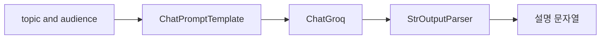

# Prompt와 LLM Chain — 체인 첫 번째 구성

## 이 글에서 답할 질문

- `ChatPromptTemplate`에서 `system`과 `human` 메시지는 어떻게 역할이 갈리는가
- 여러 입력 변수를 프롬프트에 안전하게 넣으려면 어떻게 구성해야 하는가
- `StrOutputParser`와 구조화된 파서의 선택 기준은 무엇인가
- 입력값 일부를 그대로 다음 단계로 넘기려면 어떤 Runnable이 필요한가

> Prompt chain은 문자열을 만드는 코드가 아니라 입력 구조를 메시지 구조로 바꾸는 작은 변환 파이프입니다.



## 최소 실행 예제

```python
import os

from langchain_core.output_parsers import StrOutputParser
from langchain_core.prompts import ChatPromptTemplate
from langchain_groq import ChatGroq

prompt = ChatPromptTemplate.from_messages([
    ("system", "당신은 {audience}에게 설명하는 튜터입니다."),
    ("human", "{topic}을 세 문장으로 설명해 주세요."),
])
chain = prompt | ChatGroq(model="llama-3.1-8b-instant", api_key=os.environ["GROQ_API_KEY"]) | StrOutputParser()

print(chain.invoke({"audience": "주니어 백엔드 개발자", "topic": "PromptTemplate"}))
```

## 이 코드에서 봐야 할 것

- 프롬프트 변수는 문자열 이어붙이기 대신 템플릿 단계에서 관리됩니다.
- `system` 메시지는 말투와 제약을 잡고 `human` 메시지는 실제 질문을 담습니다.
- 파서를 마지막에 붙이면 이후 단계가 항상 문자열을 받는다고 가정할 수 있습니다.
- 프롬프트 수정과 모델 교체가 체인 바깥 코드에 거의 영향을 주지 않습니다.

## 실무에서 헷갈리는 지점

- PromptTemplate은 문자열 포매터이면서 동시에 메시지 구조 생성기입니다.
- 출력 파서를 붙이지 않으면 결과가 `AIMessage`라서 후속 단계 타입이 달라집니다.
- `RunnablePassthrough`는 값을 복사하는 도구가 아니라 현재 입력을 그대로 전달하는 연결점입니다.

## 체크리스트

- [ ] `system`, `human`, `ai` 메시지 역할 차이를 설명할 수 있다
- [ ] 여러 변수로 PromptTemplate을 만들고 실행할 수 있다
- [ ] 파서를 붙였을 때와 붙이지 않았을 때 출력 타입 차이를 이해한다

LangChain 101 시리즈 (2/6)

예제 코드: [github.com/yeongseon-books/langchain-101](https://github.com/yeongseon-books/langchain-101/tree/main/02-prompt-llm-chain)

## 이 글에서 답할 질문

- `ChatPromptTemplate`은 문자열 포맷팅과 무엇이 다를까
- Prompt, LLM, OutputParser를 왜 세 단계로 나누는 걸까
- 여러 입력 변수를 체인에 넣을 때 어떤 형태를 유지해야 할까
- fallback을 붙일 때 체인 경계는 어디로 잡아야 할까

> Prompt chain은 입력 딕셔너리를 프롬프트로 렌더링하고, 모델 호출 결과를 파싱해 애플리케이션이 쓰기 좋은 출력으로 바꾸는 가장 기본적인 LCEL 조립입니다.

## 핵심 흐름 한눈에 보기


지난 글에서 LCEL의 기본 구조를 잡았다면, 이번 글에서는 실제로 자주 쓰는 패턴을 하나씩 만들어 봅니다. `ChatPromptTemplate`을 깊이 이해하고, 출력 파서를 선택하고, 체인에 변수를 넣는 방법을 다룹니다.

이번 글에서 다룰 내용은 다음과 같습니다.

- `ChatPromptTemplate`의 메시지 역할과 포맷
- 여러 변수를 가진 프롬프트 만들기
- `StrOutputParser`, `JsonOutputParser` 선택하기
- `RunnablePassthrough`로 입력을 그대로 넘기기
- 완성된 체인 테스트하기

---

## ChatPromptTemplate 구조

`ChatPromptTemplate`은 대화 형식의 프롬프트를 만드는 클래스입니다. 메시지 목록을 받아 LLM에 전달할 형식으로 렌더링합니다.

세 가지 메시지 역할이 있습니다.

- `system`: 모델의 행동 방식을 지정합니다. 페르소나, 제약, 출력 형식 등을 씁니다.
- `human`: 사용자 입력입니다.
- `ai`: 이전 어시스턴트 응답입니다. 멀티턴 시 이력을 넣을 때 씁니다.

```python
import os

from langchain_core.prompts import ChatPromptTemplate
from langchain_groq import ChatGroq

prompt = ChatPromptTemplate.from_messages([
    ("system", "당신은 {language} 전문가입니다. 명확하고 간결하게 설명합니다."),
    ("human", "{question}"),
])

llm = ChatGroq(
    model="llama-3.1-8b-instant",
    api_key=os.environ["GROQ_API_KEY"],
)

chain = prompt | llm

response = chain.invoke({
    "language": "파이썬",
    "question": "리스트 컴프리헨션은 언제 쓰는 게 좋나요?",
})

print(response.content)
```

`{language}`와 `{question}` 같은 자리 표시자는 `invoke()`에 넘기는 딕셔너리 키와 일치해야 합니다.

---

## 여러 변수를 가진 프롬프트

복잡한 태스크일수록 프롬프트에 여러 변수가 필요합니다. 모두 딕셔너리로 넘깁니다.

```python
import os

from langchain_core.output_parsers import StrOutputParser
from langchain_core.prompts import ChatPromptTemplate
from langchain_groq import ChatGroq

prompt = ChatPromptTemplate.from_messages([
    (
        "system",
        "당신은 코드 리뷰 전문가입니다. "
        "언어: {language}. 리뷰 관점: {review_focus}.",
    ),
    ("human", "다음 코드를 리뷰해 주세요:\n\n```{language}\n{code}\n```"),
])

llm = ChatGroq(
    model="llama-3.1-8b-instant",
    api_key=os.environ["GROQ_API_KEY"],
)

chain = prompt | llm | StrOutputParser()

result = chain.invoke({
    "language": "python",
    "review_focus": "가독성과 예외 처리",
    "code": """
def read_file(path):
    f = open(path)
    return f.read()
""",
})

print(result)
```

---

## StrOutputParser vs JsonOutputParser

출력 파서는 LLM 응답을 원하는 형태로 변환합니다. 두 가지가 자주 쓰입니다.

**StrOutputParser**: `AIMessage.content`를 문자열로 꺼냅니다. 대부분의 경우 이걸로 충분합니다.

**JsonOutputParser**: 모델이 JSON을 출력하도록 유도하고, 그 결과를 Python 딕셔너리로 파싱합니다. 모델에게 JSON 형식으로 응답하도록 프롬프트를 명시해야 합니다.

```python
import os

from langchain_core.output_parsers import JsonOutputParser
from langchain_core.prompts import ChatPromptTemplate
from langchain_groq import ChatGroq

prompt = ChatPromptTemplate.from_messages([
    (
        "system",
        "당신은 JSON만 출력합니다. 다른 텍스트는 포함하지 마세요.",
    ),
    (
        "human",
        "{topic}에 대한 정보를 다음 JSON 형식으로 출력하세요:\n"
        '{{"name": "이름", "description": "설명", "use_case": "활용 사례"}}',
    ),
])

llm = ChatGroq(
    model="llama-3.1-8b-instant",
    api_key=os.environ["GROQ_API_KEY"],
)

chain = prompt | llm | JsonOutputParser()

result = chain.invoke({"topic": "FAISS"})

print(f"타입: {type(result)}")
print(f"name: {result.get('name')}")
print(f"description: {result.get('description')}")
print(f"use_case: {result.get('use_case')}")
```

JSON 파싱이 불안정하다면 LangChain의 `with_structured_output()`을 쓰는 편이 더 안정적입니다. 이 방법은 llm-api-production-101 시리즈에서 다룹니다.

---

## RunnablePassthrough — 입력을 그대로 전달

파이프 체인에서 입력 일부를 그대로 뒤로 전달하고 싶을 때 `RunnablePassthrough`를 씁니다.

```python
import os

from langchain_core.output_parsers import StrOutputParser
from langchain_core.prompts import ChatPromptTemplate
from langchain_core.runnables import RunnablePassthrough
from langchain_groq import ChatGroq

prompt = ChatPromptTemplate.from_messages([
    ("system", "문서를 참고해서 질문에 답하세요."),
    ("human", "문서: {context}\n\n질문: {question}"),
])

llm = ChatGroq(
    model="llama-3.1-8b-instant",
    api_key=os.environ["GROQ_API_KEY"],
)

# context는 그대로, question은 그대로 — 이 체인은 입력을 직접 전달
chain = (
    {"context": RunnablePassthrough(), "question": RunnablePassthrough()}
    | prompt
    | llm
    | StrOutputParser()
)

# 더 일반적인 패턴: 딕셔너리 입력을 그대로 활용
chain2 = prompt | llm | StrOutputParser()

result = chain2.invoke({
    "context": "FAISS는 Facebook AI Research에서 만든 벡터 검색 라이브러리입니다.",
    "question": "FAISS는 누가 만들었나요?",
})

print(result)
```

`RunnablePassthrough`는 나중에 Retriever와 체인을 연결할 때 자주 씁니다. 4편(Retriever)에서 실제 패턴을 볼 수 있습니다.

---

## 체인에 fallback 추가하기

모델 호출이 실패할 때 대체 체인을 실행하도록 `.with_fallbacks()`를 씁니다.

```python
import os

from langchain_core.output_parsers import StrOutputParser
from langchain_core.prompts import ChatPromptTemplate
from langchain_groq import ChatGroq

prompt = ChatPromptTemplate.from_messages([
    ("human", "{question}"),
])

primary_llm = ChatGroq(
    model="llama-3.1-8b-instant",
    api_key=os.environ["GROQ_API_KEY"],
)

fallback_llm = ChatGroq(
    model="llama-3.1-8b-instant",
    api_key=os.environ["GROQ_API_KEY"],
)

primary_chain = prompt | primary_llm | StrOutputParser()
fallback_chain = prompt | fallback_llm | StrOutputParser()

chain_with_fallback = primary_chain.with_fallbacks([fallback_chain])

result = chain_with_fallback.invoke({"question": "파이썬 예외 처리 방법은?"})
print(result)
```

이 패턴은 주 모델이 다운되거나 속도 제한에 걸렸을 때 자동으로 대체 모델로 전환합니다.

---

## 이 코드에서 봐야 할 것

- Prompt chain의 입력은 대부분 딕셔너리입니다. 키 이름이 프롬프트 변수와 맞아야 체인이 자연스럽게 이어집니다.
- `StrOutputParser`와 `JsonOutputParser`의 선택은 모델 품질보다 애플리케이션이 어떤 후속 처리를 기대하는지에 더 가깝습니다.
- `RunnablePassthrough`는 값을 바꾸지 않지만, 체인 안에서 어떤 입력을 그대로 흘려보낼지 명시해 준다는 점이 중요합니다.
- fallback은 예외 처리용 장식이 아니라, 실패해도 같은 출력 계약을 유지하도록 체인을 한 번 더 준비하는 패턴입니다.

## 실무에서 헷갈리는 지점

- 프롬프트 템플릿을 문자열 템플릿으로만 보면 메시지 역할 분리의 장점을 놓치기 쉽습니다.
- JSON 파싱은 파서만 붙이면 끝난다고 생각하기 쉽지만, 모델에게 원하는 스키마를 충분히 강하게 지시해야 안정적입니다.
- fallback 체인은 성공 경로와 동일한 입력·출력 형태를 맞추지 않으면 오히려 디버깅이 더 어려워집니다.

## 체크리스트

- [ ] `ChatPromptTemplate`에 여러 변수를 넣는 입력 딕셔너리를 직접 만들 수 있다
- [ ] 문자열 파서와 JSON 파서를 언제 구분해서 써야 하는지 설명할 수 있다
- [ ] fallback 체인을 붙일 때 출력 형태를 맞춰야 하는 이유를 이해했다

## 마무리

`ChatPromptTemplate`으로 다중 변수 프롬프트를 만들고, `StrOutputParser`와 `JsonOutputParser`의 차이를 확인했습니다. `RunnablePassthrough`는 다음 글들에서 더 자주 나옵니다.

다음 글에서는 Retriever를 체인에 연결해서 문서 검색 결과를 컨텍스트로 주입하는 방법을 다룹니다.

<!-- blog-only:start -->
다음 글: [Retriever — 문서 검색과 컨텍스트 주입](./03-retriever.md)
<!-- blog-only:end -->

<!-- toc:begin -->
## 시리즈 목차

- [LangChain 소개 — LCEL과 Runnable 기본](./01-lcel-runnable-basics.md)
- **Prompt와 LLM Chain — 체인 첫 번째 구성 (현재 글)**
- Retriever — 문서 검색과 컨텍스트 주입 (예정)
- Tool Calling — 외부 도구 연결하기 (예정)
- Streaming — 실시간 출력 처리 (예정)
- 실전 체인 조립 — 컴포넌트를 하나로 연결하기 (예정)

<!-- toc:end -->

---

## 참고 자료

- [ChatPromptTemplate 공식 문서](https://python.langchain.com/docs/modules/model_io/prompts/quick_start/)
- [Output parsers](https://python.langchain.com/docs/modules/model_io/output_parsers/)
- [RunnablePassthrough](https://python.langchain.com/docs/expression_language/primitives/passthrough/)

Tags: LangChain, LCEL, Python, LLM
