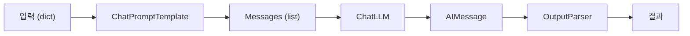

# Prompt와 LLM Chain — 체인 첫 번째 구성

> LangChain 101 시리즈 (2/6)

## 이 글에서 다룰 문제

*프롬프트* 를 *문자열* 로 *조립* 하면 *변수 누락* 과 *역할 혼동* 이 *섞입니다*. *템플릿* 으로 *분리* 하면 *오류* 가 *줄고* *재사용* 이 *쉽습니다*.

## 전체 흐름


## Before/After

**Before**: "`f-string` 으로 *프롬프트* 를 *조립* 하고 *response.content* 를 *직접* *꺼냅니다*."

**After**: "`ChatPromptTemplate | llm | StrOutputParser` 한 줄이 *같은* *흐름* 을 *대체* 합니다."

## 첫 LLM Chain 5단계

### 1단계 — 다중 변수 Prompt 작성

```python
from langchain_core.prompts import ChatPromptTemplate

prompt = ChatPromptTemplate.from_messages([
    ("system", "당신은 {persona} 입니다. 한국어로 답합니다."),
    ("human", "{question}"),
])
```

### 2단계 — LLM 준비

```python
import os
from langchain_groq import ChatGroq

os.environ.setdefault("GROQ_API_KEY", "your-key-here")
llm = ChatGroq(model="llama-3.1-8b-instant", temperature=0)
```

### 3단계 — Parser 연결

```python
from langchain_core.output_parsers import StrOutputParser

parser = StrOutputParser()
chain = prompt | llm | parser
```

### 4단계 — 두 변수로 호출

```python
answer = chain.invoke({
    "persona": "친절한 백엔드 멘토",
    "question": "REST API의 멱등성을 한 문단으로 설명해 주세요.",
})
print(answer)
```

### 5단계 — RunnablePassthrough 로 입력 전달

```python
from langchain_core.runnables import RunnablePassthrough

chain2 = (
    RunnablePassthrough.assign(persona=lambda _: "엄격한 코드 리뷰어")
    | prompt
    | llm
    | parser
)
print(chain2.invoke({"question": "함수가 너무 깁니다. 어떻게 줄이죠?"}))
```

## 이 코드에서 주목할 점

- *템플릿 변수* `{persona}`, `{question}` 은 *invoke 의 dict 키* 와 *완전히* *일치* *해야* 합니다.
- *system* 메시지를 *바꾸면* *모델 행동* 이 *눈에 띄게* *바뀝니다*.
- *RunnablePassthrough.assign* 은 *기존 키* 를 *유지* 하면서 *새 키* 를 *주입* 합니다.

## 자주 하는 실수 5가지

1. ***중괄호 이스케이프* 누락** — *코드 예시* 안에 `{var}` 가 들어가면 *템플릿 변수* 로 *해석* 됩니다. `{{var}}` 로 *피합니다*.
2. ***role 오타*** — `"sytem"` 처럼 *오타* 면 *예외* 없이 *무시* 될 수 있습니다.
3. ***parser 누락*** — *AIMessage* 를 *문자열* 처럼 *연결* 하다가 *TypeError*.
4. ***temperature 미설정*** — *재현* 이 *안* 되면 *디버깅* 이 *어렵습니다*. 학습 단계는 0 추천.
5. ***긴 system 프롬프트*** — *system* 에 *모든* 규칙을 넣으면 *비용* 과 *지연* 이 *늘어납니다*.

## 실무에서는 이렇게 쓰입니다

*프로덕션* 에서는 *프롬프트* 를 *YAML* 또는 *전용 클래스* 로 *분리* 해 *버전 관리* 합니다. *체인* 은 *입력 dict* 만 받게 *유지* 하고, *호출 측* 은 *비즈니스 객체* 를 *dict* 로 *변환* 만 합니다.

## 체크리스트

- [ ] *system* 과 *human* *역할* *분리*.
- [ ] *모든* *템플릿 변수* 가 *invoke* *키* 와 *일치*.
- [ ] *StrOutputParser* 또는 *구조화 파서* *연결*.
- [ ] *RunnablePassthrough* 로 *입력* *전달* *시도*.

## 정리 및 다음 단계

다음 글은 *Retriever — 문서 검색과 컨텍스트 주입* 입니다.

<!-- toc:begin -->
## 시리즈 목차

- [LangChain 소개 — LCEL과 Runnable 기본](./01-lcel-runnable-basics.md)
- **Prompt와 LLM Chain — 체인 첫 번째 구성 (현재 글)**
- Retriever — 문서 검색과 컨텍스트 주입 (예정)
- Tool Calling — 외부 도구 연결하기 (예정)
- Streaming — 실시간 출력 처리 (예정)
- 실전 체인 조립 — 컴포넌트를 하나로 연결하기 (예정)

<!-- toc:end -->

## 참고 자료

- [ChatPromptTemplate](https://python.langchain.com/docs/concepts/prompt_templates/)
- [Output parsers](https://python.langchain.com/docs/concepts/output_parsers/)
- [RunnablePassthrough](https://python.langchain.com/docs/how_to/passthrough/)
- [LangChain GitHub](https://github.com/langchain-ai/langchain)

Tags: LangChain, LCEL, Python, LLM
