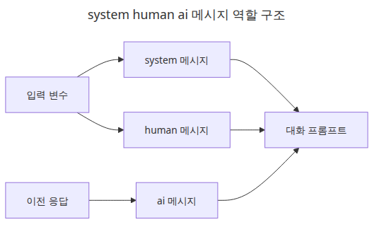
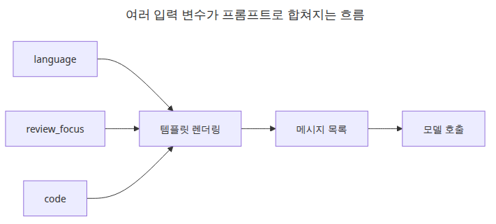
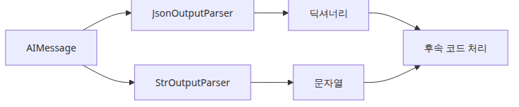

# Prompt와 LLM Chain — 체인 첫 번째 구성

이 글은 LangChain 101 시리즈의 2번째 글입니다.

첫 번째 글에서 LCEL의 뼈대를 봤다면, 이제 가장 자주 손에 잡히는 조합으로 내려와야 합니다. 실제 LangChain 코드는 결국 **입력 dict를 프롬프트로 바꾸고, 모델을 호출하고, 결과를 애플리케이션이 쓰기 좋은 형태로 정리하는 흐름**이 반복되기 때문입니다.

처음에는 프롬프트를 문자열 템플릿 정도로 생각하기 쉽습니다. 하지만 운영 관점에서는 그보다 더 중요한 역할이 있습니다. 어떤 값이 어떤 메시지 역할로 들어가는지, 결과를 문자열로 쓸지 구조화된 dict로 쓸지, 이전 단계 입력을 어느 지점까지 그대로 전달할지까지 이 레이어에서 결정됩니다.

---

## 이 글에서 다룰 문제

- `ChatPromptTemplate`에서 `system`과 `human` 메시지는 역할을 어떻게 나눌까요?
- 입력 변수가 여러 개일 때는 프롬프트를 어떤 모양으로 설계해야 할까요?
- `StrOutputParser`만으로 충분한 경우와 구조화 파싱이 필요한 경우는 언제일까요?
- 체인 중간에서 입력 일부를 그대로 다음 단계로 넘기려면 어떻게 해야 할까요?
- fallback 체인은 어디에 두어야 디버깅이 쉬울까요?

> 프롬프트 체인은 문자열 이어 붙이기를 조금 예쁘게 만든 것이 아닙니다. 애플리케이션 입력을 모델이 기대하는 메시지 형식으로 바꾸는, 타입이 있는 변환 파이프라인입니다.


*이 글에서 답할 질문*

## 최소 실행 예제

```python
import os

from langchain_core.output_parsers import StrOutputParser
from langchain_core.prompts import ChatPromptTemplate
from langchain_groq import ChatGroq

prompt = ChatPromptTemplate.from_messages([
    ("system", "You are a tutor explaining concepts to {audience}."),
    ("human", "Explain {topic} in three sentences."),
])
chain = prompt | ChatGroq(model="llama-3.1-8b-instant", api_key=os.environ["GROQ_API_KEY"]) | StrOutputParser()

print(chain.invoke({"audience": "junior backend engineers", "topic": "PromptTemplate"}))
```

<!-- injected-output:start -->
**Output**

    In the context of OpenAI's API, a PromptTemplate is a pre-defined template used to generate human-like responses by providing a framework for constructing input prompts. By using a PromptTemplate, developers can create a structure for their input, including placeholders for specific information that can be filled in at runtime. This approach enables the model to generate more accurate and relevant responses by leveraging the context provided in the template.

<!-- injected-output:end -->

이 최소 예제는 두 가지를 바로 보여 줍니다. 첫째, 변수 관리는 문자열 조립 코드가 아니라 템플릿 레이어에서 합니다. 둘째, 출력 파서가 붙는 순간 이후 단계는 `AIMessage`가 아니라 평범한 문자열을 다룰 수 있습니다. 이 차이가 작아 보여도, 체인이 길어질수록 가독성과 디버깅 난이도를 크게 바꿉니다.

## 이 코드에서 먼저 볼 점

- 변수는 수동 문자열 조립이 아니라 템플릿 레이어에서 관리됩니다.
- `system` 메시지는 행동을 정하고 `human` 메시지는 요청을 전달합니다.
- 파서를 붙이면 다음 단계는 `AIMessage` 대신 문자열을 받습니다.
- 프롬프트 구조를 바꿔도 체인 나머지를 다시 쓰지 않아도 됩니다.

## 엔지니어가 여기서 자주 헷갈리는 지점

- `ChatPromptTemplate`는 문자열 포매터이면서 동시에 메시지 빌더입니다.
- 파서가 없으면 많은 예제가 텍스트가 아니라 `AIMessage`를 돌려줍니다.
- `RunnablePassthrough`는 현재 입력을 그대로 넘길 뿐, 흩어진 상태를 자동으로 합쳐 주지는 않습니다.

## 체크리스트

- [ ] `system`, `human`, `ai` 메시지 역할을 설명할 수 있다
- [ ] 변수 여러 개를 받는 프롬프트 템플릿을 만들 수 있다
- [ ] 파서가 체인 출력 타입을 어떻게 바꾸는지 이해했다

LangChain 101 (2/6)

Example code: [github.com/yeongseon-books/langchain-101](https://github.com/yeongseon-books/langchain-101/tree/main/02-prompt-llm-chain)

## 이 글에서 다룰 문제

- `ChatPromptTemplate`는 일반 문자열 포매팅과 무엇이 다를까요?
- 왜 프롬프트, LLM, 출력 파서를 분리된 단계로 유지해야 할까요?
- 입력 변수가 여러 개일 때 dict 모양을 어떻게 유지해야 할까요?
- 프롬프트-모델 파이프라인에서 fallback은 어디에 놓는 편이 좋을까요?

> 프롬프트 체인은 가장 작은 단위의 실전 LCEL 파이프라인입니다. 구조화된 입력을 메시지로 바꾸고, 모델을 호출하고, 결과를 애플리케이션 친화적인 출력으로 바꾸는 흐름입니다.

## 전체 흐름 한눈에 보기


*전체 흐름 한눈에 보기*

첫 글에서 LCEL 구조를 봤다면, 이제 본격적으로 손에 익혀야 할 것은 프롬프트 레이어입니다. 실제 코드에서는 multi-variable prompt, parser 선택, passthrough 같은 패턴이 훨씬 자주 등장합니다. 입문 단계에서 이 세 가지를 잘 잡아 두면 이후 RAG나 Tool Calling에서도 같은 감각을 재사용할 수 있습니다.

이 글에서는 다음 주제를 순서대로 보겠습니다.

- `ChatPromptTemplate`의 메시지 역할 분리
- 여러 변수를 받는 프롬프트 작성 방식
- `StrOutputParser`와 `JsonOutputParser`의 선택 기준
- `RunnablePassthrough`로 입력 일부를 그대로 전달하는 패턴
- 완성된 체인에 fallback을 다는 최소 구조

---

## ChatPromptTemplate 구조



*system human ai 메시지 역할*

`ChatPromptTemplate`는 대화형 프롬프트를 만들고, 그것을 LLM이 기대하는 메시지 형식으로 렌더링합니다. 입문 단계에서 가장 먼저 잡아야 할 것은 **역할 분리**입니다.

- `system`: 모델의 행동 원칙, 제약, 출력 스타일을 정합니다.
- `human`: 사용자의 현재 요청을 담습니다.
- `ai`: 이전 응답을 넣어 대화 이력을 재구성할 때 씁니다.

이 구조를 이해하면 프롬프트 설계가 훨씬 단순해집니다. "어떤 정보를 주는가"보다 먼저 "이 정보가 시스템 규칙인가, 사용자 요청인가, 이전 답변인가"를 구분하는 습관이 생기기 때문입니다.

```python
import os

from langchain_core.prompts import ChatPromptTemplate
from langchain_groq import ChatGroq

prompt = ChatPromptTemplate.from_messages([
    ("system", "You are a {language} expert. Explain things clearly and concisely."),
    ("human", "{question}"),
])

llm = ChatGroq(
    model="llama-3.1-8b-instant",
    api_key=os.environ["GROQ_API_KEY"],
)

chain = prompt | llm

response = chain.invoke({
    "language": "Python",
    "question": "When is a list comprehension a better choice than a for loop?",
})

print(response.content)
```

<!-- injected-output:start -->
**Output**

    **List Comprehensions vs For Loops**

    List comprehensions and for loops are both used to create lists in Python, but they serve different purposes and have different use cases.

    **When to Use List Comprehensions:**

    1. **Concise Code:** List comprehensions are a more concise way to create lists, especially when the transformation of each element is simple.
    2. **Performance:** List comprehensions are generally faster than for loops because they create a new list in a single operation.
    3. **Readability:** List comprehensions can be more readable than for loops when the transformation of each element is complex, as they avoid the need for explicit loop control.

    **When to Use For Loops:**

    1. **Mutation:** If the list needs to be modified in place, a for loop is usually a better choice.
    2. **Complex Logic:** When the logic for creating each element is complex and involves multiple conditional statements or functions, a for loop is often easier to read and understand.
    3. **Debugging:** For loops provide more control over the loop and are often easier to debug than list comprehensions.

    **Example Use Cases:**

    ```python
    # List comprehension
    numbers = [1, 2, 3, 4, 5]
    squared_numbers = [x**2 for x in numbers]
    print(squared_numbers)  # [1, 4, 9, 16, 25]

    # For loop equivalent
    numbers = [1, 2, 3, 4, 5]
    squared_numbers = []
    for x in numbers:
        squared_numbers.append(x**2)
    print(squared_numbers)  # [1, 4, 9, 16, 25]
    ```

    In this example, the list comprehension is a better choice because it is more concise and easier to read.

    ```python
    # For loop with mutation
    numbers = [1, 2, 3, 4, 5]
    numbers = [x**2 for x in numbers]
    print(numbers)  # [1, 4, 9, 16, 25]
    ```

    In this example, the for loop is a better choice because it allows us to modify the original list in place.

    In summary, list comprehensions are a better choice when you need to create a new list and the transformation of each element is simple. For loops are a better choice when the list needs to be modified in place, or when the logic for creating each element is complex.

<!-- injected-output:end -->

여기서 `invoke()`에 넘기는 dict 키 이름은 `{language}`, `{question}`과 정확히 맞아야 합니다. 이 규칙은 단순해 보이지만, 실제 디버깅에서 가장 자주 틀리는 지점 중 하나입니다.

---

## 여러 변수를 받는 프롬프트



*여러 변수가 하나의 프롬프트로 들어가는 흐름*

현실적인 작업은 거의 항상 변수 하나로 끝나지 않습니다. 언어, 대상 독자, 리뷰 기준, 원문 코드처럼 여러 입력을 함께 받아야 합니다. 이때 핵심은 **입력을 한 dict 안에서 끝까지 유지하는 것**입니다.

```python
import os

from langchain_core.output_parsers import StrOutputParser
from langchain_core.prompts import ChatPromptTemplate
from langchain_groq import ChatGroq

prompt = ChatPromptTemplate.from_messages([
    (
        "system",
        "You are a code review expert. "
        "Language: {language}. Review focus: {review_focus}.",
    ),
    ("human", "Review the following code:\n\n```{language}\n{code}\n```"),
])

llm = ChatGroq(
    model="llama-3.1-8b-instant",
    api_key=os.environ["GROQ_API_KEY"],
)

chain = prompt | llm | StrOutputParser()

result = chain.invoke({
    "language": "python",
    "review_focus": "readability and error handling",
    "code": """
def read_file(path):
    f = open(path)
    return f.read()
""",
})

print(result)
```

이 패턴이 중요한 이유는 이후 단계에서도 입력 모양을 예측할 수 있기 때문입니다. 운영 코드에서 프롬프트 입력이 함수 인자마다 흩어져 있으면, 템플릿 변수 누락과 리팩터링 비용이 빠르게 커집니다.

---

## StrOutputParser vs JsonOutputParser



*문자열 파서와 JSON 파서 출력 비교*

출력 파서는 LLM 응답을 **다음 코드가 기대하는 자료형**으로 바꿔 줍니다. 여기서 선택 기준은 멋진 추상화가 아니라, downstream code가 무엇을 받아야 하느냐입니다.

- **`StrOutputParser`**: `AIMessage.content`를 문자열로 꺼냅니다. 가장 흔한 기본값입니다.
- **`JsonOutputParser`**: 모델이 JSON을 출력하도록 강하게 유도하고, 그 결과를 Python dict로 파싱합니다.

```python
import os

from langchain_core.output_parsers import JsonOutputParser
from langchain_core.prompts import ChatPromptTemplate
from langchain_groq import ChatGroq

prompt = ChatPromptTemplate.from_messages([
    (
        "system",
        "You output JSON only. Do not include any other text.",
    ),
    (
        "human",
        "Output information about {topic} in this JSON format:\n"
        '{{"name": "name", "description": "description", "use_case": "use case"}}',
    ),
])

llm = ChatGroq(
    model="llama-3.1-8b-instant",
    api_key=os.environ["GROQ_API_KEY"],
)

chain = prompt | llm | JsonOutputParser()

result = chain.invoke({"topic": "FAISS"})

print(f"type: {type(result)}")
print(f"name: {result.get('name')}")
print(f"description: {result.get('description')}")
print(f"use_case: {result.get('use_case')}")
```

<!-- injected-output:start -->
**Output**

    type: <class 'dict'>
    name: FAISS
    description: Facebook AI Similarity Search is an open-source library for efficient similarity search and clustering of dense vectors, written in C++ with optional Python bindings.
    use_case: ['Anomaly detection in high-dimensional data', 'Image and video search', 'Recommendation systems', 'Clustering and dimensionality reduction', 'Nearest neighbor search in large datasets']

<!-- injected-output:end -->

운영 관점에서 보면 여기서 가장 중요한 질문은 "모델이 정확히 어떤 모양을 내야 다음 단계가 안전한가"입니다. 단순 렌더링이면 문자열이면 충분하지만, API 응답이나 후속 계산에 쓰려면 dict나 스키마 기반 구조가 필요합니다. JSON 파싱이 자주 흔들린다면 `with_structured_output()`처럼 더 강한 제약을 거는 방법을 고려해야 합니다.

---

## RunnablePassthrough — 입력을 그대로 전달하기

`RunnablePassthrough`는 입력을 바꾸지 않고 그대로 다음 단계에 넘깁니다. 언뜻 단순해 보이지만, RAG나 멀티 입력 체인에서는 매우 자주 등장합니다. 한쪽 가지에서는 context를 만들고, 다른 쪽 가지에서는 원래 질문을 그대로 유지해야 하기 때문입니다.

```python
import os

from langchain_core.output_parsers import StrOutputParser
from langchain_core.prompts import ChatPromptTemplate
from langchain_core.runnables import RunnablePassthrough
from langchain_groq import ChatGroq

prompt = ChatPromptTemplate.from_messages([
    ("system", "Answer the question using the provided document."),
    ("human", "Document: {context}\n\nQuestion: {question}"),
])

llm = ChatGroq(
    model="llama-3.1-8b-instant",
    api_key=os.environ["GROQ_API_KEY"],
)

chain = prompt | llm | StrOutputParser()

result = chain.invoke({
    "context": "FAISS is a vector search library developed at Facebook AI Research.",
    "question": "Who developed FAISS?",
})

print(result)
```

<!-- injected-output:start -->
**Output**

    FAISS was developed at Facebook AI Research.

<!-- injected-output:end -->

이 글 예제에서는 단순하게 보이지만, 다음 글의 Retriever 연결 패턴에서 `RunnablePassthrough()`가 왜 필요한지 훨씬 또렷해집니다. **질문은 질문대로 보존하고, 검색 결과만 따로 가공해서 prompt의 다른 키로 넣는다**는 것이 핵심입니다.

---

## 체인에 fallback 추가하기


*기본 경로 실패 시 대체 경로로 전환*

`.with_fallbacks()`는 기본 체인이 실패했을 때 대체 체인을 실행합니다. 여기서 중요한 것은 "예외 처리 코드"라기보다, **같은 입력/출력 계약을 유지하는 두 번째 체인**이라는 점입니다.

```python
import os

from langchain_core.output_parsers import StrOutputParser
from langchain_core.prompts import ChatPromptTemplate
from langchain_groq import ChatGroq

prompt = ChatPromptTemplate.from_messages([
    ("human", "{question}"),
])

primary_llm = ChatGroq(
    model="llama-3.1-8b-instant",
    api_key=os.environ["GROQ_API_KEY"],
)

fallback_llm = ChatGroq(
    model="llama-3.1-8b-instant",
    api_key=os.environ["GROQ_API_KEY"],
)

primary_chain = prompt | primary_llm | StrOutputParser()
fallback_chain = prompt | fallback_llm | StrOutputParser()

chain_with_fallback = primary_chain.with_fallbacks([fallback_chain])

result = chain_with_fallback.invoke({"question": "How does Python handle exceptions?"})
print(result)
```

<!-- injected-output:start -->
**Output**

    **Handling Exceptions in Python**
    =====================================

    Python provides a robust exception handling mechanism to deal with runtime errors and other exceptional conditions. Here's an overview of how Python handles exceptions:

    ### Types of Exceptions

    Python has two types of exceptions:

    1.  **Built-in Exceptions**: These are exceptions that are built into the Python language, such as `TypeError`, `ValueError`, `IndexError`, etc.
    2.  **Custom Exceptions**: These are exceptions that are created by the developer to represent specific error conditions in their code.

    ### Exception Handling

    Python uses a `try`-`except` block to handle exceptions. The basic syntax is as follows:

    ```python
    try:
        # Code that might raise an exception
    except ExceptionType:
        # Code to handle the exception
    ```

    Here's an example:

    ```python
    try:
        x = 5 / 0
    except ZeroDivisionError:
        print("Cannot divide by zero!")
    ```

    In this example, the `try` block attempts to divide `5` by `0`, which raises a `ZeroDivisionError`. The `except` block catches this exception and prints an error message.

    ### Multiple Except Blocks

    You can have multiple `except` blocks to handle different types of exceptions:

    ```python
    try:
        x = 5 / 0
    except ZeroDivisionError:
        print("Cannot divide by zero!")
    except TypeError:
        print("Invalid data type!")
    ```

    ### Raising Exceptions

    You can raise exceptions using the `raise` keyword:

    ```python
    def divide(a, b):
        if b == 0:
            raise ZeroDivisionError("Cannot divide by zero!")
        return a / b
    ```

    In this example, the `divide` function raises a `ZeroDivisionError` if the divisor is zero.

    ... (truncated)

<!-- injected-output:end -->

이 패턴은 기본 모델이 일시적으로 불가능하거나 rate limit에 걸렸을 때 자동으로 다른 경로로 전환하게 해 줍니다. 다만 운영에서 정말 중요한 조건은 하나입니다. **fallback도 같은 출력 모양을 반환해야 한다**는 점입니다. 그렇지 않으면 장애 시점에만 다른 타입 버그가 터집니다.

---

## 이 코드에서 주목할 점

- 프롬프트 체인은 대체로 dict를 입력으로 받으며, 키 이름은 템플릿 변수와 정확히 맞아야 합니다.
- `StrOutputParser`와 `JsonOutputParser`의 선택은 주로 다음 단계 코드가 어떤 자료형을 기대하느냐의 문제입니다.
- `RunnablePassthrough`는 값이 그대로 유지되어야 할 때도 데이터 흐름을 명시적으로 보이게 해 줍니다.
- fallback은 방어 코드가 아니라, 기본 경로가 실패해도 같은 입출력 계약을 유지하는 두 번째 체인입니다.

## 엔지니어가 자주 헷갈리는 지점

- 프롬프트 템플릿을 단순 문자열 보간으로만 보면, 역할이 나뉜 메시지 구조의 가치를 놓치기 쉽습니다.
- JSON 파싱은 모델이 따라야 할 스키마를 프롬프트에서 강하게 제한할 때에만 안정적입니다.
- fallback 체인이 기본 체인과 다른 출력 모양을 반환하면 장애 대응이 훨씬 어려워집니다.

## 체크리스트

- [ ] 여러 변수를 받는 `ChatPromptTemplate`용 입력 dict를 만들 수 있다
- [ ] 언제 `StrOutputParser`면 충분하고, 언제 구조화 파싱이 필요한지 안다
- [ ] fallback 체인이 왜 같은 출력 모양을 유지해야 하는지 이해했다

## 정리

이제 여러 변수를 받는 프롬프트를 만들고, 작업 성격에 맞는 출력 파서를 고르고, 이전 입력을 그대로 전달하면서 체인을 조합할 수 있습니다. LangChain에서 프롬프트 체인은 문자열을 예쁘게 만드는 단계가 아니라, **입력 구조를 유지한 채 모델 호출 준비를 담당하는 핵심 변환 레이어**라고 보면 됩니다.

다음 글에서는 Retriever를 체인에 연결해, 검색된 문서 청크를 모델 프롬프트에 컨텍스트로 주입하는 기본 RAG 패턴을 만들어 보겠습니다.

<!-- toc:begin -->
## 시리즈 목차

- [LangChain 소개 — LCEL과 Runnable 기본](./01-lcel-runnable-basics.md)
- **Prompt와 LLM Chain — 체인 첫 번째 구성 (현재 글)**
- Retriever — 문서 검색과 컨텍스트 주입 (예정)
- Tool Calling — 외부 도구 연결하기 (예정)
- Streaming — 실시간 출력 처리 (예정)
- 실전 체인 조립 — 컴포넌트를 하나로 연결하기 (예정)

<!-- toc:end -->

---

## 참고 자료

- [ChatPromptTemplate documentation](https://python.langchain.com/docs/modules/model_io/prompts/quick_start/)
- [Output parsers](https://python.langchain.com/docs/modules/model_io/output_parsers/)
- [RunnablePassthrough](https://python.langchain.com/docs/expression_language/primitives/passthrough/)

Tags: LangChain, LCEL, Python, LLM
