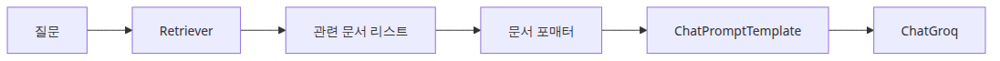
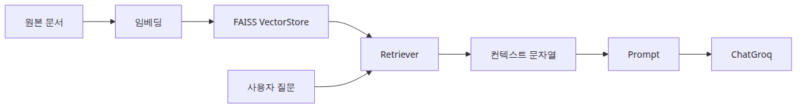
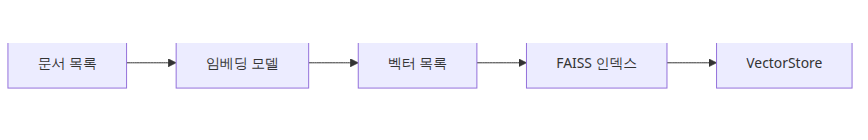
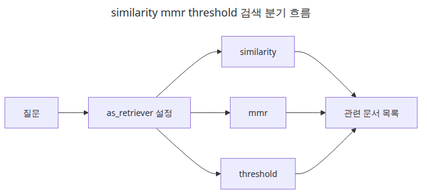
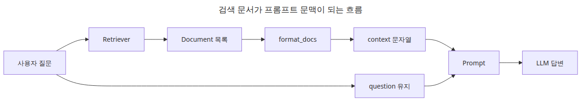
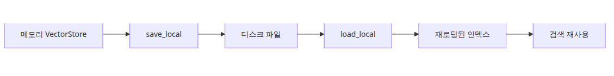

# Retriever — 문서 검색과 컨텍스트 주입

이 글은 LangChain 101 시리즈의 3번째 글입니다.

RAG를 처음 배우면 많은 사람이 곧바로 프롬프트 문구부터 만지기 시작합니다. 하지만 실제로는 그보다 앞단에서 더 중요한 일이 있습니다. **질문에 대해 어떤 문서를 꺼내 올지 결정하는 검색 단계**입니다. 프롬프트가 아무리 좋아도, 모델 앞에 놓인 문서가 틀리거나 잡음이 많으면 답변 품질은 쉽게 흔들립니다.

LangChain은 이 검색 단계를 *VectorStore*와 *Retriever*로 나눠 표현합니다. 저장소와 검색 인터페이스를 분리해 두면, 뒤쪽 체인은 "어떤 저장 엔진을 썼는가"보다 "질문을 넣으면 관련 문서 리스트가 나온다"는 계약만 신경 쓰면 됩니다.

---

## 이 글에서 다룰 문제

- LangChain은 왜 Retriever를 그 아래 VectorStore와 분리할까요?
- `as_retriever()`가 체인 안에서 어떤 입력/출력 계약을 제공할까요?
- 검색된 문서를 프롬프트에 넣기 전에 어떤 형식으로 정리해야 할까요?
- RAG 품질의 상당 부분은 왜 LLM 호출 이전에 결정될까요?
- `k`, 검색 방식, 문서 포맷터는 어떤 식으로 먼저 조정해야 할까요?

> Retriever는 스스로 지식을 저장하지 않습니다. 질문을 받아, 모델에게 보여 줄 가치가 있는 문서 일부를 골라 주는 검색 경계입니다.



*이 글에서 답할 질문*

## 최소 실행 예제

```python
from langchain_community.embeddings import HuggingFaceEmbeddings
from langchain_community.vectorstores import FAISS

embedding = HuggingFaceEmbeddings(model_name="sentence-transformers/all-MiniLM-L6-v2")
vectorstore = FAISS.from_texts([
    "FAISS is a high-speed vector search library.",
    "A Retriever finds documents relevant to a question.",
], embedding)
retriever = vectorstore.as_retriever(search_kwargs={"k": 1})

print(retriever.invoke("What does a Retriever do?")[0].page_content)
```

<!-- injected-output:start -->
**Output**

    A Retriever finds documents relevant to a question.

<!-- injected-output:end -->

이 짧은 예제의 핵심은 검색 엔진 내부 구현이 아니라 계약입니다. 임베딩 모델은 텍스트를 벡터로 만들고, VectorStore는 그것을 저장하고, Retriever는 질문을 받아 관련 문서 리스트를 돌려줍니다. 뒤쪽 체인은 이제 `question -> list[Document]`만 알면 됩니다.

## 이 코드에서 먼저 볼 점

- 임베딩 모델은 텍스트를 벡터로 바꾸고, Retriever는 질문을 문서 리스트로 바꾸는 인터페이스를 제공합니다.
- 체인 나머지는 `question -> list[Document]` 계약만 알면 됩니다.
- 검색 결과는 아직 프롬프트에 바로 넣을 수 있는 상태가 아니므로, 포맷팅 단계가 하나 더 필요합니다.
- RAG에서는 초반에 프롬프트보다 검색 품질이 더 큰 영향을 주는 경우가 많습니다.

## 엔지니어가 여기서 자주 헷갈리는 지점

- VectorStore를 만들었다고 해서 곧바로 usable한 RAG 체인이 생기는 것은 아닙니다.
- `k`를 크게 올린다고 항상 좋아지지 않습니다. 회수율과 함께 잡음도 늘어납니다.
- Retriever는 답을 생성하지 않습니다. 답을 위해 필요한 문맥을 고릅니다.

## 체크리스트

- [ ] VectorStore와 Retriever의 차이를 설명할 수 있다
- [ ] `list[Document]`를 프롬프트용 context 문자열로 바꿀 수 있다
- [ ] Retriever를 LCEL 체인에 연결할 수 있다

LangChain 101 (3/6)

Example code: [github.com/yeongseon-books/langchain-101](https://github.com/yeongseon-books/langchain-101/tree/main/03-retriever)

## 이 글에서 다룰 문제

- Retriever는 VectorStore와 어떤 관계일까요?
- `as_retriever()` 이후에 어떤 검색 파라미터를 먼저 조정해야 할까요?
- 검색된 문서를 프롬프트 컨텍스트로 바꿀 때 무엇을 조심해야 할까요?
- 기본 RAG 체인 안에서 Retriever는 어느 위치에 들어갈까요?

> Retriever는 LangChain의 검색 경계입니다. 질문에 관련 문서를 골라 다음 체인이 답을 만들 수 있도록 문맥을 넘깁니다.

## 전체 흐름 한눈에 보기



*전체 흐름 한눈에 보기*

Retriever는 질의를 받아 관련 문서 리스트를 반환합니다. LangChain은 이를 특정 벡터 DB 문법이 아니라 공통 검색 인터페이스로 감싸기 때문에, 뒤쪽 체인은 FAISS를 쓰든 Chroma를 쓰든 Elasticsearch를 쓰든 같은 방식으로 다룰 수 있습니다.

이 글에서는 FAISS 기반 Retriever를 만들고, 그것을 프롬프트에 연결해 가장 기본적인 RAG 구조를 조립해 보겠습니다. 다룰 항목은 다음과 같습니다.

- FAISS VectorStore와 Retriever 만들기
- `as_retriever()`와 검색 파라미터
- Retriever를 체인에 연결하는 패턴
- 검색 문서를 context로 주입하는 방식
- 여러 문서를 하나의 context 문자열로 합치는 이유

---

## FAISS VectorStore 만들기



*문서가 벡터 인덱스로 바뀌는 흐름*

LangChain의 `FAISS` 클래스는 FAISS 인덱스를 VectorStore 인터페이스 뒤에 감쌉니다. 문자열 리스트와 임베딩 모델만 넘기면, 인덱스 생성과 저장 구조는 클래스가 처리합니다.

```bash
pip install langchain langchain-community faiss-cpu sentence-transformers langchain-groq
```

```python
from langchain_community.embeddings import HuggingFaceEmbeddings
from langchain_community.vectorstores import FAISS

embedding_model = HuggingFaceEmbeddings(
    model_name="sentence-transformers/all-MiniLM-L6-v2",
    model_kwargs={"device": "cpu"},
    encode_kwargs={"normalize_embeddings": True},
)

documents = [
    "FAISS is a high-speed vector search library developed at Facebook AI Research.",
    "Cosine similarity measures the directional similarity between two vectors.",
    "Embedding models project text into a high-dimensional vector space.",
    "sentence-transformers specializes in sentence-level embeddings.",
    "Vector search captures semantic similarity that keyword search misses.",
    "RAG combines retrieved documents with an LLM prompt.",
    "Chunking strategies split long documents into embedding-sized units.",
]

vectorstore = FAISS.from_texts(
    texts=documents,
    embedding=embedding_model,
)

print(f"index vector count: {vectorstore.index.ntotal}")
```

<!-- injected-output:start -->
**Output**

    index vector count: 7

<!-- injected-output:end -->

여기서 중요한 포인트는 검색 애플리케이션이 **인덱싱 시점**과 **질의 시점**으로 나뉜다는 점입니다. 문서를 벡터로 바꾸고 저장하는 비용은 보통 미리 지불하고, 사용자 요청 시에는 그 인덱스를 조회합니다. 이 구분이 흐려지면 데모는 돌아가도 실서비스에서는 불필요하게 느려집니다.

---

## Retriever 만들기



*similarity mmr threshold 검색 경로*

`as_retriever()`는 VectorStore를 Retriever 인터페이스로 감쌉니다. 그 결과 뒤쪽 체인은 저장소 구현 대신 검색 계약만 보게 됩니다.

```python
retriever = vectorstore.as_retriever(
    search_type="similarity",  # default: cosine similarity
    search_kwargs={"k": 3},    # number of results to return
)

docs = retriever.invoke("how vector search works")

for i, doc in enumerate(docs):
    print(f"[{i}] {doc.page_content}")
```

여기서 조정할 수 있는 대표 `search_type`은 세 가지입니다.

- `"similarity"`: 코사인 유사도 기반 top-k 검색
- `"mmr"`: 관련성과 다양성을 함께 고려하는 maximal marginal relevance
- `"similarity_score_threshold"`: 임계치 이상인 문서만 반환

```python
# MMR — 다양성을 우선합니다
retriever_mmr = vectorstore.as_retriever(
    search_type="mmr",
    search_kwargs={"k": 3, "fetch_k": 10, "lambda_mult": 0.5},
)
```

운영 관점에서 보면 `k`와 `search_type`은 프롬프트 문구보다 먼저 손대야 할 튜닝 포인트입니다. 답변이 엉뚱하면 많은 팀이 prompt를 바꾸지만, 실제 원인은 검색 recall이나 context 잡음인 경우가 더 많습니다.

---

## Retriever를 체인에 연결하기



*검색된 문서가 프롬프트 컨텍스트가 되는 흐름*

가장 기본적인 RAG 패턴은 이렇습니다. 관련 문서를 검색하고, 그것을 context로 합치고, 질문과 함께 프롬프트에 넣고, LLM이 답하게 합니다.

```python
import os

from langchain_community.embeddings import HuggingFaceEmbeddings
from langchain_community.vectorstores import FAISS
from langchain_core.output_parsers import StrOutputParser
from langchain_core.prompts import ChatPromptTemplate
from langchain_core.runnables import RunnablePassthrough
from langchain_groq import ChatGroq

def format_docs(docs: list) -> str:
    """Combine a list of documents into a single context string."""
    return "\n\n".join(doc.page_content for doc in docs)

embedding_model = HuggingFaceEmbeddings(
    model_name="sentence-transformers/all-MiniLM-L6-v2",
    model_kwargs={"device": "cpu"},
    encode_kwargs={"normalize_embeddings": True},
)

documents = [
    "FAISS is a high-speed vector search library developed at Facebook AI Research.",
    "Cosine similarity measures the directional similarity between two vectors.",
    "Embedding models project text into a high-dimensional vector space.",
    "sentence-transformers specializes in sentence-level embeddings.",
    "Vector search captures semantic similarity that keyword search misses.",
    "RAG combines retrieved documents with an LLM prompt.",
]

vectorstore = FAISS.from_texts(texts=documents, embedding=embedding_model)
retriever = vectorstore.as_retriever(search_kwargs={"k": 3})

prompt = ChatPromptTemplate.from_messages([
    (
        "system",
        "Answer the question using only the provided documents. "
        "If the answer is not in the documents, say you don't know.\n\n"
        "Documents:\n{context}",
    ),
    ("human", "{question}"),
])

llm = ChatGroq(
    model="llama-3.1-8b-instant",
    api_key=os.environ["GROQ_API_KEY"],
)

rag_chain = (
    {
        "context": retriever | format_docs,
        "question": RunnablePassthrough(),
    }
    | prompt
    | llm
    | StrOutputParser()
)

questions = [
    "What is FAISS?",
    "How does the RAG pattern work?",
    "What do embedding models do?",
]

for question in questions:
    print(f"\nquestion: {question}")
    answer = rag_chain.invoke(question)
    print(f"answer: {answer}")
```

<!-- injected-output:start -->
**Output**

    question: What is FAISS?
    answer: FAISS is a high-speed vector search library developed at Facebook AI Research.

    question: How does the RAG pattern work?
    answer: According to the documents, RAG (Retrieval Augmented Generator) combines retrieved documents with an LLM (Large Language Model) prompt, but it doesn't explain the specifics of the pattern.

    question: What do embedding models do?
    answer: Embedding models project text into a high-dimensional vector space.

<!-- injected-output:end -->

핵심은 이 입력 dict입니다.

```python
{
    "context": retriever | format_docs,
    "question": RunnablePassthrough(),
}
```

`retriever | format_docs`는 질문을 받아 문서를 찾고, 그 문서를 하나의 문자열로 합칩니다. `RunnablePassthrough()`는 원래 질문을 그대로 `question` 키로 전달합니다. 이 패턴이 LangChain RAG 체인의 표준형이라고 보면 됩니다.

---

## VectorStore 저장하고 다시 불러오기



*인덱스 저장과 재로딩 생명주기*

```python
from langchain_community.embeddings import HuggingFaceEmbeddings
from langchain_community.vectorstores import FAISS

embedding_model = HuggingFaceEmbeddings(
    model_name="sentence-transformers/all-MiniLM-L6-v2",
    model_kwargs={"device": "cpu"},
    encode_kwargs={"normalize_embeddings": True},
)

documents = [
    "FAISS is a high-speed vector search library developed at Facebook AI Research.",
    "RAG combines retrieved documents with an LLM prompt.",
]

vectorstore = FAISS.from_texts(texts=documents, embedding=embedding_model)

# 저장
vectorstore.save_local("faiss_store")
print("saved")

# 다시 불러오기
loaded_store = FAISS.load_local(
    "faiss_store",
    embeddings=embedding_model,
    allow_dangerous_deserialization=True,
)
print(f"reloaded: {loaded_store.index.ntotal} vectors")

# 검증
results = loaded_store.similarity_search("vector search", k=1)
print(f"\nresult: {results[0].page_content}")
```

<!-- injected-output:start -->
**Output**

    saved
    reloaded: 2 vectors

    result: FAISS is a high-speed vector search library developed at Facebook AI Research.

<!-- injected-output:end -->

이 예제가 중요한 이유는 Retriever가 보통 일회성 메모리 데모 위에 있지 않기 때문입니다. 실제 서비스에서는 인덱스를 재사용하고, 색인 파이프라인과 질의 파이프라인을 분리하는 것이 기본입니다.

---

## 이 코드에서 주목할 점

- VectorStore는 저장 레이어이고, Retriever는 그 위에 얹힌 질의 인터페이스입니다.
- `retriever | format_docs`는 검색 결과를 프롬프트용 context로 넘기는 표준 LCEL 브리지입니다.
- `RunnablePassthrough()`는 원래 질문을 별도 키로 유지해 prompt가 context와 question을 모두 보게 합니다.
- 인덱스 저장/재로딩 예제가 중요한 이유는, 실전 Retriever는 대개 재사용 가능한 인덱스 위에 올라가기 때문입니다.

## 엔지니어가 자주 헷갈리는 지점

- Retriever는 답을 생성하지 않습니다. 문서를 선택할 뿐이고, 최종 응답 합성은 여전히 LLM이 합니다.
- 검색 품질 문제를 프롬프트 문제로 오진하는 경우가 많습니다. prompt를 바꾸기 전에 chunking, embedding, `k`를 먼저 확인해야 합니다.
- 문서를 단순히 이어 붙이면 context window를 금방 넘길 수 있으므로, `format_docs`는 길이 제어 지점이기도 합니다.

## 체크리스트

- [ ] VectorStore와 Retriever 차이를 설명할 수 있다
- [ ] 가장 먼저 조정할 `search_kwargs`가 무엇인지 안다
- [ ] 검색 문서를 프롬프트에 넣기 전에 포맷팅이 필요한 이유를 이해했다

## 정리

Retriever 인터페이스는 뒤에 어떤 검색 시스템이 있든 공통 질의 계약으로 감싸 줍니다. LangChain에서 RAG를 조립할 때는 `context: retriever | format_docs, question: RunnablePassthrough()` 패턴이 사실상 기본형입니다.

다음 글에서는 Tool Calling으로 넘어가, 모델이 외부 함수를 요청하고 애플리케이션이 그 결과를 다시 대화에 주입하는 루프를 보겠습니다.

<!-- toc:begin -->
## 시리즈 목차

- [LangChain 소개 — LCEL과 Runnable 기본](./01-lcel-runnable-basics.md)
- [Prompt와 LLM Chain — 체인 첫 번째 구성](./02-prompt-llm-chain.md)
- **Retriever — 문서 검색과 컨텍스트 주입 (현재 글)**
- Tool Calling — 외부 도구 연결하기 (예정)
- Streaming — 실시간 출력 처리 (예정)
- 실전 체인 조립 — 컴포넌트를 하나로 연결하기 (예정)

<!-- toc:end -->

---

## 참고 자료

- [LangChain Retriever interface](https://python.langchain.com/docs/modules/data_connection/retrievers/)
- [FAISS VectorStore](https://python.langchain.com/docs/integrations/vectorstores/faiss/)
- [Building a RAG chain](https://python.langchain.com/docs/use_cases/question_answering/)

Tags: LangChain, LCEL, Python, LLM
