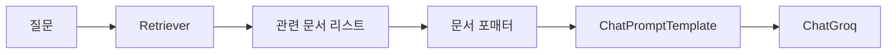
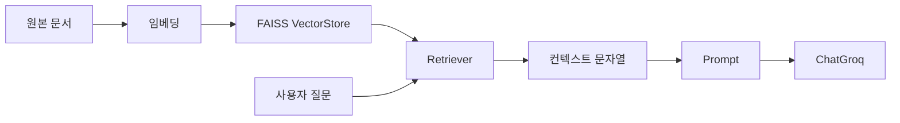

# Retriever — 문서 검색과 컨텍스트 주입

## 이 글에서 답할 질문

- Retriever는 VectorStore와 무엇이 다르고 왜 분리되어 있는가
- `as_retriever()`로 만들면 체인 안에서 어떤 입력과 출력을 주고받는가
- 검색된 여러 문서를 프롬프트 컨텍스트로 넣을 때 어떤 포맷이 안정적인가
- RAG의 정확도 문제를 Retriever 단계에서 어디까지 줄일 수 있는가

> Retriever는 문서를 저장하는 컴포넌트가 아니라 질문을 검색 가능한 컨텍스트로 바꾸는 진입점입니다.



## 최소 실행 예제

```python
from langchain_community.embeddings import HuggingFaceEmbeddings
from langchain_community.vectorstores import FAISS

embedding = HuggingFaceEmbeddings(model_name="sentence-transformers/all-MiniLM-L6-v2")
vectorstore = FAISS.from_texts([
    "FAISS는 고속 벡터 검색 라이브러리입니다.",
    "Retriever는 질문과 관련된 문서를 찾습니다.",
], embedding)
retriever = vectorstore.as_retriever(search_kwargs={"k": 1})

print(retriever.invoke("Retriever가 무엇을 하나요?")[0].page_content)
```

## 이 코드에서 봐야 할 것

- 임베딩 모델은 텍스트를 벡터로 바꾸고, Retriever는 그 벡터 인덱스를 검색 인터페이스로 감춥니다.
- 체인 입장에서는 `query -> documents`라는 일관된 계약만 알면 됩니다.
- 검색 결과는 문자열이 아니라 `Document` 객체 목록이므로 후처리 단계가 필요합니다.
- RAG 품질의 첫 관문은 프롬프트보다 검색 결과 품질입니다.

## 실무에서 헷갈리는 지점

- VectorStore를 만들었다고 바로 RAG가 되는 것은 아닙니다. 문서 포맷팅 단계가 꼭 필요합니다.
- `k`를 크게 늘리면 항상 좋아지는 것이 아니라 노이즈가 늘 수 있습니다.
- Retriever는 답을 생성하지 않고, 답에 넣을 문맥만 고릅니다.

## 체크리스트

- [ ] VectorStore와 Retriever의 역할 차이를 설명할 수 있다
- [ ] 검색된 `Document` 리스트를 문자열 컨텍스트로 바꿀 수 있다
- [ ] 간단한 Retriever를 LCEL 체인에 연결할 수 있다

LangChain 101 시리즈 (3/6)

예제 코드: [github.com/yeongseon-books/langchain-101](https://github.com/yeongseon-books/langchain-101/tree/main/03-retriever)

## 이 글에서 답할 질문

- Retriever는 VectorStore와 어떤 관계를 가질까
- `as_retriever()` 뒤에 어떤 검색 파라미터를 조절할 수 있을까
- 검색 결과를 프롬프트 컨텍스트 문자열로 바꿀 때 무엇을 주의해야 할까
- RAG 체인에서 retriever는 정확히 어느 위치에 들어갈까

> Retriever는 질문을 받아 관련 문서를 고르고, 그 결과를 프롬프트에 넣을 수 있는 컨텍스트로 바꾸는 LangChain의 검색 경계입니다.

## 핵심 흐름 한눈에 보기



Retriever는 쿼리를 받아 관련 문서 목록을 반환하는 컴포넌트입니다. LangChain의 Retriever 인터페이스는 `get_relevant_documents(query)` 메서드 하나로 정의됩니다. 뒤에 어떤 검색 시스템이 있든 — FAISS, Chroma, Elasticsearch — 체인에서는 같은 방식으로 사용합니다.

이번 글에서는 FAISS 기반 Retriever를 만들고, 그 결과를 프롬프트에 주입하는 RAG 패턴의 기본 형태를 구현합니다.

다룰 내용은 다음과 같습니다.

- FAISS VectorStore와 Retriever 만들기
- `as_retriever()`와 검색 파라미터
- Retriever를 체인에 연결하기
- 검색 결과를 컨텍스트로 주입하는 패턴
- 여러 문서를 하나의 컨텍스트 문자열로 합치기

---

<!-- ebook-only:start -->

이 장의 핵심: **Retriever는 질문을 받아 관련 문서를 돌려준다.** VectorStore를 검색 인터페이스로 추상화한 것이다.

## 이 장의 위치

이 글은 시리즈 6편 중 3번째 장입니다.
앞 장에서는 **Prompt와 LLM Chain — 체인 첫 번째 구성**을 다뤘습니다.
이 장을 마치면 다음 장에서 **Tool Calling — 외부 도구 연결하기**으로 이어집니다.
<!-- ebook-only:end -->

## FAISS VectorStore 만들기

LangChain은 `FAISS` 클래스를 통해 벡터 저장소를 추상화합니다. 문서 목록과 임베딩 모델만 넘기면 인덱스를 자동으로 구성합니다.

```bash
pip install langchain langchain-community faiss-cpu sentence-transformers langchain-groq
```

```python
from langchain_community.embeddings import HuggingFaceEmbeddings
from langchain_community.vectorstores import FAISS

embedding_model = HuggingFaceEmbeddings(
    model_name="sentence-transformers/all-MiniLM-L6-v2",
    model_kwargs={"device": "cpu"},
    encode_kwargs={"normalize_embeddings": True},
)

documents = [
    "FAISS는 Facebook AI Research에서 개발한 고속 벡터 검색 라이브러리입니다.",
    "코사인 유사도는 두 벡터의 방향 유사성을 측정합니다.",
    "임베딩 모델은 텍스트를 고차원 벡터 공간에 투영합니다.",
    "sentence-transformers는 문장 수준 임베딩에 특화된 라이브러리입니다.",
    "벡터 검색은 키워드 검색이 놓치는 의미적 유사성을 잡아냅니다.",
    "RAG는 검색된 문서를 LLM 프롬프트에 결합하는 패턴입니다.",
    "청크 전략은 긴 문서를 임베딩 가능한 단위로 나누는 방법입니다.",
]

vectorstore = FAISS.from_texts(
    texts=documents,
    embedding=embedding_model,
)

print(f"인덱스 벡터 수: {vectorstore.index.ntotal}")
```

---

## Retriever 만들기

`as_retriever()`는 VectorStore를 Retriever 인터페이스로 감쌉니다. 검색 방식과 결과 수를 파라미터로 지정합니다.

```python
retriever = vectorstore.as_retriever(
    search_type="similarity",  # 기본값: 코사인 유사도
    search_kwargs={"k": 3},    # 반환할 문서 수
)

docs = retriever.invoke("벡터 검색의 원리")

for i, doc in enumerate(docs):
    print(f"[{i}] {doc.page_content}")
```

`search_type` 옵션은 세 가지입니다.

- `"similarity"`: 코사인 유사도 기반, 상위 k개 반환
- `"mmr"`: 최대 한계 관련성 — 다양성과 관련성을 함께 고려
- `"similarity_score_threshold"`: 임계값 이상의 유사도를 가진 문서만 반환

```python
# MMR 예시 — 다양성 강조
retriever_mmr = vectorstore.as_retriever(
    search_type="mmr",
    search_kwargs={"k": 3, "fetch_k": 10, "lambda_mult": 0.5},
)
```

---

## Retriever를 체인에 연결하기

Retriever의 출력(문서 목록)을 LLM 프롬프트의 컨텍스트로 주입하는 패턴입니다.

```python
import os

from langchain_community.embeddings import HuggingFaceEmbeddings
from langchain_community.vectorstores import FAISS
from langchain_core.output_parsers import StrOutputParser
from langchain_core.prompts import ChatPromptTemplate
from langchain_core.runnables import RunnablePassthrough
from langchain_groq import ChatGroq

def format_docs(docs: list) -> str:
    """문서 목록을 하나의 컨텍스트 문자열로 합칩니다."""
    return "\n\n".join(doc.page_content for doc in docs)

embedding_model = HuggingFaceEmbeddings(
    model_name="sentence-transformers/all-MiniLM-L6-v2",
    model_kwargs={"device": "cpu"},
    encode_kwargs={"normalize_embeddings": True},
)

documents = [
    "FAISS는 Facebook AI Research에서 개발한 고속 벡터 검색 라이브러리입니다.",
    "코사인 유사도는 두 벡터의 방향 유사성을 측정합니다.",
    "임베딩 모델은 텍스트를 고차원 벡터 공간에 투영합니다.",
    "sentence-transformers는 문장 수준 임베딩에 특화된 라이브러리입니다.",
    "벡터 검색은 키워드 검색이 놓치는 의미적 유사성을 잡아냅니다.",
    "RAG는 검색된 문서를 LLM 프롬프트에 결합하는 패턴입니다.",
]

vectorstore = FAISS.from_texts(texts=documents, embedding=embedding_model)
retriever = vectorstore.as_retriever(search_kwargs={"k": 3})

prompt = ChatPromptTemplate.from_messages([
    (
        "system",
        "다음 문서를 참고해서 질문에 답하세요. 문서에 없는 내용은 모른다고 하세요.\n\n"
        "문서:\n{context}",
    ),
    ("human", "{question}"),
])

llm = ChatGroq(
    model="llama-3.1-8b-instant",
    api_key=os.environ["GROQ_API_KEY"],
)

# RAG 체인
rag_chain = (
    {
        "context": retriever | format_docs,
        "question": RunnablePassthrough(),
    }
    | prompt
    | llm
    | StrOutputParser()
)

questions = [
    "FAISS는 무엇인가요?",
    "RAG 패턴은 어떻게 동작하나요?",
    "임베딩 모델은 무엇을 하나요?",
]

for question in questions:
    print(f"\n질문: {question}")
    answer = rag_chain.invoke(question)
    print(f"답변: {answer}")
```

핵심 부분은 체인 입력 딕셔너리입니다.

```python
{
    "context": retriever | format_docs,
    "question": RunnablePassthrough(),
}
```

`retriever | format_docs`는 쿼리를 받아 → 관련 문서를 검색하고 → 문자열로 합칩니다. `RunnablePassthrough()`는 쿼리를 그대로 `"question"` 키로 넘깁니다.

---

## VectorStore 저장과 불러오기

VectorStore도 디스크에 저장할 수 있습니다. 인덱스를 한 번만 만들고 재사용할 때 유용합니다.

```python
from langchain_community.embeddings import HuggingFaceEmbeddings
from langchain_community.vectorstores import FAISS

embedding_model = HuggingFaceEmbeddings(
    model_name="sentence-transformers/all-MiniLM-L6-v2",
    model_kwargs={"device": "cpu"},
    encode_kwargs={"normalize_embeddings": True},
)

documents = [
    "FAISS는 Facebook AI Research에서 개발한 고속 벡터 검색 라이브러리입니다.",
    "RAG는 검색된 문서를 LLM 프롬프트에 결합하는 패턴입니다.",
]

vectorstore = FAISS.from_texts(texts=documents, embedding=embedding_model)

# 저장
vectorstore.save_local("faiss_store")
print("저장 완료")

# 불러오기
loaded_store = FAISS.load_local(
    "faiss_store",
    embeddings=embedding_model,
    allow_dangerous_deserialization=True,
)
print(f"불러오기 완료: {loaded_store.index.ntotal}개 벡터")

# 검색 테스트
results = loaded_store.similarity_search("벡터 검색", k=1)
print(f"\n검색 결과: {results[0].page_content}")
```

---

## 이 코드에서 봐야 할 것

- VectorStore는 문서를 저장하는 계층이고, Retriever는 그 저장소를 질의 가능한 인터페이스로 감싼 계층입니다.
- `retriever | format_docs` 패턴은 검색 결과를 바로 프롬프트 입력으로 넘기기 위한 가장 흔한 LCEL 연결입니다.
- `RunnablePassthrough()`는 질문 원문을 별도 키로 유지해 컨텍스트와 질문을 함께 프롬프트에 넣게 합니다.
- 저장과 재로딩 예제는 Retriever가 일회성 데모가 아니라 재사용 가능한 인덱스 위에서 동작한다는 점을 보여줍니다.

## 실무에서 헷갈리는 지점

- Retriever가 답을 만드는 것으로 오해하기 쉽지만, 실제 답변 생성은 여전히 LLM 단계의 역할입니다.
- 검색 품질 문제를 프롬프트 문제로 착각하는 경우가 많습니다. 관련 문서가 안 뽑히면 먼저 임베딩·청킹·`k` 값을 봐야 합니다.
- 문서를 단순 연결할 때 길이 제한을 넘기기 쉽습니다. `format_docs`는 내용뿐 아니라 길이 제어 지점이기도 합니다.

## 체크리스트

- [ ] VectorStore와 Retriever의 역할 차이를 설명할 수 있다
- [ ] `as_retriever(search_kwargs={...})`에서 조절할 값을 알고 있다
- [ ] 검색 결과를 컨텍스트 문자열로 합치는 이유와 주의점을 이해했다

## 마무리

Retriever를 만들고 RAG 체인에 연결하는 방법을 익혔습니다. `context: retriever | format_docs, question: RunnablePassthrough()` 패턴은 LangChain RAG 코드에서 가장 자주 나오는 구조입니다.

다음 글에서는 Tool Calling을 다룹니다. LLM이 외부 함수를 호출하고 그 결과를 응답에 반영하는 방법입니다.

<!-- blog-only:start -->
다음 글: [Tool Calling — 외부 도구 연결하기](./04-tool-calling.md)
<!-- blog-only:end -->

<!-- toc:begin -->
## 시리즈 목차

- [LangChain 소개 — LCEL과 Runnable 기본](./01-lcel-runnable-basics.md)
- [Prompt와 LLM Chain — 체인 첫 번째 구성](./02-prompt-llm-chain.md)
- **Retriever — 문서 검색과 컨텍스트 주입 (현재 글)**
- Tool Calling — 외부 도구 연결하기 (예정)
- Streaming — 실시간 출력 처리 (예정)
- 실전 체인 조립 — 컴포넌트를 하나로 연결하기 (예정)

<!-- toc:end -->

---

## 참고 자료

- [LangChain Retriever 인터페이스](https://python.langchain.com/docs/modules/data_connection/retrievers/)
- [FAISS VectorStore](https://python.langchain.com/docs/integrations/vectorstores/faiss/)
- [RAG 체인 빌드하기](https://python.langchain.com/docs/use_cases/question_answering/)

Tags: LangChain, LCEL, Python, LLM
