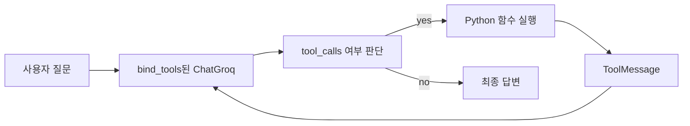

# Tool Calling — 외부 도구 연결하기

## 이 글에서 답할 질문

- Tool Calling은 일반 프롬프트 체인과 무엇이 다른가
- `@tool`과 타입 힌트는 모델에게 어떤 실행 계약을 알려 주는가
- `bind_tools()` 이후에는 애플리케이션 코드가 어떤 루프를 책임져야 하는가
- 모델이 도구를 호출할지 말지를 더 안정적으로 유도하려면 무엇을 조정해야 하는가

> Tool Calling의 핵심은 모델이 계산을 직접 하는 것이 아니라 계산을 맡길 함수를 고르게 만드는 데 있습니다.


## 최소 실행 예제

```python
import os

from langchain_core.tools import tool
from langchain_groq import ChatGroq

@tool
def add_numbers(a: float, b: float) -> float:
    """두 숫자를 더합니다."""
    return a + b

llm = ChatGroq(model="llama-3.1-8b-instant", api_key=os.environ["GROQ_API_KEY"])
response = llm.bind_tools([add_numbers]).invoke("13과 29를 더해 주세요.")
print(response.tool_calls)
```

## 이 코드에서 봐야 할 것

- 도구 이름, 설명, 입력 스키마는 함수 시그니처와 독스트링에서 나옵니다.
- `bind_tools()`는 모델에게 도구 목록을 노출하지만 실제 실행은 대신 해주지 않습니다.
- 모델 응답에 `tool_calls`가 생기면 그다음은 애플리케이션 루프 책임입니다.
- 결국 Tool Calling도 메시지 왕복을 하나 더 넣은 LCEL 구성입니다.

## 실무에서 헷갈리는 지점

- 도구를 바인딩했다고 함수가 자동 실행되지는 않습니다.
- 잘못된 독스트링이나 느슨한 타입 힌트는 도구 선택 품질을 크게 떨어뜨립니다.
- 간단한 계산은 모델이 그냥 답해 버릴 수 있으므로 시스템 프롬프트로 도구 사용 원칙을 주는 편이 안정적입니다.

## 체크리스트

- [ ] `@tool` 함수가 어떤 JSON 스키마로 노출되는지 이해한다
- [ ] `bind_tools()` 이후 직접 처리해야 할 루프를 설명할 수 있다
- [ ] 모델 응답의 `tool_calls`를 읽고 실제 함수를 호출할 수 있다

LangChain 101 시리즈 (4/6)

예제 코드: [github.com/yeongseon-books/langchain-101](https://github.com/yeongseon-books/langchain-101/tree/main/04-tool-calling)

## 이 글에서 답할 질문

- LangChain에서 도구는 어떤 정보로 LLM에 노출될까
- `bind_tools()`를 호출하면 실제로 무엇이 달라질까
- 도구 실행 결과를 왜 `ToolMessage`로 다시 넣어야 할까
- 간단한 도구 호출 루프는 어디에서 끊어야 안전할까

> Tool Calling은 모델이 함수를 직접 실행하는 기능이 아니라, 함수 호출 요청을 구조화해 앱이 대신 실행하도록 연결하는 프로토콜입니다.

## 핵심 흐름 한눈에 보기



LLM은 텍스트만 생성합니다. 계산, 날씨 조회, 데이터베이스 검색 같은 작업은 외부 도구가 필요합니다. Tool Calling은 LLM이 "이 도구를 이렇게 불러달라"는 지시를 텍스트로 내리면, 앱이 실제 함수를 실행해서 결과를 다시 LLM에 넘기는 패턴입니다.

이번 글에서는 LangChain의 도구 정의, `bind_tools()`로 LLM에 도구를 연결하는 방법, 그리고 도구 결과를 처리하는 흐름을 다룹니다.

다룰 내용은 다음과 같습니다.

- `@tool` 데코레이터로 도구 정의
- `bind_tools()`로 LLM에 도구 연결
- 도구 호출 결과를 처리하는 단순 루프
- 여러 도구를 가진 에이전트 기본 패턴
- 도구 호출 시 주의사항

---

<!-- ebook-only:start -->

이 장의 핵심: **Tool Calling은 LLM이 함수를 선택하게 한다.** 어떤 도구를 언제 쓸지 모델이 결정한다.

## 이 장의 위치

이 글은 시리즈 6편 중 4번째 장입니다.
앞 장에서는 **Retriever — 문서 검색과 컨텍스트 주입**을 다뤘습니다.
이 장을 마치면 다음 장에서 **Streaming — 실시간 출력 처리**으로 이어집니다.
<!-- ebook-only:end -->

## 도구 정의

`@tool` 데코레이터를 쓰면 Python 함수를 LangChain 도구로 만들 수 있습니다. 함수 독스트링이 LLM에게 이 도구의 용도를 알려줍니다. 타입 힌트는 입력 스키마를 정의합니다.

```python
from langchain_core.tools import tool

@tool
def add_numbers(a: float, b: float) -> float:
    """두 숫자를 더합니다. 덧셈이 필요할 때 사용합니다."""
    return a + b

@tool
def get_word_count(text: str) -> int:
    """텍스트의 단어 수를 반환합니다. 텍스트 길이를 알고 싶을 때 사용합니다."""
    return len(text.split())

@tool
def celsius_to_fahrenheit(celsius: float) -> float:
    """섭씨를 화씨로 변환합니다."""
    return celsius * 9 / 5 + 32

# 도구 정보 확인
print(f"이름: {add_numbers.name}")
print(f"설명: {add_numbers.description}")
print(f"스키마: {add_numbers.args_schema.model_json_schema()}")
```

---

## bind_tools()로 LLM에 도구 연결

`bind_tools()`는 LLM에게 사용 가능한 도구 목록을 알려줍니다.

```python
import os

from langchain_core.tools import tool
from langchain_groq import ChatGroq

@tool
def add_numbers(a: float, b: float) -> float:
    """두 숫자를 더합니다."""
    return a + b

@tool
def multiply_numbers(a: float, b: float) -> float:
    """두 숫자를 곱합니다."""
    return a * b

tools = [add_numbers, multiply_numbers]

llm = ChatGroq(
    model="llama-3.1-8b-instant",
    api_key=os.environ["GROQ_API_KEY"],
)

llm_with_tools = llm.bind_tools(tools)

# 도구 호출이 필요한 질문
response = llm_with_tools.invoke("15 더하기 27은 얼마인가요?")

print(f"응답 타입: {type(response).__name__}")
print(f"content: {response.content!r}")
print(f"tool_calls: {response.tool_calls}")
```

`tool_calls`가 비어있지 않으면 LLM이 도구 호출을 요청한 것입니다.

```
응답 타입: AIMessage
content: ''
tool_calls: [{'name': 'add_numbers', 'args': {'a': 15.0, 'b': 27.0}, 'id': 'call_...'}]
```

---

## 도구 결과를 처리하는 단순 루프

LLM이 도구 호출을 요청하면, 앱이 실제로 함수를 실행하고 결과를 다시 LLM에 넘겨야 합니다.

```python
import os

from langchain_core.messages import HumanMessage, ToolMessage
from langchain_core.tools import tool
from langchain_groq import ChatGroq

@tool
def add_numbers(a: float, b: float) -> float:
    """두 숫자를 더합니다."""
    return a + b

@tool
def multiply_numbers(a: float, b: float) -> float:
    """두 숫자를 곱합니다."""
    return a * b

tools = [add_numbers, multiply_numbers]
tool_map = {t.name: t for t in tools}

llm = ChatGroq(
    model="llama-3.1-8b-instant",
    api_key=os.environ["GROQ_API_KEY"],
)
llm_with_tools = llm.bind_tools(tools)

def run_with_tools(question: str) -> str:
    """도구 호출을 처리하는 단순 루프."""
    messages = [HumanMessage(content=question)]

    while True:
        response = llm_with_tools.invoke(messages)
        messages.append(response)

        if not response.tool_calls:
            # 도구 호출 없음 = 최종 답변
            return response.content

        # 도구 실행
        for tool_call in response.tool_calls:
            tool_name = tool_call["name"]
            tool_args = tool_call["args"]
            tool_id = tool_call["id"]

            if tool_name in tool_map:
                result = tool_map[tool_name].invoke(tool_args)
                messages.append(
                    ToolMessage(
                        content=str(result),
                        tool_call_id=tool_id,
                    )
                )
                print(f"  도구 실행: {tool_name}({tool_args}) = {result}")

questions = [
    "15 더하기 27은 얼마인가요?",
    "7 곱하기 8은 얼마인가요?",
    "5 더하기 3을 먼저 구하고, 그 결과에 4를 곱하면 얼마인가요?",
]

for q in questions:
    print(f"\n질문: {q}")
    answer = run_with_tools(q)
    print(f"답변: {answer}")
```

루프 구조는 단순합니다. LLM이 도구 호출을 요청하지 않을 때까지 반복합니다. 각 도구 결과는 `ToolMessage`로 대화 이력에 추가됩니다.

---

## 여러 도구를 가진 패턴

실제 앱에서는 다양한 종류의 도구를 섞어서 씁니다.

```python
import os
from datetime import datetime

from langchain_core.messages import HumanMessage, ToolMessage
from langchain_core.tools import tool
from langchain_groq import ChatGroq

@tool
def get_current_time() -> str:
    """현재 날짜와 시간을 반환합니다."""
    return datetime.now().strftime("%Y-%m-%d %H:%M:%S")

@tool
def calculate_bmi(weight_kg: float, height_m: float) -> float:
    """체중(kg)과 키(m)로 BMI를 계산합니다."""
    return round(weight_kg / (height_m ** 2), 2)

@tool
def word_frequency(text: str, word: str) -> int:
    """텍스트에서 특정 단어가 몇 번 나오는지 반환합니다."""
    return text.lower().split().count(word.lower())

tools = [get_current_time, calculate_bmi, word_frequency]
tool_map = {t.name: t for t in tools}

llm = ChatGroq(
    model="llama-3.1-8b-instant",
    api_key=os.environ["GROQ_API_KEY"],
)
llm_with_tools = llm.bind_tools(tools)

def run_with_tools(question: str) -> str:
    messages = [HumanMessage(content=question)]
    while True:
        response = llm_with_tools.invoke(messages)
        messages.append(response)
        if not response.tool_calls:
            return response.content
        for tc in response.tool_calls:
            result = tool_map[tc["name"]].invoke(tc["args"])
            messages.append(ToolMessage(content=str(result), tool_call_id=tc["id"]))
            print(f"  {tc['name']}({tc['args']}) = {result}")

print(run_with_tools("지금 몇 시인가요?"))
print(run_with_tools("체중 70kg, 키 1.75m인 사람의 BMI는?"))
```

---

## 도구 호출 시 주의사항

**독스트링이 핵심입니다.** LLM은 독스트링을 읽고 어떤 도구를 언제 써야 할지 판단합니다. 독스트링이 모호하면 LLM이 잘못된 도구를 고릅니다.

**입력 검증은 도구 내부에서 합니다.** 타입 힌트만으로는 LLM이 잘못된 값을 넘기는 것을 막을 수 없습니다. 중요한 도구는 내부에서 입력을 검증합니다.

**무한 루프 방지.** 간단한 루프에는 최대 반복 횟수를 설정합니다. LLM이 잘못된 도구 인수를 반복 생성하는 경우를 방어합니다.

```python
MAX_ITERATIONS = 10

def run_with_tools_safe(question: str) -> str:
    messages = [HumanMessage(content=question)]
    for _ in range(MAX_ITERATIONS):
        response = llm_with_tools.invoke(messages)
        messages.append(response)
        if not response.tool_calls:
            return response.content
        for tc in response.tool_calls:
            result = tool_map[tc["name"]].invoke(tc["args"])
            messages.append(ToolMessage(content=str(result), tool_call_id=tc["id"]))
    return "최대 반복 횟수에 도달했습니다."
```

---

## 이 코드에서 봐야 할 것

- `@tool`의 독스트링과 타입 힌트가 그대로 도구 설명과 입력 스키마 역할을 합니다.
- `bind_tools()`는 모델을 다른 모델로 바꾸는 것이 아니라, 같은 모델에 호출 가능한 도구 메타데이터를 붙이는 단계입니다.
- 응답에 `tool_calls`가 있으면 앱이 함수를 실행하고, 그 결과를 `ToolMessage`로 다시 넣어야 모델이 다음 추론을 이어갈 수 있습니다.
- 멀티툴 예제의 핵심은 복잡한 에이전트가 아니라, "요청 → 실행 → 결과 재주입" 루프를 명시적으로 보는 데 있습니다.

## 실무에서 헷갈리는 지점

- Tool Calling을 모델 내부 실행으로 오해하기 쉽지만, 실제 실행 책임은 항상 애플리케이션 쪽에 있습니다.
- 도구 설명이 모호하면 모델이 틀린 도구를 고르거나 인수를 잘못 만듭니다.
- 반복 루프에는 종료 조건이 꼭 필요합니다. 그렇지 않으면 잘못된 인수 생성이 무한 반복될 수 있습니다.

## 체크리스트

- [ ] `@tool`, `bind_tools()`, `ToolMessage`가 각자 어떤 역할인지 설명할 수 있다
- [ ] 모델이 도구를 요청한 뒤 앱이 해야 하는 단계를 순서대로 말할 수 있다
- [ ] 도구 호출 루프에 최대 반복 횟수 같은 안전장치가 필요한 이유를 이해했다

## 마무리

Tool Calling의 핵심 루프를 이해했습니다. `@tool`로 정의, `bind_tools()`로 연결, `ToolMessage`로 결과 전달, 루프 반복입니다. 다음 글에서는 스트리밍으로 LLM 응답을 실시간으로 받는 방법을 다룹니다.

<!-- blog-only:start -->
다음 글: [Streaming — 실시간 출력 처리](./05-streaming.md)
<!-- blog-only:end -->

<!-- toc:begin -->
## 시리즈 목차

- [LangChain 소개 — LCEL과 Runnable 기본](./01-lcel-runnable-basics.md)
- [Prompt와 LLM Chain — 체인 첫 번째 구성](./02-prompt-llm-chain.md)
- [Retriever — 문서 검색과 컨텍스트 주입](./03-retriever.md)
- **Tool Calling — 외부 도구 연결하기 (현재 글)**
- Streaming — 실시간 출력 처리 (예정)
- 실전 체인 조립 — 컴포넌트를 하나로 연결하기 (예정)

<!-- toc:end -->

---

## 참고 자료

- [LangChain Tool Calling 가이드](https://python.langchain.com/docs/how_to/tool_calling/)
- [Tool 정의하기](https://python.langchain.com/docs/how_to/custom_tools/)
- [Groq Tool Use](https://console.groq.com/docs/tool-use)

Tags: LangChain, LCEL, Python, LLM
