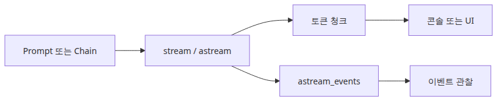
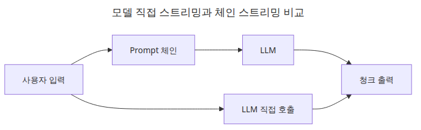
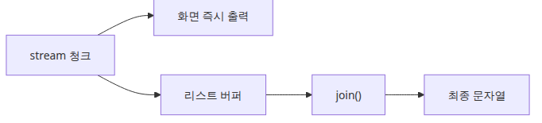
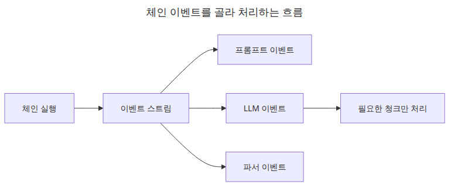

# Streaming — 실시간 출력 처리

LLM 응답은 종종 몇 초씩 걸립니다. 총 처리 시간은 같더라도, 사용자가 아무 것도 보지 못한 채 기다리는 경험은 훨씬 더 느리게 느껴집니다. 그래서 스트리밍은 성능 최적화라기보다 먼저 **체감 지연을 줄이는 전달 방식**으로 이해하는 편이 정확합니다.

LangChain에서 좋은 점은 스트리밍이 별도 아키텍처를 요구하지 않는다는 것입니다. 대부분의 경우 체인 정의는 그대로 두고, `invoke()` 대신 `stream()`이나 `astream()`으로 결과를 소비하는 방식만 바꾸면 됩니다.

---

## 이 글에서 다룰 문제

- `invoke()`에서 `stream()`으로 바꾸면 반환 형태는 어떻게 달라질까요?
- 체인 스트리밍과 모델 단독 스트리밍의 실무상 차이는 무엇일까요?
- 언제 `stream()` 대신 `astream()`이나 `astream_events()`가 필요할까요?
- 스트리밍된 청크를 UI나 API 응답으로 넘길 때는 어떤 패턴이 좋을까요?
- 총 응답 시간과 체감 응답 시간은 왜 다른 지표일까요?

> Streaming은 다른 체인을 만드는 기능이 아닙니다. 같은 체인을, 모델이 아직 생성 중일 때 부분 결과를 먼저 소비하는 실행 방식입니다.


*이 글에서 답할 질문*

## 최소 실행 예제

```python
import os

from langchain_core.output_parsers import StrOutputParser
from langchain_core.prompts import ChatPromptTemplate
from langchain_groq import ChatGroq

chain = (
    ChatPromptTemplate.from_template("Explain {topic} in three sentences.")
    | ChatGroq(model="llama-3.1-8b-instant", api_key=os.environ["GROQ_API_KEY"])
    | StrOutputParser()
)

for chunk in chain.stream({"topic": "astream"}):
    print(chunk, end="", flush=True)
```

이 예제에서 체인 정의는 전혀 특별하지 않습니다. 첫 글에서 본 것과 똑같은 `prompt | llm | parser` 구조입니다. 달라진 것은 최종 결과를 한 번에 받지 않고, 부분 문자열 청크를 순서대로 소비한다는 점뿐입니다.

## 이 코드에서 먼저 볼 점

- 체인 정의는 `invoke()` 버전과 같습니다. 달라지는 것은 소비 방식뿐입니다.
- 파서가 붙어 있으면 문자열 청크가 나오고, 없으면 메시지 청크가 나옵니다.
- 청크를 즉시 클라이언트로 보낼 수도 있고, 모아서 최종 문자열로 만들 수도 있습니다.
- 스트리밍은 총 실행 시간보다 체감 지연을 줄이는 효과가 더 큽니다.

## 엔지니어가 여기서 자주 헷갈리는 지점

- 스트리밍이 전체 응답 완료 시점을 반드시 앞당겨 주는 것은 아닙니다.
- 비동기 애플리케이션에서는 `stream()`보다 `astream()`이 이벤트 루프와 더 잘 맞습니다.
- 실행 생명주기를 보고 싶다면 단순 텍스트 청크보다 `astream_events()`가 더 유용합니다.

## 체크리스트

- [ ] `stream()` 출력 청크를 점진적으로 소비할 수 있다
- [ ] 문자열 청크와 메시지 청크의 차이를 이해한다
- [ ] 비동기 코드에서 언제 `astream()`으로 바꿔야 하는지 안다

LangChain 101 (5/6)

Example code: [github.com/yeongseon-books/langchain-101](https://github.com/yeongseon-books/langchain-101/tree/main/05-streaming)

## 이 글에서 다룰 문제

- `invoke()`를 `stream()`으로 바꿀 때 실제 코드 변경은 얼마나 될까요?
- `astream()`과 `astream_events()`는 언제 각각 써야 할까요?
- 스트리밍 청크를 다시 하나의 문자열로 모으는 패턴은 무엇일까요?
- FastAPI에서 스트리밍 출력을 넘기려면 어떤 형태가 필요할까요?

> Streaming은 체인을 새로 설계하는 작업이 아닙니다. 같은 체인을 최종 문자열을 기다리지 않고 부분 출력으로 소비하는 방식입니다.

## 전체 흐름 한눈에 보기



*전체 흐름 한눈에 보기*

응답이 길어질수록 사용자는 빈 화면을 더 답답하게 느낍니다. ChatGPT나 Claude에서 텍스트가 한 글자씩 나타나는 이유도 총 시간보다 먼저 **무언가가 보이기 시작하는 시점**을 앞당기기 위해서입니다.

LangChain에서는 `stream()`이 그 출발점입니다. 이 글에서는 다음 항목을 다루겠습니다.

- LLM 단독 스트리밍과 체인 스트리밍
- `astream()`을 이용한 비동기 스트리밍
- 청크를 다시 모아 최종 문자열 만드는 방식
- FastAPI에서 실전 스트리밍 엔드포인트 만들기
- 세밀한 이벤트 관찰을 위한 `astream_events()`

---

## 기본 스트리밍



*모델 직접 스트리밍과 체인 스트리밍 비교*

`stream()`은 generator를 반환합니다. 따라서 일반 `for` 루프로 순회하면서 청크를 바로 출력할 수 있습니다.

```python
import os

from langchain_core.output_parsers import StrOutputParser
from langchain_core.prompts import ChatPromptTemplate
from langchain_groq import ChatGroq

llm = ChatGroq(
    model="llama-3.1-8b-instant",
    api_key=os.environ["GROQ_API_KEY"],
)

# LLM에서 바로 스트리밍
print("=== LLM direct streaming ===")
for chunk in llm.stream("List five advantages of Python."):
    print(chunk.content, end="", flush=True)

print("\n\n=== chain streaming ===")
prompt = ChatPromptTemplate.from_messages([
    ("human", "Explain {topic} in three paragraphs."),
])

chain = prompt | llm | StrOutputParser()

for chunk in chain.stream({"topic": "vector search"}):
    print(chunk, end="", flush=True)

print()
```

`end=""`는 줄바꿈을 막고, `flush=True`는 버퍼링을 줄여 화면에 즉시 보이게 합니다. `StrOutputParser()`가 붙어 있으므로 체인 스트리밍에서는 `AIMessageChunk`가 아니라 문자열 조각을 받습니다.

운영 관점에서 보면 이 차이는 꽤 큽니다. 파서를 붙여 두면 이후 HTTP 응답이나 UI 이벤트로 넘길 때 훨씬 단순한 텍스트 파이프라인을 유지할 수 있기 때문입니다.

---

## 스트리밍 결과 다시 모으기



*청크를 다시 최종 텍스트로 조립하는 흐름*

스트리밍 중간에는 화면에 바로 보여 주고, 끝난 뒤에는 로그 저장이나 캐시를 위해 전체 텍스트가 필요할 때가 많습니다. 이때는 청크를 리스트에 쌓아 두었다가 마지막에 합치면 됩니다.

```python
import os

from langchain_core.output_parsers import StrOutputParser
from langchain_core.prompts import ChatPromptTemplate
from langchain_groq import ChatGroq

llm = ChatGroq(
    model="llama-3.1-8b-instant",
    api_key=os.environ["GROQ_API_KEY"],
)

chain = (
    ChatPromptTemplate.from_messages([("human", "{question}")])
    | llm
    | StrOutputParser()
)

chunks = []
print("streaming: ", end="")
for chunk in chain.stream({"question": "What is FAISS?"}):
    print(chunk, end="", flush=True)
    chunks.append(chunk)

full_text = "".join(chunks)
print(f"\n\ntotal characters: {len(full_text)}")
```

<!-- injected-output:start -->
**Output**

    streaming: FAISS (Facebook AI Similarity Search) is an open-source library for efficient similarity search and clustering of dense vectors. It was initially developed by Facebook to enable fast similarity search in large-scale vector spaces.

    FAISS is particularly useful in applications that involve searching for similar items in a high-dimensional space, such as:

    1. **Nearest Neighbor Search**: Finding the most similar items to a query vector in a large dataset.
    2. **Clustering**: Grouping similar vectors together to identify patterns or outliers.
    3. **Anomaly Detection**: Identifying vectors that are significantly different from the rest of the dataset.

    FAISS provides several benefits, including:

    1. **Speed**: FAISS is designed to be highly efficient, with performance improvements over traditional similarity search algorithms.
    2. **Scalability**: FAISS can handle large datasets and scale to thousands of nodes.
    3. **Flexibility**: FAISS supports various similarity metrics (e.g., inner product, L2 norm, cosine similarity) and clustering algorithms (e.g., k-means, hierarchical clustering).

    Some of the key features of FAISS include:

    1. **Indexing**: FAISS supports various indexing techniques, such as IVF (Inverted File) and PQ (Product Quantization).
    2. **Quantization**: FAISS provides efficient quantization methods to reduce the dimensionality of the data.
    3. **Clustering**: FAISS supports various clustering algorithms, including k-means and hierarchical clustering.

    FAISS is widely used in various applications, such as:

    1. **Recommendation Systems**: FAISS is used in recommendation systems to find similar items to suggest to users.
    2. **Computer Vision**: FAISS is used in computer vision applications, such as image and object recognition.
    3. **Natural Language Processing**: FAISS is used in NLP applications, such as text similarity search and clustering.

    Overall, FAISS is a powerful library for efficient similarity search and clustering of dense vectors, widely used in various applications across industries.

    total characters: 2039

<!-- injected-output:end -->

이 패턴은 실전에서 매우 자주 씁니다. 스트리밍은 사용자 경험을 위해 켜고, 마지막에는 전체 결과를 로깅·캐싱·후처리용으로 확보하는 방식입니다.

---

## `astream()` — 비동기 스트리밍


*async for 기반 스트리밍 실행 경로*

FastAPI 같은 비동기 프레임워크에서는 `stream()`보다 `astream()`이 더 자연스럽습니다. 이벤트 루프를 막지 않고 `async for`로 청크를 소비할 수 있기 때문입니다.

```python
import asyncio
import os

from langchain_core.output_parsers import StrOutputParser
from langchain_core.prompts import ChatPromptTemplate
from langchain_groq import ChatGroq

llm = ChatGroq(
    model="llama-3.1-8b-instant",
    api_key=os.environ["GROQ_API_KEY"],
)

chain = (
    ChatPromptTemplate.from_messages([("human", "Explain {topic} briefly.")])
    | llm
    | StrOutputParser()
)

async def stream_response(topic: str) -> None:
    print(f"streaming: {topic}")
    async for chunk in chain.astream({"topic": topic}):
        print(chunk, end="", flush=True)
    print()

async def main() -> None:
    await stream_response("embedding vectors")
    await stream_response("FAISS indexes")

asyncio.run(main())
```

이렇게 생각하면 됩니다. 동기 CLI 스크립트라면 `stream()`, 비동기 웹 서버라면 `astream()`이 기본값입니다. 체인 구조는 같고 호출자 문맥만 달라집니다.

---

## FastAPI 스트리밍 엔드포인트

실서비스에서는 스트리밍 결과를 HTTP 응답으로 흘려보내야 합니다. FastAPI에서는 `StreamingResponse`가 가장 기본적인 형태입니다.

```python
import os

from fastapi import FastAPI
from fastapi.responses import StreamingResponse
from langchain_core.output_parsers import StrOutputParser
from langchain_core.prompts import ChatPromptTemplate
from langchain_groq import ChatGroq

app = FastAPI()

llm = ChatGroq(
    model="llama-3.1-8b-instant",
    api_key=os.environ["GROQ_API_KEY"],
)

chain = (
    ChatPromptTemplate.from_messages([("human", "{question}")])
    | llm
    | StrOutputParser()
)

@app.get("/stream")
async def stream_endpoint(question: str):
    async def generate():
        async for chunk in chain.astream({"question": question}):
            yield chunk

    return StreamingResponse(generate(), media_type="text/plain")
```

서버 실행:

```bash
pip install fastapi uvicorn
uvicorn main:app --reload
```

테스트:

```bash
curl "http://localhost:8000/stream?question=What+is+RAG"
```

운영에서 자주 만나는 문제는 코드보다 네트워크 쪽입니다. 프록시나 게이트웨이가 버퍼링하면, 애플리케이션은 스트리밍 중이어도 클라이언트는 한꺼번에 받는 것처럼 보일 수 있습니다. 그래서 "streaming이 안 된다"는 문제는 LangChain보다 배포 경로 설정에서 시작하는 경우가 많습니다.

---

## `astream_events()`로 세밀하게 제어하기



*체인 이벤트를 선택적으로 보는 흐름*

단순히 텍스트 청크만 필요하다면 `astream()`이면 충분합니다. 하지만 체인 안에서 어느 컴포넌트가 어떤 이벤트를 내는지 보고 싶다면 `astream_events()`가 더 적합합니다.

```python
import asyncio
import os

from langchain_core.output_parsers import StrOutputParser
from langchain_core.prompts import ChatPromptTemplate
from langchain_groq import ChatGroq

llm = ChatGroq(
    model="llama-3.1-8b-instant",
    api_key=os.environ["GROQ_API_KEY"],
)

chain = (
    ChatPromptTemplate.from_messages([("human", "Explain {topic}.")])
    | llm
    | StrOutputParser()
)

async def main() -> None:
    async for event in chain.astream_events({"topic": "FAISS"}, version="v2"):
        event_type = event["event"]
        if event_type == "on_llm_stream":
            chunk = event["data"].get("chunk", "")
            if hasattr(chunk, "content") and chunk.content:
                print(chunk.content, end="", flush=True)
    print()

asyncio.run(main())
```

`astream_events()`는 디버깅과 계측에 특히 유용합니다. 예를 들어 Prompt 단계, Retriever 단계, LLM 단계 중 어디서 시간이 많이 걸리는지 보거나, Tool Calling이 섞인 체인에서 어떤 이벤트가 중간에 나오는지 구분할 수 있습니다.

---

## 이 코드에서 주목할 점

- 체인 정의는 `invoke()` 버전에서 거의 바뀌지 않습니다. 진짜 차이는 출력을 소비하는 방식입니다.
- `stream()`은 동기 반복이고, `astream()`은 같은 논리 응답에 대한 비동기 반복입니다.
- 청크를 리스트에 모아 나중에 합치는 패턴은 로깅, 캐싱, 후처리에 자주 쓰입니다.
- `astream_events()`는 단순 토큰 표시를 넘어, 체인 수준의 디버깅과 계측에 유용합니다.

## 엔지니어가 자주 헷갈리는 지점

- 스트리밍은 최종 답변 형식을 바꾸지 않습니다. 애플리케이션이 각 조각을 받는 시점만 바꿉니다.
- 비동기 스트리밍은 호출자 코드도 함께 바꾸므로, 프레임워크와 엔드포인트가 async 흐름을 지원해야 합니다.
- 이벤트 스트림은 강력하지만, 단지 텍스트를 점진적으로 보여 주려는 목적이라면 오버헤드가 될 수 있습니다.

## 체크리스트

- [ ] 같은 체인을 `invoke()`와 `stream()`으로 모두 실행할 수 있다
- [ ] `astream()`과 `astream_events()`의 차이를 설명할 수 있다
- [ ] FastAPI의 `StreamingResponse`가 스트리밍 청크를 어떻게 감싸는지 이해했다

## 정리

LangChain 스트리밍은 한 가지 변화로 시작합니다. `invoke()`를 `stream()`이나 `astream()`으로 바꾸는 것입니다. 체인 구조는 그대로 두고, 출력 소비 방식만 바꾸면 됩니다. FastAPI에서는 `StreamingResponse`를 감싸 실시간으로 청크를 사용자에게 전달할 수 있습니다.

다음 글에서는 지금까지 다룬 LCEL, 프롬프트, Retriever, Streaming을 한 파일 안에서 조합해, 실제로 돌아가는 완전한 RAG 체인으로 묶어 보겠습니다.

<!-- toc:begin -->
## 시리즈 목차

- [LangChain 소개 — LCEL과 Runnable 기본](./01-lcel-runnable-basics.md)
- [Prompt와 LLM Chain — 체인 첫 번째 구성](./02-prompt-llm-chain.md)
- [Retriever — 문서 검색과 컨텍스트 주입](./03-retriever.md)
- [Tool Calling — 외부 도구 연결하기](./04-tool-calling.md)
- **Streaming — 실시간 출력 처리 (현재 글)**
- 실전 체인 조립 — 컴포넌트를 하나로 연결하기 (예정)

<!-- toc:end -->

---

## 참고 자료

- [LangChain streaming guide](https://python.langchain.com/docs/expression_language/streaming/)
- [astream_events reference](https://python.langchain.com/docs/expression_language/interface/)
- [FastAPI StreamingResponse](https://fastapi.tiangolo.com/advanced/custom-response/#streamingresponse)

Tags: LangChain, LCEL, Python, LLM
