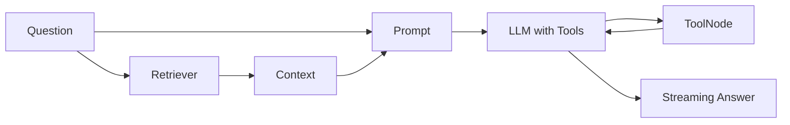

# 실전 체인 조립 — 컴포넌트를 하나로 연결하기

> LangChain 101 시리즈 (6/6)

<!-- a-grade-intro:begin -->

**핵심 질문**: *지금까지* *배운* *컴포넌트* 를 *어떻게* *한* *체인* 으로 *묶나요*?

> *Retriever* 로 *컨텍스트* 를 *모으고* *Prompt* 로 *조립* 한 뒤 *Tool 가능 모델* 을 *streaming* 으로 *호출* 합니다.

<!-- a-grade-intro:end -->

## 이 글에서 배울 것

- *RAG* + *Tool Calling* *조합*
- *LCEL dict 입력* *패턴*
- *세션별* *대화 이력* *관리*
- *streaming* *마무리*
- *전체 흐름* *디버깅*

## 왜 중요한가

*개별* *컴포넌트* 만 *익혀서는* *제품* 을 *만들* *수* *없습니다*. *연결 패턴* 을 *알아야* *비즈니스* *요구사항* 에 *맞게* *조립* *가능* 합니다.

## 개념 한눈에 보기



## 핵심 용어 정리

- **Composite chain**: *여러* *Runnable* 이 *섞인* *체인*.
- **dict 입력 패턴**: `{"key": Runnable}` 로 *병렬* 입력 *조립*.
- **session_id**: *대화 이력* 을 *분리* *하는* *키*.
- **InMemoryHistory**: *학습용* *세션 저장소*.
- **RunnableWithMessageHistory**: *체인* 에 *대화 이력* 을 *주입* *하는* *래퍼*.

## Before/After

**Before**: "*RAG*, *Tool*, *Streaming* 코드를 *각각* *함수* 로 *작성* 해 *호출* 합니다."

**After**: "*하나* 의 *LCEL 체인* 이 *전체* *흐름* 을 *책임* 집니다."

## 실습: 종합 체인 5단계

### 1단계 — Retriever 준비

```python
from langchain_core.documents import Document
from langchain_huggingface import HuggingFaceEmbeddings
from langchain_community.vectorstores import FAISS

docs = [
    Document(page_content="LangChain 101의 RAG는 FAISS를 로컬 벡터 스토어로 사용합니다."),
    Document(page_content="Tool Calling은 모델이 함수를 직접 호출하게 하는 패턴입니다."),
    Document(page_content="Streaming은 stream과 astream 메서드로 토큰 단위 출력을 받습니다."),
]
embeddings = HuggingFaceEmbeddings(model_name="sentence-transformers/all-MiniLM-L6-v2")
retriever = FAISS.from_documents(docs, embeddings).as_retriever(search_kwargs={"k": 2})
```

### 2단계 — Tool 정의

```python
from langchain_core.tools import tool

@tool
def word_count(text: str) -> int:
    """문자열의 공백 기준 단어 수를 반환합니다."""
    return len(text.split())

tools = [word_count]
```

### 3단계 — Prompt와 LLM 바인딩

```python
import os
from langchain_core.prompts import ChatPromptTemplate
from langchain_groq import ChatGroq

os.environ.setdefault("GROQ_API_KEY", "your-key-here")
llm = ChatGroq(model="llama-3.1-8b-instant", temperature=0).bind_tools(tools)

prompt = ChatPromptTemplate.from_messages([
    ("system", "주어진 컨텍스트만 사용해 한국어로 답하고 필요하면 도구를 호출합니다."),
    ("human", "컨텍스트:\n{context}\n\n질문: {question}"),
])
```

### 4단계 — 체인 조립

```python
from langchain_core.runnables import RunnablePassthrough

def format_docs(docs):
    return "\n\n".join(d.page_content for d in docs)

chain = (
    {"context": retriever | format_docs, "question": RunnablePassthrough()}
    | prompt
    | llm
)
```

### 5단계 — Tool 루프 실행

```python
from langchain_core.messages import ToolMessage

tools_by_name = {t.name: t for t in tools}

def run(question: str, max_steps: int = 3) -> str:
    ai_msg = chain.invoke(question)
    messages = [ai_msg]
    for _ in range(max_steps):
        if not ai_msg.tool_calls:
            break
        for call in ai_msg.tool_calls:
            result = tools_by_name[call["name"]].invoke(call["args"])
            messages.append(ToolMessage(content=str(result), tool_call_id=call["id"]))
        ai_msg = llm.invoke(messages)
        messages.append(ai_msg)
    return ai_msg.content

print(run("LangChain 101의 streaming 메서드 두 개의 이름과 글자 수를 알려 주세요."))
```

## 이 코드에서 주목할 점

- *dict 입력 패턴* 은 *Retriever* 와 *Passthrough* 를 *병렬* 로 *실행* 합니다.
- *Tool 루프* 는 `bind_tools` 가 *반환* 한 *모델* 을 *직접* *호출* 합니다.
- *상한* `max_steps` 가 *없으면* *무한 루프* 위험이 *있습니다*.

## 자주 하는 실수 5가지

1. ***Retriever 와 Tool 혼동*** — *지식 조회* 는 *Retriever*, *행동/계산* 은 *Tool* 로 *분리* 합니다.
2. ***대화 이력 누락*** — *이전 질문* 컨텍스트가 *사라져* *답변* 이 *튀어* 보입니다.
3. ***Tool 결과* 를 *파서* 로 *통과*** — *문자열 변환* 이 *깨질* *수* *있습니다*. *AIMessage* 단계에서 *처리* 합니다.
4. ***streaming 과 Tool Calling 동시 사용*** — *중간* *tool 호출* 단계에서는 *content* 가 *비어* *옵니다*. *분기 처리* 가 *필요* 합니다.
5. ***로깅 부재*** — *어떤* *문서* 와 *Tool 호출* 이 *최종 답* 을 *만들었는지* *추적* 할 수 *없습니다*.

## 실무에서는 이렇게 쓰입니다

*프로덕션* 에서는 *이* *수준* 의 *체인* 을 *LangGraph* 의 *그래프* 로 *옮겨* *분기* 와 *체크포인트* 를 *명시적* 으로 *관리* 합니다. *2부* 에서 다룹니다.

## 시니어 엔지니어는 이렇게 생각합니다

- *체인* 이 *복잡해지면* *그래프* 로 *옮길* *시점* 입니다.
- *Retriever* 와 *Tool* 의 *역할* 을 *섞지* *마세요*.
- *상한* 과 *타임아웃* 은 *항상* *명시* *합니다*.
- *각* *단계* *입출력* 을 *로깅* 합니다.
- *대화 이력* 은 *세션 식별자* 와 *함께* *저장* 합니다.

## 체크리스트

- [ ] *Retriever* 와 *Tool* 의 *역할* *분리*.
- [ ] *Tool 루프* *상한* *명시*.
- [ ] *각 단계* *로깅* *추가*.
- [ ] *streaming* *시점* 을 *최종 응답* 단계로 *한정*.

## 연습 문제

1. `RunnableWithMessageHistory` 로 *세션* 별 *이력* 을 *추가* 하고 *후속 질문* 을 *던져* 보세요.
2. `astream_events` 로 *Retriever 호출* 과 *Tool 호출* 만 *로그* 로 *남기세요*.
3. *Tool* 을 *2 개* 더 *추가* 하고 *복합 질문* 으로 *루프* *동작* 을 *관찰* 하세요.

## 정리 및 다음 단계

*LangChain 101* 시리즈는 여기서 *마칩니다*. 같은 *문제* 를 *상태 그래프* 로 *명시* *하는* *방법* 은 *LangGraph 101* 시리즈 에서 다룹니다.

<!-- toc:begin -->
## 시리즈 목차

- [LangChain 소개 — LCEL과 Runnable 기본](./01-lcel-runnable-basics.md)
- [Prompt와 LLM Chain — 체인 첫 번째 구성](./02-prompt-llm-chain.md)
- [Retriever — 문서 검색과 컨텍스트 주입](./03-retriever.md)
- [Tool Calling — 외부 도구 연결하기](./04-tool-calling.md)
- [Streaming — 실시간 출력 처리](./05-streaming.md)
- **실전 체인 조립 — 컴포넌트를 하나로 연결하기 (현재 글)**

<!-- toc:end -->

## 참고 자료

- [LCEL cookbook](https://python.langchain.com/docs/how_to/sequence/)
- [RunnableWithMessageHistory](https://python.langchain.com/docs/how_to/message_history/)
- [Tool calling with chat models](https://python.langchain.com/docs/how_to/tool_calling/)
- [LangChain GitHub](https://github.com/langchain-ai/langchain)

Tags: LangChain, LCEL, Python, LLM
