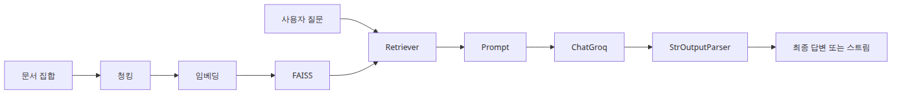
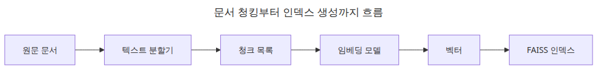
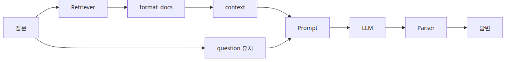
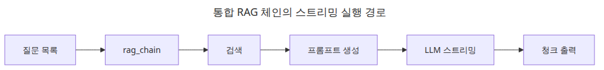
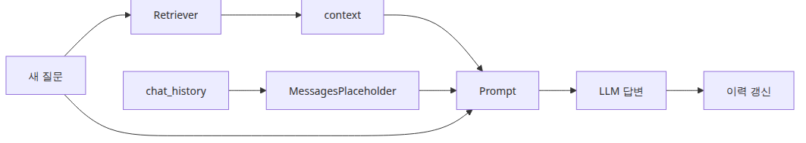

# 실전 체인 조립 — 컴포넌트를 하나로 연결하기

이제까지는 부품을 하나씩 봤습니다. LCEL, 프롬프트, Retriever, Streaming, Tool Calling이 각각 어떤 역할을 하는지는 이해했지만, 실제 애플리케이션은 결국 **이 부품들을 어떻게 끼워 맞추느냐**에서 가치가 나옵니다. 그래서 마지막 글에서는 "새로운 추상화"를 배우기보다, 앞선 다섯 글의 조각이 어떤 순서로 한 파일 안에 모이는지에 집중하겠습니다.

중요한 관점은 하나입니다. 통합 예제는 복잡해 보여도 본질은 그대로입니다. 인덱싱은 인덱싱대로, 질의 시점 검색은 검색대로, 프롬프트와 모델 호출은 또 따로 분리해서 보면 됩니다. **한 파일 예제라고 해서 모든 책임이 하나의 거대한 함수에 들어가야 하는 것은 아닙니다.**

이 글은 LangChain 101 시리즈의 마지막 글입니다. 여기서는 앞선 다섯 글의 부품을 하나의 실행 가능한 RAG 체인으로 조립하는 방식을 정리합니다.

---

## 이 글에서 다룰 문제

- 앞선 글의 *Runnable*들은 어떻게 하나의 실행 가능한 RAG 체인으로 합쳐질까요?
- 인덱싱, 검색, 프롬프팅, 생성의 경계는 어디서 나눠야 할까요?
- 스트리밍을 더하면 전체 데이터 흐름은 어떻게 보일까요?
- 예제를 실제 프로젝트에 맞게 바꿀 때는 어떤 컴포넌트부터 교체하는 게 좋을까요?
- 대화 이력까지 들어오면 체인 입력 스키마는 어떻게 달라질까요?

> 통합 체인은 새로운 마법이 아닙니다. 앞에서 보았던 같은 *Runnable*들을, 입력과 출력 순서에 맞춰 나란히 세운 결과입니다.


*이 글에서 답할 질문*

## 최소 실행 예제

```python
import os

from langchain_community.embeddings import HuggingFaceEmbeddings
from langchain_community.vectorstores import FAISS
from langchain_core.output_parsers import StrOutputParser
from langchain_core.prompts import ChatPromptTemplate
from langchain_core.runnables import RunnablePassthrough
from langchain_groq import ChatGroq

vectorstore = FAISS.from_texts(["LCEL connects Runnables with a pipe."], HuggingFaceEmbeddings(model_name="sentence-transformers/all-MiniLM-L6-v2"))
retriever = vectorstore.as_retriever(search_kwargs={"k": 1})
chain = ({"context": retriever | (lambda docs: docs[0].page_content), "question": RunnablePassthrough()} | ChatPromptTemplate.from_template("Context: {context}\nQuestion: {question}") | ChatGroq(model="llama-3.1-8b-instant", api_key=os.environ["GROQ_API_KEY"]) | StrOutputParser())

print(chain.invoke("What is LCEL?"))
```

이 짧은 예제만 봐도 통합 구조가 보입니다. 검색은 먼저 일어나고, 검색 결과는 프롬프트에 들어가기 전에 문자열로 정리되고, 사용자의 질문은 `RunnablePassthrough()`로 그대로 보존됩니다. **검색 준비와 질의 실행은 서로 다른 시간대에 일어나는 일**이라는 점도 자연스럽게 드러납니다.

## 이 코드에서 먼저 볼 점

- 인덱싱과 질의 실행은 서로 다른 시점에 일어나므로 코드에서도 분리하는 편이 좋습니다.
- Retriever 출력은 프롬프트에 넣기 전에 사람이 읽을 수 있는 context로 포맷팅해야 합니다.
- `RunnablePassthrough()`는 질문을 보존하면서 prompt dict의 다른 키를 조립하게 해 줍니다.
- 통합 체인이 잘 안 맞을 때는 프롬프트부터 만지기보다 retrieval 출력부터 보는 편이 빠릅니다.

## 엔지니어가 여기서 자주 헷갈리는 지점

- RAG 답변이 약하면 프롬프트보다 검색 단계가 실제 원인인 경우가 많습니다.
- 완성 예제가 길다고 해서 모든 단계가 하나의 거대한 함수 안에 있어야 하는 것은 아닙니다.
- 대화 이력이 들어오면 체인 입력 스키마가 달라지고, *Runnable* 조합도 그에 맞게 바뀝니다.

## 체크리스트

- [ ] retriever, prompt, llm, parser를 하나의 체인으로 연결할 수 있다
- [ ] 인덱싱 시점과 질문 응답 시점의 차이를 설명할 수 있다
- [ ] 통합 RAG 체인에서 어디부터 디버깅해야 하는지 안다

LangChain 101 (6/6)

Example code: [github.com/yeongseon-books/langchain-101](https://github.com/yeongseon-books/langchain-101/tree/main/06-putting-it-together)

## 이 글에서 다룰 문제

- 앞선 다섯 글을 하나의 체인으로 묶는 최소 구조는 무엇일까요?
- 인덱싱, 검색, 프롬프트, 생성 책임은 어디서 분리해야 할까요?
- 멀티턴 대화 이력은 프롬프트에 어떤 방식으로 들어가야 할까요?
- 한 파일짜리 통합 예제를 어떻게 읽기 좋게 유지할 수 있을까요?

> 통합 LangChain 파이프라인도 결국은 인덱싱과 질의 실행을 분리하고, 질의 경로 안에서는 retriever → prompt → llm → parser를 차례로 잇는 단순한 구조입니다.

## 전체 흐름 한눈에 보기



*전체 흐름 한눈에 보기*

앞선 다섯 글은 각각 LCEL, 프롬프트 템플릿, Retriever, Tool Calling, Streaming을 따로 살펴봤습니다. 마지막 글에서는 그것들을 하나의 실행 가능한 애플리케이션으로 모읍니다. 문서를 인덱싱하고, 질문으로 검색하고, 답변을 생성하고, 필요하면 스트리밍으로 전달하는 흐름입니다.

이번 글에서 다룰 내용은 다음과 같습니다.

- 문서 청킹 → 임베딩 → FAISS 인덱스 생성
- 스트리밍 가능한 RAG 체인 조립
- 대화 이력이 들어가는 멀티턴 RAG
- 하나의 파일에서 끝까지 실행되는 self-contained 예제

---

## 문서 인덱싱 파이프라인



*문서 청킹부터 인덱스 생성까지의 흐름*

```python
from langchain_community.embeddings import HuggingFaceEmbeddings
from langchain_community.vectorstores import FAISS
from langchain_text_splitters import RecursiveCharacterTextSplitter

embedding_model = HuggingFaceEmbeddings(
    model_name="sentence-transformers/all-MiniLM-L6-v2",
    model_kwargs={"device": "cpu"},
    encode_kwargs={"normalize_embeddings": True},
)

splitter = RecursiveCharacterTextSplitter(
    chunk_size=300,
    chunk_overlap=30,
    separators=["\n\n", "\n", ". ", " ", ""],
)

documents = [
    """
Vector search converts text into numeric vectors for meaning-based retrieval.
Unlike keyword search, it matches content even when phrasing differs.
Embedding models place semantically similar text close together in vector space.
""",
    """
FAISS is a high-speed vector search library developed at Facebook AI Research.
It supports both exact and approximate search and can handle billions of vectors.
IndexFlatIP is an exact inner-product index.
""",
    """
LangChain connects LLM components as a pipeline using LCEL.
Retriever, Tool, and OutputParser all implement the Runnable interface.
The pipe operator (|) composes components into a chain.
""",
    """
RAG (Retrieval-Augmented Generation) combines retrieved documents with an LLM prompt.
The system retrieves relevant chunks for the question and provides them as context.
Vector search is the core retrieval component in most RAG pipelines.
""",
]

chunks = []
for doc in documents:
    chunks.extend(splitter.split_text(doc))

vectorstore = FAISS.from_texts(texts=chunks, embedding=embedding_model)
retriever = vectorstore.as_retriever(search_kwargs={"k": 3})

print(f"index vector count: {vectorstore.index.ntotal}")
```

<!-- injected-output:start -->
**Output**

    index vector count: 4

<!-- injected-output:end -->

이 단계는 질의 처리 이전에 미리 해 두는 준비 작업입니다. 실전에서는 문서 수집, 청킹, 임베딩, 인덱스 저장이 별도 파이프라인으로 빠지는 경우가 많습니다. 한 파일 예제에서는 함께 보이지만, **비용이 큰 전처리와 요청당 실행되는 경로를 분리해서 생각하는 습관**이 중요합니다.

---

## RAG 체인 조립하기



*retriever prompt llm parser 조립 흐름*

```python
import os

from langchain_core.output_parsers import StrOutputParser
from langchain_core.prompts import ChatPromptTemplate
from langchain_core.runnables import RunnablePassthrough
from langchain_groq import ChatGroq

def format_docs(docs: list) -> str:
    return "\n\n".join(doc.page_content for doc in docs)

llm = ChatGroq(
    model="llama-3.1-8b-instant",
    api_key=os.environ["GROQ_API_KEY"],
)

prompt = ChatPromptTemplate.from_messages([
    (
        "system",
        "Answer the question using only the provided documents. "
        "If the answer is not in the documents, say so.\n\n"
        "Documents:\n{context}",
    ),
    ("human", "{question}"),
])

rag_chain = (
    {
        "context": retriever | format_docs,
        "question": RunnablePassthrough(),
    }
    | prompt
    | llm
    | StrOutputParser()
)
```

이 조립식 구조가 중요한 이유는 통합 예제가 길어져도 여전히 작은 조각 단위로 읽을 수 있기 때문입니다. retriever는 context를 만들고, prompt는 질문과 문맥을 메시지로 바꾸고, llm은 응답을 만들고, parser는 그것을 문자열로 바꿉니다.

---

## 스트리밍으로 실행하기



*통합 RAG 스트리밍 실행 경로*

```python
questions = [
    "How is vector search different from keyword search?",
    "Where was FAISS developed?",
    "Why does RAG improve LLM accuracy?",
    "What is LCEL in LangChain?",
]

for question in questions:
    print(f"\nquestion: {question}")
    print("answer: ", end="")
    for chunk in rag_chain.stream(question):
        print(chunk, end="", flush=True)
    print()
```

여기서 좋은 점은 스트리밍 때문에 체인을 다시 설계할 필요가 없다는 것입니다. 앞선 글에서 본 대로, 통합 체인도 `stream()`으로 소비하는 것만으로 충분합니다. 즉, **통합 예제가 길어져도 스트리밍은 출력 소비 계층의 문제**라는 사실이 유지됩니다.

---

## 대화 이력이 있는 멀티턴 RAG



*대화 이력이 포함된 멀티턴 RAG 흐름*

질문을 매번 독립적으로 처리하는 RAG만으로는 실제 챗 인터페이스를 만들기 어렵습니다. 앞선 질문과 답변을 이어 받아야 할 때는 대화 이력을 별도 입력으로 프롬프트에 넣어야 합니다.

```python
import os

from langchain_community.embeddings import HuggingFaceEmbeddings
from langchain_community.vectorstores import FAISS
from langchain_core.messages import AIMessage, HumanMessage
from langchain_core.output_parsers import StrOutputParser
from langchain_core.prompts import ChatPromptTemplate, MessagesPlaceholder
from langchain_core.runnables import RunnablePassthrough
from langchain_groq import ChatGroq

embedding_model = HuggingFaceEmbeddings(
    model_name="sentence-transformers/all-MiniLM-L6-v2",
    model_kwargs={"device": "cpu"},
    encode_kwargs={"normalize_embeddings": True},
)

documents = [
    "FAISS is a high-speed vector search library developed at Facebook AI Research.",
    "Embedding models project text into a high-dimensional vector space.",
    "RAG combines retrieved documents with an LLM prompt.",
    "LangChain connects LLM components using LCEL.",
]

vectorstore = FAISS.from_texts(texts=documents, embedding=embedding_model)
retriever = vectorstore.as_retriever(search_kwargs={"k": 2})

llm = ChatGroq(
    model="llama-3.1-8b-instant",
    api_key=os.environ["GROQ_API_KEY"],
)

prompt = ChatPromptTemplate.from_messages([
    (
        "system",
        "Answer the question using only the provided documents.\n\nDocuments:\n{context}",
    ),
    MessagesPlaceholder("chat_history"),
    ("human", "{question}"),
])

rag_chain = (
    {
        "context": retriever | (lambda docs: "\n\n".join(d.page_content for d in docs)),
        "question": RunnablePassthrough(),
        "chat_history": lambda x: x.get("chat_history", []),
    }
    | prompt
    | llm
    | StrOutputParser()
)

def chat(question: str, history: list) -> tuple[str, list]:
    result = rag_chain.invoke({"question": question, "chat_history": history})
    history.append(HumanMessage(content=question))
    history.append(AIMessage(content=result))
    return result, history

chat_history: list = []

turn1, chat_history = chat("What is FAISS?", chat_history)
print(f"[1] {turn1}\n")

turn2, chat_history = chat("What are its main features?", chat_history)
print(f"[2] {turn2}\n")

turn3, chat_history = chat("How does it connect to LangChain?", chat_history)
print(f"[3] {turn3}")
```

여기서 핵심은 `MessagesPlaceholder("chat_history")`입니다. 이 자리가 있어야 기존 대화가 프롬프트 구조를 무너뜨리지 않고 끼어들 수 있습니다. 질문만 있던 입력 스키마가 이제 `question + chat_history`로 바뀌는 셈입니다.

---

## self-contained 애플리케이션

```python
"""
langchain_rag_app.py

Run: python langchain_rag_app.py
Requires: langchain langchain-community langchain-groq faiss-cpu sentence-transformers langchain-text-splitters
"""
import os

from langchain_community.embeddings import HuggingFaceEmbeddings
from langchain_community.vectorstores import FAISS
from langchain_core.output_parsers import StrOutputParser
from langchain_core.prompts import ChatPromptTemplate
from langchain_core.runnables import RunnablePassthrough
from langchain_groq import ChatGroq
from langchain_text_splitters import RecursiveCharacterTextSplitter

def build_rag_chain(documents: list[str]):
    embedding_model = HuggingFaceEmbeddings(
        model_name="sentence-transformers/all-MiniLM-L6-v2",
        model_kwargs={"device": "cpu"},
        encode_kwargs={"normalize_embeddings": True},
    )

    splitter = RecursiveCharacterTextSplitter(chunk_size=300, chunk_overlap=30)
    chunks = []
    for doc in documents:
        chunks.extend(splitter.split_text(doc))

    vectorstore = FAISS.from_texts(texts=chunks, embedding=embedding_model)
    retriever = vectorstore.as_retriever(search_kwargs={"k": 3})

    llm = ChatGroq(
        model="llama-3.1-8b-instant",
        api_key=os.environ["GROQ_API_KEY"],
    )

    prompt = ChatPromptTemplate.from_messages([
        (
            "system",
            "Answer the question using only the provided documents.\n\nDocuments:\n{context}",
        ),
        ("human", "{question}"),
    ])

    return (
        {
            "context": retriever | (lambda docs: "\n\n".join(d.page_content for d in docs)),
            "question": RunnablePassthrough(),
        }
        | prompt
        | llm
        | StrOutputParser()
    )

def main() -> None:
    documents = [
        "FAISS is a high-speed vector search library developed at Facebook AI Research.",
        "Embedding models project text into a high-dimensional vector space.",
        "RAG combines retrieved documents with an LLM prompt.",
        "LangChain connects LLM components using LCEL.",
    ]

    chain = build_rag_chain(documents)

    while True:
        question = input("\nQuestion (q to quit): ").strip()
        if question.lower() == "q":
            break
        if not question:
            continue

        print("Answer: ", end="")
        for chunk in chain.stream(question):
            print(chunk, end="", flush=True)
        print()

if __name__ == "__main__":
    main()
```

이 예제는 길지만, 구조는 여전히 단순합니다. 문서 준비와 인덱싱은 `build_rag_chain()` 안에 있고, 실행 루프는 `main()`에 있습니다. 즉, **통합 예제에서도 작은 책임 단위로 나누는 습관**이 유지됩니다. 이 패턴을 지키면 이후에 FAISS를 다른 VectorStore로 바꾸거나, Groq를 다른 모델 공급자로 교체해도 수정 범위를 좁힐 수 있습니다.

---

## 이 코드에서 주목할 점

- 인덱싱 파이프라인과 질의 파이프라인을 분리하면 문서 준비 비용과 요청당 비용을 따로 이해하기 쉬워집니다.
- 통합 체인도 결국 `retriever | format_docs`와 `prompt | llm | parser` 같은 작은 LCEL 조각으로 구성됩니다.
- `MessagesPlaceholder`는 멀티턴 이력이 프롬프트 구조를 무너뜨리지 않고 들어오는 삽입 지점입니다.
- 전체 애플리케이션이 길어 보여도, 유지보수 가능한 패턴은 여전히 작은 helper 함수로 책임을 나누는 것입니다.

## 엔지니어가 자주 헷갈리는 지점

- RAG 애플리케이션은 한꺼번에 보면 복잡해 보이지만, 인덱싱과 질의 실행을 나누면 훨씬 단순해집니다.
- 검색, 프롬프트, 이력 관리는 서로 독립적으로 검증할 수 있는데도 한 번에 같이 디버깅하는 경우가 많습니다.
- 스트리밍을 추가해도 가장 크게 바뀌는 것은 출력 소비 방식이지, 체인 정의 자체가 아닙니다.

## 체크리스트

- [ ] 이 애플리케이션에서 인덱싱 시점과 질의 시점의 차이를 설명할 수 있다
- [ ] 최종 체인 안에서 retriever, prompt, llm, parser의 역할을 말할 수 있다
- [ ] 대화 이력이 프롬프트 구조 어디에 들어가는지 이해했다

## 정리

이번 시리즈는 LangChain API를 첫 원리부터 훑었습니다. LCEL과 *Runnable* 인터페이스, 프롬프트 템플릿, Retriever, Streaming, 그리고 통합 RAG 체인까지 모두 같은 인터페이스 위에서 움직인다는 점이 핵심입니다. 그래서 `|`로 자연스럽게 조합할 수 있습니다.

다음 단계에서는 이런 부품들을 실제 애플리케이션 패턴에 적용하게 됩니다. 챗봇, 문서 질의응답, 에이전트, 워크플로 자동화처럼 더 큰 설계 문제는 다음 시리즈에서 이어집니다.

<!-- toc:begin -->
## 시리즈 목차

- [LangChain 소개 — LCEL과 Runnable 기본](./01-lcel-runnable-basics.md)
- [Prompt와 LLM Chain — 체인 첫 번째 구성](./02-prompt-llm-chain.md)
- [Retriever — 문서 검색과 컨텍스트 주입](./03-retriever.md)
- [Tool Calling — 외부 도구 연결하기](./04-tool-calling.md)
- [Streaming — 실시간 출력 처리](./05-streaming.md)
- **실전 체인 조립 — 컴포넌트를 하나로 연결하기 (현재 글)**

<!-- toc:end -->

---

## 참고 자료

- [LangChain RAG tutorial](https://python.langchain.com/docs/use_cases/question_answering/)
- [LCEL reference](https://python.langchain.com/docs/expression_language/)
- [MessagesPlaceholder](https://python.langchain.com/docs/modules/model_io/prompts/quick_start/#messagesplaceholder)

Tags: LangChain, LCEL, Python, LLM
