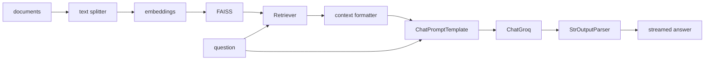
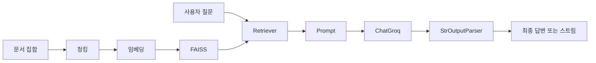

# 실전 체인 조립 — 컴포넌트를 하나로 연결하기

## 이 글에서 답할 질문

- 지금까지 본 Runnable들을 하나의 실행 가능한 RAG 체인으로 어떻게 묶는가
- 문서 분할, 임베딩, 검색, 프롬프트, 생성 단계는 어떤 경계로 나뉘는가
- 스트리밍 출력까지 붙였을 때 전체 데이터 흐름은 어떻게 읽어야 하는가
- 통합 예제에서 가장 먼저 교체해야 할 컴포넌트는 무엇인가

> 통합 체인은 새로운 마법이 아니라 앞에서 본 Runnable들을 입력 타입 순서대로 이어 붙인 결과입니다.



## 최소 실행 예제

```python
import os

from langchain_community.embeddings import HuggingFaceEmbeddings
from langchain_community.vectorstores import FAISS
from langchain_core.output_parsers import StrOutputParser
from langchain_core.prompts import ChatPromptTemplate
from langchain_core.runnables import RunnablePassthrough
from langchain_groq import ChatGroq

vectorstore = FAISS.from_texts(["LCEL은 Runnable을 파이프로 연결합니다."], HuggingFaceEmbeddings(model_name="sentence-transformers/all-MiniLM-L6-v2"))
retriever = vectorstore.as_retriever(search_kwargs={"k": 1})
chain = ({"context": retriever | (lambda docs: docs[0].page_content), "question": RunnablePassthrough()} | ChatPromptTemplate.from_template("문맥: {context}\n질문: {question}") | ChatGroq(model="llama-3.1-8b-instant", api_key=os.environ["GROQ_API_KEY"]) | StrOutputParser())

print(chain.invoke("LCEL이 무엇인가요?"))
```

## 이 코드에서 봐야 할 것

- 인덱싱 단계와 질의 단계는 시간축이 다르므로 코드에서도 분리하는 편이 좋습니다.
- Retriever 출력은 바로 프롬프트에 넣지 말고 문자열 포맷터를 거쳐야 합니다.
- `RunnablePassthrough()`가 사용자 질문을 보존해서 프롬프트 딕셔너리의 다른 키와 합칩니다.
- 통합 체인 디버깅은 항상 검색 결과 확인부터 시작하는 편이 빠릅니다.

## 실무에서 헷갈리는 지점

- RAG가 안 맞을 때 프롬프트만 손보는 경우가 많은데, 실제 원인은 검색 품질인 경우가 많습니다.
- 통합 예제라고 해서 모든 단계를 한 함수에 넣을 필요는 없습니다.
- 대화 이력을 넣는 순간 입력 스키마가 바뀌므로 Runnable 조합도 함께 바뀝니다.

## 체크리스트

- [ ] Retriever, prompt, llm, parser를 하나의 체인으로 연결할 수 있다
- [ ] 문서 인덱싱 단계와 질문 실행 단계를 구분해서 설명할 수 있다
- [ ] 통합 체인에서 어디부터 디버깅해야 하는지 감을 잡았다

LangChain 101 시리즈 (6/6)

예제 코드: [github.com/yeongseon-books/langchain-101](https://github.com/yeongseon-books/langchain-101/tree/main/06-putting-it-together)

## 이 글에서 답할 질문

- 앞선 다섯 편의 컴포넌트를 하나의 체인으로 묶을 때 최소 구조는 무엇일까
- 인덱싱, 검색, 프롬프트, 생성 단계를 어디에서 분리해 두는 게 좋을까
- 멀티턴 대화 이력은 프롬프트에 어떤 방식으로 끼워 넣을까
- 통합 예제를 하나의 파일로 유지하면서도 읽기 쉽게 나누려면 어떻게 해야 할까

> 통합 LangChain 파이프라인은 인덱싱 단계와 질의 단계가 분리되고, 질의 단계 내부는 retriever → prompt → llm → parser 순서로 흘러가는 조합입니다.

## 핵심 흐름 한눈에 보기



지금까지 LCEL, 프롬프트, Retriever, Tool Calling, Streaming을 각각 다뤘습니다. 마지막 글에서는 이 컴포넌트들을 하나의 실행 가능한 앱으로 조립합니다. 문서를 인덱싱하고, 쿼리로 검색하고, LLM이 답변을 생성하고, 결과를 스트리밍으로 출력하는 전체 흐름입니다.

다룰 내용은 다음과 같습니다.

- 문서 청킹 → 임베딩 → FAISS 인덱스 구축
- RAG 체인 조립과 스트리밍 출력
- 대화 이력을 반영한 멀티턴 RAG
- 전체 앱을 하나의 파일로 정리

---

## 문서 인덱싱 파이프라인

```python
from langchain_community.embeddings import HuggingFaceEmbeddings
from langchain_community.vectorstores import FAISS
from langchain_text_splitters import RecursiveCharacterTextSplitter

embedding_model = HuggingFaceEmbeddings(
    model_name="sentence-transformers/all-MiniLM-L6-v2",
    model_kwargs={"device": "cpu"},
    encode_kwargs={"normalize_embeddings": True},
)

splitter = RecursiveCharacterTextSplitter(
    chunk_size=300,
    chunk_overlap=30,
    separators=["\n\n", "\n", ". ", " ", ""],
)

documents = [
    """
벡터 검색은 텍스트를 수치 벡터로 변환해 의미 기반으로 검색하는 방법입니다.
키워드 검색과 달리 표현이 달라도 의미가 같으면 검색 결과에 포함됩니다.
임베딩 모델은 유사한 의미의 텍스트를 벡터 공간에서 가깝게 배치합니다.
""",
    """
FAISS는 Facebook AI Research에서 개발한 고속 벡터 검색 라이브러리입니다.
정확 검색과 근사 검색 모두 지원하며, 수십억 개의 벡터도 처리할 수 있습니다.
IndexFlatIP는 내적 기반 정확 검색 인덱스입니다.
""",
    """
LangChain은 LCEL을 통해 LLM 컴포넌트를 파이프로 연결하는 프레임워크입니다.
Retriever, Tool, OutputParser가 모두 Runnable 인터페이스를 구현합니다.
pipe 연산자(|)로 컴포넌트를 연결하면 체인이 됩니다.
""",
    """
RAG(Retrieval-Augmented Generation)는 검색된 문서를 LLM 프롬프트에 결합하는 패턴입니다.
관련 문서를 먼저 검색하고, 그 내용을 컨텍스트로 제공해 LLM이 더 정확한 답을 생성합니다.
벡터 검색은 RAG 파이프라인의 핵심 컴포넌트입니다.
""",
]

chunks = []
for doc in documents:
    chunks.extend(splitter.split_text(doc))

vectorstore = FAISS.from_texts(texts=chunks, embedding=embedding_model)
retriever = vectorstore.as_retriever(search_kwargs={"k": 3})

print(f"인덱스 벡터 수: {vectorstore.index.ntotal}")
```

---

## RAG 체인 조립

```python
import os

from langchain_core.output_parsers import StrOutputParser
from langchain_core.prompts import ChatPromptTemplate
from langchain_core.runnables import RunnablePassthrough
from langchain_groq import ChatGroq

def format_docs(docs: list) -> str:
    return "\n\n".join(doc.page_content for doc in docs)

llm = ChatGroq(
    model="llama-3.1-8b-instant",
    api_key=os.environ["GROQ_API_KEY"],
)

prompt = ChatPromptTemplate.from_messages([
    (
        "system",
        "다음 문서를 참고해서 질문에 답하세요. 문서에 없는 내용은 '문서에서 찾을 수 없습니다'라고 하세요.\n\n"
        "문서:\n{context}",
    ),
    ("human", "{question}"),
])

rag_chain = (
    {
        "context": retriever | format_docs,
        "question": RunnablePassthrough(),
    }
    | prompt
    | llm
    | StrOutputParser()
)
```

---

## 스트리밍으로 실행

```python
questions = [
    "벡터 검색은 키워드 검색과 어떻게 다른가요?",
    "FAISS는 어디서 개발했나요?",
    "RAG 패턴이 LLM 정확도를 높이는 이유는 무엇인가요?",
    "LangChain의 LCEL은 무엇인가요?",
]

for question in questions:
    print(f"\n질문: {question}")
    print("답변: ", end="")
    for chunk in rag_chain.stream(question):
        print(chunk, end="", flush=True)
    print()
```

---

## 대화 이력을 반영한 멀티턴 RAG

단순 RAG 체인은 각 질문을 독립적으로 처리합니다. 이전 대화를 참고해서 답하려면 대화 이력을 체인에 넘겨야 합니다.

```python
import os
from typing import Any

from langchain_community.embeddings import HuggingFaceEmbeddings
from langchain_community.vectorstores import FAISS
from langchain_core.messages import AIMessage, HumanMessage
from langchain_core.output_parsers import StrOutputParser
from langchain_core.prompts import ChatPromptTemplate, MessagesPlaceholder
from langchain_core.runnables import RunnablePassthrough
from langchain_groq import ChatGroq
from langchain_text_splitters import RecursiveCharacterTextSplitter

embedding_model = HuggingFaceEmbeddings(
    model_name="sentence-transformers/all-MiniLM-L6-v2",
    model_kwargs={"device": "cpu"},
    encode_kwargs={"normalize_embeddings": True},
)

documents = [
    "FAISS는 Facebook AI Research에서 개발한 고속 벡터 검색 라이브러리입니다.",
    "임베딩 모델은 텍스트를 고차원 벡터 공간에 투영합니다.",
    "RAG는 검색된 문서를 LLM 프롬프트에 결합하는 패턴입니다.",
    "LangChain은 LCEL을 통해 LLM 컴포넌트를 파이프로 연결합니다.",
]

vectorstore = FAISS.from_texts(texts=documents, embedding=embedding_model)
retriever = vectorstore.as_retriever(search_kwargs={"k": 2})

llm = ChatGroq(
    model="llama-3.1-8b-instant",
    api_key=os.environ["GROQ_API_KEY"],
)

prompt = ChatPromptTemplate.from_messages([
    (
        "system",
        "다음 문서를 참고해서 질문에 답하세요.\n\n문서:\n{context}",
    ),
    MessagesPlaceholder("chat_history"),
    ("human", "{question}"),
])

def format_docs(docs: list) -> str:
    return "\n\n".join(doc.page_content for doc in docs)

rag_chain = (
    {
        "context": retriever | format_docs,
        "question": RunnablePassthrough(),
        "chat_history": lambda x: x.get("chat_history", []),
    }
    | prompt
    | llm
    | StrOutputParser()
)

def chat(question: str, history: list) -> tuple[str, list]:
    result = rag_chain.invoke({
        "question": question,
        "chat_history": history,
    })
    history.append(HumanMessage(content=question))
    history.append(AIMessage(content=result))
    return result, history

chat_history: list = []

turn1, chat_history = chat("FAISS가 무엇인가요?", chat_history)
print(f"[1] {turn1}\n")

turn2, chat_history = chat("그것의 주요 특징은 무엇인가요?", chat_history)
print(f"[2] {turn2}\n")

turn3, chat_history = chat("LangChain과 어떻게 연결하나요?", chat_history)
print(f"[3] {turn3}")
```

---

## 완전한 앱 — 하나의 파일

```python
"""
langchain_rag_app.py

실행: python langchain_rag_app.py
필요 패키지: langchain langchain-community langchain-groq faiss-cpu sentence-transformers langchain-text-splitters
"""
import os

from langchain_community.embeddings import HuggingFaceEmbeddings
from langchain_community.vectorstores import FAISS
from langchain_core.output_parsers import StrOutputParser
from langchain_core.prompts import ChatPromptTemplate
from langchain_core.runnables import RunnablePassthrough
from langchain_groq import ChatGroq
from langchain_text_splitters import RecursiveCharacterTextSplitter

def build_rag_chain(documents: list[str]):
    embedding_model = HuggingFaceEmbeddings(
        model_name="sentence-transformers/all-MiniLM-L6-v2",
        model_kwargs={"device": "cpu"},
        encode_kwargs={"normalize_embeddings": True},
    )

    splitter = RecursiveCharacterTextSplitter(chunk_size=300, chunk_overlap=30)
    chunks = []
    for doc in documents:
        chunks.extend(splitter.split_text(doc))

    vectorstore = FAISS.from_texts(texts=chunks, embedding=embedding_model)
    retriever = vectorstore.as_retriever(search_kwargs={"k": 3})

    llm = ChatGroq(
        model="llama-3.1-8b-instant",
        api_key=os.environ["GROQ_API_KEY"],
    )

    prompt = ChatPromptTemplate.from_messages([
        (
            "system",
            "다음 문서를 참고해서 질문에 답하세요.\n\n문서:\n{context}",
        ),
        ("human", "{question}"),
    ])

    return (
        {
            "context": retriever | (lambda docs: "\n\n".join(d.page_content for d in docs)),
            "question": RunnablePassthrough(),
        }
        | prompt
        | llm
        | StrOutputParser()
    )

def main() -> None:
    documents = [
        "FAISS는 Facebook AI Research에서 개발한 고속 벡터 검색 라이브러리입니다.",
        "임베딩 모델은 텍스트를 고차원 벡터 공간에 투영합니다.",
        "RAG는 검색된 문서를 LLM 프롬프트에 결합하는 패턴입니다.",
        "LangChain은 LCEL을 통해 LLM 컴포넌트를 파이프로 연결합니다.",
    ]

    chain = build_rag_chain(documents)

    while True:
        question = input("\n질문 (종료: q): ").strip()
        if question.lower() == "q":
            break
        if not question:
            continue

        print("답변: ", end="")
        for chunk in chain.stream(question):
            print(chunk, end="", flush=True)
        print()

if __name__ == "__main__":
    main()
```

---

## 이 코드에서 봐야 할 것

- 인덱싱 파이프라인과 질의 파이프라인을 나눠 두면, 문서 준비 비용과 질의 처리 비용을 분리해서 이해할 수 있습니다.
- 통합 체인의 핵심도 여전히 `retriever | format_docs`, `prompt | llm | parser` 같은 작은 조합의 반복입니다.
- `MessagesPlaceholder`는 멀티턴 이력을 프롬프트 구조 안에 안전하게 끼워 넣는 지점입니다.
- 마지막 전체 예제는 긴 파일이지만, 실제로는 작은 Runnable 조합을 함수로 쪼개어 관리하는 패턴을 보여줍니다.

## 실무에서 헷갈리는 지점

- RAG 앱을 한 번에 구현하려고 하면 복잡해 보이지만, 런타임 경계는 인덱싱과 질의 두 부분으로 먼저 나누면 훨씬 단순해집니다.
- 검색, 프롬프트, 대화 이력 문제가 한꺼번에 섞여 디버깅되기 쉽습니다. 각 단계를 개별 실행해 보는 습관이 중요합니다.
- 통합 예제에서 스트리밍을 추가해도 체인 정의 자체는 크게 바뀌지 않습니다. 소비 방식만 바뀝니다.

## 체크리스트

- [ ] 인덱싱 단계와 질의 단계를 분리해서 설명할 수 있다
- [ ] 통합 체인 안에서 retriever, prompt, llm, parser의 역할을 각각 말할 수 있다
- [ ] 멀티턴 대화 이력을 프롬프트에 넣는 위치를 이해했다

## 마무리

LangChain 101 시리즈를 마칩니다. LCEL과 Runnable 기본에서 시작해, 프롬프트 템플릿, Retriever, Tool Calling, Streaming, 그리고 RAG 체인 조립까지 다뤘습니다.

이 컴포넌트들을 조합해서 실제 서비스 패턴으로 발전시키는 내용은 ai-app-patterns-101 시리즈에서 이어집니다.

<!-- toc:begin -->
## 시리즈 목차

- [LangChain 소개 — LCEL과 Runnable 기본](./01-lcel-runnable-basics.md)
- [Prompt와 LLM Chain — 체인 첫 번째 구성](./02-prompt-llm-chain.md)
- [Retriever — 문서 검색과 컨텍스트 주입](./03-retriever.md)
- [Tool Calling — 외부 도구 연결하기](./04-tool-calling.md)
- [Streaming — 실시간 출력 처리](./05-streaming.md)
- **실전 체인 조립 — 컴포넌트를 하나로 연결하기 (현재 글)**

<!-- toc:end -->

---

## 참고 자료

- [LangChain RAG 튜토리얼](https://python.langchain.com/docs/use_cases/question_answering/)
- [LCEL 공식 레퍼런스](https://python.langchain.com/docs/expression_language/)
- [MessagesPlaceholder](https://python.langchain.com/docs/modules/model_io/prompts/quick_start/#messagesplaceholder)

Tags: LangChain, LCEL, Python, LLM
